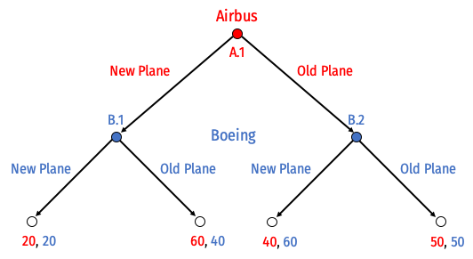

```{r setup, include=FALSE}
knitr::opts_chunk$set(echo = FALSE,
                      warning = FALSE,
                      message = FALSE)
```

# Concepts and Critical Thinking

1. Explain what cartels are, the economic problems that they face, and some methods by which these problems might be overcome. 

\vspace{3in}

2. Describe the major differences between Bertrand competition, Cournot competition, and Stackelberg competition. How do firms compete, and what are the results in terms of market price, industry output, and profits for firms?

\clearpage

3. Explain what the Bertrand paradox is, and two ways/model extensions that the paradox can be resolved. 

\vspace{3in}

4. How are fixed costs (sunk or otherwise) a barrier to entry? How do they alter the outcomes of Cournot competition, and of entry games?

\clearpage

5. If a prisoners’ dilemma is played repeatedly, how does the outcome of the game change? What if it is repeated a finite number of times? What if it is repeated an infinite number of times?

\vspace{3in}

6. What makes a threat or a promise credible? In your answer, use the concept of subgame perfection.

\clearpage

# Problems

7. Suppose Comcast $(C)$ and Verizon $(V)$ have a constant $MC=AC=\$20$ per customer connected to their internet network. The market (inverse) demand curve for basic internet service is given by:
$$\begin{aligned}
P&=80-2Q\\
Q&=q_C+q_V\\
\end{aligned}$$

a. Find the Cournot-Nash equilibrium output, price, and profit for each firm.
b. Find the output, price, and profit for each firm if the two were to collude.
c. Suppose now Comcast is a Stackelberg leader. Find each firm's output, price, and profit.
d. Find the output, price, and profit for each firm they were to compete on *price* instead of *quantity.*

\clearpage

8. Boeing (a U.S. company), and Airbus (a European company) are fierce competitors that together, about evenly dominate the market for aircraft. Airbus decides whether it is going to launch a *new plane*, or keep its *old planes*. Boeing must then respond and determine if it is also going to launch a *new plane* or keep its *old planes*. 

> Developing a new plane is very expensive. If both companies produce *new planes*, they will have spent a lot on producing the new plane, but neither will gain any market share. If only one company releases a new plane, they will capture more of the market, making the extra cost of development worthwhile. This game is depicted in extensive form below:



a. List all of Airbus' possible strategies and list all of Boeing's possible strategies.
b. Circle (or describe) all of the subgames of this game.
c. Solve for the "rollback equilibrium" using backwards induction.
d. Draw this game in normal form. Find all Nash equilibria. (Hint: think carefully about the players' strategies, as you listed out in Part A.) Which is subgame perfect, and why?
e. Suppose Boeing, who has to move second, announces the following threat to Airbus makes its initial decision: *if Airbus produces a new plane, Boeing will respond by also producing a new plane.* Is this threat credible? Why or why not?
f. The U.S. government considers the aircraft industry to be of strategic importance. Suppose Boeing lobbies the government to gain a subsidy to produce the plane. Boeing's payoff increases by $s$ only when it chooses to produce the new plane. How big must $s$ need to be in order to make Boeing's threat in Part E credible?

\clearpage

# Optional Bonus (10 points)

9. This question will show what happens as we relax some of the assumptions of Cournot competition. Crude oil is transported across the globe in enormous tanker ships called Very Large Crude Carriers (VLCCs). By 2001, more than 92% of all new VLCCs were built in South Korea and Japan. Assume that the price of new VLCCs (in millions of dollars) is determined by the inverse demand function between the duopoly of Korea and Japan: 
$$\begin{aligned}p&=180-Q\\
Q&=q_{Korea}+q_{Japan}\\
\end{aligned}$$
Assume the marginal cost of building each ship is <span>&#36;</span>30 (million) in both Korea and Japan.

a. Find each country's best response function, the Nash equilibrium quantity produced by each country, the market price, and the profit for each country.
b. Labor costs in Korean shipyards are actually lower than in Japan. Assume now the marginal cost per ship in Japan is <span>&#36;</span>40 (million) and only <span>&#36;</span>20 (million) in Korea. Find the new best response functions, the Nash equilibrium quantity produced by each country, the market price, and the profit for each country.
c. Suppose China decides to enter the VLCC construction market. The duopoly now becomes a triopoly, so that the market inverse demand function is:
$$\begin{aligned}
p&=180-Q\\
Q&=q_{Korea}+q_{Japan}+q_{China}\\
\end{aligned}$$
Assume for simplicity that all countries face the same marginal cost of <span>&#36;</span>30 (million) per ship. Find the new best response functions, the Nash equilibrium quantity produced by each country, the market price, and the profit for each country. Hint: proceed as before, such that you get three reaction functions with three unknowns.
d. Compare the quantity, price, and profits between parts A, B, and C