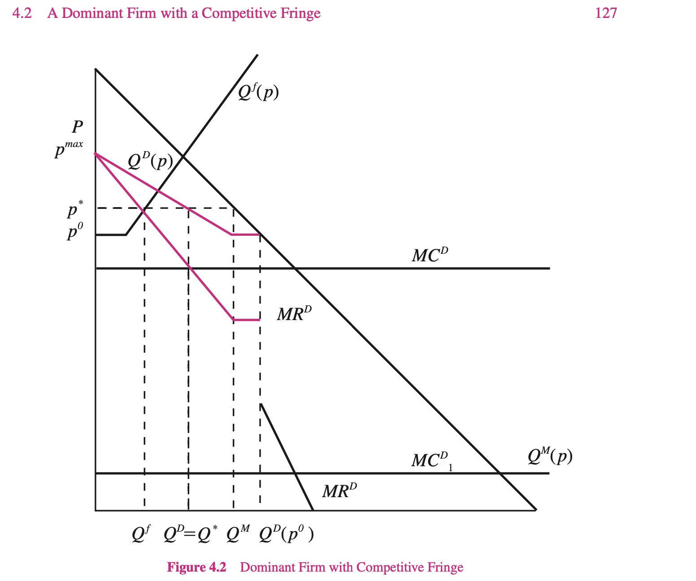
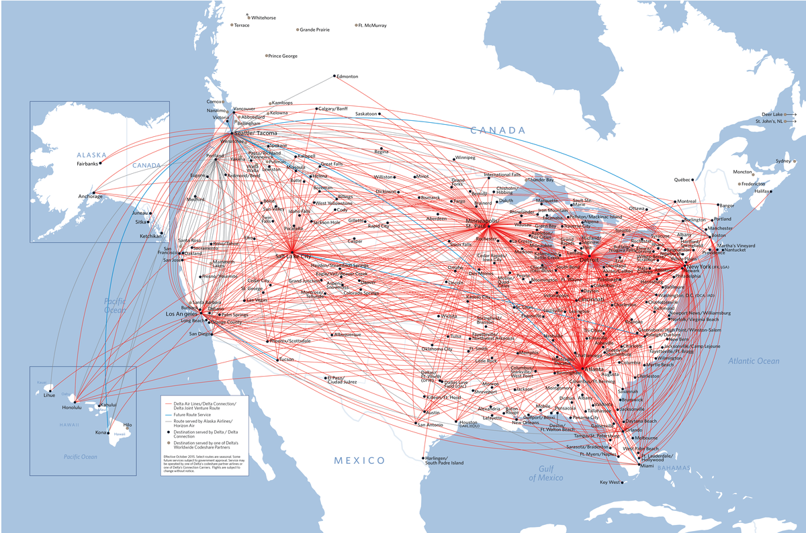
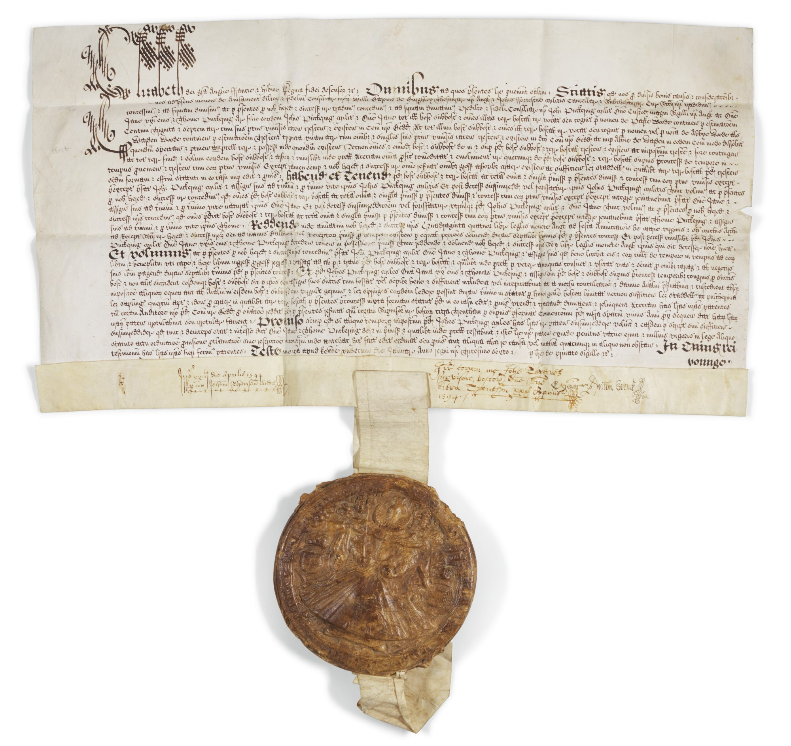

```{r setup, include=FALSE}
options(htmltools.dir.version = FALSE)
knitr::opts_chunk$set(echo=F,
                      message=F,
                      warning=F,
                      fig.retina = 3,
                      fig.align = "center")
library("tidyverse")
library("mosaic")
library("ggrepel")
library("fontawesome")
xaringanExtra::use_tile_view()
xaringanExtra::use_tachyons()
xaringanExtra::use_freezeframe()

update_geom_defaults("label", list(family = "Fira Sans Condensed"))
update_geom_defaults("text", list(family = "Fira Sans Condensed"))

set.seed(256)
```


class: title-slide

# 1.6 — Consequences & Sources of Power

## ECON 306 • Industrial Organization • Spring 2023

### Ryan Safner<br> Associate Professor of Economics <br> <a href="mailto:safner@hood.edu"><i class="fa fa-paper-plane fa-fw"></i>safner@hood.edu</a> <br> <a href="https://github.com/ryansafner/ioS23"><i class="fa fa-github fa-fw"></i>ryansafner/ioS23</a><br> <a href="https://ioS23.classes.ryansafner.com"> <i class="fa fa-globe fa-fw"></i>ioS23.classes.ryansafner.com</a><br>

---

class: inverse

# Outline

### [Comparative Statics: Differences In Firm Behavior](#3)

### [The Social Harm of Market Power](#4)

### [What *Is* a Monopoly?](#)

### [Dominant Firms with a Competitive Fringe](#19)

### [Entry Barriers](#41)

### [Economies of Scale and Natural Monopoly](#45)

### [Government Entry Regulation](#54)

### [The *Ugly* of Market Power: Rent-Seeking](#62)

---

class: inverse, center, middle

# Comparative Statics: Differences In Firm Behavior

---

# Firms With Market Power Respond Differently

.pull-left[
```{r, fig.height=5}
demand_1=function(x){10-x}
mr_1=function(x){10-2*x}

demand_2=function(x){16-x}
mr_2=function(x){16-2*x}

mc_m=function(x){x+1}
mc_c=function(x){2*x+1}

pc<-ggplot(data=tibble(x=1:10), aes(x=x))+
  stat_function(fun=mc_m, geom="line", size=2, color="red")+
  geom_label(x=8,y=mc_m(8), color="red", label=expression(MC))+
  geom_hline(yintercept=7, size = 2, color = "blue")+
  geom_label(x=8,y=7, color="blue", label="Demand")+
  geom_segment(x=6,xend=6, y=0, yend=7, size=1, linetype="dotted")+
  scale_x_continuous(breaks = c(0,6),
                     labels = c(0,expression(q)),
                     limits = c(0,10),
                     expand=c(0,0))+
  scale_y_continuous(breaks = c(0,7),
                     labels = c(0,expression(p)),
                     limits = c(0,14),
                     expand=c(0,0))+
  theme_classic(base_family = "Fira Sans Condensed", base_size=16)+
  labs(x = "Quantity",
       y = "Price",
       title = "Price-Taking Firm in Competitive Market")
pc
```
]

.pull-right[
```{r, fig.height=5}

mp<-ggplot(data=tibble(x=1:10), aes(x=x))+
  stat_function(fun=demand_1, geom="line", size=2, color="blue")+
  stat_function(fun=mr_1, geom="line", size=2, color="purple")+
  stat_function(fun=mc_m, geom="line", size=2, color="red")+
  #stat_function(fun=mc_c, geom="line", size=2, color="red")+

  
  geom_label(x=8,y=demand_1(8), color="blue", label="Demand")+
  geom_label(x=4,y=mr_1(4), color="purple", label=expression(MR))+
  geom_label(x=8,y=mc_m(8), color="red", label=expression(MC))+
  #geom_label(x=4,y=mc_c(4), color="red", label=expression(MC[c]))+
  
  geom_segment(x=3,xend=3, y=0, yend=7, size=1, linetype="dotted")+
  geom_segment(x=0,xend=3, y=7, yend=7, size=1, linetype="dotted")+

  scale_x_continuous(breaks = c(0,3),
                     labels = c(0,expression(q)),
                     limits = c(0,10),
                     expand=c(0,0))+
  scale_y_continuous(breaks = c(0,7),
                     labels = c(0,expression(p)),
                     limits = c(0,14),
                     expand=c(0,0))+
  theme_classic(base_family = "Fira Sans Condensed", base_size=16)+
  labs(x = "Quantity",
       y = "Price",
       title = "Price-Searching Firm with Market Power")
mp
```
]

---

# A Change in (A Firm’s) Marginal Cost

.pull-left[
```{r, fig.height=5}
mc_m2=function(x){x+1+2}
mc_c=function(x){2*x+1}

pc+
  stat_function(fun=mc_m2, geom="line", size=2, color="darkred")+
  geom_label(x=8,y=mc_m2(8), color="darkred", label=expression(MC[2]))+
  geom_hline(yintercept=7, size = 2, color = "blue")+
  geom_label(x=8,y=7, color="blue", label="Demand")+
  geom_segment(x=4,xend=4, y=0, yend=7, size=1, linetype="dotted")+
  
  annotate("segment", x = 6, xend = 4, y = 2, yend = 2, colour = "black", size=2, alpha=1, arrow=arrow(length=unit(0.5,"cm"), ends="last", type="closed"))+

  scale_x_continuous(breaks = c(0,4,6),
                     labels = c(0,expression(q[2]),expression(q[1])),
                     limits = c(0,10),
                     expand=c(0,0))+
  scale_y_continuous(breaks = c(0,7),
                     labels = c(0,expression(p)),
                     limits = c(0,14),
                     expand=c(0,0))

```

- Change in $q^\star$ only

]

.pull-right[
```{r, fig.height=5}
mp+
  stat_function(fun=mc_m2, geom="line", size=2, color="darkred")+
  geom_label(x=8,y=mc_m2(8), color="darkred", label=expression(MC[2]))+
  geom_segment(x=2.325, xend=2.325, y=0, yend=7.625, size=1, linetype="dotted")+
  geom_segment(x=0, xend=2.325, y=7.625, yend=7.625, size=1, linetype="dotted")+
  
  annotate("segment", x = 3, xend = 2.325, y = 2, yend = 2, colour = "black", size=2, alpha=1, arrow=arrow(length=unit(0.15,"cm"), ends="last", type="closed"))+
  annotate("segment", x = 0.5, xend = 0.5, y = 7, yend = 7.625, colour = "black", size=2, alpha=1, arrow=arrow(length=unit(0.25,"cm"), ends="last", type="closed"))+
  
  scale_x_continuous(breaks = c(0,2.325,3),
                     labels = c(0,expression(q[2]),expression(q[1])),
                     limits = c(0,10),
                     expand=c(0,0))+
  scale_y_continuous(breaks = c(0,7,7.625),
                     labels = c(0,expression(p[1]),expression(p[2])),
                     limits = c(0,14),
                     expand=c(0,0))
```

- Change in $p^\star$ and $q^\star$

]

--

- Firms with market power will pass on cost increases (from e.g. taxes, etc.) onto customers, competitive firms will not

---

# A Shift of Market Demand

.pull-left[
```{r, fig.height=5}
demand_3=function(x){14-x}
mr_3=function(x){14-2*x}

ggplot(data=tibble(x=1:10), aes(x=x))+
  stat_function(fun=mc_m, geom="line", size=2, color="red")+
  geom_label(x=8,y=mc_m(8), color="red", label=expression(MC))+
  geom_hline(yintercept=7, size = 2, color = "blue")+
  geom_label(x=3,y=7, color="blue", label="Demand")+
  geom_segment(x=6,xend=6, y=0, yend=7, size=1, linetype="dotted")+
  geom_hline(yintercept = 10, size = 2, color = "darkblue")+
  geom_label(x=3,y=10, color="darkblue", label=expression(Demand[2]))+
  geom_segment(x=9,xend=9, y=0, yend=10, size=1, linetype="dotted")+
  
  annotate("segment", x = 6, xend = 9, y = 2, yend = 2, colour = "black", size=2, alpha=1, arrow=arrow(length=unit(0.5,"cm"), ends="last", type="closed"))+
  annotate("segment", x = 1, xend = 1, y = 7, yend = 10, colour = "black", size=2, alpha=1, arrow=arrow(length=unit(0.5,"cm"), ends="last", type="closed"))+

    scale_x_continuous(breaks = c(0,6,9),
                     labels = c(0,expression(q[1]),expression(q[2])),
                     limits = c(0,10),
                     expand=c(0,0))+
  scale_y_continuous(breaks = c(0,7,10),
                     labels = c(0,expression(p[1]),expression(p[2])),
                     limits = c(0,14),
                     expand=c(0,0))+
  theme_classic(base_family = "Fira Sans Condensed", base_size=12)+
  labs(x = "Quantity",
       y = "Price",
       title = "Price-Taking Firm in Competitive Market")
```

]


.pull-right[
```{r, fig.height=5}
ggplot(data=tibble(x=1:10), aes(x=x))+
  stat_function(fun=demand_1, geom="line", size=2, color="blue", alpha = 0.35)+
  stat_function(fun=mr_1, geom="line", size=2, color="purple", alpha = 0.35)+
  stat_function(fun=mc_m, geom="line", size=2, color="red")+
  #stat_function(fun=mc_c, geom="line", size=2, color="red")+

  
  geom_label(x=8,y=demand_1(8), color="blue", label="Demand")+
  geom_label(x=4,y=mr_1(4), color="purple", label=expression(MR))+
  geom_label(x=8,y=mc_m(8), color="red", label=expression(MC))+
  #geom_label(x=4,y=mc_c(4), color="red", label=expression(MC[c]))+
  
  geom_segment(x=3,xend=3, y=0, yend=7, size=1, linetype="dotted")+
  geom_segment(x=0,xend=3, y=7, yend=7, size=1, linetype="dotted")+

  geom_segment(x=4.333,xend=4.333, y=0, yend=demand_3(4.333), size=1, linetype="dotted")+
  geom_segment(x=0,xend=4.333, y=demand_3(4.333), yend=demand_3(4.333), size=1, linetype="dotted")+

  stat_function(fun=demand_3, geom="line", size=2, color="darkblue")+
  geom_label(x=5,y=demand_3(5), color="darkblue", label=expression(Demand[2]))+
  stat_function(fun=mr_3, geom="line", size=2, color="purple")+
  geom_label(x=2.5,y=mr_3(2.5), color="purple", label=expression(MR[2]))+

  annotate("segment", x = 3, xend = 4.333, y = 3, yend = 3, colour = "black", size=2, alpha=1, arrow=arrow(length=unit(0.5,"cm"), ends="last", type="closed"))+
  annotate("segment", x = 0.5, xend = 0.5, y = 7, yend = demand_3(4.333), colour = "black", size=2, alpha=1, arrow=arrow(length=unit(0.5,"cm"), ends="last", type="closed"))+

  scale_x_continuous(breaks = c(0,3,4.333),
                     labels = c(0,expression(q[1]),expression(q[2])),
                     limits = c(0,10),
                     expand=c(0,0))+
  scale_y_continuous(breaks = c(0,7,demand_3(4.333)),
                     labels = c(0,expression(p[1]),expression(p[2])),
                     limits = c(0,14),
                     expand=c(0,0))+
  theme_classic(base_family = "Fira Sans Condensed", base_size=12)+
  labs(x = "Quantity",
       y = "Price",
       title = "Price-Searching Firm with Market Power")
```
]

- Both firms change $p^\star$ and $q^\star$, but smaller change in $q^\star$ for monopolist

---

# A Change in Price Elasticity of Demand

.pull-left[
```{r, fig.height=5}
demand_cr=function(x){7.75-0.5*x}

ggplot(data=tibble(x=1:10), aes(x=x))+
  stat_function(fun=demand_1, geom="line", size=2, color="blue", alpha =0.5)+
    geom_label(x=9,y=demand_1(9), color="blue", label="Demand")+
    stat_function(fun=mc_m, geom="line", size=2, color="red")+
    geom_label(x=9,y=mc_m(9), color="red", label="Supply")+
    stat_function(fun=demand_cr, geom="line", size=2, color="blue")+
    geom_label(x=9,y=demand_cr(9), color="blue", label=expression(Demand[E]))+

  geom_segment(x=4.5,xend=4.5, y=0, yend=5.5, size=1, linetype="dotted")+
  geom_segment(x=0,xend=4.5, y=5.5, yend=5.5, size=1, linetype="dotted")+
  scale_x_continuous(breaks = c(0,4.5),
                     labels = c(0,expression(q[c])),
                     limits = c(0,10),
                     expand=c(0,0))+
  scale_y_continuous(breaks = c(0,5.5),
                     labels = c(0,expression(p[c])),
                     limits = c(0,14),
                     expand=c(0,0))+
  theme_classic(base_family = "Fira Sans Condensed", base_size=16)+
  labs(x = "Quantity",
       y = "Price",
       title = "Competitive Market")
```

- No change in $q^\star$ or $p^\star$ for the *industry*!
]

.pull-right[
```{r, fig.height=5}
demand_r=function(x){8.5-0.5*x}
mr_r=function(x){8.5-1*x}

ggplot(data=tibble(x=1:10), aes(x=x))+
  stat_function(fun=demand_1, geom="line", size=2, color="blue",alpha=0.3)+
  stat_function(fun=mr_1, geom="line", size=2, color="purple",alpha=0.3)+
  stat_function(fun=mc_m, geom="line", size=2, color="red")+

  stat_function(fun=demand_r, geom="line", size=2, color="blue")+
  stat_function(fun=mr_r, geom="line", size=2, color="purple")+

  
  geom_label(x=8,y=demand_1(8), color="blue", label=expression(Demand[1]), alpha=0.3)+
  geom_label(x=4,y=mr_1(4), color="purple", label=expression(MR[1]), alpha=0.3)+
  geom_label(x=8,y=mc_m(8), color="red", label=expression(MC))+

  geom_label(x=8.5,y=demand_r(8.5), color="blue", label=expression(Demand[E]))+
  geom_label(x=4.25,y=mr_r(4.25), color="purple", label=expression(MR[E]))+

  
  geom_segment(x=3,xend=3, y=0, yend=7, size=1, linetype="dotted")+
  geom_segment(x=0,xend=3, y=7, yend=7, size=1, linetype="dotted")+

  geom_segment(x=3.75,xend=3.75, y=0, yend=6.5, size=1, linetype="dotted")+
  geom_segment(x=0,xend=3.75, y=6.5, yend=6.5, size=1, linetype="dotted")+

  annotate("segment", x = 3, xend = 3.75, y = 3, yend = 3, colour = "black", size=2, alpha=1, arrow=arrow(length=unit(0.2,"cm"), ends="last", type="closed"))+
  annotate("segment", x = 0.5, xend = 0.5, y = 7, yend = 6.5, colour = "black", size=2, alpha=1, arrow=arrow(length=unit(0.2,"cm"), ends="last", type="closed"))+

  scale_x_continuous(breaks = c(0,3,3.75),
                     labels = c(0,expression(q[1]), expression(q[2])),
                     limits = c(0,10),
                     expand=c(0,0))+
  scale_y_continuous(breaks = c(0,6.5,7),
                     labels = c(0,expression(p[2]), expression(p[1])),
                     limits = c(0,14),
                     expand=c(0,0))+
  theme_classic(base_family = "Fira Sans Condensed", base_size=16)+
  labs(x = "Quantity",
       y = "Price",
       title = "Price-Searching Firm with Market Power")
```

- Monopolist will lower (raise) $p^\star$ and raise (lower) $q^\star$ as demand becomes more (less) elastic
]

---

# Market Power: The Good, the Bad, and the Ugly

.pull-left[
.smallest[
- No market is perfectly competitive, but **that does not .ul[necessarily] imply market failure**
  - Static vs. dynamic benefits of markets

- Market power is *interesting*
  - Most firms clearly have *some* market power
  - Market power $\neq$ bad, necessarily!

- Today, we’ll examine what I call .hi-purple[“the good, the bad, and the ugly” of market power]
  - (but not necessarily in that order)
]
]

.pull-right[
.center[

]
]

---

class: inverse, center, middle

# The Social Harm of Market Power

---

# Perfectly Competitive Market

.pull-left[
```{r, fig.retina=3, fig.height=4.5}
demand<-function(x){10-x}
supply<-function(x){x}
demand_firm<-function(x){10}
mc_cc<-function(x){3*x^2-8*x+9}
ac_cc<-function(x){x^2-4*x+10+10/x}

pc<-ggplot(data.frame(x=c(0,10)), aes(x=x))+
  stat_function(fun=demand_firm, geom="line", size=2, color = "blue")+
  geom_label(aes(x=4.5,y=demand_firm(4.5)), color = "blue", label="Demand", size = 5)+
    stat_function(fun=mc_cc, geom="line", size=2, color = "red")+
  geom_label(aes(x=3.5,y=mc_cc(3.5)), color = "red", label="MC(q)", size = 5)+
    stat_function(fun=ac_cc, geom="line", size=2, color = "orange")+
  geom_label(aes(x=4.5,y=ac_cc(4.5)), color = "orange", label = "AC(q)", size = 5)+
  geom_segment(x=2.8, xend=2.8, y=0, yend=10, size=1, linetype="dotted")+
    scale_x_continuous(breaks=NULL,
                     limits=c(0,5),
                     expand=expand_scale(mult=c(0,0.1)))+
  scale_y_continuous(breaks=NULL,
                     limits=c(0,20),
                     expand=expand_scale(mult=c(0,0.1)))+
  guides(fill=F)+
  labs(title = "Representative Firm",
       x = "Quantity",
       y = "Price")+
  theme_classic(base_family = "Fira Sans Condensed", base_size=20)
pc
```
]

.pull-right[
```{r, fig.retina=3, fig.height=4.5}
cs_1<-tribble(
  ~x, ~y,
  0, 10,
  0, 5,
  5, 5
)
ps_1<-tribble(
  ~x, ~y,
  0, 0,
  0, 5,
  5, 5
)

ggplot(data.frame(x=c(0,10)), aes(x=x))+
  geom_polygon(data=cs_1, aes(x=x,y=y), fill="blue", alpha=0.5)+
  geom_polygon(data=ps_1, aes(x=x,y=y), fill="red", alpha=0.5)+
  geom_text(x = 1.5, y = 6.5, color = "white", label = "CS", size = 6)+
  geom_text(x = 1.5, y = 3.5, color = "white", label = "PS", size = 6)+
  stat_function(fun=demand, geom="line", size=2, color = "blue")+
    geom_label(aes(x=9,y=demand(9)), color = "blue", label="Demand", size = 5)+
  stat_function(fun=supply, geom="line", size=2, color = "red")+
    geom_label(aes(x=9,y=supply(9)), color = "red", label="Supply", size = 5)+
  geom_segment(x=5, xend=5, y=0, yend=5, size=1, linetype="dotted")+
  geom_segment(x=0, xend=5, y=5, yend=5, size=1, linetype="dotted")+
  
  # point A
  geom_point(x = 5, y = 5, size=3)+
  geom_text(x = 5, y = 5.5, label = "A", size=5)+
  
    scale_x_continuous(breaks=NULL,
                     limits=c(0,10),
                     expand=expand_scale(mult=c(0,0.1)))+
  scale_y_continuous(breaks=NULL,
                     limits=c(0,10),
                     expand=expand_scale(mult=c(0,0.1)))+
  guides(fill=F)+
  labs(title = "Industry",
       x = "Quantity",
       y = "Price")+
  theme_classic(base_family = "Fira Sans Condensed", base_size=20)
```
]

.smallest[
- In a .hi[competitive market] in .hi[long run equilibrium]:
  - .hi-purple[Economic profit] is driven to $0; resources (factors of production) optimally allocated
  - .hi-purple[Allocatively efficient]: $\color{blue}{p}=\color{red}{MC(q)}$, maximized .blue[CS] $+$ .red[PS]
  - .hi-purple[Productively efficient]: $\color{blue}{p}=\color{orange}{AC(q)_{min}}$ (otherwise firms would enter/exit)
]
---

# The Bad of Monopoly: DWL I

.pull-left[

```{r, fig.retina=3}
library(mosaic)
mc<-function(x){2}
demand<-function(x){10-x}
mr<-function(x){10-2*x}

CS<-tibble(x=c(0,0,8),
           y=c(10,2,2))
#PS<-tibble(x=c(0,0,2),
#           y=c(10,2,2))

#line_colors <- c("Supply" = "red", "Demand" = "blue")
#surplus_colors <-c("Consumer" = "blue", "Producer" = "red")

ggplot(data.frame(x=c(0,10)), aes(x=x))+
  geom_polygon(data=CS, aes(x=x,y=y), fill="blue",alpha=0.5)+
  stat_function(fun=demand, geom="line", size=2, color = "blue")+
    geom_label(aes(x=9,y=demand(9)), color = "blue", label="Demand", size = 5)+
  stat_function(fun=mc, geom="line", size=2, color = "red")+
    geom_label(aes(x=6,y=mc(6)), color = "red", label=expression(MC(q)==AC(q)), size = 5)+
  geom_segment(x=8, xend=8, y=0, yend=2, size=1, linetype="dotted")+
  geom_text(aes(x=3, y= 5), label="CS", color="white", size =5)+
    scale_x_continuous(breaks=c(0,8),
                       labels=c(0,expression(q[c])),
                     limits=c(0,10),
                     expand=expand_scale(mult=c(0,0.1)))+
  scale_y_continuous(breaks=c(0,2),
                     labels=c(0,expression(p[c])),
                     limits=c(0,10),
                     expand=expand_scale(mult=c(0,0.1)))+
  guides(fill=F)+
  labs(x = "Quantity",
       y = "Price")+
  theme_classic(base_family = "Fira Sans Condensed", base_size=16)
```

]

.pull-right[

- Consider an industry with some simplified cost assumptions:

$$C(q)=cq$$
  - No fixed cost; $\color{red}{MC(q)}=\color{orange}{AC(q)} = c$<sup>.magenta[†]</sup>

- If this industry were **competitive**, firms would set $\color{blue}{p_c}=\color{red}{MC(q)}$ and (collectively), industry would produce $q_c$
  - Max .blue[consumer surplus], $\color{green}{\pi=0}$

.footnote[<sup>.magenta[†]</sup> Why? [See here](/resources/appendices/2.5-appendix/#common-cost-assumptions) for a reminder.]
]


---

# The Bad of Monopoly: DWL II

.pull-left[

```{r, fig.retina=3}
mc<-function(x){2}
demand<-function(x){10-x}
mr<-function(x){10-2*x}

CS<-tibble(x=c(0,0,8),
           y=c(10,2,2))

CS_2<-tibble(x=c(0,0,4),
           y=c(10,6,6))
dwl<-tibble(x=c(4,4,8),
           y=c(6,2,2))
mr<-function(x){10-2*x}

#line_colors <- c("Supply" = "red", "Demand" = "blue")
#surplus_colors <-c("Consumer" = "blue", "Producer" = "red")

m<-ggplot(data.frame(x=c(0,10)), aes(x=x))+
  
  # surpluses
  geom_polygon(data=CS_2, aes(x=x,y=y), fill="blue",alpha=0.5)+
  geom_rect(xmin=0,xmax=4,ymin=2,ymax=6,fill="green", alpha=0.25)+ #profit
  geom_polygon(data=dwl, aes(x=x,y=y), fill="black",alpha=0.5)+ #dwl
  
  # surplus labels
  geom_text(aes(x=1.5, y= 4), label="Profit", color="white", size =5)+
  geom_text(aes(x=1.5, y= 7.5), label="CS", color="white", size =5)+
  geom_text(aes(x=5.5, y= 3.5), label="DWL", color="white", size =5)+
  
  # lines 
  stat_function(fun=demand, geom="line", size=2, color = "blue")+
    geom_label(aes(x=9,y=demand(9)), color = "blue", label="Demand", size = 5)+
  stat_function(fun=mr, geom="line", size=2, color = "purple")+
    geom_label(aes(x=4.5,y=mr(4.5)), color = "purple", label=expression(MR(q)), size = 5)+
  stat_function(fun=mc, geom="line", size=2, color = "red")+
    geom_label(aes(x=6,y=mc(6)), color = "red", label=expression(MC(q)==AC(q)), size = 5)+
  
  # optimal dots
  geom_segment(x=0, xend=4, y=6, yend=6, size=1, linetype="dotted")+
  geom_segment(x=8, xend=8, y=0, yend=2, size=1, linetype="dotted")+
  geom_segment(x=4, xend=4, y=0, yend=6, size=1, linetype="dotted")+
  
  #geom_point(x=4,y=6, size=3)+

  scale_x_continuous(breaks=c(0,4,8),
                       labels=c(0,expression(q[m]),expression(q[c])),
                     limits=c(0,10),
                     expand=expand_scale(mult=c(0,0.1)))+
  scale_y_continuous(breaks=c(0,2,6),
                       labels=c(0,expression(p[c]),expression(p[m])),
                     limits=c(0,10),
                     expand=expand_scale(mult=c(0,0.1)))+

  guides(fill=F)+
  labs(x = "Quantity",
       y = "Price")+
  theme_classic(base_family = "Fira Sans Condensed", base_size=16)

m + annotate("segment", x = 8, xend = 4, y = 0.5, yend = 0.5, colour = "black", size=2, alpha=1, arrow=arrow(length=unit(0.5,"cm"), ends="last", type="closed"))+
  annotate("segment", x = 0.5, xend = 0.5, y = 2, yend = 6, colour = "black", size=2, alpha=1, arrow=arrow(length=unit(0.5,"cm"), ends="last", type="closed"))
```

]

.pull-right[

- A **monopolist** would face *entire* industry demand and set $(q_m,p_m)$:
  - Set .purple[`\\(MR(q)\\)`] $=$ .red[`\\(MC(q)\\)`]: $q_m$
  - Raise $p$ to .blue[max. WTP (Demand)]: $p_m$

- .hi-purple[Restricts output and raises price], compared to competitive market

- Earns .hi-green[monopoly profits (`\\(p>AC\\)`)] 

- Loss of .hi-blue[consumer surplus]

]

---

# The Bad of Monopoly: DWL III

.pull-left[

```{r, fig.retina=3}
m + annotate("segment", x = 8, xend = 4, y = 0.5, yend = 0.5, colour = "black", size=2, alpha=1, arrow=arrow(length=unit(0.5,"cm"), ends="last", type="closed"))+
  annotate("segment", x = 0.5, xend = 0.5, y = 2, yend = 6, colour = "black", size=2, alpha=1, arrow=arrow(length=unit(0.5,"cm"), ends="last", type="closed"))
```

]

.pull-right[

- **Deadweight loss** of surplus destroyed from lost gains from trade
  - Consumers willing to buy more than $q_m$, if the monopolist would lower prices!
  - Monopolist *would* benefit by accepting lower prices to sell more than $q_m$, but this would yield *less* than _maximum_ profits
      - main problem is that monopolist must lower price on all units sold

]

---

# The Bad of Monopoly II

.pull-left[
.center[

]
]

.pull-right[

- **Deadweight loss** of surplus destroyed from lost gains from trade
  - Consumers willing to buy more than $q_m$, if the monopolist would lower prices!
  - Monopolist *would* benefit by accepting lower prices to sell more than $q_m$, **but this would yield _less_ than _maximum_ profits**
      - main problem is that monopolist must lower price on all units sold

]

---

# The Bad of Monopoly: DWL III

.pull-left[

```{r, fig.retina=3}
m + annotate("segment", x = 8, xend = 4, y = 0.5, yend = 0.5, colour = "black", size=2, alpha=1, arrow=arrow(length=unit(0.5,"cm"), ends="last", type="closed"))+
  annotate("segment", x = 0.5, xend = 0.5, y = 2, yend = 6, colour = "black", size=2, alpha=1, arrow=arrow(length=unit(0.5,"cm"), ends="last", type="closed"))
```

]

.pull-right[

- Size of **DWL** depends on:
  - price distortion $(p_m - p_c)$ (varies inversely with demand elasticity)
  - quantity distortion $(q_c - q_m)$ (varies directly with demand elasticity)

]

---

# The Bad of Monopoly: DWL IV

.pull-left[

.center[
.smallest[
Demand *Less* Elastic at $p^*$
]
]

```{r, fig.align="center", fig.height=5.5}
demand_i=function(x){20-2*x}
mr_i=function(x){20-4*x}

dwl_i<-tribble(
  ~x, ~y,
  4.5, 2,
  4.5, 11,
  9, 2
)

ggplot(data.frame(x=c(0,10)), aes(x=x))+
  geom_polygon(data=dwl_i, aes(x=x,y=y), fill="black", alpha=0.7)+
  geom_hline(yintercept=2, size=2, color="red")+
  geom_label(x=6,y=2, color = "red", label="MC(q)")+
  stat_function(fun=demand_i, geom="line", size=2, color = "blue")+
  geom_label(x=6,y=demand_i(6), color = "blue", label="Demand")+
  stat_function(fun=mr_i, geom="line", size=2, color = "purple")+
  geom_label(x=3,y=mr_i(3), color = "purple", label="MR(q)")+
    scale_x_continuous(breaks=seq(0,10,1),
                     limits=c(0,10),
                     expand=expand_scale(mult=c(0,0.1)))+
  scale_y_continuous(breaks=seq(0,20,2),
                     limits=c(0,20),
                     expand=expand_scale(mult=c(0,0.1)),
                     labels = function(x){paste("$", x, sep="")})+
  # line at 4,6 
  geom_segment(aes(x=0,xend=4.5, y=11, yend=11), linetype="dashed")+
  geom_segment(aes(x=4.5,xend=4.5, y=11, yend=0), linetype="dashed")+
  
  ggrepel::geom_text_repel(
    data = point_i<-tibble(x = 4.5,
                           y = 11.5),
    aes(x=x,y=y), label = expression(epsilon == -1.22),
    color = "black",
    seed = 2,
    nudge_x=0.5,
    nudge_y=0.5
  )+
  #arrow down
  annotate("segment", x = 1, xend = 1, y = 2, yend = 11, colour = "black", size=2, alpha=1, arrow=arrow(length=unit(0.5,"cm"), ends="last", type="closed"))+
  geom_label(aes(x=1, y=6), color="black", label="82% of Price \n is Markup")+
  geom_text(aes(x=6, y=5), color="white", label="DWL = $20.25")+
  coord_cartesian(clip="off")+
  labs(x = "Quantity",
       y = "Price")+
  theme_classic(base_family = "Fira Sans Condensed", base_size=20)
```

.smallest[
- Price distortion is larger, quantity distortion smaller
]
]
.pull-right[

.center[
.smallest[
Demand *More* Elastic at $p^*$
]
]

```{r, fig.align="center", fig.height=5.5}
demand_e=function(x){10-x}
mr_e=function(x){10-2*x}

dwl_e<-tribble(
  ~x, ~y,
  4, 2,
  4, 6,
  8, 2
)

ggplot(data.frame(x=c(0,10)), aes(x=x))+
  geom_polygon(data=dwl_e, aes(x=x,y=y), fill="black", alpha=0.7)+
  geom_hline(yintercept=2, size=2, color="red")+
  geom_label(x=6,y=2, color = "red", label="MC(q)")+
  stat_function(fun=demand_e, geom="line", size=2, color = "blue")+
  geom_label(x=6,y=demand_e(6), color = "blue", label="Demand")+
  stat_function(fun=mr_e, geom="line", size=2, color = "purple")+
  geom_label(x=3,y=mr_e(3), color = "purple", label="MR(q)")+
    scale_x_continuous(breaks=seq(0,10,1),
                     limits=c(0,10),
                     expand=expand_scale(mult=c(0,0.1)))+
  scale_y_continuous(breaks=seq(0,20,2),
                     limits=c(0,20),
                     expand=expand_scale(mult=c(0,0.1)),
                     labels = function(x){paste("$", x, sep="")})+
  # line at 4,6 
  geom_segment(aes(x=0,xend=4, y=6, yend=6), linetype="dashed")+
  geom_segment(aes(x=4,xend=4, y=6, yend=0), linetype="dashed")+
  
  ggrepel::geom_text_repel(
    data = point_i<-tibble(x = 4,
                           y = 6),
    aes(x=x,y=y), label = expression(epsilon == -1.5),
    color = "black",
    seed = 2,
    nudge_x=0.5,
    nudge_y=0.5
  )+
  #arrow down
  annotate("segment", x = 1, xend = 1, y = 2, yend = 6, colour = "black", size=2, alpha=1, arrow=arrow(length=unit(0.5,"cm"), ends="last", type="closed"))+
  geom_label(aes(x=1, y=4), color="black", label="67% of Price \n is Markup")+
  geom_text(aes(x=5, y=4), color="white", label="DWL = $8.00")+
  labs(x = "Quantity",
       y = "Price")+
  theme_classic(base_family = "Fira Sans Condensed", base_size=20)
```
.smallest[
- Price distortion is smaller, quantity distortion larger
]
]

---

# The Bad of Monopoly: DWL V

.pull-left[

```{r, fig.retina=3}
m
```

]

.pull-right[

- In general, with a linear demand curve and constant marginal costs,

$$DWL = \frac{1}{2} \varepsilon P_m Q_m L^2$$

- And more simply:

$$DWL = \frac{\pi}{2}$$

]

---

# DWL VI: Harberger Triangles I

.left-column[
.center[

]

.smallest[
Arnold Harberger
1924 —
]
]

.right-column[

.quitesmall[
> “One of the first things we learn when we begin to study price theory is that the main effects of monopoly are to misallocate resources, to reduce aggregate welfare, and to redistribute income in favor of monopolists. In the light of this fact, it is a little curious that our empirical efforts at studying monopoly have so largely concentrated on other things. We have studied particular industries and have come up with a formidable list of monopolistic practices...And we have also studied the whole economy, using the concentration of production in the hands of a small number of firms as the measure of monopoly. On this basis we have obtained the impression that some 20 or 30 or 40 per cent of our economy is effectively monopolized,” (77).

> “In this paper I propose to look at the American economy, and in particular at American manufacturing industry, and try to get some quantitative notion of the allocative and welfare effects of monopoly. It should be clear from the outset that this is not the kind of job one can do with great precision. The best we can hope for is to get a feeling for the general orders of magnitude that are involved,” (77).

]

.source[Harberger, Arnold C, 1954, “Monopoly and Resource Allocation,” *American Economic Review* 44(2): 77-87]
]

---

# DWL VI: Harberger Triangles II

.left-column[
.center[

]

.smallest[
Arnold Harberger
1924 —
]
]

.right-column[

.smallest[

> “Thus we come to our final conclusion. Elimination of resource misallocations in American manufacturing in the late twenties would bring with it an improvement in consumer welfare of just a little more than a tenth of a per cent. In present values, this welfare gain would amount to about $2.00 per capita,” (84).

> “I must confess that I was amazed at this result. I never really tried to quantify my notions of what monopoly misallocations amounted to, and I doubt that many other people have. Still, it seems to me that our literature of the last twenty or so years reflects a general belief that monopoly distortions to our resources structure are much greater than
they seem in fact to be,” (86).
]

.source[Harberger, Arnold C, 1954, “Monopoly and Resource Allocation,” *American Economic Review* 44(2): 77-87]
]

---

# The Bad of Monopoly: X-Inefficiency

.pull-left[

```{r, fig.retina=3}
mc<-function(x){2}
mc_x<-function(x){4}
dwl_x<-tibble(x=c(6,6,8),
           y=c(4,2,2))


ggplot(data.frame(x=c(0,10)), aes(x=x))+
  
  # surpluses
  #geom_rect(xmin=0,xmax=6,ymin=2,ymax=4,fill="black", alpha=0.5)+ #profit
  #geom_polygon(data=dwl_x, aes(x=x,y=y), fill="black",alpha=0.5)+ #dwl
  
  # surplus labels
  #geom_label(aes(x=5.5, y= 3.5), label="DWL", color="black", size =5)+
  
  # lines 
  stat_function(fun=demand, geom="line", size=2, color = "blue")+
    geom_label(aes(x=9,y=demand(9)), color = "blue", label="Demand", size = 5)+
  stat_function(fun=mr, geom="line", size=2, color = "purple")+
    geom_label(aes(x=4.5,y=mr(4.5)), color = "purple", label=expression(MR(q)), size = 5)+
  stat_function(fun=mc, geom="line", size=2, color = "red")+
    geom_label(aes(x=6,y=mc(6)), color = "red", label=expression(MC(q)==AC(q)), size = 5)+
  stat_function(fun=mc_x, geom="line", size=2, color = "orange")+
    geom_label(aes(x=6,y=mc_x(6)), color = "orange", label=expression(MC(q)^{x}==AC(q)^{x}), size = 5)+
  # optimal dots
  geom_segment(x=0, xend=4, y=6, yend=6, size=1, linetype="dotted")+
  geom_segment(x=8, xend=8, y=0, yend=2, size=1, linetype="dotted")+
  geom_segment(x=4, xend=4, y=0, yend=6, size=1, linetype="dotted")+
  
  # x-eff
  geom_segment(x=3, xend=3, y=0, yend=7, size=1, linetype="dotted")+
  geom_segment(x=0, xend=3, y=7, yend=7, size=1, linetype="dotted")+
    scale_x_continuous(breaks=c(3,4,8),
                       labels=c(expression(q[m]^{x}),expression(q[m]),expression(q[c])),
                     limits=c(0,10),
                     expand=expand_scale(mult=c(0,0.1)))+
  scale_y_continuous(breaks=c(2,6,7),
                       labels=c(expression(p[c]),expression(p[m]),expression(p[m]^{x})),
                     limits=c(0,10),
                     expand=expand_scale(mult=c(0,0.1)))+
  guides(fill=F)+
  labs(x = "Quantity",
       y = "Price")+
  theme_classic(base_family = "Fira Sans Condensed", base_size=16)

```

]

.pull-right[

> “The best of all monopoly profits is a quiet life” - Sir John Hicks


- Monopoly may generate .hi[“X-inefficiency”]

- Lack of competition causes monopoly to be **complacent** or **lazy**
  - May inefficiently .orange[raise costs] of production

- Creates further distortions (lost surpluses)

]

---

# In General

.center[

]

---

class: inverse, center, middle

# What Is a Monopoly?

---

# What Is a Monopoly?

.pull-left[

- Everyone (economists & the public alike) generally agree that monopoly is bad

- .hi-turquoise[But what *is* a monopoly?]

- A surprisingly difficult question to answer!
]

.pull-right[
.center[

]
]

---

# In Ye Olde Days

.left-column[
.center[


Lord Edward Coke

1552—1634

Chief Justice (King's Bench)

]
]

.right-column[

> “A monopoly is an institution or allowance by the king, by his grant, commission, or otherwise...to any person or persons, bodies politic or corporate, for the sole buying, selling, making, working, or using of anything, whereby any person or persons, bodies politic or corporate, are sought to be restrained of any freedom or liberty that they had before, or hindered in their lawful trade,” (181).

.source[Coke, Edward, 1648, *Institutes of the laws of England*, Part 3]
]

---

# In Ye Olde Days

> "[A man lives] in a house built with monopoly bricks, with windows...of monopoly glass; heated by monopoly coal (in Ireland monopoly timber), burning in a grate made of monopoly iron...He washed himself in monopoly soap, his clothes in monopoly starch. He dressed in monopoly lace, monopoly linen, monopoly leather, monopoly gold thread...His clothes were dyed with monopoly dyes. He ate monopoly butter, monopoly currants, monopoly red herrings, monopoly salmon, and monopoly lobsters. His food was seasoned with monopoly salt, monopoly pepper, monopoly vinegar...He wrote with monopoly pens, on monopoly writing paper; read (through monopoly spectacles, by the light of monopoly candles) monopoly printed books," (quoted in Acemoglu and Robinson 2011, pp.187-188).

.source[Hill, Christopher, (1961), *The Century of Revolution*

Acemoglu, Daron and James A Robinson, 2013, *Why Nations Fail*]

---

# Isn’t a Single Seller a Monopolist?

.pull-left[
.smallest[
- Isn’t the only seller of something a monopolist?
  - A new inventor?
  - An artist?
  - LeBron James?
  - First-mover?
  - The only hardware store in town?
  - The only seafood restaurant?

]
]

.pull-right[
.center[

]
]

---

# Maybe...Depends on the Elasticity!

.center[
.smallest[
.hi-purple[The more (less) price elastically a good, the less (more) market power]: $L=\frac{p-MC(q)}{p}=-\frac{1}{\epsilon}$
]
]
.pull-left[

.center[
.smallest[
Demand *Less* Elastic at $p^*$
]
]

```{r, fig.align="center", fig.height=5.5}
demand_i=function(x){20-2*x}
mr_i=function(x){20-4*x}

ggplot(data.frame(x=c(0,10)), aes(x=x))+
  geom_hline(yintercept=2, size=2, color="red")+
  geom_label(x=6,y=2, color = "red", label="MC(q)")+
  stat_function(fun=demand_i, geom="line", size=2, color = "blue")+
  geom_label(x=6,y=demand_i(6), color = "blue", label="Demand")+
  stat_function(fun=mr_i, geom="line", size=2, color = "purple")+
  geom_label(x=3,y=mr_i(3), color = "purple", label="MR(q)")+
    scale_x_continuous(breaks=seq(0,10,1),
                     limits=c(0,10),
                     expand=expand_scale(mult=c(0,0.1)))+
  scale_y_continuous(breaks=seq(0,20,2),
                     limits=c(0,20),
                     expand=expand_scale(mult=c(0,0.1)),
                     labels = function(x){paste("$", x, sep="")})+
  # line at 4,6 
  geom_segment(aes(x=0,xend=4.5, y=11, yend=11), linetype="dashed")+
  geom_segment(aes(x=4.5,xend=4.5, y=11, yend=0), linetype="dashed")+
  
  ggrepel::geom_label_repel(
    data = point_i<-tibble(x = 4.5,
                           y = 11.5),
    aes(x=x,y=y), label = expression(epsilon == -1.22),
    color = "black",
    seed = 2,
    nudge_x=0.5,
    nudge_y=0.5
  )+
  #arrow down
  annotate("segment", x = 1, xend = 1, y = 2, yend = 11, colour = "black", size=2, alpha=1, arrow=arrow(length=unit(0.5,"cm"), ends="last", type="closed"))+
  geom_label(aes(x=1, y=6), color="black", label="82% of Price \n is Markup")+
  coord_cartesian(clip="off")+
  labs(x = "Quantity",
       y = "Price")+
  theme_classic(base_family = "Fira Sans Condensed", base_size=20)
```
]

.pull-right[

.center[
.smallest[
Demand *More* Elastic at $p^*$
]
]

```{r, fig.align="center", fig.height=5.5}
demand_e=function(x){10-x}
mr_e=function(x){10-2*x}

ggplot(data.frame(x=c(0,10)), aes(x=x))+
  geom_hline(yintercept=2, size=2, color="red")+
  geom_label(x=6,y=2, color = "red", label="MC(q)")+
  stat_function(fun=demand_e, geom="line", size=2, color = "blue")+
  geom_label(x=6,y=demand_e(6), color = "blue", label="Demand")+
  stat_function(fun=mr_e, geom="line", size=2, color = "purple")+
  geom_label(x=3,y=mr_e(3), color = "purple", label="MR(q)")+
    scale_x_continuous(breaks=seq(0,10,1),
                     limits=c(0,10),
                     expand=expand_scale(mult=c(0,0.1)))+
  scale_y_continuous(breaks=seq(0,20,2),
                     limits=c(0,20),
                     expand=expand_scale(mult=c(0,0.1)),
                     labels = function(x){paste("$", x, sep="")})+
  # line at 4,6 
  geom_segment(aes(x=0,xend=4, y=6, yend=6), linetype="dashed")+
  geom_segment(aes(x=4,xend=4, y=6, yend=0), linetype="dashed")+
  
  ggrepel::geom_label_repel(
    data = point_i<-tibble(x = 4,
                           y = 6),
    aes(x=x,y=y), label = expression(epsilon == -1.5),
    color = "black",
    seed = 2,
    nudge_x=0.5,
    nudge_y=0.5
  )+
  #arrow down
  annotate("segment", x = 1, xend = 1, y = 2, yend = 6, colour = "black", size=2, alpha=1, arrow=arrow(length=unit(0.5,"cm"), ends="last", type="closed"))+
  geom_label(aes(x=1, y=4), color="black", label="67% of Price \n is Markup")+
  labs(x = "Quantity",
       y = "Price")+
  theme_classic(base_family = "Fira Sans Condensed", base_size=20)
```
]

---

# Maybe...Depends on the Elasticity!

.pull-left[

.smaller[
- Market power: ability to profitably raise $p>MC$

- Depends on .hi-purple[ability of consumers to find substitutes] when firm raises its price
  - .hi-turquoise[Supply side substitution]: consumers switch to other producers of the *same* product
  - .hi-turquoise[Demand side substitution]: consumers switch to consuming *other* acceptable products

- More (fewer) substitutes $\implies$ higher price elasticity of demand $\implies$ more market power
]
]

.pull-right[
.center[

]
]

---

# Maybe...Depends on the Elasticity!

.pull-left[

- .hi-purple[(Own) Price elasticity of demand]: measure of *responsiveness* 

$$\varepsilon_{q_x, p_x} = \frac{\% \Delta q_x}{\% \Delta p_x}$$

- .hi-purple[Cross-price elasticity of demand]: measure of *responsiveness* 

$$\varepsilon_{q_x, p_y} = \frac{\% \Delta q_x}{\% \Delta p_y}$$

]

.pull-right[
.center[

]
]

---

# Elasticities Matter!

.left-column[
.center[

]
]

.right-column[

.quitesmall[

> “For every product substitutes exist. But a relevant market cannot meaningfully encompass that infinite a range. The circle must be drawn narrowly to exclude any other product to which, within reasonable variations in price, only a limited number of buyers will turn; in technical terms, products whose 'cross-elasticities of demand' are small,” *Times-Picayune Publishing v. United States*, 345 U.S. 594 at 621 n. 31 (1953)

> “Every manufacturer is the sole producer of the particular commodity it makes but its control in the above sense of the relevant market depends on the availability of alternative commodities for buyers: i.e., whether there is a cross-elasticity of demand between cellophane and the other wrappings,” *U.S. v. E. I. du Pont de Nemours &. Co.*, 351 U.S. 377 (1956)

> “Cross-price elasticity is a more useful tool than own-price elasticity in defining a relevant antitrust market. Cross-price elasticity estimates tell one where the lost sales will go when the price is raised, while own-price elasticity estimates simply tell one that a price increase would cause a decline in volume,” *New York v. Kraft General Foods*, 926 F. Supp. 321 (1995)
]
]

---

class: inverse, center, middle

# Dominant Firms with a Competitive Fringe

---

# Dominant Firms with a Competitive Fringe I

.pull-left[

- Monopoly (a *single* firm) is easy to work with in theory, harder to find in practice

- More common to have “near monopolies” with a .hi-purple[dominant firm] that has large (but not 100%) market share
  - Often more efficient than rivals (e.g. economies of scale)
  - Or has a superior product
]

.pull-right[
.center[

]
]

---

# Dominant Firms with a Competitive Fringe II

.pull-left[

- Other firms (.hi-purple[“competitive fringe”]), let’s assume (for now) have no market power and are **price-takers** — they supply output at price chosen by dominant firm
  - Set $p^D = MC^f$
  - Total fringe supply: $\displaystyle \sum^n_{f=1} MC_f$

]
.pull-right[
.center[

]

]

---

# Dominant Firms with a Competitive Fringe III

.pull-left[

- Supply from fringe at price chosen by dominant firm $(p^D)$ dampens (but doesn't eliminate) the (residual) demand for dominant firm as it raises price
  - Makes its demand more elastic (ready supply-side substitutes)
  - Reduces its market power
]

.pull-right[
.center[

]

]

---

# Dominant Firms with a Competitive Fringe IV

.center[


Church and Ware, 2000, p. 127
]

---

# Dominant Firms with a Competitive Fringe V

.pull-left[

.smaller[
$$L^D = \frac{p - MC^D}{p} = \frac{\color{green}{s^D}}{\color{orange}{\varepsilon^f_s} \color{maroon}{s^f} + \color{blue}{\varepsilon}}$$
- $L^D$: dominant firm’s market power (Lerner index)
- $\color{green}{s^D}$: dominant firm’s market share
- $\color{orange}{\varepsilon^f_s}$: competitive fringe’s price elasticity of supply
- $\color{maroon}{s^f}$: competitive fringe’s market share
- $\color{blue}{\varepsilon}$: price elasticity of market demand

]
]
.pull-right[
.center[

]

]

---

# Dominant Firms with a Competitive Fringe VI

.pull-left[

.smaller[
$$L^D = \frac{p - MC^D}{p} = \frac{\color{green}{s^D}}{\color{orange}{\varepsilon^f_s} \color{maroon}{s^f} + \color{blue}{\varepsilon}}$$
]

.smallest[
- Market power of dominant firm $(L^D)$ is affected by three things:
  1. $\color{blue}{\varepsilon}$ Elasticity of market demand
      - more elastic demand reduces market power of dominant firm
  2. $\color{orange}{\varepsilon^f_s}$ Elasticity of fringe supply
      - greater supply response to dominant firm raising price
      - depends on fringe’s $MC^f$
  3. More efficient dominant firm is compared to fringe $(MC^D < MC^f)$

]
]
.pull-right[
.center[

]

]

---


# Dominant Firms with a Competitive Fringe VII

.pull-left[

$$L^D = \frac{p - MC^D}{p} = \frac{\color{green}{s^D}}{\color{orange}{\varepsilon^f_s} \color{maroon}{s^f} + \color{blue}{\varepsilon}}$$
.smallest[
- An endogenous relationship between market power $(L^D)$ & market share $(\color{green}{s^D})$!
  - Larger $(\color{green}{s^D})$ implies larger $L^D$

- With no competitive fringe, $\color{maroon}{s^f} = 0$, $\color{green}{s^D} = 1$, $\color{orange}{\varepsilon^f_s} = 0$, we are left with 
$$L^D = \frac{p - MC^D}{p} = \frac{1}{\color{blue}{\varepsilon}}$$
  - Simple monopoly solution
  - Presence of fringe essentially increases elasticity $\color{blue}{\varepsilon}$
]
]

.pull-right[
.center[

]

]

---

class: inverse, center, middle

# Entry Barriers

---

# Market Power *Persists* Because of Entry Barriers

.pull-left[

- Monopoly exists, and persists, because of .hi[barriers to entry]
  - otherwise, profits would get competed away by new entrants
  - markets become competitive over time as entrepreneurs enter & produce substitutes

- .hi-purple[How easy is it to enter and compete with incumbent firm?]

]

.pull-right[
.center[

]
]

---

# Market Power *Persists* Because of Entry Barriers

.pull-left[

- Remember the long run equilibrium condition in competitive markets: .hi[no profitable entry]
  - Potential entrants must expect negative profits after entering
  
- Key corporate strategy: .hi-turquoise[entry deterrence]
  - Silicon Valley talks about “moats”

- Public policy concerns: entry barriers impede competition and thus efficiency; (but may be benefits in some cases)
]

.pull-right[
.center[

]
]

---

# Market Power *Persists* Because of Entry Barriers

.pull-left[
.smallest[
- (Some) possible types of entry barriers:
  - **Control over key resource**: Ricardian rents
  - **Structural/technological**: Name/brand recognition, high fixed/sunk costs, economies of scale, network externalities
  - **Government regulation**: Intellectual property rights, occupational licensing, public franchises, burdensome compliance, rent-seeking
  - **Strategic behavior by incuments**: aggressive postentry behavior, predatory pricing, raising rivals’ costs, lowering rivals’ revenues
  
- “Natural” vs. “artificial” barriers to entry
  - .hi-purple[“open”] vs. .hi-purple[“closed”] monopoly

]
]

.pull-right[
.center[

]
]

---

class: inverse, center, middle

# Economies of Scale and Natural Monopoly

---

# Economies of Scale and Natural Monopoly I

.pull-left[

- Recall: .hi-purple[economies of scale]: as $\uparrow q$, $\downarrow AC(q)$

- .hi-purple[Minimum Efficient Scale (MES)]: $q$ with the lowest $AC(q)$

]

.pull-right[

```{r, fig.retina=3}
demand<-function(x){20-2*x}

mes_plot<-ggplot(data.frame(x=c(0,10)), aes(x=x))+
  stat_function(fun=demand, geom="line", size=2, color="blue")+
  geom_label(x = 9, y=demand(9), color = "blue", size = 5, label = "Demand")+
    scale_x_continuous(breaks=NULL,
                     limits=c(0,10),
                     expand=expand_scale(mult=c(0,0.1)))+
  scale_y_continuous(breaks=NULL,
                     limits=c(0,20),
                     expand=expand_scale(mult=c(0,0.1)))+
  labs(x = "Quantity",
       y = "Price")+
  theme_classic(base_family = "Fira Sans Condensed", base_size=20)+
  theme(legend.position = "bottom")
mes_plot
```
]

---

# Economies of Scale and Natural Monopoly I

.pull-left[

- Recall: .hi-purple[economies of scale]: as $\uparrow q$, $\downarrow AC(q)$

- .hi-purple[Minimum Efficient Scale (MES)]: $q$ with the lowest $AC(q)$

- If MES is small relative to market demand...
  - .orange[AC] hits .blue[Market demand] during **diseconomies of scale**...

]

.pull-right[

```{r, fig.retina=3}
tiny_mes<-function(x){(4*x-2)^(2)+12}

mes_plot+
  stat_function(fun=tiny_mes, geom="line", size=2, color="orange")+
  geom_segment(x=0, xend=4, y=12, yend=12, size=1, linetype="dashed")+
  geom_segment(x=4, xend=4, y=12, yend=0, size=1, linetype="dashed")+
  geom_label(x=2.5, y=12, label="MES (Competitive)", color="orange", size=5)+
  geom_segment(x=0.5, xend=0.5, y=12, yend=0, linetype = "dotted", size = 1)+
  scale_x_continuous(breaks = c(4),
                     labels = c(expression(q[c])),
                     limits=c(0,10),
                     expand=expand_scale(mult=c(0,0.1)))+
  scale_y_continuous(breaks = c(12),
                     labels = c(expression(p[c])),
                     limits=c(0,20),
                     expand=expand_scale(mult=c(0,0.1)))
```
]

---

# Economies of Scale and Natural Monopoly I

.pull-left[

- Recall: .hi-purple[economies of scale]: as $\uparrow q$, $\downarrow AC(q)$

- .hi-purple[Minimum Efficient Scale (MES)]: $q$ with the lowest $AC(q)$

- If MES is small relative to market demand...
  - .orange[AC] hits .blue[Market demand] during **diseconomies of scale**...
  - .hi-purple[...can fit more identical firms into the industry!]

]

.pull-right[

```{r, fig.retina=3}
tiny_mes_2<-function(x){(4*x-4)^(2)+12}
tiny_mes_3<-function(x){(4*x-6)^(2)+12}
tiny_mes_4<-function(x){(4*x-8)^(2)+12}
tiny_mes_5<-function(x){(4*x-10)^(2)+12}
tiny_mes_6<-function(x){(4*x-12)^(2)+12}
tiny_mes_7<-function(x){(4*x-14)^(2)+12}
tiny_mes_8<-function(x){(4*x-16)^(2)+12}

mes_plot+
  stat_function(fun=tiny_mes, geom="line", size=2, color="orange")+
  stat_function(fun=tiny_mes_2, geom="line", size=2, color="orange")+
  stat_function(fun=tiny_mes_3, geom="line", size=2, color="orange")+
  stat_function(fun=tiny_mes_4, geom="line", size=2, color="orange")+
  stat_function(fun=tiny_mes_5, geom="line", size=2, color="orange")+
  stat_function(fun=tiny_mes_6, geom="line", size=2, color="orange")+
  stat_function(fun=tiny_mes_7, geom="line", size=2, color="orange")+
  stat_function(fun=tiny_mes_8, geom="line", size=2, color="orange")+
  geom_segment(x=0, xend=4, y=12, yend=12, size=1, linetype="dashed")+
  geom_segment(x=4, xend=4, y=12, yend=0, size=1, linetype="dashed")+
  
  geom_rect(xmin=0, xmax=0.5, ymin=0, ymax=12, alpha = 0.5, fill = "#F0F921FF")+
  geom_rect(xmin=0.5, xmax=1, ymin=0, ymax=12, alpha = 0.5, fill = "#FCA636FF")+
  geom_rect(xmin=1, xmax=1.5, ymin=0, ymax=12, alpha = 0.5, fill = "#E16462FF")+
  geom_rect(xmin=1.5, xmax=2, ymin=0, ymax=12, alpha = 0.5, fill = "#B12A90FF")+
  geom_rect(xmin=2.0, xmax=2.5, ymin=0, ymax=12, alpha = 0.5, fill = "#6A00A8FF")+
  geom_rect(xmin=2.5, xmax=3, ymin=0, ymax=12, alpha = 0.5, fill = "#0D0887FF")+
  geom_rect(xmin=3, xmax=3.5, ymin=0, ymax=12, alpha = 0.5, fill = "#7AD151FF")+
  geom_rect(xmin=3.5, xmax=4, ymin=0, ymax=12, alpha = 0.5, fill = "#2A788EFF")+
  
  geom_segment(x=0.5, xend=0.5, y=12, yend=0, linetype = "dotted", size = 1)+
  geom_segment(x=1.0, xend=1.0, y=12, yend=0, linetype = "dotted", size = 1)+
  geom_segment(x=1.5, xend=1.5, y=12, yend=0, linetype = "dotted", size = 1)+
  geom_segment(x=2.0, xend=2.0, y=12, yend=0, linetype = "dotted", size = 1)+
  geom_segment(x=2.5, xend=2.5, y=12, yend=0, linetype = "dotted", size = 1)+
  geom_segment(x=3.0, xend=3.0, y=12, yend=0, linetype = "dotted", size = 1)+
  geom_segment(x=3.5, xend=3.5, y=12, yend=0, linetype = "dotted", size = 1)+
  
  geom_text(x = 0.25, y = 5, label = "Firm 1", angle = 90, color = "white")+
  geom_text(x = 0.75, y = 5, label = "Firm 2", angle = 90, color = "white")+
  geom_text(x = 1.25, y = 5, label = "Firm 3", angle = 90, color = "white")+
  geom_text(x = 1.75, y = 5, label = "Firm 4", angle = 90, color = "white")+
  geom_text(x = 2.25, y = 5, label = "Firm 5", angle = 90, color = "white")+
  geom_text(x = 2.75, y = 5, label = "Firm 6", angle = 90, color = "white")+
  geom_text(x = 3.25, y = 5, label = "Firm 7", angle = 90, color = "white")+
  geom_text(x = 3.75, y = 5, label = "Firm 8", angle = 90, color = "white")+
  geom_label(x=2.5, y=12, label="MES (Competitive)", color="orange", size=5)+
  scale_x_continuous(breaks = c(4),
                     labels = c(expression(q[c])),
                     limits=c(0,10),
                     expand=expand_scale(mult=c(0,0.1)))+
  scale_y_continuous(breaks = c(12),
                     labels = c(expression(p[c])),
                     limits=c(0,20),
                     expand=expand_scale(mult=c(0,0.1)))
```
]

---

# Economies of Scale and Natural Monopoly I

.pull-left[

- If MES is *large* relative to market demand...
  - .red[AC] hits .blue[Market demand] during **_economies_ of scale**...
  - .hi-purple[likely to be a single firm in the industry!]

]

.pull-right[

```{r, fig.retina=3}
big_mes<-function(x){(0.25*x-2)^(2)+4}

mes_plot+
  stat_function(fun=tiny_mes, geom="line", size=2, color="orange")+
  stat_function(fun=tiny_mes_2, geom="line", size=2, color="orange")+
  stat_function(fun=tiny_mes_3, geom="line", size=2, color="orange")+
  stat_function(fun=tiny_mes_4, geom="line", size=2, color="orange")+
  stat_function(fun=tiny_mes_5, geom="line", size=2, color="orange")+
  stat_function(fun=tiny_mes_6, geom="line", size=2, color="orange")+
  stat_function(fun=tiny_mes_7, geom="line", size=2, color="orange")+
  stat_function(fun=tiny_mes_8, geom="line", size=2, color="orange")+
  geom_segment(x=0, xend=4, y=12, yend=12, size=1, linetype="dashed")+
  geom_segment(x=4, xend=4, y=12, yend=0, size=1, linetype="dashed")+
  geom_label(x=2.5, y=12, label="MES (Competitive)", color="orange", size=5)+
  stat_function(fun=big_mes, geom="line", size=2, color="red")+
  geom_segment(x=0, xend=8, y=4, yend=4, size=1, linetype="dashed")+
  geom_segment(x=8, xend=8, y=4, yend=0, size=1, linetype="dashed")+
  geom_label(x=2.5, y=4, label="MES (Monopoly)", color="red", size=5)+
  scale_x_continuous(breaks = c(4, 8),
                     labels = c(expression(q[c]),expression(q[m])),
                     limits=c(0,10),
                     expand=expand_scale(mult=c(0,0.1)))+
  scale_y_continuous(breaks = c(4,12),
                     labels = c(expression(p[m]),expression(p[c])),
                     limits=c(0,20),
                     expand=expand_scale(mult=c(0,0.1)))
```
]


---

# Economies of Scale and Natural Monopoly I

.pull-left[

- If MES is *large* relative to market demand...
  - .red[AC] hits .blue[Market demand] during **_economies_ of scale**...
  - .hi-purple[likely to be a single firm in the industry!]

- A .hi[natural monopoly] that can produce higher $q^*$ and lower $p^*$ than a competitive industry!

]

.pull-right[

```{r, fig.retina=3}
mes_plot+
  stat_function(fun=tiny_mes, geom="line", size=2, color="orange")+
  stat_function(fun=tiny_mes_2, geom="line", size=2, color="orange")+
  stat_function(fun=tiny_mes_3, geom="line", size=2, color="orange")+
  stat_function(fun=tiny_mes_4, geom="line", size=2, color="orange")+
  stat_function(fun=tiny_mes_5, geom="line", size=2, color="orange")+
  stat_function(fun=tiny_mes_6, geom="line", size=2, color="orange")+
  stat_function(fun=tiny_mes_7, geom="line", size=2, color="orange")+
  stat_function(fun=tiny_mes_8, geom="line", size=2, color="orange")+
  geom_segment(x=0, xend=4, y=12, yend=12, size=1, linetype="dashed")+
  geom_segment(x=4, xend=4, y=12, yend=0, size=1, linetype="dashed")+
  geom_label(x=2.5, y=12, label="MES (Competitive)", color="orange", size=5)+
  stat_function(fun=big_mes, geom="line", size=2, color="red")+
  geom_segment(x=0, xend=8, y=4, yend=4, size=1, linetype="dashed")+
  geom_segment(x=8, xend=8, y=4, yend=0, size=1, linetype="dashed")+
  geom_label(x=2.5, y=4, label="MES (Monopoly)", color="red", size=5)+
  scale_x_continuous(breaks = c(4, 8),
                     labels = c(expression(q[c]),expression(q[m])),
                     limits=c(0,10),
                     expand=expand_scale(mult=c(0,0.1)))+
  scale_y_continuous(breaks = c(4,12),
                     labels = c(expression(p[m]),expression(p[c])),
                     limits=c(0,20),
                     expand=expand_scale(mult=c(0,0.1)))
```
]

---

# Economies of Scale and Natural Monopoly II

.pull-left[
.bg-washed-green.b--dark-green.ba.bw2.br3.shadow-5.ph4.mt5[
.green[**Example**]: Imagine a single isolated condo complex with 1,000 units far from any other buildings or telco infrastructure

- **Fixed costs**: laying fiber optics to the complex is $100,000
- **Marginal costs**: connecting each unit: $0
]
]

.pull-right[

.center[

]
]

---

# Economies of Scale and Natural Monopoly II

.pull-left[
- Suppose .hi-purple[10 providers] split the complex, each laying down their own cables, and each serving 100 units:

$$\mathbf{AC(100)}=\frac{\$100,000}{100}=\$1,000 \text{/subscriber}$$

]
.pull-right[

.center[

]
]

---

# Economies of Scale and Natural Monopoly II

.pull-left[

- Suppose .hi-purple[1 provider] serves the complex serving all 1,000 units:

$$\mathbf{AC(1,000)}=\frac{\$100,000}{1000}=\$100 \text{/subscriber}$$

]
.pull-right[

.center[

]
]

---

class: inverse, center, middle

# Government Entry Regulation

---

# Intellectual Property I

.pull-left[

.quitesmall[
- For alleged economic reasons, .hi[patent] (for ideas and inventions) and .hi[copyright] (for expressions) laws exist
  - owners can sue competitors for **infringement**

- Grant *temporary* monopoly to recover fixed costs & provide incentive to undertake (risky and expensive) research/creativity
  - similar to natural monopoly!

- A *tradeoff* between incentives & access

- See my intellectual property [lecture](https://laws21.classes.ryansafner.com/content/2.6-content/) from Economics of the Law for more
]

.center[

]
]

.pull-right[

.center[


]

]

---

# Entry Regulation

.pull-left[

.center[

]
]

.pull-right[

- The United States Postal Service is the only provider of first class mail allowed by order of the government

- Starting another business that delivers mail is **illegal**

.quitesmall[
> “Whoever establishes any private express for the conveyance of letters or packets, or in any manner causes or provides for the conveyance of the same by regular trips or at stated periods over any post route which is or may be established by law...shall be fined...or imprisoned...or both.” ([18 U.S.C. $\S$ 1696](https://www.law.cornell.edu/uscode/text/18/1696))

]
]

---

# Entry Regulation

.pull-left[
.center[

]
]

.pull-right[
.center[

]
]

---

# Entry Regulation: Occupational Licensing I

.center[


.tiny[
In 1950, 1 in 20 jobs required a license. Today it's 1 in 4. Source: [Obama White House (2015): Occupational Licensing: A Framework for Policymakers](https://obamawhitehouse.archives.gov/sites/default/files/docs/licensing_report_final_nonembargo.pdf)
]
]

---

# Occupational Licensing II

.center[


.tiny[Source: [Mercatus Research (March 25, 2014): Occupational Licensing: Bad for Competition, Bad for Low-Income Workers](https://www.mercatus.org/publication/occupational-licensing-bad-competition-bad-low-income-workers)
]]

---

# Revenue Source for Government I

.pull-left[

- Many governments create entry restrictions to create monopoly rents in order to extract some from the monopolist as revenue source

- Historically, a **_primary_** source of state revenue (inability to tax)
    - Medieval guilds
    - “Letters patent”
]

.pull-right[
.center[


]
]

---

# Revenue Source for Government II

.pull-left[
.center[

]

]

--

.pull-right[
.center[

]
]

---

class: inverse, center, middle

# The *Ugly* of Market Power: Rent-Seeking

---

# The *Ugly* of Market Power: Rent-Seeking I

.pull-left[

```{r, fig.retina=3}
mc<-function(x){2}
demand<-function(x){10-x}
mr<-function(x){10-2*x}

CS<-tibble(x=c(0,0,8),
           y=c(10,2,2))

CS_2<-tibble(x=c(0,0,4),
           y=c(10,6,6))
dwl<-tibble(x=c(4,4,8),
           y=c(6,2,2))
mr<-function(x){10-2*x}

#line_colors <- c("Supply" = "red", "Demand" = "blue")
#surplus_colors <-c("Consumer" = "blue", "Producer" = "red")

ggplot(data.frame(x=c(0,10)), aes(x=x))+
  
  # surpluses
  geom_polygon(data=CS_2, aes(x=x,y=y), fill="blue",alpha=0.5)+
  geom_rect(xmin=0,xmax=4,ymin=2,ymax=6,fill="green", alpha=0.25)+ #profit
  geom_polygon(data=dwl, aes(x=x,y=y), fill="black",alpha=0.5)+ #dwl
  
  # surplus labels
  geom_label(aes(x=1.5, y= 4), label="Profit", color="green", size =5)+
  geom_label(aes(x=1.5, y= 7.5), label="CS", color="blue", size =5)+
  geom_label(aes(x=5.5, y= 3.5), label="DWL", color="black", size =5)+
  
  # lines 
  stat_function(fun=demand, geom="line", size=2, color = "blue")+
    geom_label(aes(x=9,y=demand(9)), color = "blue", label="Demand", size = 5)+
  stat_function(fun=mr, geom="line", size=2, color = "purple")+
    geom_label(aes(x=4.5,y=mr(4.5)), color = "purple", label=expression(MR(q)), size = 5)+
  stat_function(fun=mc, geom="line", size=2, color = "red")+
    geom_label(aes(x=6,y=mc(6)), color = "red", label=expression(MC(q)==AC(q)), size = 5)+
  
  # optimal dots
  geom_segment(x=0, xend=4, y=6, yend=6, size=1, linetype="dotted")+
  geom_segment(x=8, xend=8, y=0, yend=2, size=1, linetype="dotted")+
  geom_segment(x=4, xend=4, y=0, yend=6, size=1, linetype="dotted")+
  
  scale_x_continuous(breaks=c(0,4,8),
                       labels=c(0,expression(q[m]),expression(q[c])),
                     limits=c(0,10),
                     expand=expand_scale(mult=c(0,0.1)))+
  scale_y_continuous(breaks=c(0,2,6),
                       labels=c(0,expression(p[c]),expression(p[m])),
                     limits=c(0,10),
                     expand=expand_scale(mult=c(0,0.1)))+
  guides(fill=F)+
  labs(x = "Quantity",
       y = "Price")+
  theme_classic(base_family = "Fira Sans Condensed", base_size=20)

```

]

.pull-right[

- The .hi-green[monopoly profits] earned with market power are an .hi[economic rent]
  - A windfall return above opportunity cost .red[(MC)]
  - Creates an artificial scarcity from restricting entry & competition

- This is the .hi-purple[“prize”] of market power

]

---

# The *Ugly* of Market Power: Rent-Seeking II

.pull-left[
.center[

]
]

.pull-right[

- Think of an .hi[economic rent] as a “prize,” the payment a person receives for a good above its opportunity cost

- Creating rents creates competition for the rents, causing people to invest resources in .hi[rent-seeking]

- The social cost of the rent is all of the resources invested in rent-seeking!
]

---

# Government Intervention Creates Rents I

.pull-left[
.center[

]
]

.pull-right[
.smaller[
- Political authorities intervene in markets in various ways that benefit some groups at the expense of everyone else
  - subsidies to groups (often producers)
  - regulation of industries
  - tariffs, quotas, and special exemptions from these
  - tax breaks and loopholes
  - conferring monopoly and other privileges

- See Mitchell (2013) in [today’s readings](/content/4.2-content) for examples
]
]
---

# Government Intervention Creates Rents I

.pull-left[
.center[

]
]

.pull-right[
.smallest[
- These interventions create .hi[economic rents] for their beneficiaries by restricting competition

- This is a transfer of wealth from consumers/taxpayers to politically-favored groups

- The problem in politics .hi-purple[is you cannot give away money for free even if you tried!]

- The promise of earning a rent breeds **competition over the rents** (.hi[rent-seeking])
  - investments of resources to lobby political officials

]
]

---

# Rent-Seeking

.left-column[
.center[


Gordon Tullock

1922-2014
]
]

.right-column[

> “The rectangle to the left of the [Deadweight loss] triangle is the income transfer that a successful monopolist can extort from the customers. .hi[Surely we should expect that with a prize of this size dangling before our eyes, potential monopolists would be willing to invest large resources in the activity of monopolizing.] ... .hi[Entrepreneurs should be willing to invest resources in attempts to form a monopoly] until the marginal cost equals the properly discounted return,” (p.231). 

]

.source[Tullock, Gordon, (1967), "The Welfare Cost of Tariffs, Monopolies, and Theft," *Western Economic Journal* 5(3): 224-232.]


---

# Tax Preparation?

.center[


Source: [*ProPublica* (Mar 20, 2017)](https://www.propublica.org/article/filing-taxes-could-be-free-simple-hr-block-intuit-lobbying-against-it)
]

---

# Milk?

.center[


Source: [*New York Times* (Feb 13, 2017)](https://www.nytimes.com/2017/02/13/well/eat/got-almond-milk-dairy-farms-protest-milk-label-on-nondairy-drinks.html)
]

---

# If You Look at the World Long Enough...

.pull-left[
.center[

]
]

--

.pull-right[
.center[

]
]

---

# Regulation has a Dark Side

.left-column[
.center[


George Stigler

1911-1991

Economics Nobel 1982
]
]

.right-column[

> “[A]s a rule, regulation is acquired by the industry and is designed and operated primarily for its benefits,” (p.3).

> “[E]very industry or occupation that has enough political power to utilize the state will seek to control entry. In addition, the regulatory policy will often be so fashioned as to retard the rate of growth of new firms,” (p.5).
]

.source[Stigler, George J, (1971), “The Theory of Economic Regulation,” *Bell Journal of Economics and Management Science* 3:3-21]

---

# Regulation has a Dark Side

.pull-left[
.center[

]
]

.pull-right[
- .hi[Regulatory capture]: a regulatory body is **“captured”** by the very industry it is tasked with regulating

- Industry members use agency to further their own interests
  - Incentives for firms to design regulations to harm competitors
  - Legislation & regulations written by lobbyists & industry-insiders
]

---

# Regulation has a Dark Side

.pull-left[
.center[

]
]

.pull-right[
- One major source of capture is the .hi-purple[“revolving door”] between the public and private sector

- Legislators & regulators retire from politics to become highly paid consultants and lobbyists for the industry they had previously “regulated”

]