```{r setup, include=FALSE}
options(htmltools.dir.version = FALSE)
knitr::opts_chunk$set(echo=F,
                      message=F,
                      warning=F,
                      fig.retina = 3,
                      fig.align = "center")
library("tidyverse")
library("mosaic")
library("ggrepel")
library("fontawesome")
xaringanExtra::use_tile_view()
xaringanExtra::use_tachyons()
xaringanExtra::use_freezeframe()

update_geom_defaults("label", list(family = "Fira Sans Condensed"))
update_geom_defaults("text", list(family = "Fira Sans Condensed"))

set.seed(256)
```


class: title-slide

# 3.3 — Entry Deterrence

## ECON 326 • Industrial Organization • Spring 2023

### Ryan Safner<br> Associate Professor of Economics <br> <a href="mailto:safner@hood.edu"><i class="fa fa-paper-plane fa-fw"></i>safner@hood.edu</a> <br> <a href="https://github.com/ryansafner/ioS23"><i class="fa fa-github fa-fw"></i>ryansafner/ioS23</a><br> <a href="https://ioS23.classes.ryansafner.com"> <i class="fa fa-globe fa-fw"></i>ioS23.classes.ryansafner.com</a><br>

---

class: inverse

# Outline

### [Limit Pricing](#3)

### [A Simple Entry Game](#)

### [Subgame Perfection](#)

### [Strategic Moves & Commitment](#)

### [Entry Game with Commitment](#)

### [Market Contestability](#)

---

class: inverse, center, middle

# Limit Pricing

---

# Accommodation vs. Deterrence

.left-column[
.center[


.smallest[
Henrich von Stackelberg

1905-1946
]
]
]


.right-column[

- In the Stackelberg game, we implicitly **assumed** the Leader (Coke) would .hi-purple[accommodate] the Follower (Pepsi)
  - Consider the Leader as the .hi-purple[incumbent] (firm already in the industry) and the Follower as a (potential) .hi-purple[Entrant]

- In Stackelberg, Leader produced more than Cournot, but anticipated follower still entering and producing (pushing down the market price and profits below the monopoly level) 

]

---

# Accommodation vs. Deterrence

.pull-left[

.smaller[
- But there is another possibility, that the Incumbent can .hi-purple[deter entry] (a .hi-purple[“blockaded monopoly”])
  - Follower will **stay out** if it expects zero or negative post-entry profits
$$\pi_2\left(R_2(q_1^L),q_1^L\right)=0$$
  - $R_2$ is Firm 2's Cournot reaction function
  - $q_1^L$ is the .hi-purple[“limit output”]

- We can find the .hi[limit output] $q_1^L$ and .hi[limit price] $P(q_1^L)$ that successfully deters Firm 2 from entering
]
]

.pull-right[
.center[

]
]

---

# Entry Deterrence Example: Constant Returns to Scale

.pull-left[

.content-box-green[

.hi-green[Example]: Return to .hi-red[Coke] and .hi-blue[Pepsi] again, with a constant marginal cost of $0.50 and the (inverse) market demand:

$$\begin{align*}
P&=5-0.05Q\\
Q&=\color{red}{q_{c}}+\color{blue}{q_p}\\
\end{align*}$$
]

- With .hi-red[Coke] moving first, what level of output `\\(\color{red}{q_c^L}\\)` will deter .hi-blue[Pepsi] from entering?

]

.pull-right[
.center[

]
]

---

# Entry Deterrence Example: Constant Returns to Scale

- Recall the reaction functions:

$$\begin{align*}
\color{red}{q_{c}^*}&=45-0.5\color{blue}{q_{p}}\\
\color{blue}{q_{p}^*}&=45-0.5\color{red}{q_{c}}\\
\\ \end{align*}$$

--

- Take Pepsi’s profit function and substitute in the demand for $P$, and Pepsi’s reaction function into its output $q_p$; set profit equal to 0
  - Solve carefully! (Need the quadratic formula!)
---

.smaller[
$$\begin{align*}
\pi_p & = (\color{green}{p}-c)q_p \\
\pi_p & = (\color{green}{a-bq_c-bq_p}-c)q_p\\
\pi_p & = (5-0.05q_c-0.05\color{blue}{q_p}-0.50)\color{blue}{q_p}\\
\pi_p &= (5-0.05q_c-0.05\color{blue}{[45-0.5q_c]}-0.50)\color{blue}{[45-0.5q_c]}\\
 &= (5-0.05q_c - 2.25+0.025q_c-0.5)[45-0.5q_c]\\
 &= (2.25-0.025q_c)[45-0.5q_c]\\
 &= (101.25-1.125q_c-1.125q_c+0.0125q_c^2)\\
 &= (0.0125q_c^2-2.25q_c+101.25)\\
 0&= 0.0125q_c^2-2.25q_c+101.25\\
 &= \frac{2.25 \pm \sqrt{-2.25^2-4(0.0125)(101.25)}}{2(0.0125)}\\
 &=\frac{2.25 \pm \sqrt{0}}{0.025}\\
 q^L_c&=90\\
\\ \end{align*}$$
]

---

# Entry Deterrence Example: Constant Returns to Scale

.pull-left[

- $q_c^L=90$

- This sets the market price to 

$$\begin{align*}
p&=5-0.05(90)\\
p&=0.50
\\ \end{align*}$$

i.e. marginal cost!

- This is the Bertrand/perfectly competitive outcome, but with **one** firm!
  - $p=MC=0.50$, $\pi_c=\pi_p=0$

]

.pull-right[
```{r}
Demand_market<-function(x){5-0.05*x}
MR_market<-function(x){5-0.10*x}
MC_market<-function(x){0.50}

CS_b<-tribble(
  ~x, ~y,
  0, 5,
  0, 0.5,
  90, 0.5
)


ggplot(tibble(x=c(0,10)), aes(x=x))+
  geom_polygon(data=CS_b, aes(x=x,y=y), fill="blue",alpha=0.5)+ #cs
  stat_function(fun=Demand_market, geom="line", size=2, color="blue")+
    stat_function(fun=MR_market, geom="line", size=2, color="purple")+
  annotate(geom = "label", x = 70, y = Demand_market(70) , label = "Market Demand",color = "blue", size = 4) +
    annotate(geom = "label", x = 35, y = MR_market(35) , label = "MR(q)",color = "purple", size = 4) +
  
      stat_function(fun=MC_market, geom="line", size=2, color="red")+
  annotate(geom = "label", x = 70, y = MC_market(70) , label = "MC(q)=AC(q)",color = "red", size = 4) +

  geom_segment(x=60,xend=60,y=0,yend=2,linetype="dotted", size =1)+
  geom_segment(x=0,xend=60,y=2,yend=2,linetype="dotted", size =1)+
  geom_segment(x=90,xend=90,y=0.5,yend=0,linetype="dotted", size =1)+

    geom_point(x=60,y=2,size=5,color="purple")+
  annotate(geom = "label", x = 80, y = 2 , label = "Cournot-Nash Equilibrium",color = "purple", size = 4)+
  annotate(geom = "label", x = 60, y = 2.75 , label = "Collusion/Monopoly",color = "orange", size = 4)+
  geom_point(x=90,y=0.5,size=5,color="green")+
  annotate(geom = "label", x = 90, y = 1 , label = "Bertrand/PC",color = "green", size = 4)+
  geom_segment(x=45,xend=45,y=0,yend=2.75,linetype="dotted", size =1)+
  geom_segment(x=0,xend=45,y=2.75,yend=2.75,linetype="dotted", size =1)+
    geom_point(x=45,y=2.75,size=5,color="orange")+
  scale_x_continuous(breaks = seq(0,100,10),
                     limits = c(0,100),
                     expand=c(0,0))+
  scale_y_continuous(breaks = seq(0,5,1),
                     labels = scales::dollar,
                     limits = c(0,5),
                     expand=c(0,0))+
  theme_classic(base_family = "Fira Sans Condensed", base_size=20)+
  labs(x = "Industry Output, Q",
       y = "Market Price, p",
       title = "Cola Industry")
```

]

---

# Entry Deterrence Example: Constant Returns to Scale

.pull-left[

- At $\color{red}{q_c^L = 90}$, .hi-blue[Pepsi]'s best response is to produce 0 (i.e. stay out of the market)

- But .hi-red[Coke] earns $\color{red}{\pi_c=0}$!
]
.pull-right[
```{r}
library(ggtext)
Coke=function(x){45-0.5*x}
Pepsi=function(x){90-2*x}

points_react_stack <- tribble(
  ~x, ~y, ~color, ~lab,
  30, 30, "purple", "Cournot Nash Eq.",
  22.5, 22.5, "orange", "Collusion",
  22.5, 45, "darkgreen", "Stackelberg (Coke leads)",
  0, 90, "brown", "Coke Deters Pepsi Entry",
  )

coke<-ggplot(tibble(x=c(0,10)), aes(x=x))+
  stat_function(fun=Coke, geom="line", size=2, color="red")+
    annotate(geom = "label", x = 65, y = Coke(65) , label = "Coke's RF",color = "red", size = 4) +
  scale_x_continuous(breaks = seq(0,100,10),
                     limits = c(0,100),
                     expand=c(0,0))+
  scale_y_continuous(breaks = seq(0,100,10),
                     limits = c(0,100),
                     expand=c(0,0))+
  theme_light(base_family = "Fira Sans Condensed", base_size=20)+
  labs(x = "<span style = 'color:blue'>Pepsi's Output, q<sub>p</sub></span>",
       y = "<span style = 'color:red'>Coke's Output, q<sub>p</sub></span>")+
  theme(axis.title.x = element_markdown(),
        axis.title.y = element_markdown())
coke+
  stat_function(fun=Pepsi, geom="line", size=2, color="blue")+
    annotate(geom = "label", x = 15, y = Pepsi(15) , label = "Pepsi's RF",color = "blue", size = 4) +
  geom_segment(x=30,xend=30,y=0,yend=30, size=1, linetype="dotted")+
  geom_segment(x=0,xend=30,y=30,yend=30, size=1, linetype="dotted")+
  geom_segment(x=22.5,xend=22.5,y=0,yend=45, size=1, linetype="dotted")+
  geom_segment(x=0,xend=22.5,y=22.5,yend=22.5, size=1, linetype="dotted")+
  geom_segment(x=0,xend=22.5,y=45,yend=45, size=1, linetype="dotted")+
  geom_segment(x = 0, xend = 45, y = 45, yend = 0, size = 1, linetype = "dashed", alpha = 0.5)+
  geom_point(data = points_react_stack, aes(x = x, y = y, color = color), size = 3)+
  geom_label_repel(data = points_react_stack, aes(x = x, y = y, label = lab, color = color), size = 4, box.padding = 0.5, nudge_y = 0.5)+
  guides(color = FALSE)+
  scale_color_manual(values = c("purple"= "purple", "orange" = "orange", "darkgreen" = "darkgreen", "brown" = "brown"))
```
]

---

# Entry Deterrence Example: Constant Returns to Scale

.pull-left[
.smallest[
- With .hi-turquoise[constant returns to scale] (and identical technology), Leader **cannot** credibly deter entry by Follower (and itself earn profits)!
  - No penalty for small scale production (Follower could produce even a tiny amount and earn positive profits!)

- Limit price is $MC$ and profits for *both* firms are zero, i.e. the Bertrand or Perfectly Competitive outcome!

- It is rational for Leader to optimally **accommodate** (produce Stackelberg amount!) as opposed to **deter** entry 
]
]

.pull-right[
.center[

]
]

---

# Entry Deterrence Example: Economies of Scale

- With .hi-purple[economies of scale] and **fixed costs**, consider if both firms have the same technology:
$$C(q_i)=cq_i+f$$
- $c$ is variable (marginal) costs
- $f$ represents entry costs; as $\uparrow f$, the greater the economies of scale

- Follower considering entry must weigh its post-entry profits $\pi_2 = (p-c)q_2$ vs. the cost of entry $f$

- .hi-green[Example]: If $c = 0.50$ (again), and $f$ is 20, find the limit output for Firm 1 (Coke)

---

.smaller[
$$\begin{align*}
\pi_p & = (\color{green}{p}-c)q_p \\
\pi_p & = (\color{green}{a-bq_c-bq_p}-c)q_p -f \\
\pi_p & = (5-0.05q_c-0.05\color{blue}{q_p}-0.50)\color{blue}{q_p} -20\\
\pi_p &= (5-0.05q_c-0.05\color{blue}{[45-0.5q_c]}-0.50)\color{blue}{[45-0.5q_c]} -20\\
 &= (5-0.05q_c - 2.25+0.025q_c-0.5)[45-0.5q_c]-20\\
 &= (2.25-0.025q_c)[45-0.5q_c]-20\\
 &= (101.25-1.125q_c-1.125q_c+0.0125q_c^2)-20\\
 &= (0.0125q_c^2-2.25q_c+101.25)-20\\
 0&= 0.0125q_c^2-2.25q_c+81.25\\
 &= \frac{2.25 \pm \sqrt{-2.25^2-4(0.0125)(81.25)}}{2(0.0125)}\\
 &=\frac{2.25 \pm \sqrt{5.0625-4.0625}}{0.025}\\
&= \frac{2.25 \pm 1}{0.025}\\
 q_c^L&=50\\
\\ \end{align*}$$

]

---

# Entry Deterrence Example: Economies of Scale

.pull-left[

.smallest[
- With .hi-red[Coke] producing 50, .hi-blue[Pepsi]'s best response would be to produce 20

- This would set $p=5-0.05(70) = 1.50$

- Coke's gross profit would be $\pi_c=(1.50-0.50)50 = 50$.
  - Less the $20 fixed cost, a total profit of $30
- Pepsi's gross profit would be $\pi_p=(1.50-0.50)20 = 20$
  - Less the $20 fixed cost, a total profit of $0

- Fixed cost moves .hi-blue[Pepsi] up and to the left on its best response curve
]
]
.pull-right[
```{r}
library(ggtext)
Coke=function(x){45-0.5*x}
Pepsi=function(x){90-2*x}

points_react_stack <- tribble(
  ~x, ~y, ~color, ~lab,
  30, 30, "purple", "Cournot Nash Eq.",
  22.5, 22.5, "orange", "Collusion",
  22.5, 45, "darkgreen", "Stackelberg (Coke leads)",
  20, 50, "brown", "Coke Deters Pepsi Entry",
  )

coke<-ggplot(tibble(x=c(0,10)), aes(x=x))+
  stat_function(fun=Coke, geom="line", size=2, color="red")+
    annotate(geom = "label", x = 65, y = Coke(65) , label = "Coke's RF",color = "red", size = 4) +
  scale_x_continuous(breaks = seq(0,100,10),
                     limits = c(0,100),
                     expand=c(0,0))+
  scale_y_continuous(breaks = seq(0,100,10),
                     limits = c(0,100),
                     expand=c(0,0))+
  theme_light(base_family = "Fira Sans Condensed", base_size=20)+
  labs(x = "<span style = 'color:blue'>Pepsi's Output, q<sub>p</sub></span>",
       y = "<span style = 'color:red'>Coke's Output, q<sub>p</sub></span>")+
  theme(axis.title.x = element_markdown(),
        axis.title.y = element_markdown())
coke+
  stat_function(fun=Pepsi, geom="line", size=2, color="blue")+
    annotate(geom = "label", x = 15, y = Pepsi(15) , label = "Pepsi's RF",color = "blue", size = 4) +
  geom_segment(x=30,xend=30,y=0,yend=30, size=1, linetype="dotted")+
  geom_segment(x=0,xend=30,y=30,yend=30, size=1, linetype="dotted")+
  geom_segment(x=20,xend=20,y=0,yend=50, size=1, linetype="dotted")+
  geom_segment(x=0,xend=20,y=50,yend=50, size=1, linetype="dotted")+
  geom_segment(x=22.5,xend=22.5,y=0,yend=45, size=1, linetype="dotted")+
  geom_segment(x=0,xend=22.5,y=22.5,yend=22.5, size=1, linetype="dotted")+
  geom_segment(x=0,xend=22.5,y=45,yend=45, size=1, linetype="dotted")+
  geom_segment(x = 0, xend = 45, y = 45, yend = 0, size = 1, linetype = "dashed", alpha = 0.5)+
  geom_point(data = points_react_stack, aes(x = x, y = y, color = color), size = 3)+
  geom_label_repel(data = points_react_stack, aes(x = x, y = y, label = lab, color = color), size = 4, box.padding = 0.5, nudge_y = 0.5)+
  guides(color = FALSE)+
  scale_color_manual(values = c("purple"= "purple", "orange" = "orange", "darkgreen" = "darkgreen", "brown" = "brown"))
```
]

---

# Entry Deterrence Example: Economies of Scale

.pull-left[
- Since .hi-blue[Pepsi] stays out of the market at .hi-red[Coke]'s limit output of 50, Coke's profits with deterrence are:

- This would set the limit price of

$$\begin{align*}
p&=5-0.05(50)\\
p &= 2.50\\ \end{align*}$$

- Coke’s total profits (including fixed costs):

$\pi_c=(2.50-0.50)50 - 20 = 80$.


]

.pull-right[
.center[

]
]

---

# Entry Deterrence Example: Economies of Scale

.smallest[
- In general, $q_1^L= \frac{(a-c-\sqrt{4bf})}{b}$, as $\uparrow f$, $\downarrow q_1^L$
]

.quitesmall[
| f | Coke's Stackelberg Profits | Coke's Entry Deterrence Profits |
|---:|---:|---:|
| 0.25 | 50.38 | 18.87 |
| 0.50  | 50.13 | 25.96  |
| 3.00 | 47.63 | 54.71 |
| 5.00 | 45.63 | 65.00 |
| 10.00 | 40.63 | 77.28 |
| 20.00 | 30.63 | 80.00 |
| 50.00 | 0.63 | 34.60 |
| 64.00 | -13.37 | 1.99 |

]

.smallest[
- Coke prefers entry deterrence over accommodation when f $>$ 3

- But as $f$ gets too large, even a Coke monopoly becomes less profitable

]

```{r, eval = F}
limit_output <- function(a,b,c,f){
  limit = (a-c-sqrt(4*b*f))/b
  return(limit)
}

a <- 5
b <- 0.05
c <- 0.5
f <- 4

limit_output(a,b,c,f)

leader_profit <- function(a,b,c,f){
  limit = (a-c-sqrt(4*b*f))/b
  price = (a - b * limit)
  pi = ((price - c)*limit) - f
  return(pi)
}

leader_profit(a,b,c,f)
```

---

# Dixit Model

.pull-left[

.smallest[
- Textbook provides a good example of a more complex model of entry deterrence (based on Dixit 1980), p.488-507, a two-stage game:
  1. Incumbent (firm 1) can sink (nonrecoverable) investment in a capacity size $k_1$ at cost $r$
  2. Entrant observes $k_1$, then decides whether to enter at entry cost $f$, and then both compete Cournot-style

- Essentially, investing in excess capacity creates an opportunity to deter potential entrants through a price war

- Alternatively, investments in capacity may lower incumbent’s $MC$ below entrant’s

- Investments in capacity are *sunk* costs

]
]

.pull-right[
.center[

]
]

---

# Dixit Model

.pull-left[
.smallest[
- Essentially, investment in capacity is a sunk cost, used to potentially deter entry
  - Firm 1 invests in capacity to ensure it can produce the limit output to deter Firm 2 from entry

- With significant .hi-purple[economies of scale (fixed costs)], need not invest in *excess* capacity since monopoly output may be at least as large as the limit output to deter Firm 2

- With limited economies of scale, firm 1 would need to strategically *over*-invest in capacity (beyond monopoly level) to commit to deterring firm 2
]
]

.pull-right[
.center[

]
]

---

# Takeaways about Deterrence

.pull-left[

- Suggests necessary requirements for profitable strategic entry deterrence (with identical products and costs):
  1. ability of incumbents to reduce their marginal costs postentry via sunk expenditures 
  2. economies of scale
  
- If the incumbent’s capacity investments are not sunk, then Firm 1 can’t commit to producing more than Cournot (no credible threat)

- Without economies of scale, there is no profitable entry deterrence (as we saw above)

]

.pull-right[
.center[

]
]

---

# Deterrence and Credibility

.pull-left[
- So we saw how economies of scale can change the game, *why?*

- Return to the constant returns to scale case, and let’s buckle up for some more game theory

]

.pull-right[
.center[

]
]

---

class: inverse, center, middle

# A Simple Entry Game

---

# Entry Game: Extensive Form

.pull-left[
.center[

]

]

.pull-right[

- Consider a stylized .hi[Entry Game]<sup>.magenta[†]</sup>, between an .hi-red[Incumbent (Coke)] and a (potential) .hi-blue[Entrant (Pepsi)]

- A sequential game: .hi-blue[Entrant] moves first, .hi-red[Incumbent] moves second

- Payoffs:
  - $\pi_m$: monopoly profits
  - $\pi_d$: duopoly (Cournot) profits
  - $\pi_w$: profits during a price war

]

.tiny[<sup>.magenta[†]</sup> Famously based on Dixit 1982]

.source[Dixit, Avinash, 1982, “Recent Developments in Oligopoly Theory,” *American Economic Review* 72(2): 12-17]

---

# Entry Game: Extensive Form

.pull-left[
.center[
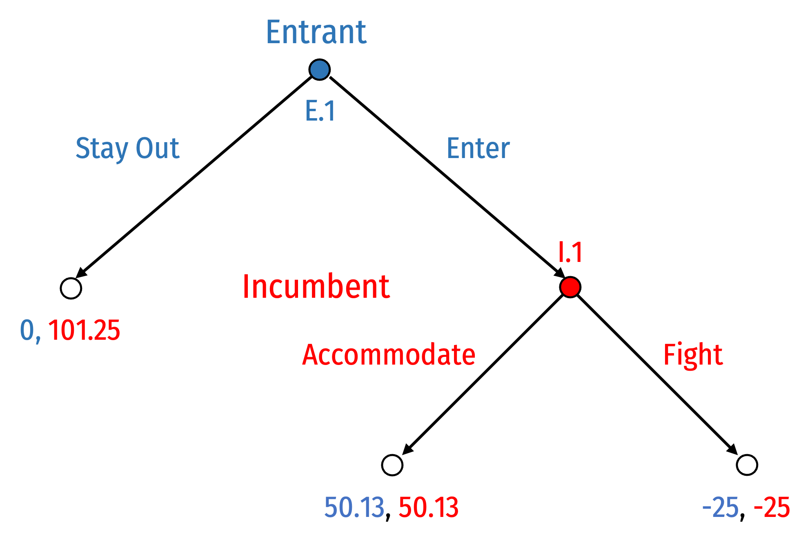
]

]

.pull-right[

- Let’s use the monopoly and Cournot payoffs from [lesson 2.2](/slides/2.2-slides)

- Suppose in a price war, each firm loses $25

]


---

# Pure Strategies

.pull-left[
.center[

]
]

.pull-right[

- .hi-blue[Entrant] has 2 pure strategies:
  1. .blue[Stay Out] at .blue[E.1]
  2. .blue[Enter] at .blue[E.1]

- .hi-red[Incumbent] has 2 pure strategies:
  1. .red[Accommodate] at .red[I.1]
  2. .red[Fight] at .red[I.1]

- Note .hi-red[Incumbent]'s strategy only comes into play if .hi-blue[Entrant] plays .hi-blue[Enter] and the game reaches node .hi-red[I.1] 

]

---

# Solving via Backward Induction

.pull-left[
.center[

]
]

.pull-right[

- .hi[Backwards induction]: to determine the outcome of the game, start with the **last-mover** (i.e. decision nodes just before terminal nodes)

- What is that mover's best choice to maximize their payoff?

- i.e. we start at .red[I.1] where .hi-red[Incumbent] can:
  - .red[Accommodate] to earn .red[50.13]
  - .red[Fight] to earn .red[-25]

]

---

# Solving via Backward Induction

.pull-left[
.center[
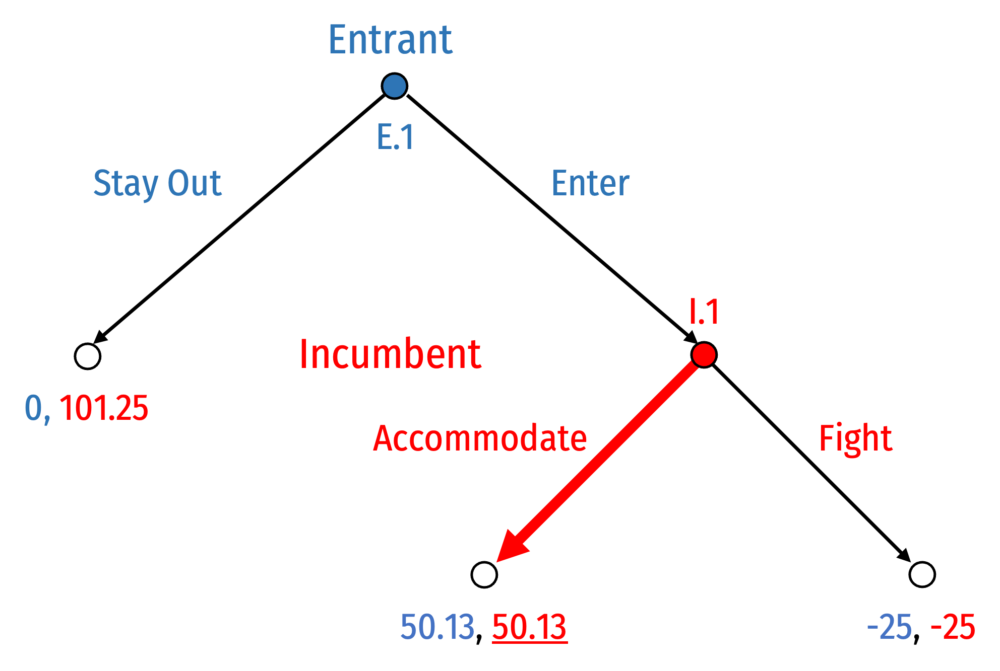
]
]

.pull-right[

- .hi-red[Incumbent] will .hi-red[Accommodate] if game reaches .hi-red[I.1]

- Given this, what will .hi-blue[Entrant] do at .hi-blue[E.1]?
  - .blue[Stay Out] to earn .blue[0]
  - .blue[Enter], knowing .hi-red[Incumbent] will .red[Accommodate], and so will earn .blue[50.13]
]

---

# Solving via Backward Induction

.pull-left[
.center[
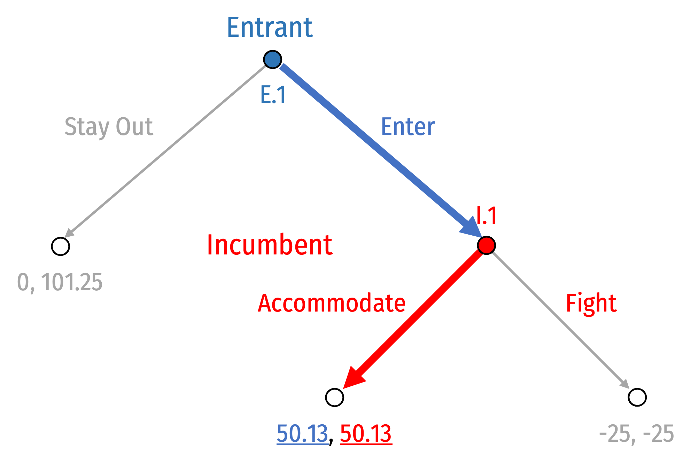
]
]

.pull-right[

- .hi-blue[Entrant] will .blue[Enter]

- Continue until we've reached the initial node (beginning)

- We have the Nash equilibrium:

.center[
(.hi-blue[Enter], .hi-red[Accommodate])
]
]

---

# Sequential Games: Normal vs. Extensive Form

.pull-left[
.center[
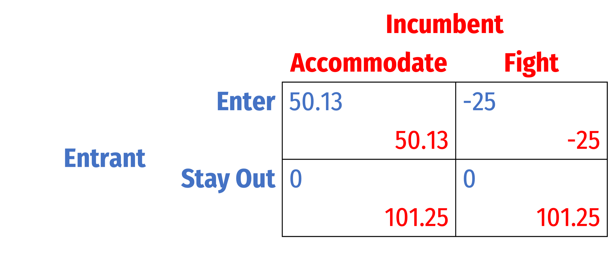
]
]

.pull-right[

- Any game in extensive form can also be depicted in .hi-purple[“normal”] or .hi-purple[“strategic” form] (a payoff matrix)

- Note, if .hi-blue[Entrant] plays .hi-blue[Stay Out], doesn't matter what .hi-red[Incumbent] plays, payoffs are the same

]

---

# Sequential Games: Normal vs. Extensive Form

.pull-left[
.center[

]
]

.pull-right[

.smaller[
- Solve this for Nash Equilibrium...
]
]

---

# Sequential Games: Normal vs. Extensive Form

.pull-left[
.center[
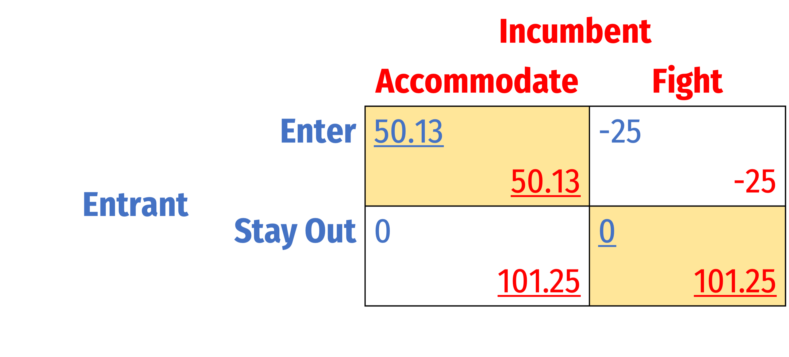
]
]

.pull-right[

.smaller[
- Solve this for Nash Equilibrium...

- *Two* Nash Equilibria:
1. (.hi-blue[Enter], .hi-red[Accommodate])
2. (.hi-blue[Stay Out], .hi-red[Fight])

- But remember, we ignored the *sequential* nature of this game in normal form
  - Which Nash equilibrium is “sequentially rational?”

- New solution concept: .hi[“subgame perfect Nash equilibrium” (SPNE)]
]
]
---

class: inverse, center, middle

# Subgame Perfection

---

# Subgames

.pull-left[
.center[

]
]

.pull-right[

- .hi-purple[Subgame]: any portion of a full game initiated at one node and continuing until all terminal nodes
  - i.e. any decision node starts a subgame containing all the “branches” of that decision node

- Every full game is itself a subgame

- How many subgames does *this* game have?
]

---

# Subgames

.pull-left[
.center[
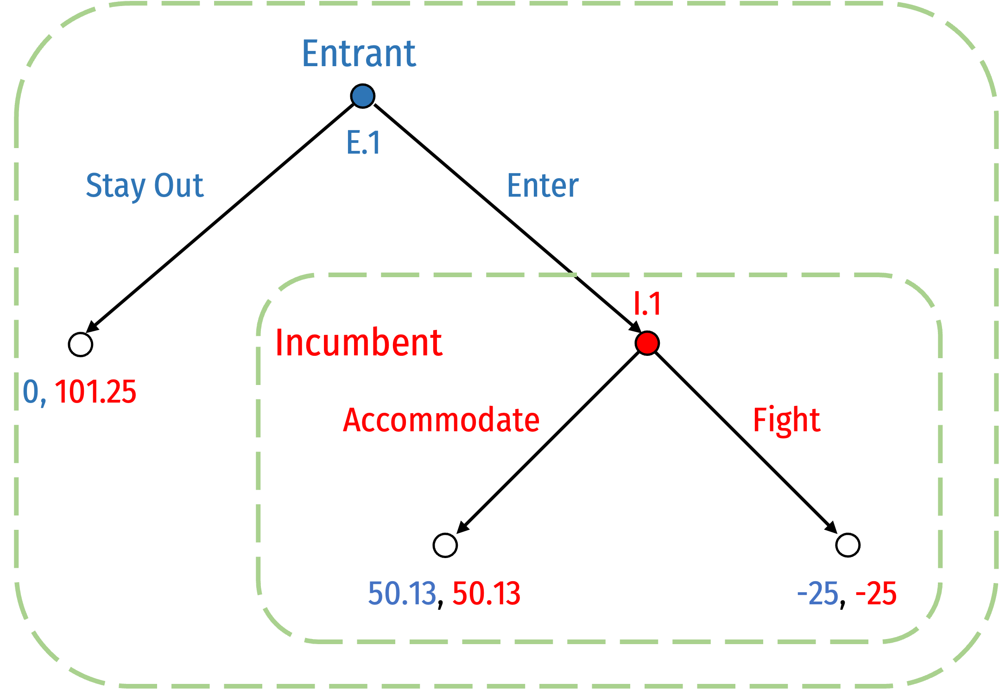
]
]

.pull-left[

1. Subgame initiated at decision node .hi-blue[E.1] (i.e. the full game)
2. Subgame initiated at decision node .hi-red[I.1]

]

---

# Subgame Perfect Nash Equilibrium

.pull-left[
.center[

]
]

.pull-left[

.smaller[
- Consider each subgame as a game itself and ignore the .hi-purple[“history”] of play that got a to that subgame
  - What is optimal to play in *that* subgame?

- Consider a set of strategies that is optimal for all players in *every* subgame it reaches
  - No player would want to change their strategy given the other’s

- That’s .hi[“subgame perfect Nash equilibrium”]

]
]
---

# Subgame Perfect Nash Equilibrium

.pull-left[
.center[


]
]

.pull-left[

- Recall our two Nash Equilibria from normal form: 
1. (.hi-blue[Enter], .hi-red[Accommodate])
2. (.hi-blue[Stay Out], .hi-red[Fight])

]

---

# Subgame Perfect Nash Equilibrium

.pull-left[
.center[


]
]

.pull-left[

- Recall our two Nash Equilibria from normal form: 
1. (.hi-blue[Enter], .hi-red[Accommodate])
2. (.hi-blue[Stay Out], .hi-red[Fight])

- Consider the second set of strategies, where .hi-red[Incumbent] chooses to .red[Fight] at node .red[I.1]

- What if for some reason, .hi-red[Incumbent] is playing this strategy, and .hi-blue[Entrant] unexpectedly plays .blue[Enter]??
]

---

# Subgame Perfect Nash Equilibrium

.pull-left[
.center[


]
]

.pull-left[

- It’s **not rational** for .hi-red[Incumbent] to play .red[Fight] if the game reaches .red[I.1]!
  - Would want to switch to .red[Accommodate]!

- .hi-red[Incumbent] playing .hi-red[Fight] at .red[I.1] is **not a Nash Equilibrium in this subgame!**

- Thus, Nash Equilibrium (.hi-blue[Stay Out], .hi-red[Fight]) is **not sequentially rational**
  - (Though it *is* still a Nash equilibrium!)
]

---

# Subgame Perfect Nash Equilibrium

.pull-left[
.center[


]
]

.pull-left[

- Only (.hi-blue[Enter], .hi-red[Accommodate]) is a .hi-purple[Subgame Perfect Nash Equilibrium (SPNE)]

- These strategy profiles for each player constitute a Nash equilibrium in every possible subgame!

- Simple trick: backwards induction *always* yields the unique SPNE!
]

---

# SPNE and Credibility

.pull-left[
.center[


]
]

.pull-left[

- Suppose before the game started, .hi-red[Incumbent] announced to .hi-blue[Entrant], “if you .blue[Enter], I will .red[Fight]!”

- This **threat** is .hi-purple[not credible] because playing .red[Fight] in response to .blue[Enter] is not rational!

- The strategy is not Subgame Perfect!

]

---

class: inverse, center, middle

# Strategic Moves & Commitment

---

# Strategic vs. Tactical Choices in Game Theory

.pull-left[

- .hi[Strategic move]: must occur prior to tactical choices, **and** must include commitment (i.e. irreversibility)
  - Early stage of game; or “pre-game”

- .hi[Tactical move]: occur after strategic choices
  - Choices made “in-game,” or later stages of game
  - Depend on the strategic choices made earlier
]

.pull-right[
.center[

]
]

---

# Strategic Choices and Time-Horizons

.pull-left[
.quitesmall[
- Consider the difference in time-horizons across certain types of producer decisions

- Shorter-run decisions depend upon the longer-run decisions!

- .hi-purple[Very long run]
  - Research and development

- .hi-purple[Long run]
  - Capacity (choice of capital, $K$)
  - Product characteristics
  - Vertical integration
  - Marketing

- .hi-purple[Short run]
  - Quantity of output
  - Price
]
]

.pull-right[
.center[

]
]

---

# SPNE and Credibility

.pull-left[
.center[

]
]

.pull-right[

- Suppose I were to announce that if you were late once to class, I gave you an F

- If you believe my threat, you would arrive on time, and I never have to carry out my threat

- Sounds like a Nash equilibrium...but not subgame perfect!

- If you call my bluff and come late, I don't actually want to carry out my policy!
]

---

# Incentive Compatibility

.pull-left[
.center[
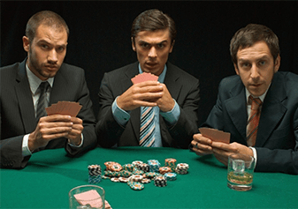


]
]

.pull-right[

- .hi-purple[“Talk is cheap”] in game theory

- With perfect information, strategic **promises** or **threats** will not change equilibrium if they are .hi-purple[not credible]
  - Must be “sequentially rational” or SPNE strategy

- Strategy must be .hi-purple[incentive-compatible], if game reaches the relevant node, it must be in your interest to carry out your promise or threat!
]

---

# Strategic Moves AKA “Game Changers”

.pull-left[
.smallest[
- So far, assumed rules of the game are fixed

- In many strategic situations, players have incentives to try to affect the rules of the game for their own benefit
    - Order, available strategies, payoffs, repetition
    
- A .hi[strategic move] (“game changer”) is an action taken outside the rules an existing game by transforming it into a two-stage game
    - A strategic move is made in stage I (“pre-game” move)
    - A modified version of the original game is played in stage II
]
]

.pull-right[
.center[

]
]

---

# Types of Strategic Moves

.pull-left[
.smallest[
1. .hi[Threats]: if other players don’t choose your preferred move, you will play in a manner that will be bad for them (in second stage)
  - .hi-purple[Conditional] response to other players’ actions

2. .hi[Promises]: if other players choose your preferred move, you will play in a manner that will be good for them (in second stage)
  - .hi-purple[Conditional] response to other players’ actions

3. .hi[Commitments]: irreversibly limit your choice of action, .hi-purple[unconditional] on other players’ actions
]
]

.pull-right[
.center[

]
]

---

# Strategic Moves and Credibility

.pull-left[

- Key: .hi-turquoise[threats and promises are often costly if you must carry them out against your own interest!]

- If a threat works and elicits the desired behavior in others, no need to carry it out

- If a promise elicits the desired behavior in others, cost of performing the promise
]

.pull-right[
.center[

]
]

---

# Commitments

.pull-left[
.smaller[
- A .hi[commitment] is an action taken .hi-purple[unconditional] on other players' actions that **limits your own actions**

- Only a *visible* and *irreversible* commitment makes a strategic threat or promise **credible**
  - *forces* you to follow through with your threat/promise, **even, and especially, if you don't actually want to**

- Can change outcomes of second-stage games; changes other players' expectations of the consequences of their own actions
]
]

.pull-right[
.center[

]
]

---

# Credible Commitment

.center[


*Odysseus and the Sirens* by John William Waterhouse, Scene from Homer’s *Odyssey*

]

---

# Another Motivating Example: Why Professors Are Mean

.pull-left[
.smallest[
- Most professors have a lateness policy where late homework is either not accepted, or points are lost

- Not (necessarily) because professors are mean!

- Suppose a student hands in homework late and has a plausible excuse

- Most professors actually are generous and accommodating, will make an exception

- But if students know this, all students will try plausible excuses and everything becomes late
]
]

.pull-right[
.center[

]
]

---

# Another Motivating Example: Why Professors Are Mean

.pull-left[
.smaller[
- Professor can **commit** to a bright-line policy from the beginning (i.e. in syllabus)

- Removes professor's discretion in individual cases

- The *policy* may be "mean", but leads to a better Nash equilibrium by tying professor's hands

- Salespeople have same limitations from “their manager” or “the man upstairs” preventing better deals
]
]

.pull-right[
.center[

]
]

---

# What Doesn't Kill You Makes You Stronger

.pull-left[

- **Committing** to something is costly in the short-run, but often makes the commit-er better off in the long run

- Often need some kind of **commitment device** to artificially constrain your ability to react

]

.pull-right[
.center[

]
]

---

# What Doesn't Kill You Makes You Stronger

.left-column[
.center[


.smallest[
Thomas Schelling

1921—2016

Economics Nobel 2005
]
]
]

.right-column[

.smallest[

> “‘Bargaining power’ suggests that the advantage goes to the powerful, the strong, or the skillful. It does, of course, if those qualities are defined to mean only that negotiations are won by those who win...The sophisticated negotiator may find it difficult to seem as obstinate as a truly obstinate man,” (p.22).

> “.hi[Bargaining power [is] the power to bind oneself],” (p.22).

]
.source[Schelling, Thomas, 1960, *The Strategy of Conflict*]
]

---

# What Doesn't Kill You Makes You Stronger

.left-column[
.center[


.smallest[
Thomas Schelling

1921—2016

Economics Nobel 2005
]
]
]

.right-column[

.smallest[

> “.hi[How can one commit himself in advance to an act that he would in fact prefer not to carry out in the event,] in order that his commitment may deter the other party? ... In bargaining, the commitment is a device to leave the last clear chance to decide the outcome with the other party, in a manner that he fully appreciates; it is to relinquish further initative, having rigged the incentives so that the other party must choose in one's favor. If one driver speeds up so that he cannot stop, and the other realizes it, the latter has to yield...This doctrine helps to understand some of those cases in which .hi[bargaining 'strength' inheres in what is weakness by other standards.],” (p.22).

]
.source[Schelling, Thomas, 1960, *The Strategy of Conflict*]
]

---

# Why Are the Following So Difficult?

.pull-left[
- New Years Resolutions

- Waking up early

- Dieting

- Going to the gym
]

.pull-right[
.center[


]
]

---

# Time-Inconsistency Problem

.pull-left[

- .hi[Time inconsistency problem]: *Future you* will have different preferences at the moment of truth than *Present you* has now
]

.pull-right[
.center[


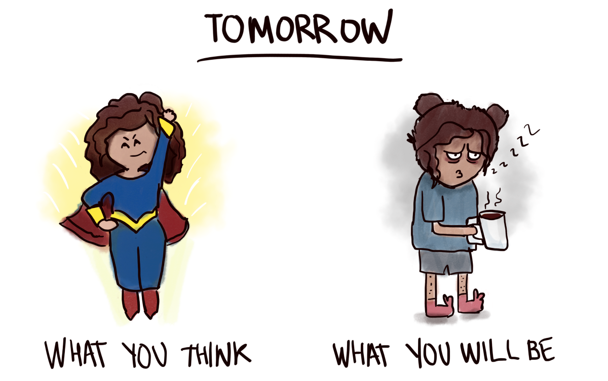

]
]

---

# Time-Inconsistency and Commitment Devices

.pull-left[
.smallest[
- With a .hi[commitment device] you can bind yourself in the future to obey your present wishes

- Limiting your future choices keeps your preferences consistent over time

- Examples:
  - Deadlines
  - Rely on other people
  - Stake your reputation on it
  - Impose a high cost on yourself for failure
  - Hire an agent who is compensated based on your success
]
]

.pull-right[
.center[


]
]

---

class: inverse, center, middle

# Entry Game with Commitment

---

# Entry Game with Credible Commitment

.pull-left[
.smallest[
- Return to our .hi-red[Coke (incumbent)] and .hi-blue[Pepsi (entrant)] entry game

- Suppose that before .hi-blue[Entrant] can decide to .blue[Enter] or .blue[Stay Out], .hi-red[Incumbent] can choose to signal it will respond to any entry .red[Aggressively]
  - invest in excess capacity; i.e. a “war chest” of superfluous infrastructure that costs .blue[-*f*]

- But with this, in response to .hi-blue[Entrant] playing .blue[Enter], .hi-red[Incumbent] is in a *better* position to survive .red[Fight] a price war that forces .hi-blue[Entrant] out of the market
]
]
.pull-right[
.center[

]
]
---

# Entry Game with Credible Commitment

.pull-left[
.center[
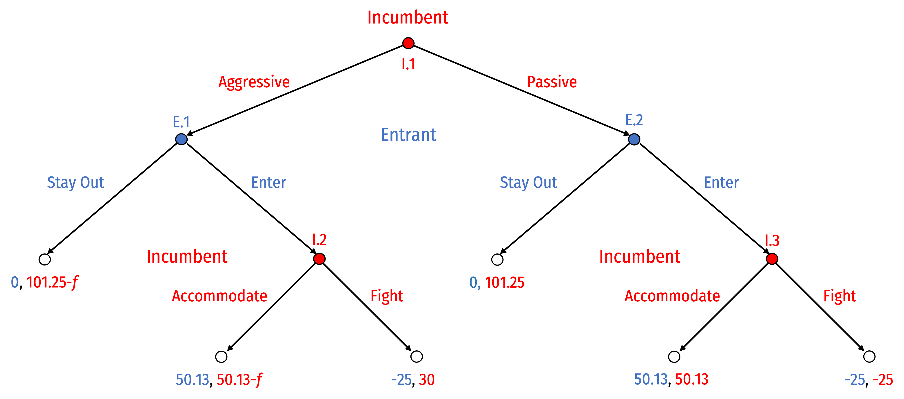

]
]

.pull-right[
- Game changes, .hi-red[Incumbent] goes first at (new) .red[I.1], deciding whether to signal it will be .red[Aggressive] or .red[Passive]
  - Game is the same as before from .blue[E.2] onwards
  
- This is a more complicated game, let's apply what we've learned...
]

---

.center[


]

---

# Entry Game with Credible Commitment

.pull-left[
.center[


]
]

.pull-right[
- What are the **subgames**?

]

---

# Entry Game with Credible Commitment

.pull-left[
.center[
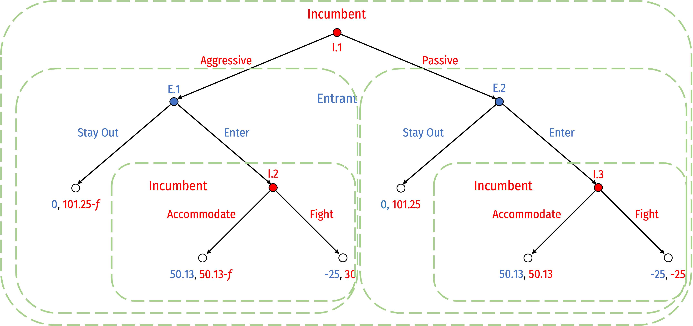

]
]

.pull-right[
- What are the **subgames**?

1. Subgame initiated by node .red[I.1] (game itself)
2. Subgame initiated by node .blue[E.1] 
3. Subgame initiated by node .blue[E.2]
4. Subgame initiated by node .red[I.2] 
5. Subgame initiated by node .red[I.3] 

]

---

# Entry Game with Credible Commitment

.pull-left[
.center[


]
]

.pull-right[

.smallest[
- What are the **strategies** available to each player?
]
]

---

# Entry Game with Credible Commitment

.pull-left[
.center[


]
]

.pull-right[
.smallest[
- What are the **strategies** available to each player?

- .hi-blue[Entrant], choosing at nodes .blue[(E.1, E.2)]
  1. .blue[(Stay Out, Stay Out)]
  2. .blue[(Stay Out, Enter)]
  3. .blue[(Enter, Stay Out)]
  4. .blue[(Enter, Enter)]
]
]

---

# Entry Game with Credible Commitment

.pull-left[
.center[


]
]

.pull-right[

.smallest[
- What are the **strategies** available to each player?

- .hi-red[Incumbent], choosing between two options each at nodes .red[(I.1, I.2, I.3)], has $2^3=8$ possible strategies: 
  1. .red[(Aggressive, Accommodate, Accommodate)]
  2. .red[(Aggressive, Accommodate, Fight)]
  3. .red[(Aggressive, Fight, Accommodate)]
  4. .red[(Aggressive, Fight, Fight)]
  5. .red[(Passive, Accommodate, Accommodate)]
  6. .red[(Passive, Accommodate, Fight)]
  7. .red[(Passive, Fight, Accommodate)]
  8. .red[(Passive, Fight, Fight)]
]
]

---

# Entry Game with Credible Commitment

.pull-left[
.center[


]

]

.pull-right[

- We can use backwards induction to find the outcome of the game

- Let’s assume **_f_ > 20.13** (to make .red[Aggressive-Fight] worthwhile)

- Start with best response of .hi-red[Incumbent] at .red[I.2] and .red[I.3]...then best response of .hi-blue[Entrant] at .blue[E.1] and .blue[E.2]...then .hi-red[Incumbent] at .red[I.1]
]

---

.center[
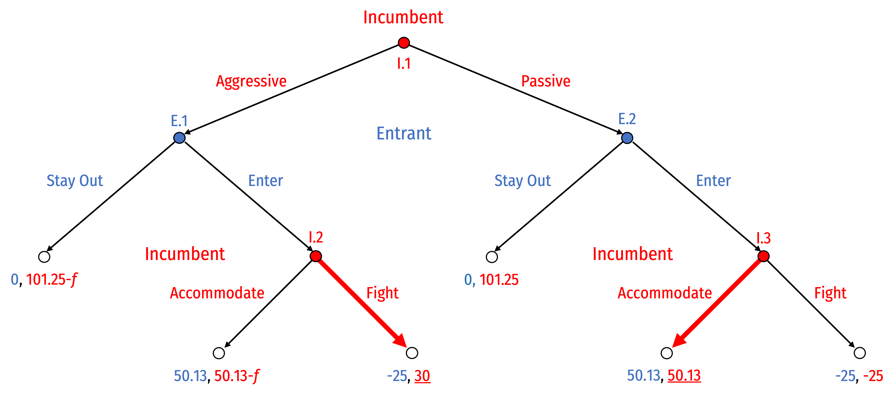
]

---

.center[
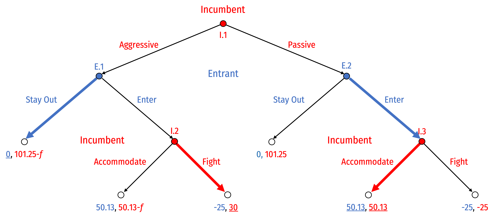
]

---

.center[
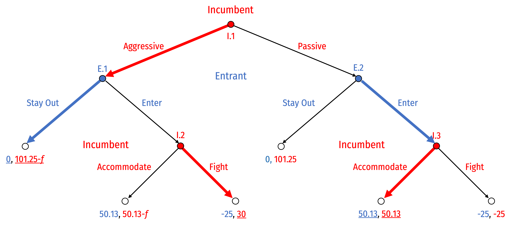
]

---

.center[
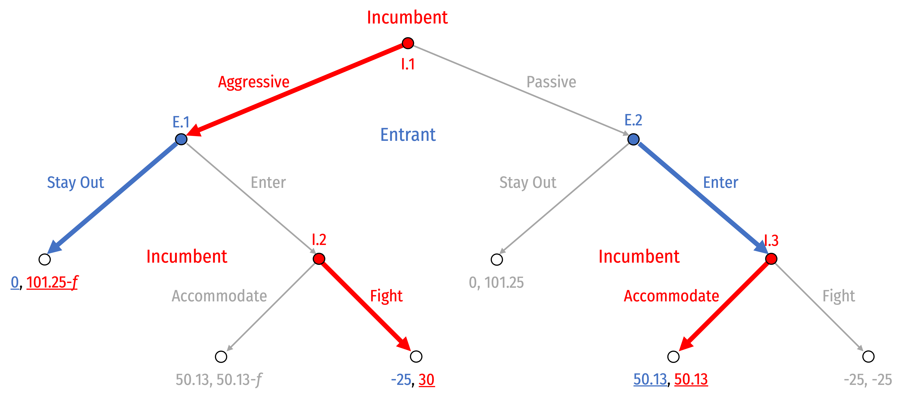
]

---

# Entry Game with Credible Commitment

.pull-left[
.center[

]

]

.pull-right[

.smallest[
- With f > 20.13, .hi-purple[Subgame Perfect Nash Equilibrium (SPNE)]:

.red[(Aggressive, Fight, Accommodate)], .blue[(Stay Out, Enter)]

- The **equilibrium path of play** is .red[Aggressive], then .blue[Stay Out]
]
]

---

# Entry Game with Credible Commitment

.pull-left[
.center[

]

]

.pull-right[

.smallest[
.red[(Aggressive, Fight, Accommodate)], .blue[(Stay Out, Enter)]

]

- SPNE: this set of strategies induces a Nash equilibrium in every subgame
  - Each player optimally responding to every contigency

- With **commitment**, it is .hi-purple[credible] for .hi-red[Incumbent] to threaten to .red[Fight] if .hi-blue[Entrant] decides to .blue[Enter]!
]

---

# Entry Game with Credible Commitment: Normal Form

.pull-left[

]

.pull-right[

.smallest[
.red[(Aggressive, Fight, Accommodate)], .blue[(Stay Out, Enter)]

]

- Note we could look at the set of strategies in normal form

]

---

# Entry Game with Credible Commitment: Normal Form

.pull-left[
.center[
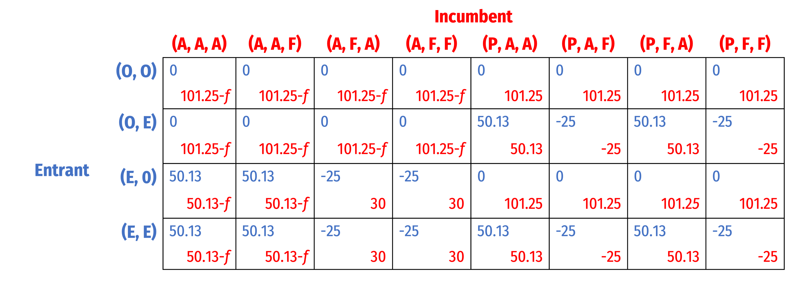
]

]

.pull-right[

.smallest[
.red[(Aggressive, Fight, Accommodate)], .blue[(Stay Out, Enter)]

]

- Note we could look at the set of strategies in normal form

]

---

# Entry Game with Credible Commitment: Normal Form

.pull-left[
.center[
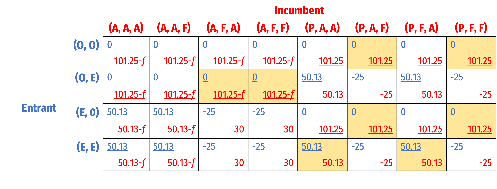
]

]

.pull-right[

.smallest[
.red[(Aggressive, Fight, Accommodate)], .blue[(Stay Out, Enter)]

]

- Note we could look at the set of strategies in normal form
]

---

# Entry Game with Credible Commitment: Normal Form

.pull-left[
.center[
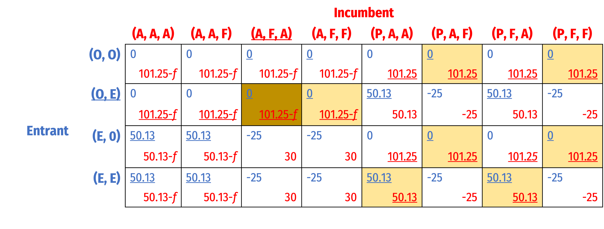
]

]

.pull-right[

.smallest[
.red[(Aggressive, Fight, Accommodate)], .blue[(Stay Out, Enter)]

]

- Note we could look at the set of strategies in normal form
  - But only the one mentioned above is subgame perfect!
]

---

class: middle

.center[

]

---

class: inverse, center, middle

# Market Contestability

---

# Contestable Markets

.pull-left[
- .hi-purple[Markets are **perfectly contestable** if]:
  1. Entry and exit are free
  2. Firms have similar technologies (i.e. similar cost structure)
  3. May have economies of scale (fixed costs), but there are *no sunk* costs
  
- Generalizes “perfect competition” model in more realistic way, also game-theoretic
]

.pull-right[
.center[

]
]

---

# Contestable Markets

.left-column[

.center[


William Baumol

(1922--2017)

]
]

.right-column[

> “This means that...an incumbent, even if he can threaten retaliation after entry, dare not offer profit-making opportunities to potential entrants because an entering firm can hit and run, gathering in the available profits and departing when the going gets rough.”

]

.source[Baumol, William, J, 1982, "Contestable Markets: An Uprising in the Theory of Industry Structure," *American Economic Review,* 72(1): 1-15]

---

# Contestable Markets

.pull-left[

- .hi[“Hit-and-run” competition] forces the incumbent to the limit price

- Incumbent is constrained by the threat of entry or potential competition, rather than actual competition

- Can get perfectly competitive outcome with a single firm!
]

.pull-right[
.center[


]
]

---

# An Entry Game

.pull-left[

- Model the market as an .hi-purple[entry game], with two players:

1. .hi-red[**Incumbent**] which sets its price $\color{red}{p_I}$

2. .hi-blue[**Entrant**] decides to **stay out** or **enter** the market, setting its price $\color{blue}{p_E}$

- Bertrand (price) competition between 2 firms with similar products $\implies$ .hi-purple[consumers buy only from firm with lower price]

]

.pull-right[

.center[


]
]

---

# Contestable Markets II

.pull-left[
.smallest[
- Suppose both firms have identical costs: 
$$\begin{align*}
C(q)&=cq\\
MC(q)&=c\\ \end{align*}$$

- If .hi-red[Incumbent] sets $\color{red}{p_I}>c$
  - .hi-blue[Entrant] would enter and set $\color{blue}{p_E}=\color{red}{p_I}-\epsilon$<sup>.magenta[†]</sup>
]

]

.pull-right[
.center[

]
]

.footnote[<sup>.magenta[†]</sup> For arbitrary `\\(\epsilon>0\\)`, think `\\(\epsilon =\\)` “one penny”]

---

# Contestable Markets II

.pull-left[
.smallest[
- Suppose both firms have identical costs: 
$$\begin{align*}
C(q)&=cq\\
MC(q)&=c\\ \end{align*}$$

- If .hi-red[Incumbent] sets $\color{red}{p_I}>c$
  - .hi-blue[Entrant] would enter and set $\color{blue}{p_E}=\color{red}{p_I}-\epsilon$<sup>.magenta[†]</sup>
  - .hi-red[Incumbent] foresees this possibility, and wants to lower its price $\color{red}{p_I}<\color{blue}{p_E}$
  - This potential undercutting would continue logically until...

]

]

.pull-right[
.center[

]
]

.footnote[<sup>.magenta[†]</sup> For arbitrary `\\(\epsilon>0\\)`, think `\\(\epsilon =\\)` “one penny”]

---

# Contestable Markets II

.pull-left[
.smaller[
- .hi-purple[Nash Equilibrium]: $\big(\color{red}{p_I}=c$, .blue[Stay Out] $\big)$

- .hi-purple[A market with a single firm, but the **competitive outcome**!]
  - $p^*=MC$, $\color{green}{\pi=0}$
  - competitive $q^*$
  - max .hi-blue[Consumer Surplus], no DWL
]
]

.pull-right[

```{r, fig.retina=3} 
# Demand function, format: p=d-eq
a<-10
b<-2
f<-5
c<-2

Demand=function(x){a-b*x}
MR=function(x){a-2*b*x}
MC=function(x){c}
AC=function(x){f/x+c}

q_choke=a/b
q_PC<-(a-c)/(b)

CS<-data.frame(x=c(0,0,q_PC),
               y=c(Demand(q_PC),a,Demand(q_PC)))

points<-tribble(
  ~x, ~y, ~lab,
  q_PC, c, "Nash Eq."
)

line_colors <- c("Demand" = "blue", "MR" = "purple", "MC" = "red", "AC" = "orange")
surplus_colors <-c("Consumer" = "blue", "Profit" = "green", "DWL" = "black")

# make plot 

ggplot(data.frame(x=c(0,q_choke)), aes(x=x))+
  
  # curves 
  stat_function(fun=Demand, geom="line", size=2, aes(color="Demand"))+
  stat_function(fun=MR, geom="line", size=2, aes(color="MR"))+
  stat_function(fun=MC, geom="line", size=2, aes(color="MC"))+
  # surpluses
  geom_polygon(data=CS, aes(x=x,y=y, fill="Consumer"), alpha=0.5)+ #CS

  # labels 
  geom_segment(x=q_PC,y=0,xend=q_PC,yend=c,linetype=3)+
  geom_point(data = points,
             aes(x = x, y = y),
             size=4)+ 
  ggrepel::geom_text_repel(data = points,
                           aes(x = x, y = y, label = lab),
                           box.padding = 0.5,
                           seed = 2,
                           nudge_y = 0.75,
                           #nudge_x = 0.5
                           )+
  annotate(geom = "label", x = 4.5, y = Demand(4.5), label = "Demand",
           color = "blue") +
  annotate(geom = "label", x = 2.25, y = MR(2.25), label = "MR",
           color = "purple") +
  annotate(geom = "label", x = 4.5, y = c, label = "MC",
           color = "red") +
  # annotate(geom = "label", x = 1.3, y = 5, label = "Consumer Surplus",
   #        color = "blue") +
  scale_x_continuous(breaks = c(0,q_PC),
                     labels = c(0,expression(q[p=MC])),
                     expand=c(0,0))+
  scale_y_continuous(breaks = c(0,c),
                     labels = c(0,expression(c)),
                     limits = c(0,a),
                     expand=c(0,0))+
  scale_colour_manual("Curves", values = line_colors)+
  scale_fill_manual("Surpluses", values = surplus_colors, guide = guide_legend(override.aes = list(alpha = 0.5)))+
  guides(color = F, fill = F)+
  labs(x = "Quantity (q)",
       y = "Price (p)")+
  theme_classic(base_family = "Fira Sans Condensed", base_size=18)
```
]

---

# Contestable Markets II

.pull-left[

.smaller[
- What if the .hi-blue[Entrant] has *higher costs* than the .hi-red[Incumbent]: $\color{blue}{c_E}>\color{red}{c_I}$?
]
]

.pull-right[
]

---

# Contestable Markets II

.pull-left[

.smaller[
- What if the .hi-blue[Entrant] has *higher costs* than the .hi-red[Incumbent]: $\color{blue}{c_E}>\color{red}{c_I}$?

- .hi-purple[Nash equilibrium]: 
$\big(\color{red}{p_I}=\color{blue}{p_E-\epsilon}$, .blue[Stay Out] $\big)$

- One firm again, with some inefficiency
  - But not as bad as monopoly!
]
]

.pull-right[

```{r, fig.retina=3} 
a<-10
b<-2
f<-5
c<-2
d<-4.5
e<-4

Demand=function(x){a-b*x}
MR=function(x){a-2*b*x}
MCi=function(x){c}
MCe=function(x){d}
AC=function(x){f/x+c}

q_choke=a/b
q_PC<-(a-c)/(b)

q_star<-(a-e)/b
q_monopoly<-(a-c)/(2*b)

CS<-data.frame(x=c(0,0,q_star),
               y=c(Demand(q_star),a,Demand(q_star)))
DWL<-data.frame(x=c(q_star,q_star,q_PC),
               y=c(c,e,c))

points2<-tribble(
  ~x, ~y, ~lab,
  q_PC, c, "Comp. Eq.",
  q_monopoly, Demand(q_monopoly), "Monopoly",
  q_star, Demand(q_star), "Nash. Eq."
)

line_colors <- c("Demand" = "blue", "MR" = "purple", "MCi" = "red", "MCe" = "red4")
surplus_colors <-c("Consumer" = "blue", "Profit" = "green", "DWL" = "black")

# make plot 

library("ggplot2")
ggplot(data.frame(x=c(0,q_choke)), aes(x=x))+
  
  # curves 
  stat_function(fun=Demand, geom="line", size=2, aes(color="Demand"))+
  stat_function(fun=MR, geom="line", size=2, aes(color="MR"))+
  stat_function(fun=MCi, geom="line", size=2, aes(color="MCi"))+
  stat_function(fun=MCe, geom="line", size=2, aes(color="MCe"))+
  # surpluses
  geom_polygon(data=CS, aes(x=x,y=y, fill="Consumer"), alpha=0.5)+ #CS
  geom_rect(aes(xmin=0,xmax=q_star,ymin=c,ymax=e,fill="Profit"),alpha=0.25) + # Profits
  geom_polygon(data=DWL, aes(x=x,y=y, fill="DWL"), alpha=0.5)+ #CS
  # labels 
  
  # P.C. point 
  geom_segment(aes(x=q_PC,y=0),xend=q_PC,yend=c,linetype=3)+
  # N.E. point 
  geom_segment(aes(x=q_star,y=0),xend=q_star,yend=e,linetype=3)+
  geom_segment(aes(x=0,y=e),xend=q_star,yend=e,linetype=3)+
  # Monopoly point 
  geom_segment(aes(x=q_monopoly,y=0),xend=q_monopoly,yend=Demand(q_monopoly),linetype=3)+
  geom_segment(aes(x=0,y=Demand(q_monopoly)),xend=q_monopoly,yend=Demand(q_monopoly),linetype=3)+
    geom_point(data = points2,
             aes(x = x, y = y),
             size=4)+ 
  ggrepel::geom_text_repel(data = points2,
                           aes(x = x, y = y, label = lab),
                           box.padding = 0.5,
                           seed = 2,
                           nudge_y = 0.75,
                           #nudge_x = 0.5
                           )+

  annotate(geom = "label", x = 4.5, y = Demand(4.5), label = "Demand",
           color = "blue") +
  annotate(geom = "label", x = 2.25, y = MR(2.25), label = "MR",
           color = "purple") +
  annotate(geom = "label", x = 4.5, y = c, label = expression(c[I]),
           color = "red") +
  annotate(geom = "label", x = 4.5, y = d, label = expression(c[E]),
           color = "red4") +
  #annotate(geom = "label", x = 1.25, y = 6, label = "Consumer Surplus",
  #         color = "blue") +
  #annotate(geom = "label", x = 1.25, y = 3, label = "Profit",
  #         color = "green") +
  #annotate(geom = "label", x = 3.2, y = 3, label = "DWL",
  #         color = "black") +
  scale_x_continuous(breaks = c(0,q_monopoly,q_star,q_PC),
                     labels = c(0,expression(q[m]),expression(q[NE]),expression(q[p=MC])),
                     expand=c(0,0))+
  scale_y_continuous(breaks = c(0,c,d,e,Demand(q_monopoly)),
                     labels = c(0,expression(C[I]),expression(c[E]),expression(p[I]==c[E]-epsilon),expression(p[m])),
                     limits = c(0,a),
                     expand=c(0,0))+
  theme_light()+
  scale_colour_manual("Curves", values = line_colors)+
  scale_fill_manual("Surpluses", values = surplus_colors, guide = guide_legend(override.aes = list(alpha = 0.5)))+
  guides(color = F, fill = F)+
  labs(x = "Quantity (q)",
       y = "Price (p)")+
  theme_classic(base_family = "Fira Sans Condensed", base_size=18)
```
]

---

# Contestable Markets III

.pull-left[

- What if there are **fixed costs**, $f$?

$$\begin{align*}
C(q)&=cq+f \\
MC(q)&=c \\
AC(q)&=c+\frac{f}{q} \\
\end{align*}$$

- With high enough $f$, .hi[economies of scale] prevent marginal cost pricing from a being profitable Nash Equilibrium

$$\pi_{p=MC}=-\frac{f}{q}<0$$

]

.pull-right[

```{r, fig.retina=3} 
# Demand function, format: p=d-eq
a<-10
b<-2
f<-5
c<-2

Demand=function(x){a-b*x}
MR=function(x){a-2*b*x}
MC=function(x){c}
AC=function(x){f/x+c}

q_choke<-(a/b)
MR_choke<-(a/(2*b))
q_PC<-(a-c)/(b)

CS<-data.frame(x=c(0,0,q_PC),
               y=c(Demand(q_PC),a,Demand(q_PC)))

line_colors <- c("Demand" = "blue", "MR" = "purple", "MC" = "red", "AC" = "orange")
surplus_colors <-c("Consumer" = "blue", "Loss" = "black", "DWL" = "black")

# make plot 

library("ggplot2")
ggplot(data.frame(x=c(0,q_choke)), aes(x=x))+
  
  # curves 
  stat_function(fun=Demand, geom="line", size=2, aes(color="Demand"))+
  stat_function(fun=MR, geom="line", size=2, aes(color="MR"))+
  stat_function(fun=MC, geom="line", size=2, aes(color="MC"))+
  stat_function(fun=AC, geom="line", size=2, aes(color="AC"))+
  
  # surpluses
  geom_rect(aes(xmin=0,xmax=q_PC,ymin=c,ymax=AC(q_PC),fill="Loss"),alpha=0.25) + # Losses
  
   # labels 
  geom_segment(aes(x=q_PC,y=0),xend=q_PC,yend=c,linetype=3)+
  #geom_point(aes(x=q_PC,y=c), color="black", size=3)+ 
  geom_text(x=q_PC+0.5,y=c,label="P.C.", color="black")+
  annotate(geom = "label", x = 4.5, y = Demand(4.5), label = "Demand",
           color = "blue") +
  annotate(geom = "label", x = 2.25, y = MR(2.25), label = "MR",
           color = "purple") +
  annotate(geom = "label", x = 4.5, y = c, label = "MC",
           color = "red") +
  annotate(geom = "label", x = 4.5, y = AC(d), label = "AC",
           color = "orange") +
  annotate(geom = "label", x = 1.25, y = 2.5, label = "Loss",
           color = "black") +
  scale_x_continuous(breaks = c(0,q_PC),
                     labels = c(0,expression(q[p=MC])),
                     expand=c(0,0))+
  scale_y_continuous(breaks = c(0,c,AC(q_PC)),
                     labels = c(0,expression(c),expression(c+f/q)),
                     limits = c(0,a),
                     expand=c(0,0))+
  theme_light(base_family = "Yanone Kaffeesatz Regular")+
  scale_colour_manual("Curves", values = line_colors)+
  scale_fill_manual("Surpluses", values = surplus_colors, guide = guide_legend(override.aes = list(alpha = 0.5)))+
  labs(x = "Quantity (q)",
       y = "Price (p)")+
  guides(color = F, fill = F)+
  theme_classic(base_family = "Fira Sans Condensed", base_size=18)
```
]

---

# Contestable Markets IV

.pull-left[

.smaller[
- .hi-purple[Nash equilibrium]: $\big(\color{red}{p_I}=AC$, .blue[Stay Out] $\big)$

- Again, only a single firm with some inefficiency
  - But not as bad as monopoly!
  - .red[Incumbent] earns no profits!

]
]
.pull-right[

```{r, fig.retina=3} 
# Demand function, format: p=d-eq
a<-10
b<-2
f<-5
c<-2

Demand=function(x){a-b*x}
MR=function(x){a-2*b*x}
MC=function(x){c}
AC=function(x){f/x+c}

q_choke<-(a/b)
MR_choke<-(a/(2*b))
q_PC<-(a-c)/(b)
q_AC<-((a-c)+sqrt((a-c)^2-4*b*f))/(2*b) # needed quadratic formula, heh 

CS<-data.frame(x=c(0,0,q_AC),
               y=c(Demand(q_AC),a,Demand(q_AC)))

DWL<-data.frame(x=c(q_AC,q_AC,q_PC),
                        y=c(c,Demand(q_AC),c))

points3<-tribble(
  ~x, ~y, ~lab,
  q_PC, c, "Comp. Eq.",
  q_monopoly, Demand(q_monopoly), "Monopoly",
  q_AC, Demand(q_AC), "Nash. Eq."
)

line_colors <- c("Demand" = "blue", "MR" = "purple", "MC" = "red", "AC" = "orange")
surplus_colors <-c("Consumer" = "blue", "Profit" = "green", "DWL" = "black")

# make plot 
ggplot(data.frame(x=c(0,q_choke)), aes(x=x))+
  
  # curves 
  stat_function(fun=Demand, geom="line", size=2, aes(color="Demand"))+
  stat_function(fun=MR, geom="line", size=2, aes(color="MR"))+
  stat_function(fun=MC, geom="line", size=2, aes(color="MC"))+
  stat_function(fun=AC, geom="line", size=2, aes(color="AC"))+
  
  # surpluses
  geom_polygon(data=CS, aes(x=x,y=y, fill="Consumer"), alpha=0.5)+ #CS
  geom_polygon(data=DWL, aes(x=x,y=y, fill="DWL"), alpha=0.5)+ #DWL
  
   # labels 
  geom_segment(aes(x=q_monopoly,y=0),xend=q_monopoly,yend=Demand(q_monopoly), linetype=3)+
  geom_segment(aes(x=0,y=Demand(q_monopoly)),xend=q_monopoly,yend=Demand(q_monopoly), linetype=3)+

  geom_segment(aes(x=q_PC,y=0),xend=q_PC,yend=c,linetype=3)+
  geom_segment(aes(x=q_AC,y=0),xend=q_AC,yend=Demand(q_AC), linetype=3)+
  geom_segment(aes(x=0,y=Demand(q_AC)),xend=q_AC,yend=Demand(q_AC), linetype=3)+
  annotate(geom = "label", x = 4.5, y = Demand(4.5), label = "Demand",
           color = "blue") +
  annotate(geom = "label", x = 2.25, y = MR(2.25),  label = "MR",
           color = "purple") +
  annotate(geom = "label", x = 4.5, y = c, label = "MC",
           color = "red") +
  annotate(geom = "label", x = 4.5, y = AC(d), label = "AC",
           color = "orange") +

      geom_point(data = points3,
             aes(x = x, y = y),
             size=4)+ 
  ggrepel::geom_text_repel(data = points3,
                           aes(x = x, y = y, label = lab),
                           box.padding = 0.5,
                           seed = 2,
                           nudge_y = 0.75,
                           #nudge_x = 0.5
                           )+
  scale_x_continuous(breaks = c(0,q_monopoly,q_AC,q_PC),
                     labels = c(0,expression(q[m]),expression(q[p=AC]),expression(q[p=MC])),
                     expand=c(0,0))+
  scale_y_continuous(breaks = c(0,c,AC(q_AC),Demand(q_monopoly)),
                     labels = c(0,expression(c),expression(c+f/q), expression(q[m])),
                     limits = c(0,a),
                     expand=c(0,0))+
  scale_colour_manual("Curves", values = line_colors)+
  scale_fill_manual("Surpluses", values = surplus_colors, guide = guide_legend(override.aes = list(alpha = 0.5)))+
  labs(x = "Quantity (q)",
       y = "Price (p)")+
  guides(color = F, fill = F)+
  theme_classic(base_family = "Fira Sans Condensed", base_size=18)
```
]

---

# What About *Sunk* Costs? I

.pull-left[
- Fixed costs $\implies$ do not vary with output

- If firm exits, could sell these assets (e.g. machines, real estate) to recover costs
  - Thus, .hi-purple[“hit-and-run” competition] remains potentially profitable
  - Maintains .hi-purple[credible threat] against incumbent acting as a monopolist

]

.pull-right[
.center[

]
]

---

# What About *Sunk* Costs? I

.pull-left[

- But what if assets are *not* sellable and costs *not* recoverable - i.e. .hi[sunk costs]?

- e.g. research and development, spending to build brand equity, advertising, worker-training for industry-specific skills, etc 

]

.pull-right[
.center[

]
]

---

# What About *Sunk* Costs? II

.pull-left[
- These are bygones to the .hi-red[Incumbent], who has already committed to producing

- But are *new* costs and risk to .hi-blue[Entrant], lowering expected profits

- In effect, sunk costs raise $\color{blue}{c_E}>\color{red}{c_I}$, and return us back to our Scenario II

- .hi[Nash equilibrium]: .hi-red[Incumbent] deters entry with $\color{red}{p_I}=\color{blue}{p_E}-\epsilon$
  - Inefficient, $p>AC$, but again not monopoly

]

.pull-right[
.center[

]
]