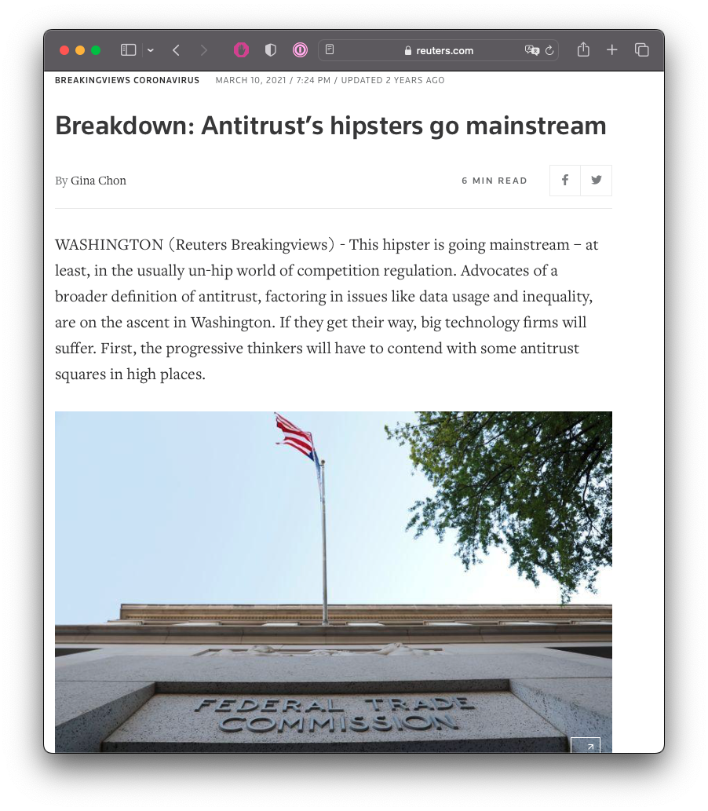
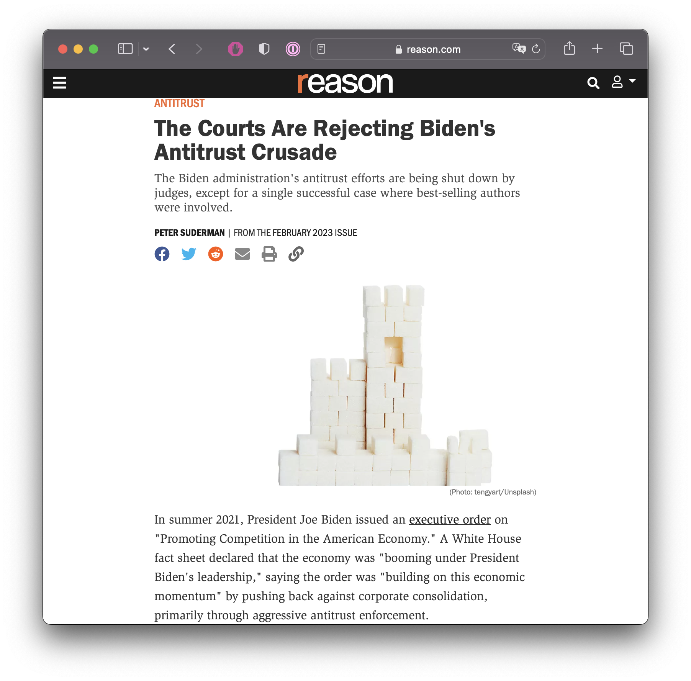

```{r setup, include=FALSE}
options(htmltools.dir.version = FALSE)
knitr::opts_chunk$set(echo=F,
                      message=F,
                      warning=F,
                      fig.retina = 3,
                      fig.align = "center")
library("tidyverse")
library("mosaic")
library("ggrepel")
library("fontawesome")
xaringanExtra::use_tile_view()
xaringanExtra::use_tachyons()
xaringanExtra::use_freezeframe()

update_geom_defaults("label", list(family = "Fira Sans Condensed"))
update_geom_defaults("text", list(family = "Fira Sans Condensed"))

set.seed(256)
```

class: title-slide

# 5.3 — Antitrust III: The Hipsters

## ECON 326 • Industrial Organization • Spring 2023

### Ryan Safner<br> Associate Professor of Economics <br> <a href="mailto:safner@hood.edu"><i class="fa fa-paper-plane fa-fw"></i>safner@hood.edu</a> <br> <a href="https://github.com/ryansafner/ioS23"><i class="fa fa-github fa-fw"></i>ryansafner/ioS23</a><br> <a href="https://ioS23.classes.ryansafner.com"> <i class="fa fa-globe fa-fw"></i>ioS23.classes.ryansafner.com</a><br>

---

class: inverse

# Outline

### [The Unique Economics of Platforms](#4)

### [The Paradox of Antitrust](#9)

### [Historical Revisionism of the Gilded Age](#30)

### [The Legislative History & Intent of Sherman Act](#57)

---

# Antitrust III: Big Tech & Hipster Antitrust

.pull-left[
.center[

]
]

.pull-right[
.smaller[
Today:

- Unique economics of platforms
  - Network effect
  - Multi-sided markets

- Hipster Antitrust
  - Kahn's critique of Amazon
  - Antitrust issues in Big Tech
  - Replacement of consumer welfare standard?
]
]

---

class: inverse, center, middle

# The Unique Economics of Platforms

---

# Network Effects

.pull-left[
.center[

]
]

.pull-right[
.smaller[
- .hi-purple[Network Economies]: the value of using a particular product increases with the number of people already using the product (or expected to join)

- A positive externality

- .hi-green[Examples]:
  - Railroad track gauge
  - Cellular networks (especially pre-2004)
  - Bank & ATM networks
  - Payment networks (Venmo, Square, etc.)
  - Operating system (Android, Apple)
]
]

---

# Network Effects

.pull-left[
.center[

]
]

.pull-right[

- .hi-purple[Metcalfe's Law]: the number of connections on a network increases proportional to the *square* of the number of users
$$connections=\frac{n(n-1)}{2}$$
  - $n=2 \implies 1$ connection
  - $n=5 \implies 10$ connections
  - $n=12 \implies 66$ connections

- As $\lim\limits_{n \to \infty} \text{connections} = n^2$

]

---

# Path Dependence and Lock-In

.pull-left[
.center[

]
]

.pull-right[

- Often a battle of standards

- A .hi-purple[Coordination Game]
  - Two Nash equilibria (.red[A], .blue[A]) and (.red[B], .blue[B])
  - Either just as good
  - Coordination is most important

]

---

# Path Dependence and Lock-In

.pull-left[
.center[

]
]

.pull-right[

- .hi-purple[Path Dependence]: early choices may affect later ability to choose or switch

- .hi-purple[Lock-in]: the switching cost of moving from one equilibrium to another becomes prohibitive

]

---

# Inefficient Lock-In

.pull-left[
.center[

]
]

.pull-right[

- Suppose we are currently in equilibrium (.red[B], .blue[B])

- .hi-purple[Inefficient lock-in]:
  - Standard A is superior to B
  - But too costly to switch from B to A

]

---

# Alleged Example of Lock-In

.pull-left[
.center[

]
]

.pull-right[

.center[


]
]

.source[David, Paul A, 1985, "Clio and the Economics of QWERTY," *American Economic Review*, 75(2):332-337]

---

# Alleged Example of Lock-In

.pull-left[
.center[

]
]

.pull-right[

.center[

]
]

---

# Types of Lock-In

.pull-left[
.center[

]
]

.pull-right[

- .hi-purple[“First-degree” path dependency]:
  - Sensitivity to initial conditions
  - But no inefficiency

- .hi-green[Examples]:
  - language
  - driving on left vs. right side of road
]

.source[Liebowitz, Stan J and Stephen E Margolis, 1990, "The Fable of the Keys," *Journal of Law and Economics*, 33(1):1-25]

---

# Types of Lock-In 

.pull-left[
.center[


Later: 

]
]

.pull-right[

- .hi-purple[“Second-degree” path dependency]:
  - Sensitivity to initial conditions
  - Imperfect information at time of choice
  - Outcomes are regrettable *ex post*

- Not inefficient: no better decision could have been made *at the time*
]

.source[Liebowitz, Stan J and Stephen E Margolis, 1990, "The Fable of the Keys," *Journal of Law and Economics*, 33(1):1-25]

---

# Types of Lock-In 

.pull-left[
.center[

]
]

.pull-right[

- .hi-purple[“Third-degree” path dependency]: 
  - Sensitivity to initial conditions
  - Worse choice made (.red[A], .blue[A])
  - Avoidable mistake at the time
  
- Inefficient lock-in (.red[A], .blue[A])

]

.source[Liebowitz, Stan J and Stephen E Margolis, 1990, "The Fable of the Keys," *Journal of Law and Economics*, 33(1):1-25]

---

# Technological Choice and Uncertainty

.pull-left[
.center[

]

]

.pull-right[

- In the .hi-turquoise[long-run], suppose, Technology **B** is superior

- But in the .hi-turquoise[short-run], Technology **A** has higher payoffs

- Choosing **A** leads to inefficient lock-in

- But what about .hi-purple[uncertainty]?
  - What set of institutions will choose best under uncertainty?


]
 
.source[Arthur, W. Brian, 1989, "Competing Technologies, Increasing Returns, and Lock-In by Historical Events," *Economic Journal* 99(394): 116-131]


---

# Technological Choice and Uncertainty

.pull-left[
.center[

]

]

.pull-right[

- Role for .hi-purple[entrepreneurial judgment] and .hi-purple[“championing”] a standard
  - Someone who “owns” a standard has strong incentive to ensure it becomes widely adopted

- Champions who forecast higher long-term payoffs can subsidize adoption in the short run


]

.source[Arthur, W. Brian, 1989, "Competing Technologies, Increasing Returns, and Lock-In by Historical Events," *Economic Journal* 99(394): 116-131]

---

class: inverse, center, middle

# Platforms

---

# Platforms

.pull-left[
.center[

]
]

.pull-right[

- A .hi-purple[multi-sided market] or a .hi-purple[“platform”] is a managed marketplace where an intermediary matches together two different groups of users to exchange
  - Platform itself is often a business, helping to match users together across groups for a fee

- Simple example: newspapers
  - Group A: readers
  - Group B: advertisers

]

---

# Platforms

.pull-left[
.center[

]
]

.pull-right[
.center[

]
]

---

# The Digital Disruption is Here

.pull-left[
.center[

]
]

.pull-right[
.center[

]
]

---

# Non-Platform Business Models

.pull-left[
.center[

]
]

.pull-right[

- .hi-purple[Linear business model]: serve one segment of the market
  - direct to consumers or business (next-stage of supply chain)

- Owns one side of the transaction

- Products have an inherent value

- Compete in one dimension: on cost via economies of scale

]

---

# Platform Business Model

.pull-left[
.center[

]
]

.pull-right[

- .hi-purple[Platform business model]: facilitate transactions between multiple groups
  - “be the market”

- Owns infrastructure that adds value to *both* sides of the transaction

]

---

# Platform Business Model

.pull-left[
.center[

]
]

.pull-right[

- Compete in multiple dimensions: 
  - on cost via economies of scale (high entry barriers)
  - on customers via network effect
  - may also provide features to either/both groups

]

---

# Platform Business Model

.pull-left[
```{r}
library(patchwork)
mv_linear=function(x){4}
mc_linear=function(x){8-x}

p1<-ggplot(data.frame(x=c(0,10)), aes(x=x))+
  stat_function(fun=mv_linear, geom="line", size=2, color = "blue")+
    geom_label(aes(x=8,y=mv_linear(8)), color = "blue", label="Marginal Value", size = 3)+
  stat_function(fun=mc_linear, geom="line", size=2, color = "red")+
    geom_label(aes(x=6,y=mc_linear(6)), color = "red", label="Marginal Cost", size = 3)+
  geom_vline(xintercept=2, size=1, linetype="dashed")+
  geom_label(x = 2, y = 9, label = "Firm B", size=3)+
  
  geom_vline(xintercept=7, size=1, linetype="dashed")+
  geom_label(x = 7, y = 9, label = "Firm A", size=3)+

    scale_x_continuous(breaks=NULL,
                     limits=c(0,10),
                     expand=expand_scale(mult=c(0,0.1)))+
  scale_y_continuous(breaks=NULL,
                     limits=c(0,10),
                     expand=expand_scale(mult=c(0,0.1)))+
  guides(fill=F)+
  labs(title = "Linear Business",
       x = "Scale",
       y = "Value")+
  theme_classic(base_family = "Fira Sans Condensed", base_size=20)

mv_platform=function(x){x}
mc_platform=function(x){8-x}

p2<-ggplot(data.frame(x=c(0,10)), aes(x=x))+
  stat_function(fun=mv_platform, geom="line", size=2, color = "blue")+
    geom_label(aes(x=8,y=mv_platform(8)), color = "blue", label="Marginal Value", size = 3)+
  stat_function(fun=mc_platform, geom="line", size=2, color = "red")+
    geom_label(aes(x=6,y=mc_platform(6)), color = "red", label="Marginal Cost", size = 3)+
  geom_vline(xintercept=2, size=1, linetype="dashed")+
  geom_label(x = 2, y = 9, label = "Firm B", size=3)+
  
  geom_vline(xintercept=7, size=1, linetype="dashed")+
  geom_label(x = 7, y = 9, label = "Firm A", size=3)+
  
    scale_x_continuous(breaks=NULL,
                     limits=c(0,10),
                     expand=expand_scale(mult=c(0,0.1)))+
  scale_y_continuous(breaks=NULL,
                     limits=c(0,10),
                     expand=expand_scale(mult=c(0,0.1)))+
  guides(fill=F)+
  labs(title = "Platform Business",
       x = "Scale",
       y = "Value")+
  theme_classic(base_family = "Fira Sans Condensed", base_size=20)

p1+p2
```

]

.pull-right[

- Competition between platforms is often .hi-purple["winner-take-all"]

- Large initial costs and low initial value

- Increasing value due to network effect

- High barriers to entry to compete with existing platform
  - trust, history, reputation, volume, size of network
]

---

# Platform Examples

.center[

]

.source[Moazed, Alex and Nicholas L. Johnson, 2016, *Modern Monopolies: What it Takes to Dominate the 21st Century Economy*]

---

# Matchmaking

.center[

]

---

# The Long Tail of Transactions

.center[

]

---

# Pricing for Platforms

.pull-left[
```{r}
demand_a=function(x){3/x}

p3<-ggplot(data.frame(x=c(0,10)), aes(x=x))+
  stat_function(fun=demand_a, geom="line", size=2, color = "blue")+
  geom_label(aes(x=1,y=demand_a(1)), color = "blue", label="Demand", size = 3)+
  geom_rect(xmin=0,xmax=2,ymin=0,ymax=demand_a(2), fill="blue", alpha=0.3)+
  scale_x_continuous(breaks=c(2),
                     labels=c(expression(q[1])),
                     limits=c(0,10),
                     expand=expand_scale(mult=c(0,0.1)))+
  scale_y_continuous(breaks=c(demand_a(2)),
                     labels=c(expression(p[1])),
                     limits=c(0,10),
                     expand=expand_scale(mult=c(0,0.1)))+
  labs(title = "Consumer",
       x = "Quantity",
       y = "Price")+
  theme_classic(base_family = "Fira Sans Condensed", base_size=20)

demand_b=function(x){8-x}
demand_b2=function(x){10-x}

p4<-ggplot(data.frame(x=c(0,10)), aes(x=x))+
  stat_function(fun=demand_b, geom="line", size=2, color = "blue")+
  geom_label(aes(x=1,y=demand_b(1)), color = "blue", label="Demand", size = 3)+
  geom_rect(xmin=0,xmax=4,ymin=0,ymax=demand_b(4), fill="blue", alpha=0.3)+
  scale_x_continuous(breaks=c(4),
                     labels=c(expression(q[1])),
                     limits=c(0,10),
                     expand=expand_scale(mult=c(0,0.1)))+
  scale_y_continuous(breaks=c(demand_b(4)),
                     labels=c(expression(p[1])),
                     limits=c(0,10),
                     expand=expand_scale(mult=c(0,0.1)))+
  labs(title = "Developer",
       x = "Price",
       y = "Quantity")+
  theme_classic(base_family = "Fira Sans Condensed", base_size=20)

p3+p4
```

]

.pull-right[
.smaller[
- Traditional business pricing model: price each market to maximize revenue
]
]
---

# Pricing for Platforms

.pull-left[
```{r}
p5<-ggplot(data.frame(x=c(0,10)), aes(x=x))+
  stat_function(fun=demand_a, geom="line", size=2, color = "blue")+
  geom_label(aes(x=1,y=demand_a(1)), color = "blue", label="Demand", size = 3)+
  geom_rect(xmin=0,xmax=2,ymin=0,ymax=demand_a(2), fill="red", alpha=0.3)+
  scale_x_continuous(breaks=c(2,10),
                     labels=c(expression(q[1]),expression(q[2])),
                     limits=c(0,10),
                     expand=expand_scale(mult=c(0,0.1)))+
  scale_y_continuous(breaks=c(0,demand_a(2)),
                     labels=c(expression(p[2]),expression(p[1])),
                     limits=c(0,10),
                     expand=expand_scale(mult=c(0,0.1)))+
  labs(title = "Consumer",
       x = "Quantity",
       y = "Price")+
  theme_classic(base_family = "Fira Sans Condensed", base_size=20)

demand_b2=function(x){10-x}

p6<-ggplot(data.frame(x=c(0,10)), aes(x=x))+
  stat_function(fun=demand_b, geom="line", size=2, color = "blue")+
  geom_label(aes(x=1,y=demand_b(1)), color = "blue", label="Demand", size = 3)+
  stat_function(fun=demand_b2, geom="line", size=2, color = "darkblue")+
  geom_label(aes(x=1,y=demand_b2(1)), color = "darkblue", label="Demand 2", size = 3)+
  geom_rect(xmin=0,xmax=4,ymin=0,ymax=demand_b(4), fill="blue", alpha=0.3)+
  geom_rect(xmin=0,xmax=5,ymin=0,ymax=demand_b2(5), fill="green", alpha=0.3)+
  scale_x_continuous(breaks=c(4,5),
                     labels=c(expression(q[1]),expression(q[2])),
                     limits=c(0,10),
                     expand=expand_scale(mult=c(0,0.1)))+
  scale_y_continuous(breaks=c(demand_b(4),demand_b2(5)),
                     labels=c(expression(p[1]),expression(p[2])),
                     limits=c(0,10),
                     expand=expand_scale(mult=c(0,0.1)))+
  labs(title = "Developer",
       x = "Price",
       y = "Quantity")+
  theme_classic(base_family = "Fira Sans Condensed", base_size=20)

p5+p6
```

]

.pull-right[
.smaller[
- Traditional business pricing model: price each market to maximize revenue

- Platform business: so long as .hi-red[revenue lost] from Consumers $<$ .hi-green[revenue gained] from Developers: cross-subsidize
  - Lower price on Consumers (even to 0) to boost demand
  - Increases demand for Developers, raise price on them

- Standard "champion" forecasting future value: subsidize early adopters!
]
]
---

# The "Subsidy Side" and the "Money Side"

.center[

]

.source[Evans, David S and Richard Schmalensee, 2016, *Matchmakers: The New Economics of Multisided Platforms]

---

# Rise of Platforms in S&P 500

.pull-left[
.center[

]
]

.pull-right[
.center[

]
]

---

class: inverse, center, middle

# Hipster Antitrust

---

# Hipster Antitrust

.left-column[
.center[

.smallest[
Lina Khan

1989-
]
]
]

.right-column[

- ["Amazon's Antitrust Paradox"](https://www.yalelawjournal.org/note/amazons-antitrust-paradox) *Yale Law Journal* 126(3)

- Response to Bork's *Antitrust Paradox* and the dominant "consumer welfare standard"
  - Antitrust should only be about consumer welfare, not small-business protectionism
  - Focus only on classic market power behavior: high price, low output, low quality

- Amazon (and other platforms) have fiercely low prices and provides enormous consumer surplus
]

---

# Hipster Antitrust & Big Tech

.pull-left[
.center[

]
]

.pull-right[
.smaller[
- Most dominant tech companies are platforms with large market share

- But consider consumer welfare standard and focus on price

- These platforms offer very low prices (often $0!), high quantity, high quality, and ample choice to consumers
  - Consumers are often "paying" in their data, sold to advertisers

- What about the producers' (advertisers, sellers, etc) side of the market?
]
]
---

# Louis Brandeis


.left-column[
.center[

.smallest[
Louis Brandeis

1856-1941

Associate U.S. Supreme Court Justice
]
]
]

.right-column[
.smallest[

> “We may have democracy, or we may have wealth concentrated in the hands of a few, but we can’t have both.”

]
]

---

# Louis Brandeis


.left-column[
.center[

.smallest[
Louis Brandeis

1856-1941

Associate U.S. Supreme Court Justice
]
]
]

.right-column[
.quitesmall[

> “[The question is,] shall we have regulated competition or regulated monopoly?”

> “We learned long ago that liberty could be preserved only by limiting in some way the freedom of action of individuals; that otherwise liberty would necessarily lead to absolutism and in the same way we have learned that unless there be regulation of competition, its excesses will lead to the destruction of competition, and monopoly will take its place.”

> “There are no natural monopolies today in the industrial world. The Oil Trust and the Steel Trust have been referred to as natural monopolies, but they are both most unnatural. The Oil Trust acquired its control of the market by conduct...which enabled it to destroy its small competitors by price-cutting and similar practices. The Steel Trust acquired control not through greater efficiency, but by buying up existing plants and ore supplies at fabulous prices.”

]

.source[Brandeis, Louis, 1934, *The Curse of Bigness, Miscellaneous Papers of Louis Brandeis.*]
]

---

# "Amazon's Antitrust Paradox"

.left-column[
.center[

.smallest[
Lina Khan

1989-
]
]
]

.right-column[
.smallest[
> "Amazon is the titan of twenty-first century commerce. In addition to being a retailer, it is now a marketing platform, a delivery and logistics network, a payment service, a credit lender, an auction house, a major book publisher, a producer of television and films, a fashion designer, a hardware manufacturer, and a leading host of cloud server space. Although Amazon has clocked staggering growth, it generates meager profits, choosing to price below-cost and expand widely instead. Through this strategy, the company has positioned itself at the center of e-commerce and now serves as essential infrastructure for a host of other businesses that depend upon it. Elements of the firm’s structure and conduct pose anticompetitive concerns—yet it has escaped antitrust scrutiny," (p.710). 

]
.source[Khan, Lina, 2017, "Amazon's Antitrust Paradox," *Yale Law Journal* 126(3):710-805]

]

---

# “Hipster” Antitrust


.smallest[
> “For antitrust practitioners, scholars, and economists – those who work with antitrust in agencies, courts, or law firms – the development of the antitrust laws over the past half century has been a remarkable and positive development for the American economy and consumers. Most fundamentally, there is agreement that the goal of protecting consumer welfare is and should be the lodestar of modern antitrust enforcement. This has not always been the case. For much of its history, antitrust has done more harm than good. Prior to the modern “consumer-welfare” era, antitrust laws employed confused doctrines that pursued populist notions and often led to contradictory results that purported to advance a variety of social and political goals at the expense of American consumers. From the perspective of antitrust professionals and academics, there is widespread agreement that the intellectual revolution that led to the consumer welfare standard saved an incoherent doctrine from its own internal inconsistencies and saved consumers from its perverse and paradoxical results. Outside of mainstream antitrust practice and the academy, things look quite different. There appears to be another revolution brewing – the Hipster Antitrust Movement. It calls for the return of populism in antitrust enforcement. It declares the modern antitrust era - and the consumer welfare standard specifically – a failure. Hipster Antitrust lays at antitrust law’s feet a myriad of perceived socio-political problems, including, but not limited to, rising inequality, employee wage concerns, and the concentration of political power. The drumbeat for this revolution is strong and growing, with a broad range of enthusiastic participants and devotees, including public intellectuals and think tankers, as well as prominent members of Congress. At its core, the Hipster Antitrust movement calls for a total rejection of the commitment to economic methodology and evidence-based policy that lies at the heart of modern antitrust enforcement. In this Article, we evaluate the Hipster Antitrust claims. Some of those claims are made on modern antitrust’s own terms: that a return to “big-is-bad” antitrust enforcement based upon firm size or banning vertical mergers would make consumers better off. Others are “outside” the domain of consumer welfare-based antitrust: that lax antitrust has caused an increase in economic inequality. We demonstrate that, when evaluated as evidence-based policy proposals, the Hipster Antitrust agenda fails to substantiate its claims and promises. We discuss the dangers to consumers and society of adopting the populist antitrust approach, including enhancing corporate welfare at the expense of consumers, and encouraging rent-seeking by giving agencies and judges unbridled discretion. ”

]

.source[Wright, Joshua D, Elyse Dorsey, Jan Rybnick, and Jonathan Klick, 2019, “Requiem for a Paradox: The Dubious Rise and Inevitable Fall of Hipster Antitrust”]
---


# "Amazon's Antitrust Paradox"

.left-column[
.center[

.smallest[
Lina Khan

1989-
]
]
]

.right-column[
.smaller[
> "This Note argues that the current framework in antitrust—specifically its pegging competition to 'consumer welfare,' defined as short-term price effects—is unequipped to capture the architecture of market power in the modern economy. We cannot cognize the potential harms to competition posed by Amazon’s dominance if we measure competition primarily through price and output. Specifically, current doctrine underappreciates the risk of predatory pricing and how integration across distinct business lines may prove anticompetitive," (p.710). 

]
.source[Khan, Lina, 2017, "Amazon's Antitrust Paradox," *Yale Law Journal* 126(3):710-805]

]

---

# "Amazon's Antitrust Paradox"

.left-column[
.center[

.smallest[
Lina Khan

1989-
]
]
]

.right-column[
.smallest[

> "These concerns are heightened in the context of online platforms for two reasons. First, the economics of platform markets create incentives for a company to pursue growth over profits, a strategy that investors have rewarded. Under these conditions, predatory pricing becomes highly rational—even as existing doctrine treats it as irrational and therefore implausible. Second, because online platforms serve as critical intermediaries, integrating across business lines positions these platforms to control the essential infrastructure on which their rivals depend. This dual role also enables a platform to exploit information collected on companies using its services to undermine them as competitors," (p.710). 

]
.source[Khan, Lina, 2017, "Amazon's Antitrust Paradox," *Yale Law Journal* 126(3):710-805]

]

---

# "Amazon's Antitrust Paradox"

.left-column[
.center[

.smallest[
Lina Khan

1989-
]
]
]

.right-column[
.smallest[

> "The dominant framework in antitrust today fails to recognize the risk that Amazon's dominance poses for discrimination and barriers to new entry. In part, this is because—as with the framework's view of predatory pricing—the primary harm that registers within the 'consumer welfare' frame is higher consumer prices. On the Chicago School’s account, Amazon’s vertical integration would only be harmful if and when it chooses to use its dominance in delivery and retail to hike fees to consumers. Amazon has already raised Prime prices. But antitrust enforcers should be equally concerned about the fact that Amazon increasingly controls the infrastructure of online commerce—and the ways in which it is harnessing this dominance to expand and advantage its new business ventures," (p.780).

]
.source[Khan, Lina, 2017, "Amazon's Antitrust Paradox," *Yale Law Journal* 126(3):710-805]
]

---

# "Amazon's Antitrust Paradox"

.left-column[
.center[

.smallest[
Lina Khan

1989-
]
]
]

.right-column[
.smallest[

> "The conflicts of interest that arise from Amazon both competing with merchants and delivering their wares pose a hazard to competition, particularly in light of Amazon’s entrenched position as an online platform. Amazon’s conflicts of interest tarnish the neutrality of the competitive process. The thousands of retailers and independent businesses that must ride Amazon’s rails to reach market are increasingly dependent on their biggest competitor," (p.780).

]
.source[Khan, Lina, 2017, "Amazon's Antitrust Paradox," *Yale Law Journal* 126(3):710-805]
]

---
# Amazon Exerting Market Power on its Platform?

.pull-left[
.center[

]
]

.pull-right[
.center[

]
]

---

# What's The Difference?

.pull-left[
.center[

]
]

.pull-right[
.center[

]
]

---

# Amazon: Possible Solutions

.pull-left[
.center[

]
]

.pull-right[

- Investigate Amazon's business practices

- Break apart Amazon's brand (Amazonbasics) from Amazon's marketplace platform

- Is Amazon subsidizing its brand from AWS revenues?

]

---

# "Amazon's Antitrust Paradox"

.left-column[
.center[

.smallest[
Lina Khan

1989-
]
]
]

.right-column[

> "[I consider] two potential regimes for addressing Amazon’s power: restoring traditional antitrust and competition policy principles or applying common carrier obligations and duties," (p.710).

.source[Khan, Lina, 2017, "Amazon's Antitrust Paradox," *Yale Law Journal* 126(3):710-805]
]

---

# Search Engines

.pull-left[
.center[

]
]


.pull-right[

- Consumers don't pay to search Google - enormous consumer welfare
  - Google collects a lot of tracking information & data for advertisers

- Google holds auctions to marketers to place advertisements on its results

- Could Google be using its dominant market position to raise ad prices?

]

---

# App Stores

.pull-left[
.center[

]
]

.pull-right[

- Google and Apple app stores are dominant platforms
  - Apple & Google do not charge the consumer anything for using the stores
  - App developers set prices to consumers, Google & Apple take percentage of developers' sales

- .hi-purple["Walled gardens"] where users are locked-into Android or Apple ecosystem

]

---

# App Stores

.pull-left[
.center[

]
]

.pull-right[
.smaller[
> "The iPhone users argued that Apple’s 30% commission on sales through the App Store is an unfair use of monopoly power that results in inflated prices passed on to consumers.

> Apple argued that only app developers, and not users, should be able to bring such a lawsuit. But the Supreme Court, in an opinion authored by Kavanaugh, rejected that claim."

]
]
---

# Mergers: Is Facebook Buying Up its Potential Competitors?

.pull-left[
.center[

]
]

.pull-right[
.center[

]
]

---

# Is New Antitrust Action Necessary? 

.center[

]

---

# Is New Antitrust *Thinking* Necessary?

.center[

]

---

# Well, It's Now *in Power*, Sort Of

.pull-left[
.center[

]
]

.pull-right[
.center[

]
]

---

# Some Concluding Thoughts

.pull-left[
.center[

.smallest[
But which are "good" and which are "bad"?
]
]
]

.pull-right[

- What is important in antitrust law?
  - Protecting consumers? Protecting (some) businesses?
  - Maximizing *total* economic surplus (Consumer surplus + producer surplus)?

- What does market power look like/do?
  - High prices, low output, low quality, few choice?
]

---

# Some Concluding Thoughts

.center[

]
