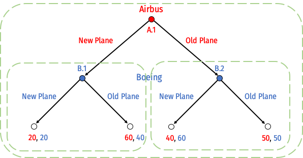
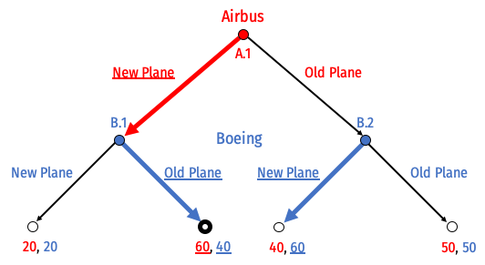
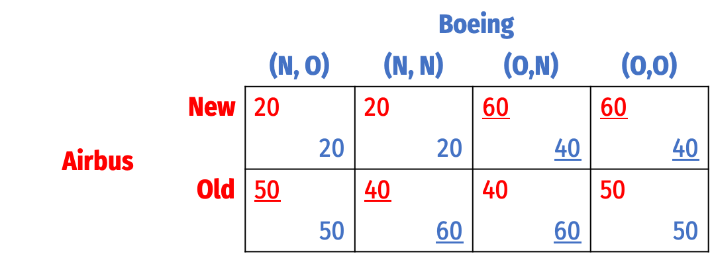
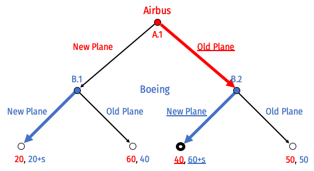

```{r setup, include=FALSE}
knitr::opts_chunk$set(echo = FALSE,
                      warning = FALSE,
                      message = FALSE)
```

# Concepts and Critical Thinking

## Question 1

Explain what cartels are, the economic problems that they face, and some methods by which these problems might be overcome. 

---

The Nash equilibrium is for both firms to lower price, since that is a dominant strategy for each firm. If both firms raise their price (cooperate with other firm), they can increase their profits by forming a cartel. However, this is not a Nash equilibrium, since each firm has an incentive to lower their prices and cheat the cartel if the other firm maintains a high price.

Cartels must find ways to enforce the agreement between members to keep prices high and outputs low. Cartel members must be able to monitor each other's behavior and detect and punish cheating or chiseling the agreement. Cartels also have to worry about competition from entrants (who are not cartel members), and detection from the government.

Cartels that are not just a one-shot interaction and involve repeated interaction between firms have a higher chance of sustaining collusion — see question 5.

Cartels can persist only by solving these problems in one of two ways:

- Cartels can craft a clever coordination mechanism to secretly coordinate prices or divide up territory that all members actively pay attention to. Price-matching policies are one potential example, allowing a member to retaliate against other members that try to lower prices.

- Cartels can try to capture or co-opt government regulatory bodies meant to regulate them: regulators can then be influenced to fix an above-market price or divide up explusive territory and enforce it amongst all regulated firms.

---

## Question 2

Describe the major differences between Bertrand competition, Cournot competition, and Stackelberg competition. How do firms compete, and what are the results in terms of market price, industry output, and profits for firms?

---

- Bertrand competition:
    - Firms compete *simultaneously* on *price*
    - Nash equilibrium: firms set $p=MC$ and earn no profits (competitive market outcome)
- Cournot competition:
    - Firms compete *simultaneously* on *quantity*, market price is determined by joint output
    - Nash equilibrium: firms produce same amount, earn equal (positive) profits at a high market price
- Stackelberg competition:
    - Firms compete *sequentially* on *quantity*, market price is determined by joint output
    - Nash equilibrium: 
        - *leader* produces more than Cournot-level output, earns more than Cournot-level profits
        - *follower* produces less than Cournot-level output, earns less than Cournot-level profits
        - Increased output pushes market price below Cournot level

Comparing by each metric:

- Industry output: $q_B>q_S>q_C$
- Firm profits: $\pi_{SL}>\pi_{C}>\pi_{SF}>\pi_{B}=0$
- Market price: $p_C>p_S>p_B=MC$
- where subscripts $B$=Bertrand, $C$=Cournot, $S$=Stackelberg, $L$=Leader, $F$=Follower


---

## Question 3

Explain what the Bertrand paradox is, and two ways/model extensions that the paradox can be resolved. 

---

The Betrand paradox is the result that, under Bertrand competition (simultaneous price competition), the Nash equilibrium will be the perfectly competitive one: firms will set their price equal to marginal cost, and earn no profits. Thus, we attain the perfectly competitive equilibrium with just two firms. 

One of the reasons this occurs, however, is partially due to the restrictive assumptions of Bertrand competition (like the restrictive assumptions about perfect competition): both firms sell identical products that are perfect substitutes, have the same marginal costs, and have sufficient capacity to produce for the entire market (should they have the lower price). 

If, for example, firms (i) sold differentiated products that are merely *imperfect* substitutes, or (ii) if firms had insufficient capacity such that they could *not* supply the entire market demand, then the Nash equilibrium would involve firms charging $p>MC$ and earning some positive profits.

---

## Question 4

How are fixed costs (sunk or otherwise) a barrier to entry? How do they alter the outcomes of Cournot competition, and of entry games?

---

With constant returns to scale (i.e. constant variable costs and no fixed costs, so a cost function of $C(q_i)=cq_i)$, there are no barriers to entry (absent government policy or some other external feature of the industry). In the model of Cournot competition with more than 2 firms, technically an arbitrarily large number of firms can fit into such an industry. No limits to entry exist, as firms can produce at extremely tiny scales and still earn miniscule, but positive, profits. As the number of firms, $N$, gets larger, the industry approaches the perfectly competitive outcome $(p \rightarrow MC, \pi \rightarrow 0)$, etc. Only with $\infty$ firms do we get the exact perfectly competitive equilibrium $(p = MC, \pi = 0)$.

With economies of scale, (i.e. fixed costs, so a cost function such as $C(q_i)=cq_i+f)$, there is a penalty to small-scale production, as smaller volumes of output $q$ will have higher average costs than larger volumes of output (due to average fixed costs, $\frac{f}{q}$, declining with $q)$. Thus, depending on the size of $f$, only so many firms will “fit” into an industry consistent with free entry (i.e. no legal barriers to entry) — specifically, $$N^* = \frac{a-c}{\sqrt{bf}}-1$$
where $N^*$ is the equilibrium number of firms, $a$ is the industry demand intercept, $b$ is the industry demand slope, $c$ is the variable cost, and $f$ is the fixed cost. If $N<N^*$, it will be profitable for additional firms to enter. If $N>N^*$, all firms would earn losses.

In terms of *entry deterrence*, when there are constant returns to scale, it is impossible for an incumbent firm to deter entry and also earn profits. Producing the limit quantity and charging the limit price (where the entrant earns zero profits after entry) results merely in the Bertrand/perfectly competitive equilibrium, except the incumbent is the only firm in the market. It earns no profits since $p=MC$. The would-be entrant would stay out of the market, as it would not earn positive profits. As such, it would always be rational for the incumbent to *accommodate* entry and act in a Stackelberg fashion (produce the Leader’s Stackelberg quantity, anticipating the entrant producing the Follower’s Stackelberg quantity), since it can expect positive profits under this equilibrium.

With economies of scale, an incumbent firm can successfully deter entry and still earn profits. Again, there is a disadvantage of small-scale production (to the entrant) since the average costs will be higher, and the incumbent will be able to produce at a large-scale. Furthermore, if these fixed costs are *sunk*, the incumbent has *already* paid the fixed costs in the past in order to operate in the market, whereas the entrant must pay the fixed cost to enter the market in addition to the variable cost of producing. Finally, there is the possibility that being in the market and having committed these sunk investments, the incumbent may face lower marginal costs than the entrant, and being able to outcompete them by being able to charge a price lower than the entrant’s costs. Such credible threats deter a would-be entrant from ever entering.

---

## Question 5

If a prisoners’ dilemma is played repeatedly, how does the outcome of the game change? What if it is repeated a finite number of times? What if it is repeated an infinite number of times?

---

A *finitely* repeated game is a game that is played (by the same players) for a fixed number of times (e.g. 5, 10, 5 million). The important idea is that all players know exactly which round the game will end on. In a game with a unique Nash equilibrium in a one-shot game (e.g. a Prisoners’ Dilemma), in the final round, players play these equilibrium strategies (e.g. dominant strategies, etc) since there is no affect on the nonexistent future rounds (i.e. no punishments or rewards in future rounds based on actions in the final round). Using subgame perfection, and backwards induction, since all players know what will occur in the final round, they cannot reward or punish players for what they do in the second-to-last round, so they will play their equilibrium strategies in the second-to-last round. Extend this all the way to the first round, and players will play the equilibrium strategy in every round.

Thus, a *finitely*-repeated game has the same equilibrium in the one-shot version as the multi-round version. For example, in a finitely-repeated prisoners’ dilemma, subgame perfection predicts players Defect in every round.

An *infinitely* repeated game is played for an unknowable amount of rounds. This can be interpreted two ways:

1. Players actually play an infinite number of rounds, forever, but discount the future at some constant rate $\delta$
2. Each round of the game leads to another round of the game with some constant probability $\theta$

The “folk theorem” says that if players play an infinitely repeated game and can observe each player’s history, then if players have high enough discount rates $(\delta$ – they are patient enough to care enough about future payoffs vs. present payoffs) or if there is a high enough probability of repeated interaction $(\theta)$, then any equilibrium that is at least as good as the one-shot equilibrium is possible.

The punchline is, in a prisoners’ dilemma, if players care enough about the future ($\delta$ or $\theta$ is high enough), then cooperation is a sustainable and rational equilibrium.

---

## Question 6

What makes a threat or a promise credible? In your answer, use the concept of subgame perfection.

---

A threat (or a promise, for that matter) is not credible if the threatened strategy is not _incentive-compatible_ for the threatener if the subgame is reached where they must carry out the promise or threat and it is not in their interest to do so. In other words, a threatened/promised strategy is not credible unless it is _subgame perfect_ -- it would be a Nash equilibrium for the player to carry out the threat or promise in the relevant subgame.

Promises and threats can be made credible with _commitment_ that changes the payoffs or available moves to the threatener/promisor such that they will indeed choose to carry out the promise or threat if that subgame were reached.

A Nash equilibrium set of strategies is _subgame perfect_ if it is sequentially rational: the pair of strategies must be a Nash equilibrium in every possible subgame. That is, if any subgame were reached, neither player would want to deviate from their strategy.

In short, subgame perfection rules out threats or promises that are not credible, i.e. if the relevant subgame were reached, players would want to change their announced strategy to the _SPNE_ strategy

---

# Problems

## Question 7

Suppose Comcast $(C)$ and Verizon $(V)$ have a constant $MC=AC=\$20$ per customer connected to their internet network. The market (inverse) demand curve for basic internet service is given by:
$$\begin{aligned}
P&=80-2Q\\
Q&=q_C+q_V\\
\end{aligned}$$

### Part A

Find the Cournot-Nash equilibrium output, price, and profit for each firm.

---

Solving for Comcast, recalling that MR is twice the slope of the inverse demand curve:
$$MR_{C}=80-4q_{C}-2q_{V}$$

Comcast maximizes profit at $q^*$ where $MR_C=MC_1$:

$$\begin{aligned}
MR_{C}&=MC && \text{Profit-max condition} \\
80-4q_{C}-2q_{V}&=20 && \text{Plugging in}\\
60-4q_{C}-2q_{V}&=0 && \text{Subtracting 20 from both sides}\\
60-2q_{V}&=4q_{C} && \text{Adding }4q_{C} \text{ to both sides}\\
15-0.5q_{V}&=q_{C}^* && \text{Dividing both sides by 4}\\
\end{aligned}$$
 
Since Verizon is identical, its $q^*$ is:
$$q_{V}^*=15-0.5q_{C}$$

Find Nash equilibrium algebraically by plugging in one country's reaction curve into the other's:

$$\begin{aligned}
q_{C}&=15-0.5q_{V} && \text{Comcast's reaction function}\\
q_{C}&=15-0.5(15-0.5q_{V}) && \text{Plugging in Verizon's reaction function}\\
q_{C}&=15-7.5+0.25q_{C} && \text{Distributing the }-0.5\\
q_{C}&=7.5+0.25q_{C} && \text{Subtracting}\\
0.75q_{C}&=7.5 && \text{Subtracting }0.25q_{C} \text{ to both sides}\\
q_{C}&=10 && \text{Dividing by 0.75}\\
\end{aligned}$$

Symmetrically, $q_{V}=10$

This sets a market price of:

$$\begin{aligned}
p&=80-2Q && \text{Market inverse demand function}\\
p&=80-2(10+10) && \text{Plugging in firms' output}\\
p&=40 && \text{Simplifying}\\
\end{aligned}$$

Each firm then earns a profit of:

$$\begin{aligned}
\pi_{C}&=q_{C}(p-c) && \text{Comcast's profit function}\\
\pi_{C}&=10(40-20) && \text{Plugging in}\\
\pi_{C}&=200 && \text{Simplifying}\\
\end{aligned}$$

Verizon symmetrically earns $\pi_{Z}=200$.

---

### Part B

Find the output, price, and profit for each firm if the two were to collude.

---

The two firms acting as a cartel act as a single monopolist facing the entire market demand $(p=80-2Q)$, who maximizes profit by setting:

$$\begin{aligned}
MR_{monopoly}&=MC && \text{Profit-max condition} \\
80-4Q&=20 && \text{Plugging in}\\
60-4Q&=0 && \text{Subtracting 20 from both sides}\\
60&=4Q && \text{Adding }4Q \text{ to both sides}\\
15&=Q^* && \text{Dividing both sides by 4}\\
\end{aligned}$$

The total industry output is 15, meaning each firm produces 7.5 units. This sets a market price of

$$\begin{aligned}
p&=80-2Q && \text{Market inverse demand function}\\
p&=80-2(15) && \text{Plugging in countries' output}\\
p&=50 && \text{Simplifying}\\
\end{aligned}$$

The cartel then earns a profit of:

$$\begin{aligned}
\pi_{1}&=Q(p-c) && \text{Firm 1's profit function}\\
\pi_{1}&=15(50-20) && \text{Plugging in}\\
\pi_{1}&=450 && \text{Simplifying}\\
\end{aligned}$$

Since the two firms split the cartel profits, each firm earns a profit of $225.

---

### Part C

Suppose now Comcast is a Stackelberg leader. Find each firm's output, price, and profit.

---

Substitute the Verizon (follower)'s reaction function into market (inverse) demand function

$$\begin{aligned}
P&=80-2q_{C}-2q_V && \text{The inverse market demand function}\\
P&=80-2q_{C}-2(15-0.5q_{C}) && \text{Plugging in Firm 2's reaction function for} q_V\\
P&=80-2q_{C}-30+1q_{C} && \text{Multiplying by }-2\\
P&=50-q_{C} && \text{Simplifying the right}\\
\end{aligned}$$

Find $MR_C$ for Comcast from market demand:

$$MR_{C}=104-2q_{C}$$

$$\begin{aligned}
MR_C&=MC && \text{Profit-max condition}\\
50-2q_{C}&=20 && \text{Plugging in}\\
50&=20+2q_{C} && \text{Adding }2q_{C} \text{ to both sides}\\
30&=2q_{C} && \text{Subtracting 20 from both sides}\\
15&=q_{C}^* && \text{Dividing both sides by 2} \\
\end{aligned}$$

Verizon will respond to Comcast producing 15 according to Verizon's reaction function:
$$\begin{aligned}
q_V^*&=15-0.5q_{C}\\
q_V^*&=15-0.5(15)\\
q_V^*&=15-7.5\\
q_V^*&=7.5\\
\end{aligned}$$

With $q^*_{C}=15$ and $q^*_V=7.5$, this sets a market price of:

$$\begin{aligned}
P&=80-2Q\\
P&=80-2(15+7.5)\\
P&=35\\
\end{aligned}$$

Profit for Comcast (leader) is:

$$\begin{aligned}
\pi_{C}&=q_{1}(P-c)\\
\pi_{C}&=15(35-20)\\
\pi_{C}&=\$225\\
\end{aligned}$$

Profit for Verizon (follower) is:

$$\begin{aligned}
\pi_{C}&=q_{2}(P-c)\\
\pi_{C}&=7.5(35-20)\\
\pi_{C}&=\$112.50\\
\end{aligned}$$

The leader (Comcast) earns higher than Cournot profits (part a), and the follower (Verizon) earns less than Cournot profits.

---

### Part D

Find the output, price, and profit for each firm they were to compete on *price* instead of *quantity.*

---

Under Bertrand competition, the Nash equilibrium is the competitive market outcome, where firms set:

$$\begin{aligned}
p&=MC && \text{Competitive market condition}\\
80-2Q&=20 && \text{Plugging in}\\
60-2Q&=0 && \text{Subtracting 20 from both sides}\\
60&=2Q && \text{Adding }2Q \text{ to both sides}\\
30&=Q && \text{Dividing both sides by 2}\\
\end{aligned}$$

The total industry output is 30, so each firm is producing 15 units. Since $p=MC$, the market price is \$20, and each firm earns $\pi=0$.

## Question 8

Boeing (a U.S. company), and Airbus (a European company) are fierce competitors that together, about evenly dominate the market for aircraft. Airbus decides whether it is going to launch a *new plane*, or keep its *old planes*. Boeing must then respond and determine if it is also going to launch a *new plane* or keep its *old planes*. 

> Developing a new plane is very expensive. If both companies produce *new planes*, they will have spent a lot on producing the new plane, but neither will gain any market share. If only one company releases a new plane, they will capture more of the market, making the extra cost of development worthwhile. This game is depicted in extensive form below:


### Part A

List all of Airbus' possible strategies and list all of Boeing's possible strategies.

---

Airbus has one decision between two choices at node A.1, thus it has $2^1$ strategies possible:

1. (New Plane)
2. (Old Plane)

Boeing has two decisions (each between two choices) at node B.1 and B.2, thus it has $2^2=4$ strategies possible (B.1, B.2):

1. (New Plane, New Plane)
2. (New Plane, Old Plane)
3. (Old Plane, New Plane)
4. (Old Plane, Old Plane)

---

### Part B

Circle (or describe) all of the subgames of this game.

---



1. Subgame initiated at decision node A.1 (the game itself)
2. Subgame initiated at decision node B.1
3. Subgame initiated at decision node B.2

---

### Part C

Solve for the “rollback equilibrium” using backwards induction.

---



Airbus will build a New Plane, and Boeing will use its Old Plane.

---

### Part D

Draw this game in normal form. Find all Nash equilibria. (Hint: think carefully about the players' strategies, as you listed out in Part A.) Which is subgame perfect, and why?

---



Note Boeing's strategies are described as "O" (Old) or "N" (New), written as Boeing's set of decisions at nodes (B.1,B.2).

There are three Nash equilibria, written as $\{$Airbus' strategy, Boeing's strategy$\}$:

1. $\{$New, (Old, New)$\}$
2. $\{$New, (Old, Old)$\}$
3. $\{$Old, (New, New)$\}$

Only Nash equilibrium 1 is subgame perfect. To see why 2 and 3 are _not_, see the next question.

---

### Part E

Suppose Boeing, who has to move second, announces the following threat to Airbus makes its initial decision: *if Airbus produces a new plane, Boeing will respond by also producing a new plane.* Is this threat credible? Why or why not?

---

This threat is _not_ credible. If play ever reaches the subgame at decision node B.1 (where Airbus has produced a New Plane), it is always in Boeing's interests to use their Old Plane. Boeing would thus not want to carry out its threat of also producing a New Plane.

This is in effect, testing the subgame perfection of the second Nash equilibrium. Boeing's strategy in that Nash equilibrium is to _always_ launch a new plane. But if the game reaches node B.1, this strategy is not a Nash equilibrium in that subgame: Boeing would want to switch its strategy to Old Plane to respond to Airbus' New Plane.

---

### Part F

The U.S. government considers the aircraft industry to be of strategic importance. Suppose Boeing lobbies the government to gain a subsidy to produce the plane. Boeing's payoff increases by $s$ only when it chooses to produce the new plane. How big must $s$ need to be in order to make Boeing's threat in Part E credible?

---



Change Boeing's payoffs each time it produces a New Plane to add $+s$. We are not concerned about the outcome where Airbus plays Old Plane and Boeing playds New Plane - Boeing was always going to play New Plane at node B.2.

What we need to look at is node B.1 (where Airbus plays New Plane). Originally, it was in Boeing's interest to use its Old Plane, since $40>20$ for Boeing. But now, Boeing gets a subsidy if it produces New Plane, so we really need:

$$\begin{aligned}
20+s&>40\\
s&>20 \\
\end{aligned}$$

If the subsidy $s>20$, then it's in Boeing's interest to produce a New Plane to respond to Airbus' New Plane, since it's payoff is now higher than its Old Plane. In fact, this threat becomes credible enough that now it is no longer in Airbus' interest to produce a New Plane (and earn 20, with Boeing's New Plane), it would rather use its Old Plane (it knows Boeing will respond with New Plane at B.2) and earn 40.

---

# Optional Bonus (10 points)

## Question 9

This question will show what happens as we relax some of the assumptions of Cournot competition. Crude oil is transported across the globe in enormous tanker ships called Very Large Crude Carriers (VLCCs). By 2001, more than 92% of all new VLCCs were built in South Korea and Japan. Assume that the price of new VLCCs (in millions of dollars) is determined by the inverse demand function between the duopoly of Korea and Japan: 
$$\begin{aligned}p&=180-Q\\
Q&=q_{Korea}+q_{Japan}\\
\end{aligned}$$
Assume the marginal cost of building each ship is <span>&#36;</span>30 (million) in both Korea and Japan.

---

### Part A

Find each country's best response function, the Nash equilibrium quantity produced by each country, the market price, and the profit for each country.

---

$$\begin{align*}
p&=180-Q\\
Q&=q_{Korea}+q_{Japan}\\
\end{align*}$$

Solving for Korea, recalling that MR is twice the slope of the inverse demand curve:
$$MR_{Korea}=180-2q_{Korea}-q_{Japan}$$

Korea maximizes profit at $q^*$ where $MR=MC$:

$$\begin{align*}
MR_{Korea}&=MC && \text{Profit-max condition} \\
180-2q_{Korea}-q_{Japan}&=30 && \text{Plugging in}\\
150-2q_{Korea}-q_{Japan}&=0 && \text{Subtracting 30 from both sides}\\
150-q_{Japan}&=2q_{Korea} && \text{Adding }2q_{Korea} \text{ to both sides}\\
75-0.5q_{Japan}&=q_{Korea}^* && \text{Dividing both sides by 2}\\
\end{align*}$$
- Since Japan is identical, its $q^*$ is:
$$q_{Japan}^*=75-0.5q_{Korea}$$

Find Nash equilibrium algebraically by plugging in one country's reaction curve into the other's

$$\begin{align*}
q_{Korea}&=75-0.5q_{Japan} && \text{Korea's reaction function}\\
q_{Korea}&=75-0.5(50-0.5q_{Korea}) && \text{Plugging in Japan's reaction function}\\
q_{Korea}&=75-37.5+0.25q_{Korea} && \text{Distributing the }-0.5\\
q_{Korea}&=37.5+0.25q_{Korea} && \text{Subtracting}\\
0.75q_{Korea}&=50 && \text{Subtracting }0.25q_{Korea} \text{ from both sides}\\
q_{Korea}&=50 && \text{Dividing by 0.75}\\
\end{align*}$$

Symmetrically, $q_{Japan}=50$

This sets a market price of 

$$\begin{align*}
p&=180-Q && \text{Market inverse demand function}\\
p&=180-(50+50) && \text{Plugging in countries' output}\\
p&=80 && \text{Simplifying}\\
\end{align*}$$

Each country then earns a profit of 

$$\begin{align*}
\pi_{Korea}&=q_{Korea}(p-c) && \text{Korea's profit function}\\
\pi_{Korea}&=50(80-30) && \text{Plugging in}\\
\pi_{Korea}&=2,500 && \text{Simplifying}\\
\end{align*}$$

Japan symmetrically earns $\pi_{Japan}=2,500$.


```{r}
# Set Cournot parameters
a<-180
b<-1
c<-30

Firm1react=function(x){(a-c)/(2*b)-0.5*x} # assumes identical costs 
Firm2reactplot=function(x){2*((a-c)/(2*b))-2*x} # assumes identical costs
q1_cournot<-(a-c)/(3*b)# assumes identical costs
q2_cournot<-(a-c)/(3*b)# assumes identical costs

intercept<-2*(a-c)/(2*b)

# Reaction Functions
#Korea=function(x){75-0.5*x}
#Japan=function(x){150-2*x} # for graphing only, take inverses of coefficients of other reaction curve

# Equilibria 
NE<-50

line_colors <- c("Korea" = "red", "Japan" = "blue")

library("ggplot2")
ggplot(data.frame(x=c(0,60)), aes(x=x))+
  stat_function(fun=Firm1react, geom="line", size=1, aes(color="Korea"))+
  stat_function(fun=Firm2reactplot, geom="line", size=1, aes(color="Japan"))+
  
  # Nash equilibrium 
  geom_point(aes(x=q2_cournot,y=q1_cournot), color="purple", size=2)+
  geom_text(aes(x=q2_cournot,y=q1_cournot,label="Cournot-Nash Equilibrium"),hjust=-0.1, vjust=-0.1, color="purple")+
  geom_segment(aes(x=q2_cournot,y=0),xend=q2_cournot,yend=q1_cournot,linetype=3)+
  geom_segment(aes(x=0,y=q1_cournot),xend=q2_cournot,yend=q1_cournot, linetype=3)+
  
  # Collusion
  #geom_point(aes(x=Collusion,y=Collusion), color="purple")+
  #geom_text(aes(x=Collusion,y=Collusion,label="Collusion"),hjust=-0.1, vjust=-0.1, color="purple")+
  #geom_segment(aes(x=Collusion,y=0),xend=Collusion,yend=Collusion,linetype=3)+
  #geom_segment(aes(x=0,y=Collusion),xend=Collusion,yend=Collusion, linetype=3)+

  # Stackelberg
  #geom_point(aes(x=Follower,y=Leader), color="purple")+
  #geom_text(aes(x=Follower,y=Leader,label="Stackelberg (SA leads)"),hjust=-0.1, vjust=-0.1, color="purple")+
  #geom_segment(aes(x=Follower,y=0),xend=Follower,yend=Leader,linetype=3)+
  #geom_segment(aes(x=0,y=Leader),xend=Follower,yend=Leader, linetype=3)+

  scale_x_continuous(breaks=seq(0,intercept,10), limits=c(0,intercept), expand=c(0,0))+
  scale_y_continuous(breaks=seq(0,intercept,10), limits=c(0,intercept), expand=c(0,0))+
  theme_light()+
  annotate(geom = "label", x = (0.7*intercept), y = Firm1react(0.7*intercept), label = "Korea",
           color = "red", size = 4.5) +
  annotate(geom = "label", x = (0.2*intercept), y = Firm2reactplot(0.2*intercept), label = "Japan",
           color = "blue", size = 4.5) +
  scale_colour_manual("Reaction Curves", values = line_colors)+
  labs(x = expression(paste("Japan's Output, " ,q[Japan])),
       y = expression(paste("Korea's Output, " ,q[Korea])),
       title = "Countries' Reaction Functions")+
  theme(legend.position = "",
        plot.title = element_text(size = rel(1.25)))
```


---

### Part B

Labor costs in Korean shipyards are actually lower than in Japan. Assume now the marginal cost per ship in Japan is <span>&#36;</span>40 (million) and only <span>&#36;</span>20 (million) in Korea. Find the new best response functions, the Nash equilibrium quantity produced by each country, the market price, and the profit for each country.

---

The analysis proceeds almost identically as before, except each firm now has their own marginal cost. 

Solving for Korea first, we have the same marginal revenue as before, and Korea's marginal cost is now \$20. Korea maximizes profit at $q^*$ where:

$$\begin{align*}
MR_{Korea}&=MC_{Korea} && \text{Profit-max condition} \\
180-2q_{Korea}-q_{Japan}&=20 && \text{Plugging in}\\
160-2q_{Korea}-q_{Japan}&=0 && \text{Subtracting 20 from both sides}\\
160-q_{Japan}&=2q_{Korea} && \text{Adding }2q_{Korea} \text{ to both sides}\\
80-0.5q_{Japan}&=q_{Korea}^* && \text{Dividing both sides by 2}\\
\end{align*}$$

Since the firms are no longer identical, we now need to find Japan's reaction function. Japan similarly maximizes profit at $q^*$ where:

$$\begin{align*}
MR_{Japan}&=MC_{Japan} && \text{Profit-max condition} \\
180-q_{Korea}-2q_{Japan}&=40 && \text{Plugging in}\\
140-q_{Korea}-2q_{Japan}&=0 && \text{Subtracting 40 from both sides}\\
140-q_{Korea}&=2q_{Japan} && \text{Adding }2q_{Japan} \text{ to both sides}\\
70-0.5q_{Korea}&=q_{Japan}^* && \text{Dividing both sides by 2}\\
\end{align*}$$

Find Nash equilibrium algebraically by plugging in one country's reaction curve into the other's. Here, I plug Japan's reaction function into Korea's: 

$$\begin{align*}
q_{Korea}^*&=80-0.5q_{Japan} && \text{Korea's reaction function}\\
q_{Korea}^*&=80-0.5(70-0.5q_{Korea}) && \text{Plugging in Japan's reaction function}\\
q_{Korea}^*&=80-35+0.25q_{Korea} && \text{Distributing the }-0.5\\
q_{Korea}^*&=45+0.25q_{Korea} && \text{Subtracting}\\
0.75q_{Korea}^*&=45 && \text{Subtracting }0.25q_{Korea} \text{ to both sides}\\
q_{Korea}^*&=60 && \text{Dividing by 0.75}\\
\end{align*}$$

Now we must find Japan's output by seeing how they respond to Korea producing 60:

$$\begin{align*}
q_{Japan}^*&=70-0.5q_{Japan} && \text{Japan's reaction function}\\
q_{Japan}^*&=70-0.5(60) && \text{Plugging in Korea's output}\\
q_{Japan}^*&=70-30 && \text{Multiplying}\\
q_{Japan}^*&=40 && \text{Subtracting}\\
\end{align*}$$

This sets a market price of 

$$\begin{align*}
p&=180-Q && \text{Market inverse demand function}\\
p&=180-(60+40) && \text{Plugging in countries' output}\\
p&=80 && \text{Simplifying}\\
\end{align*}$$

Since each country has a different marginal cost (and output), we need to calculate the profit for each country separately. Start with Korea:

$$\begin{align*}
\pi_{Korea}&=q_{Korea}(p-c_{Korea}) && \text{Korea's profit function}\\
\pi_{Korea}&=60(80-20) && \text{Plugging in}\\
\pi_{Korea}&=3,600 && \text{Simplifying}\\
\end{align*}$$

Next, Japan:

$$\begin{align*}
\pi_{Japan}&=q_{Korea}(p-c_{Korea}) && \text{Japan's profit function}\\
\pi_{Japan}&=40(80-40) && \text{Plugging in}\\
\pi_{Japan}&=1,600 && \text{Simplifying}\\
\end{align*}$$

```{r}
# Set Cournot parameters
a<-180
b<-1
c_1<-20
c_2<-40

intercept<-2*(a-c)/(2*b)

Firm1react=function(x){(a-c_1)/(2*b)-0.5*x}
Firm2react=function(x){(a-c_2)/(2*b)-0.5*x}
Firm2reactplot=function(x){2*((a-c_2)/(2*b))-2*x}
    
q1_cournot<-(a-2*c_1+c_2)/(3*b)
q2_cournot<-(a-2*c_2+c_1)/(3*b)

line_colors <- c("Korea" = "red", "Japan" = "blue")

library("ggplot2")
ggplot(data.frame(x=c(0,60)), aes(x=x))+
  stat_function(fun=Firm1react, geom="line", size=1, aes(color="Korea"))+
  stat_function(fun=Firm2reactplot, geom="line", size=1, aes(color="Japan"))+
  
  # Nash equilibrium 
  geom_point(aes(x=q2_cournot,y=q1_cournot), color="purple", size=2)+
  geom_text(aes(x=q2_cournot,y=q1_cournot,label="Cournot-Nash Equilibrium"),hjust=-0.1, vjust=-0.1, color="purple")+
  geom_segment(aes(x=q2_cournot,y=0),xend=q2_cournot,yend=q1_cournot,linetype=3)+
  geom_segment(aes(x=0,y=q1_cournot),xend=q2_cournot,yend=q1_cournot, linetype=3)+
  
  # Collusion
  #geom_point(aes(x=Collusion,y=Collusion), color="purple")+
  #geom_text(aes(x=Collusion,y=Collusion,label="Collusion"),hjust=-0.1, vjust=-0.1, color="purple")+
  #geom_segment(aes(x=Collusion,y=0),xend=Collusion,yend=Collusion,linetype=3)+
  #geom_segment(aes(x=0,y=Collusion),xend=Collusion,yend=Collusion, linetype=3)+

  # Stackelberg
  #geom_point(aes(x=Follower,y=Leader), color="purple")+
  #geom_text(aes(x=Follower,y=Leader,label="Stackelberg (SA leads)"),hjust=-0.1, vjust=-0.1, color="purple")+
  #geom_segment(aes(x=Follower,y=0),xend=Follower,yend=Leader,linetype=3)+
  #geom_segment(aes(x=0,y=Leader),xend=Follower,yend=Leader, linetype=3)+

  scale_x_continuous(breaks=seq(0,intercept,10), limits=c(0,intercept), expand=c(0,0))+
  scale_y_continuous(breaks=seq(0,intercept,10), limits=c(0,intercept), expand=c(0,0))+
  theme_light()+
  annotate(geom = "label", x = (0.7*intercept), y = Firm1react(0.7*intercept), label = "Korea",
           color = "red", size = 4.5) +
  annotate(geom = "label", x = (0.2*intercept), y = Firm2reactplot(0.2*intercept), label = "Japan",
           color = "blue", size = 4.5) +
  scale_colour_manual("Reaction Curves", values = line_colors)+
  labs(x = expression(paste("Japan's Output, " ,q[Japan])),
       y = expression(paste("Korea's Output, " ,q[Korea])),
       title = "Countries' Reaction Functions")+
  theme(legend.position = "",
        plot.title = element_text(size = rel(1.25)))
```

---

### Part C

Suppose China decides to enter the VLCC construction market. The duopoly now becomes a triopoly, so that the market inverse demand function is:
$$\begin{aligned}
p&=180-Q\\
Q&=q_{Korea}+q_{Japan}+q_{China}\\
\end{aligned}$$
Assume for simplicity that all countries face the same marginal cost of <span>&#36;</span>30 (million) per ship. Find the new best response functions, the Nash equilibrium quantity produced by each country, the market price, and the profit for each country. Hint: proceed as before, such that you get three reaction functions with three unknowns.

---


$$\begin{align*}
p&=180-Q\\
Q&=q_{Korea}+q_{Japan}+q_{China}\\
\end{align*}$$

#### Assume for simplicity that all countries face the same marginal cost of <span>&#36;</span>30 (million) per ship. Find the new best response functions, the Nash equilibrium quantity produced by each country, the market price, and the profit for each country. Hint: proceed as before, such that you get three reaction functions with three unknowns.

Again, the analysis proceeds almost the same, except now we modify the market inverse demand function to create a marginal revenue function for each firm:

$$\begin{align*}
p&=180-Q && \text{The market inverse demand function}\\
p&=180-q_{Korea}-q_{Japan}-q_{China} && \text{Plugging in }Q=q_{Korea}-q_{Japan}-q_{China}\\
\end{align*}$$

Since all firms have the same cost again, we can look just at one firm to derive the reaction function for each firm symmetrically. We'll use Korea, which sets: 

$$\begin{align*}
MR_{Korea}&=MC_{Korea} && \text{Profit-max condition} \\
180-2q_{Korea}-q_{Japan}-q_{China}&=20 && \text{Plugging in}\\
160-2q_{Korea}-q_{Japan}-q_{China}&=0 && \text{Subtracting 20 from both sides}\\
160-q_{Japan}-q_{China}&=2q_{Korea} && \text{Adding }2q_{Korea} \text{ to both sides}\\
80-0.5q_{Japan}-0.5q_{China}&=q_{Korea}^* && \text{Dividing both sides by 2}\\
\end{align*}$$

Symmetrically, each firm's optimal response is a function the other two countries' outputs: 

$$\begin{align}
q_{Korea}^*&=80-0.5q_{Japan}-0.5q_{China}\\
q_{Japan}^*&=80-0.5q_{Korea}-0.5q_{China}\\
q_{China}^*&=80-0.5q_{Korea}-0.5q_{Japan}\\
\end{align}$$

Now the trick is to recognize we have three equations with three unknowns, so we need to use substitution or elimination methods from algebra. 

First, let's eliminate $q_{Korea}^*$ by subtracting equation (2) from equation (1):

$$\begin{align*}
q_{Korea}-q_{Japan}&=(80-0.5q_{Japan}-0.5q_{China})-(80-0.5q_{Korea}-0.5q_{China}) && \text{Subtracting (2) from (1)}\\
q_{Korea}-q_{Japan}&=-0.5q_{Japan}+0.5q_{Korea} && \text{Eliminating like terms}\\
q_{Korea}&=0.5q_{Japan}+0.5q_{Korea} && \text{Adding }0.5q_{Japan} \text{ to both sides}\\
0.5q_{Korea}&=0.5q_{Japan} && \text{Subtracting }0.5q_{Korea} \text{ from both sides}\\
q_{Korea}&=q_{Japan} && \text{Dividing both sides by 0.5}\\
\end{align*}$$

Next, let's eliminate $q_{Korea}$ by subtracting equation (3) from equation (2):

$$\begin{align*}
q_{Japan}-q_{China}&=(80-0.5q_{Korea}-0.5q_{China})-(80-0.5q_{Korea}-0.5q_{Japan}) && \text{Subtracting (2) from (1)}\\
q_{Japan}-q_{China}&=-0.5q_{China}+0.5q_{Japan} && \text{Eliminating like terms}\\
q_{Japan}&=0.5q_{China}+0.5q_{Japan} && \text{Adding }0.5q_{China} \text{ to both sides}\\
0.5q_{Japan}&=0.5q_{China} && \text{Subtracting }0.5q_{Japan} \text{ from both sides}\\
q_{Japan}&=q_{China} && \text{Dividing both sides by 0.5}\\
\end{align*}$$

Now knowing $q_{Korea}=q_{Japan}=q_{China}$, we can plug this into any reaction function. We'll plug it into Korea's:

$$\begin{align*}
q_{Korea}&=75-0.5q_{Japan}-0.5q_{China} && \text{Korea's reaction function}\\
q_{Korea}&=75-0.5(q_{Korea})-0.5(q_{Korea}) && \text{Plugging in } q_{Korea} \text{ for } q_{Japan} \text{ and } q_{China}\\
q_{Korea}&=75-q_{Korea} && \text{Combining like terms} \\
2q_{Korea}&=75 && \text{Adding } q_{Korea} \text{ to both sides}\\
q_{Korea}&=37.5 && \text{Dividing both sides by 2}\\
\end{align*}$$

Since we know $q_{Korea}=q_{Japan}=q_{China}$, each firm is producing 37.5 ships.

This sets a market price of 

$$\begin{align*}
p&=180-Q && \text{Market inverse demand function}\\
p&=180-(37.5+37.5+37.5) && \text{Plugging in countries' output}\\
p&=67.50 && \text{Simplifying}\\
\end{align*}$$

Each country then the same profit, since they produce the same output, face the same price, and have the same cost. We'll use Korea's perspective: 

$$\begin{align*}
\pi_{Korea}&=q_{Korea}(p-c) && \text{Korea's profit function}\\
\pi_{Korea}&=37.5(67.5-30) && \text{Plugging in}\\
\pi_{Korea}&=1,406.25 && \text{Simplifying}\\
\end{align*}$$

Japan and China symmetrically earn $1,406.25.


---

### Part D

Compare the quantity, price, and profits between parts A, B, and C

---

Adding more firms to the industry increases competition and boosts industry output, lowering market price (and profits) on all firms. The more firms in Cournot competition, the closer we get to a competitive outcome. We can see this plainly in the graph of industry equilibria below: 

```{r}

Demand=function(x){a-b*x}
MR=function(x){a-2*b*x}
MC=function(x){c}
    
q_duopoly<-100
q_triopoly<-112.5
p_duopoly<-80
p_triopoly<-67.5

q_monopoly<-75
p_monopoly<-105

#CS_cournot<-data.frame(x=c(0,0,q_cournot),
#                   y=c(p_cournot,a,p_cournot))
#DWL_cournot<-data.frame(x=c(q_cournot,q_cournot,q_bertrand),
#                   y=c(c,p_cournot,c))
    
#CS_calc<-(q_star*(a-p_star))/2
    
line_colors <- c("Demand" = "blue", "MR" = "purple", "MC" = "red")
surplus_colors <-c("Consumer" = "blue", "Profit" = "green", "DWL" = "black")
    
#plot graph 
ggplot(data.frame(x=c(1,200),y=c(0,200)), aes(x=x,y=y))+
  stat_function(fun=MC, geom="line", size=1, aes(color="MC"))+
  stat_function(fun=Demand, geom="line", size=1, aes(color="Demand"))+
  stat_function(fun=MR, geom="line", size=1, aes(color="MR"))+
  
  # Labels
  annotate(geom = "label", x = 40, y = Demand(40), label = "Demand",
           color = "blue", size = 4.5) +
  annotate(geom = "label", x = 40, y = MR(40), label = "MR",
           color = "purple", size = 4.5) +
  annotate(geom = "label", x = 40, y = c, label = "MC",
           color = "red", size = 4.5) +

  # Duopoly
  geom_point(aes(x=q_duopoly,y=p_duopoly), color="black")+ 
  geom_text(aes(x=q_duopoly,y=p_duopoly,label="Duopoly (n=2)"),hjust=-0.1, vjust=-0.1, color="black")+
  geom_segment(aes(x=q_duopoly,y=0),xend=q_duopoly,yend=p_duopoly,linetype=3)+
  geom_segment(aes(x=0,y=p_duopoly),xend=q_duopoly,yend=p_duopoly, linetype=3)+
  
  # Triopoly
  geom_point(aes(x=q_triopoly,y=p_triopoly), color="black")+ 
  geom_text(aes(x=q_triopoly,y=p_triopoly,label="Triopoly (n=3)"),hjust=-0.1, vjust=-0.1, color="black")+
  geom_segment(aes(x=q_triopoly,y=0),xend=q_triopoly,yend=p_triopoly,linetype=3)+
  geom_segment(aes(x=0,y=p_triopoly),xend=q_triopoly,yend=p_triopoly, linetype=3)+
  
  # Monopoly 
  geom_point(aes(x=q_monopoly,y=p_monopoly), color="black")+
  geom_text(aes(x=q_monopoly,y=p_monopoly,label="Monopoly (n=1)"),hjust=-0.1, vjust=-0.1, color="black")+
  geom_segment(aes(x=q_monopoly,y=0),xend=q_monopoly,yend=p_monopoly,linetype=3)+
  geom_segment(aes(x=0,y=p_monopoly),xend=q_monopoly,yend=p_monopoly, linetype=3)+
  
  # PC 
  geom_point(aes(x=150,y=c), color="black")+
  geom_text(aes(x=150,y=c,label="Perfect Competition"),hjust=-0.1, vjust=-0.1, color="black")+
  geom_segment(aes(x=150,y=0),xend=150,yend=c,linetype=3)+
  
  scale_x_continuous(breaks=seq(0,200,20),limits=c(0,200),expand = c(0,0))+
  scale_y_continuous(breaks=seq(0,200,20),limits=c(0,200),expand = c(0,0))+
  scale_colour_manual("Profits", values = line_colors)+
  labs(x = "Industry output (Q)",
       y = "Market Price (p)",
       title = "Cournot Competition with n Firms",
           subtitle = expression(paste("As ", n %->% infinity,", Cournot competition approaches perfect competition")))+
  theme_classic(base_family = "Fira Sans Condensed")+
      theme(legend.position = "",
        plot.title = element_text(size = rel(1.25)))
```