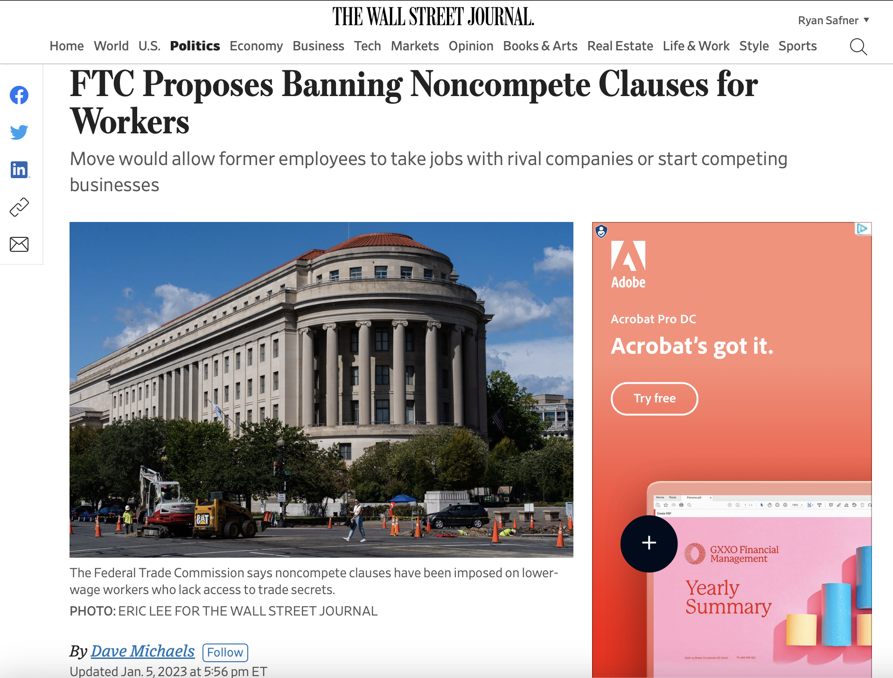

```{r setup, include=FALSE}
options(htmltools.dir.version = FALSE)
knitr::opts_chunk$set(echo=F,
                      message=F,
                      warning=F,
                      fig.retina = 3,
                      fig.align = "center")
library("tidyverse")
library("ggrepel")
library("fontawesome")
xaringanExtra::use_tile_view()
xaringanExtra::use_tachyons()
xaringanExtra::use_freezeframe()
xaringanExtra::use_progress_bar()

update_geom_defaults("label", list(family = "Fira Sans Condensed"))
update_geom_defaults("text", list(family = "Fira Sans Condensed"))

set.seed(256)

theme_slides <- theme_light() + 
  theme(
    text = element_text(family = "Fira Sans", size = 24)
  )

```

```{r}
library(wbstats)
library(fredr)
fredr_set_key("9100cdf3c862283007d8c83ce02059e6")
```

class: title-slide

# 1.1 — Introduction to IO

## ECON 326 • Industrial Organization • Spring 2023

### Ryan Safner<br> Associate Professor of Economics <br> <a href="mailto:safner@hood.edu"><i class="fa fa-paper-plane fa-fw"></i>safner@hood.edu</a> <br> <a href="https://github.com/ryansafner/ioS23"><i class="fa fa-github fa-fw"></i>ryansafner/ioS23</a><br> <a href="https://ioS23.classes.ryansafner.com"> <i class="fa fa-globe fa-fw"></i>ioS23.classes.ryansafner.com</a><br>
---

class: inverse

# Outline

### [What is Industrial Organization About?](#5)
### [Motivations for this Semester](#37)
### [About This Course](#46)

---

# About Me

.left-column[
.center[


.smallest[
Edinburgh, 2019
]
]
]

.right-column[
.smallest[

- Ph.D (Economics) — George Mason University, 2015

- B.A. (Economics) — University of Connecticut, 2011

- 7th year teaching at Hood

- Specializations:
  - Law and Economics
  - Austrian Economics

- Research interests
  - modeling innovation & economic growth
  - political economy & economic history of intellectual property
  - Substack: [Increasing Returns](https://increasingreturns.substack.com)
]
]

---

# What's Keeping Me Busy

.center[

]

---

class: inverse, center, middle

# What is Industrial Organization About?

---

# Industrial Organization

.pull-left[

- .hi[How are industries organized, and why do they operate the way they do?]

- .hi[How do we properly regulate industry?]

- .hi[How does, and should, *actual* competition between firms work?]

]

.pull-right[

.center[

]
]

---

# IO is Applied Microeconomics

.left-column[
.center[


George Stigler

1911-1991

Economics Nobel 1982
]
]

.right-column[

> “Let us start this...on a higher plane of candor than [we] will always maintain, .hi[there is no such subject as industrial organization],” (p.1).

> “These courses deal with the size, structure, the effects of concentration on competition, the effects of competition upon prices, investment, innovation, and so on. But this is precisely the content of economic theory — price or resource allocation theory, now often given the unfelicitious name of .hi[microeconomics],” (p.1).

]

.source[Stigler, George J, 1968, *The Organization of Industry*]

---

# You Already Know a Lot of IO Basics

.pull-left[

- You (hopefully) learn(ed) in **Microeconomics (206, 306)**:

- .hi[Market structures]:
  1. .hi-purple[perfect competition]
  2. .hi-purple[monopoly]
  3. .hi-purple[monopolistic competition]
  4. .hi-purple[oligopoly]
]

.pull-right[
.center[

]
]

---

# You Already Know a Lot of IO Basics

.pull-left[
- You (hopefully) learn(ed) in **Microeconomics (206, 306)**:

- **Something** about the following .hi[concepts]:
  1. .hi-purple[pricing]
  2. .hi-purple[game theory]
  3. .hi-purple[antitrust]
  4. .hi-purple[entrepreneurship]
  5. .hi-purple[market failures/regulation/welfare]
]

.pull-right[
.center[

]
]

---

# Spectrum of Market Structures


---

# Classic Elements of Industrial Organization

.pull-left[

1. .hi[Structure-Conduct-Performance (SCP) paradigm]

2. .hi[Price theory and Game theory]

3. .hi[Economics of Organization/Firms]

4. .hi[Antitrust and economics of regulation]
]

.pull-right[

.center[

]
]

---

# Structure-Conduct-Performance Paradigm

.pull-left[
.center[

]
]

.pull-right[

- An industry’s .hi-purple[“Performance”]
  - Price (high, low)
  - Output (high, low)
  - Profit
  - Productive efficiency
  - Allocative efficiency (CS, DWL)
  - Quality, safety, etc.
]
---

# Structure-Conduct-Performance Paradigm

.pull-left[
.center[

]
]

.pull-right[

- ... which is determined by its firms’ .hi-purple[“Conduct”]
  - Pricing behavior
  - Output choices
  - Advertising
  - Lobbying
  - Lawsuits
  - Entry and exit
  - Collusion
  - Innovation
]

---

# Structure-Conduct-Performance Paradigm

.pull-left[
.center[

]
]

.pull-right[

- ... which is determined by the industry’s .hi-purple[“Structure”]
  - Number of buyers
  - Number of sellers
  - Product differentiation
  - Vertical integration
  - Barriers to entry
]

---

# Structure-Conduct-Performance Paradigm

.pull-left[
.center[

]
]

.pull-right[

- ... which is determined (exogenously) by the product’s .hi-purple[“Technology”]
  - **Consumer demand** (price and income elasticity, substitutes, location, etc)
  - **Product’s features**: experience, information, durability, rivalry, excludability
  - **Production features**: economies of scale, economies of scope, network externalities, two-sided platforms
]

---

# Structure-Conduct-Performance Paradigm

.pull-left[
.center[

]
]

.pull-right[

- .hi-purple[Government policy] can affect nearly every stage
  - Entry regulation
  - Price regulation
  - Antitrust lawsuits
  - Taxes and subsidies
]

---

# A Brief Sketch of IO History

.pull-left[
.smallest[

- Theory of perfect competition perfected 1920—1930s

- SCP paradigm dominant (1950s—1970s)
  - cross-industry comparisons
  - positive correlation between industry concentration and profits

]
]

.pull-right[
.center[

]
]

---

# A Brief Sketch of IO History

.pull-left[
.smallest[
- “New learning” rejects SCP paradigm (1970s-1980s)
  - game theory in imperfect competition, strategic behaviors
  - efficiency arguments for firm behaviors
  - revolution in antitrust thinking
  
- “New Empirical Industrial Organization” (1980s-present)
  - better data & better theory
  - focus on individual industries, micro-level
  - 1990s credibility revolution in econometrics, counterfactual modeling
]
]

.pull-right[
.center[

]
]


---

# Price Theory

.pull-left[
.smaller[
- Economics is a .hi[way of thinking] based on a few core ideas:

- .hi-purple[People respond to incentives]
    - Money, punishment, taxes and subsidies, risk of injury, reputation, profits, sex, effort, morals

- .hi-purple[Environments adjust until they are in equilibrium]
    - People make adjustments until their choices are optimal given others’ actions
]
]
.pull-right[

.center[


]
]


---

# Price Theory: Optimization & Equilibrium

.pull-left[

## Optimization

- Agents have .hi[objectives] they value

- Agents face .hi[constraints]

- Make .hi[tradeoffs] to maximize objectives within constraints

.center[

]
]

--

.pull-right[

## Equilibrium

- Agents .hi[compete] with others over **scarce** resources

- Agents .hi[adjust] behaviors based on prices

- .hi[Stable outcomes] when adjustments stop

.center[

]

]

---

# Price Theory: Optimization and Equilibrium

.pull-left[
- If people can **learn** and **change** their behavior, they will always switch to a higher-valued option

- If there are no alternatives that are better, people are at an .hi[optimum]

- If **everyone** is at an optimum, the system is in .hi[equilibrium]
]

.pull-right[
.center[


]
]

---

# Economics (Price Theory) Is Broader Than You Think

.center[

]

---

# Remember: All Models are Wrong!

.pull-left[
.content-box-red[
.red[**Caution**:] Don't conflate models with reality!
]
- Models help us *understand* reality.

- A good economist is always aware of:
    - "*ceterus paribus*"
    - "...and then what?"
    - "...compared to what?"

]

.pull-right[
.center[

]
]

---

# .st[Economics] IO Often Uses, but Is Not Limited to, Math

```{r, fig.width=12}
red_pink <- "#e64173"
blue <- "#2b59c3"

venn_colors <- c(red_pink, blue)
venn_lines <- rep("solid", 10)
# Locations of circles
venn_df <- tibble(
  x  = c( 0.0,   2.0),
  y  = c( 0.0,   0.0),
  r  = c( 2.0,   2.0),
  l  = c( "Math \n Modeling", "Thinking Like \n an Economist"),
  xl = c( -1.0,    3.0),
  yl = c( 0.0,   0.0))
# Venn
ggplot(data = venn_df, aes(x0 = x, y0 = y, r = r, fill = l, color = l)) +
ggforce::geom_circle(aes(linetype = l), alpha = 0.3, size = 0.75) +
theme_void() +
theme(legend.position = "none") +
scale_fill_manual(values = venn_colors) +
scale_color_manual(values = venn_colors) +
scale_linetype_manual(values = venn_lines) +
  geom_text(aes(x = xl, y = yl, label = l), size = 8, family = "Fira Sans Condensed") +
coord_equal()
```

---

# The Economics of Organization

.pull-left[

- Studying the problem of .hi[economic organization] provides more perspectives

- .hi[Firms] (hierarchies) and **markets** are substitutable methods of production

- .hi[Team production] of many economic goods and services

- Organize to **minimize** **transaction costs** in production

]

.pull-right[
.center[

]
]

---

# The Economics of Organization

.pull-left[

- **Most** production takes place in firms

- Firms grapple with their own .hi-purple[principal-agent problems]: 
  - management vs. labor, management vs. owners

- Firms must relate to other firms
  - specialization & division of labor
  - up/downstream market power
  - mergers & acquisitions, vertical integration
]

.pull-right[
.center[

]
]

---

# Efficiency Arguments and Antitrust

.pull-left[

- A lot of business activities that appear anti-competitive may actually be pro-competitive (i.e. they improve .hi-purple[consumer welfare])


]

.pull-right[
.center[

]
]

---
# Game Theory and Strategic Behavior

.pull-left[

- .hi[Game theory]: a set of tools that model strategic interactions ("games") between rational players, 3 elements:
    1. **Players**
    2. **Strategies** that players can choose from
    3. **Payoffs** are *jointly-determined* from combination of all players' strategies 

]

.pull-right[
.center[

]
]

---

# Game Theory vs. Price Theory Models I

.pull-left[

- .hi-purple[Optimization models] **ignore all other agents** and just focus on how can **you** maximize **your** objective within **your** constraints
  - Other agents are a primary cause of your constraints - but not considered in the model!
  - Consumers max utility; firms max profit, etc.

- **Outcome**: .hi[optimum]: decision where *you* have no better alternatives

]

.pull-right[
.center[

]
]

---

# Game Theory vs. Price Theory Models II

.pull-left[

- Traditional economic models are often called .hi[Decision theory]:

- .hi-purple[Equilibrium models] assume that there are **so many agents** that **no agent's decision can affect the outcome**
  - P.C.: firms are price-**takers**
  - Monopoly: the **only** buyer or seller
  - **Ignores all other agents' choices**!

- **Outcome**: .hi[equilibrium]: where *nobody* has no better alternatives

]

.pull-right[

.center[

]
]

---

# Game Theory vs. Price Theory Models III

.pull-left[

- .hi[Game theory models] directly confront **strategic interactions** between players
  - How each player would respond to a strategy chosen by other player(s)
  - Lead to a stable outcome where everyone has considered and chosen their best responses

- **Outcome**: .hi-purple[Nash equilibrium]: where *nobody* has a better strategy *given the strategies everyone else is playing*

]

.pull-right[
.center[

]
]

---

# Challenges to Consider

.pull-left[

- Positive correlation between concentration (fewer, bigger firms) and profits across industries

- Is this because:
  a. big firms buy up their rivals to capture market share *and then* earn higher profits (anti-competitive)
  b. more efficient firms earn higher profits and outlast inefficient firms earning losses that go out of business or are acquired (pro-competitive)
]

.pull-right[
.center[

]
]

---

# Challenges to Consider

.pull-left[

- Are the following business practices
  - .hi-purple[anti-competitive] (and worth regulating/prosecuting) OR 
  - .hi-purple[pro-competitive] (creates efficiency & benefits consumers):
    - price discrimination
    - mergers & acquisitions
    - franchising, exclusive dealing
    - vertical restraints
    - resale price maintenance
    - advertising/marketing
]

.pull-right[
.center[

]
]

---

# Challenges to Consider

.pull-left[
- How do you define "an industry" or a market?
  - What does Coca Cola compete with?
  - What does Google compete with?

- Substitutes in production vs. substitutes in consumption

- Geographic boundaries
]

.pull-right[
.center[

]
]

---

# Challenges to Consider

.pull-left[

- Is regulation used by the government to regulate firms in the public interest?

- Or is regulation used by firms to bludgeon their competition?

- (Or something else?)
]

.pull-right[
.center[

]
]

---

class: inverse, center, middle

# Motivating Issues in the World

---

# Unequal Growth, or Unshared Prosperity? I

.pull-left[
- Common argument: "**real wages** have been stagnant since 1970" or "real wages have not kept up with productivity since 1970"

- **Labor's share** of national income has gone down recently

- .hi-purple[Might this be because of *increasing market power*?]

]

.pull-right[
.center[

]
]

---

# Unequal Growth, or Unshared Prosperity? II

```{r, fig.width=12}
labor<-fredr(
  series_id = "MPU4910141"
)

#series %>%
#  spread(key = "Series",
#         value = value) %>%
#  mutate(Sum = Capital + Labor)
ggplot(data = labor)+
  aes(x = date,
      y = value,
      color = series_id)+
  #geom_point()+
  geom_path(size=2)+
  scale_x_date(date_labels = "%Y", breaks = "2 years")+
  scale_y_continuous(breaks=seq(0.60,0.70,0.01),
                     limits=c(0.6,0.7))+
  theme_slides+
  guides(color=F)+
  labs(x = "Year",
       y = "Labor's Share of Cost",
       title = "The Decline of Labor's Share in Cost",
       subtitle = "(Private Nonfarm Business Sector)",
       caption = "Data Source: FRED")
```

---

# Unequal Growth, or Unshared Prosperity? III

```{r, fig.width=12}
profits<-fredr(
  series_id = "CP"
)

#series %>%
#  spread(key = "Series",
#         value = value) %>%
#  mutate(Sum = Capital + Labor)
ggplot(data = profits)+
  aes(x = date,
      y = value,
      color = series_id)+
  #geom_point()+
  geom_path(size=2)+
  scale_x_date(date_labels = "%Y", breaks = "10 years")+
  scale_y_continuous(breaks=seq(0,2100,200),
                     labels=scales::dollar,
                     limits=c(0,2100),
                     expand=c(0,0))+
  theme_slides+
  guides(color=F)+
  labs(x = "Year",
       y = "Corporate Profits (in Billions)",
       title = "The Rise of Corporate Profits",
       subtitle = "(Unadjusted, After Tax)",
       caption = "Data Source: FRED")
```

---

# The Rise of Market Power?

.center[

]

---

# Is New Antitrust Action Necessary? 

.center[

]

---

# Is New Antitrust *Thinking* Necessary?

.center[

]

---

# Big Changes in Regulatory Approach

.center[

]

.source[Source: [WSJ](https://www.wsj.com/articles/ftc-proposes-banning-noncompete-clauses-for-workers-11672900586)]

---

# Some Questions for the Semester

1. Has there been a **general increase in market power/concentration**?

2. If so, what should we do about it?

3. Should we revitalize **antitrust laws**?

4. Are **platforms** like Facebook, Amazon, Google, etc. uniquely problematic? How should we regulate them?

5. Should your **data** be **owned** (and compensated) as **labor**?

6. Will **automation** take all the jobs? If so, what do we do about that? 

---

class: inverse, center, middle
# About This Course

---

# Learning Goals I

.smaller[
1. Understand key economic models of perfect competition, monopoly, monopolistic competition, oligopoly (Bertrand, Cournot, and Stackelberg competition), and contestable markets

2. Apply models of competition to different industries and regulatory regimes

3. Simulate strategic and game theoretic interactions and apply them to industry behavior

4. Discuss how firms actually compete with one another

5. Critique textbook models and theories of regulation and antitrust

6. Understand the economic problems that firms solve, create, and grapple with

7. Debate regulatory solutions to problems and current events in various industries

---

# A Course in Five Acts

.pull-left[
- .hi-purple[I. Models/Review]
  - Production theory (technology, costs, etc)
  - Market structures (perfect competition, monopoly)
  - Some extensions beyond ECON 306 (factors markets, etc.)
  - *Some* math & practice (**HWs**, **Midterm**)
]

.pull-right[

.center[

]
]
---

# A Course in Five Acts

.pull-left[
- .hi-purple[II. Oligopoly]
  - Oligopoly models
  - (Static) game theory
  - **Playing games** in class (**Moblab**)
]

.pull-right[

.center[

]
]

---

# A Course in Five Acts

.pull-left[
- .hi-purple[III. Economic Organization]
  - Theory of the firm: why firms exist (and look/act the way they do)
  - Efficiency rationales for firm organization & behavior
]

.pull-right[

.center[

]
]

---

# A Course in Five Acts

.pull-left[
- .hi-purple[IV. Strategic Behavior]
  - Dynamic/sequential game theory
  - Repeated games
  - Entry barriers
  - Anticompetitive behavior

- More **readings** and **discussions** with some lecture
]

.pull-right[

.center[

]
]

---

# A Course in Five Acts

.pull-left[
- .hi-purple[V. Regulation & Applications]
  - Antitrust (theory, history, applications)
  - Regulating natural monopoly
  - Automation, gig economy
  - Networks, platforms, ownership of data

- More **readings** and **discussions** with some lecture
]

.pull-right[

.center[

]
]

---

# Assignments

```{r}

assignments <- tribble(
  ~"",  ~Assignment, ~Percent,
  "n", "Participation (Average)", "10%",
  "n", "Homework (Average)", "20%",
  "1", "Midterm", "20%",
  "1", "Final (Take-home)", "30%",
  "1", "Industry Report", "20%"
)
knitr::kable(assignments, "html")
```

.center[
See more details at the [assignments page](/assignments)
]

---

# Textbooks You Might Want

.pull-left[
.center[

]
]
.pull-right[

- It's free online (PDF):  https://works.bepress.com/jeffrey_church/23

- But you may purchase a hard copy if you wish
]

---

# And So We Can Play Games 

.pull-left[
.center[

]
]

.pull-right[
.center[

]
]


---


# Course Website

.pull-left[
.center[


]
]

.pull-right[
.center[

]
]

.center[
[ioS23.classes.ryansafner.com](https://ioS23.classes.ryansafner.com)
]

---

# Tips for Success, Or: How to College

.pull-left[
- Take notes. On paper. Really.

- Read the readings. I've optimized them for you.

- Participate<sup>*</sup>

- You are learning how to learn

- See the [reference page](http://ios23.classes.ryansafner.com/reference) for more
]

.pull-right[
.center[

]
]
.footnote[<sup>*</sup> To the degree you feel comfortable. But try to push that boundary with baby steps!]