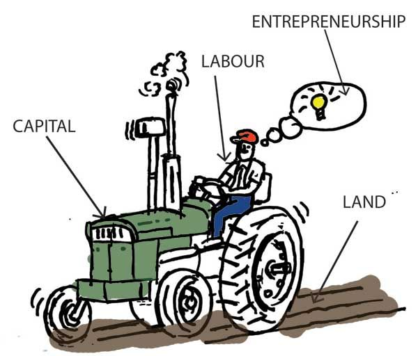
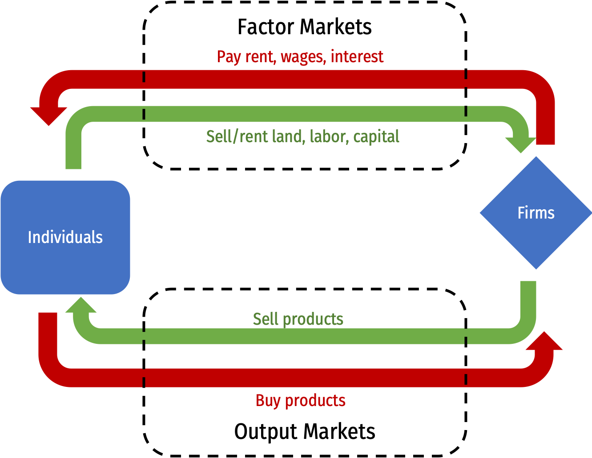
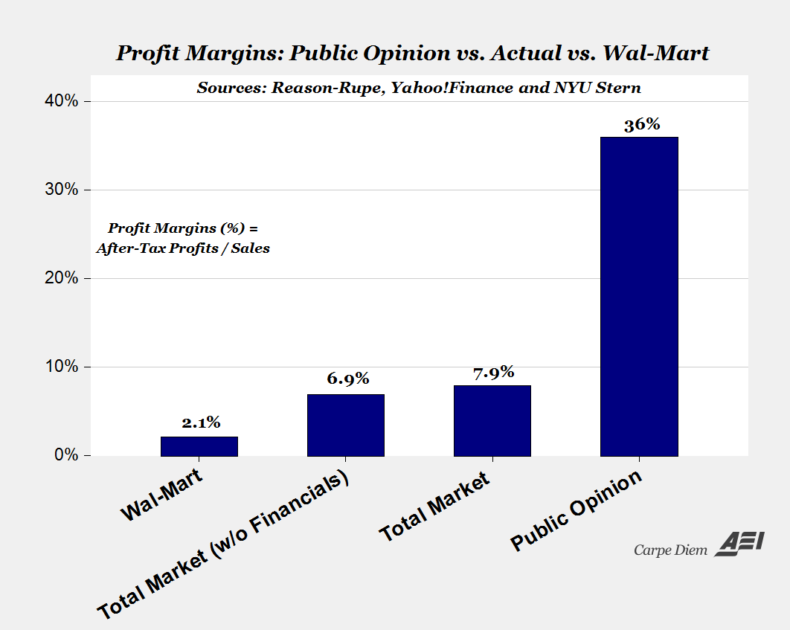

```{r setup, include=FALSE}
options(htmltools.dir.version = FALSE)
knitr::opts_chunk$set(echo=F,
                      message=F,
                      warning=F,
                      fig.retina = 3,
                      fig.align = "center")
library("tidyverse")
library("ggrepel")
library("fontawesome")
xaringanExtra::use_tile_view()
xaringanExtra::use_tachyons()
xaringanExtra::use_freezeframe()
xaringanExtra::use_progress_bar()

update_geom_defaults("label", list(family = "Fira Sans Condensed"))
update_geom_defaults("text", list(family = "Fira Sans Condensed"))

set.seed(256)

theme_slides <- theme_light() + 
  theme(
    text = element_text(family = "Fira Sans", size = 24)
  )

```

class: title-slide

# 1.2 — Technology and Cost

## ECON 326 • Industrial Organization • Spring 2023

### Ryan Safner<br> Associate Professor of Economics <br> <a href="mailto:safner@hood.edu"><i class="fa fa-paper-plane fa-fw"></i>safner@hood.edu</a> <br> <a href="https://github.com/ryansafner/ioS23"><i class="fa fa-github fa-fw"></i>ryansafner/ioS23</a><br> <a href="https://ioS23.classes.ryansafner.com"> <i class="fa fa-globe fa-fw"></i>ioS23.classes.ryansafner.com</a><br>
---

class: inverse

# Outline

### [Short Run Production Concepts](#27)
### [Costs in the Short Run](#37)
### [Costs in the Long Run](#65)
### [Revenues](#75)

---

# This Black Box We Call "Firms"

.pull-left[

- .hi[Firm] is a mere .hi-purple[production process]:
  - a bundle of technology, physical assets, and individuals

- Synonymous with .hi[production function]

- Fully replicable

- We'll explore (and explode) this much later
]

.pull-right[
.center[

]
]

---

# What Do Firms Do? I

.pull-left[

- We'll assume “the firm” is the agent to model:

- So what do firms do? 

- How would we set up an optimization model:

1. **Choose:** .hi-blue[ < some alternative >]

2. **In order to maximize:** .hi-green[< some objective >]

3. **Subject to:** .hi-red[< some constraints >]

]

.pull-right[

.center[

]
]

---

# What Do Firms Do? II

.pull-left[
.smaller[
- Firms convert some goods to other goods: 
]
]

.pull-right[
.center[

]
]

---

# What Do Firms Do? II

.pull-left[
.smaller[
- Firms convert some goods to other goods: 

- **Inputs**: $x_1, x_2, \cdots, x_n$
  - <span class="green">**Examples**: worker efforts, warehouse space, electricity, loans, oil, cardboard, fertilizer, computers, software programs, etc<span>
  ]
]

.pull-right[
.center[

]
]

---
# What Do Firms Do? II

.pull-left[
.smaller[
- Firms convert some goods to other goods: 

- **Inputs**: $x_1, x_2, \cdots, x_n$
  - <span class="green">**Examples**: worker efforts, warehouse space, electricity, loans, oil, cardboard, fertilizer, computers, software programs, etc<span>
  
- **Output**: $q$
  - <span class="green">**Examples**: gas, cars, legal services, mobile apps, vegetables, consulting advice, financial reports, etc<span>
]
]

.pull-right[
.center[

]
]

---

# What Do Firms Do? III

.pull-left[
- .hi[Technology] or a .hi[production function]: rate at which firm can convert specified **inputs** $(x_1, x_2, \cdots, x_n)$ into **output** $(q)$
$$q=f(x_1, x_2, \cdots, x_n)$$

]

.pull-right[
.center[

]
]

---

# Production Function as Recipe

.pull-left[
.center[The production function


]
]

.pull-right[
.center[The production algorithm


]

]

---

# Factors of Production I

$$q=A \,f(t,l,k)$$

.pull-left[
.smaller[
- Economists typically classify inputs, called the .hi[“factors of production” (FOP)]:

```{r,results="asis"}
tribble(
  ~"Factor", ~"Owned By", ~"Earns",
  "Land (t)", "Landowners", "Rent",
  "Labor (l)", "Laborers", "Wages",
  "Capital (k)", "Capitalists", "Interest",
) %>%
  knitr::kable(., format="html")
```
]
.smallest[
- $A$: .b["total factor productivity"] (ideas/knowledge/institutions)

]
]
.pull-right[
.center[

]

]

---

# Factors of Production II

$$q=f(l,k)$$

.pull-left[

- We will assume just two inputs: labor $l$ and capital $k$

```{r,results="asis"}
tribble(
  ~"Factor", ~"Owned By", ~"Earns",
  "Labor (l)", "Laborers", "Wages",
  "Capital (k)", "Capitalists", "Interest"
) %>%
  knitr::kable(., format="html")
```

]

.pull-right[
.center[

]

]

---

# What Does a Firm Maximize?

.pull-left[

- We assume firms .hi-purple[maximize profit `\\((\pi)\\)`]

- Not true for all firms
    - <span class="green">**Examples**: non-profits, charities, civic associations, government agencies, criminal organizations, etc</span>

- Even profit-seeking firms may also want to maximize *additional* things
    - <span class="green">**Examples**: goodwill, sustainability, social responsibility, etc </span>

]

.pull-right[

.center[

]
]

---

# Profits Have a Bad Rap These Days

.center[

]

---

# What is Profit?

.pull-left[

- In economics, .hi-purple[profit] is simply **benefits minus (opportunity) costs**

]

.pull-right[
.center[

]
]

---

# What is Profit?

.pull-left[

- In economics, .hi-purple[profit] is simply **benefits minus (opportunity) costs**

- Suppose firm sells **output** $q$ at price $p$

]

.pull-right[
.center[

]
]


---

# What is Profit?

.pull-left[

- In economics, .hi-purple[profit] is simply **benefits minus (opportunity) costs**

- Suppose firm sells **output** $q$ at price $p$

- It can buy each **input** $x_i$ at an associated price $p_i$, i.e.
    - labor $l$ at wage rate $w$
    - capital $k$ at rental rate $r$

]

.pull-right[
.center[

]
]

---

# What is Profit?

.pull-left[

- In economics, .hi-purple[profit] is simply **benefits minus (opportunity) costs**

- Suppose firm sells **output** $q$ at price $p$

- It can buy each **input** $x_i$ at an associated price $p_i$, i.e.
    - labor $l$ at wage rate $w$
    - capital $k$ at rental rate $r$

- The profit of selling $q$ units and using inputs $l,k$ is:

]

.pull-right[
.center[

]
]

---

# Who Gets the Profits? I

.pull-left[
$$\pi=\underbrace{pq}_{revenues}-\underbrace{(wl+rk)}_{costs}$$

]

.pull-right[
.center[

]
]

---

# Reminder from Macroeconomics: “The Circular Flow”

.center[

]

---

# Who Gets the Profits? I

.pull-left[
$$\pi=\underbrace{pq}_{revenues}-\underbrace{(wl+rk)}_{costs}$$

- .hi-purple[The firm's costs are all of the factor-owner's incomes!]
    - Landowners, laborers, creditors are all paid rent, wages, and interest, respectively

]

.pull-right[
.center[

]
]

---

# Who Gets the Profits? I

.pull-left[
$$\pi=\underbrace{pq}_{revenues}-\underbrace{(wl+rk)}_{costs}$$

- Profits are the .hi-purple[residual value] leftover after paying all factors

- Profits are income for the .hi[residual claimant(s)] of the production process (i.e. **owner(s)** of a firm):
    - Entrepreneurs
    - Shareholders

]

.pull-right[
.center[

]
]

---

# Who Gets the Profits? II

.pull-left[
$$\pi=\underbrace{pq}_{revenues}-\underbrace{(wl+rk)}_{costs}$$

- Residual claimants have incentives to maximize firm's profits, as this *maximizes their own income*

- Entrepreneurs and shareholders are the only participants in production that are *not* guaranteed an income!
    - Starting and owning a firm is inherently **risky**!

]

.pull-right[
.center[

]
]
---

# People Overestimate Profits

.center[

]

.source[Source: [American Enterprise Institute](https://www.aei.org/carpe-diem/the-public-thinks-the-average-company-makes-a-36-profit-margin-which-is-about-5x-too-high-part-ii/)]

---

# Profits and Entrepreneurship: A Preview

.pull-left[

- In markets, production must face the .hi[profit test]:
    - <span class="hi-purple">Is consumer's willingness to pay $>$ opportunity cost of inputs?</span>

- Profits are an indication that **value is being created for society**

- Losses are an indication that **value is being destroyed for society**

- Survival in markets *requires* firms continually create value & earn profits
]

.pull-right[

.center[

]
]

---

# The Firm's Optimization Problem I

.pull-left[

- So what do firms do? 

1. **Choose:** .hi-blue[ < some alternative >]

2. **In order to maximize:** .hi-green[< profits >]

3. **Subject to:** .hi-red[< technology >]

- We've so far assumed they maximize profits and they are limited by their technology

]

.pull-right[

.center[

]
]

---

# The Firm's Optimization Problem II

.pull-left[
- What do firms **choose**? (Not an easy answer)

- Prices?
    - Depends on the market the firm is operating in!
    - Study of <span class="hi">industrial organization</span>
    
- Essential question: .hi-turquoise[how competitive is a market?] This will influence what firms (can) do
]

.pull-right[
.center[

]
]

---

class: inverse, center, middle

# Short-Run Production Concepts

---

# Marginal Products

.pull-left[
- The .hi[marginal product] of an input is the *additional* output produced by *one more unit* of that input (*holding all other inputs constant*)

- Like marginal utility

- Similar to marginal utilities, I will give you the marginal product equations

]

.pull-right[
```{r, fig.retina=3}
prod_1=function(x){2*sqrt(x)}

pf<-ggplot(data.frame(x=c(0,6)), aes(x=x))+
  stat_function(fun=prod_1, geom="line", size=2, color="red")+
  geom_label(aes(x=5,y=prod_1(5)), color = "red", label="Total Product", size = 6)+
    scale_x_continuous(breaks=seq(0,6,1),
                     limits=c(0,6),
                     expand=expand_scale(mult=c(0,0.1)))+
  scale_y_continuous(breaks=seq(0,6,1),
                     limits=c(0,6),
                     expand=expand_scale(mult=c(0,0.1)))+
  scale_colour_manual("I.C. equations", values = colors)+
  guides(color = F)+
  labs(x = "Input (l)",
       y = "Output (q)",
       caption = expression(paste("Technology: ", q(l,bar(k))==2*sqrt(l))))+
  theme_classic(base_family = "Fira Sans Condensed", base_size=20)

pf+ # 1 to 2
  geom_segment(x=1,xend=1,y=0,yend=prod_1(1), linetype="dotted", size =1)+
  geom_segment(x=0,xend=1,y=prod_1(1),yend=prod_1(1), linetype="dotted", size =1)+
  geom_segment(x=2,xend=2,y=0,yend=prod_1(2), linetype="dotted", size =1)+
  geom_segment(x=0,xend=2,y=prod_1(2),yend=prod_1(2), linetype="dotted", size =1)+
  annotate("segment", x = 1, xend = 2, y = 1, yend = 1, color = "purple", size=2, alpha=0.9, arrow=arrow(length=unit(0.5,"cm"), ends="last", type="closed"))+
  annotate("segment", x = 1, xend = 1, y = 2, yend = prod_1(2), color = "purple", size=2, alpha=0.9, arrow=arrow(length=unit(0.5,"cm"), ends="last", type="closed"))

```
]

---

# Marginal Product of Labor

.pull-left[

- .hi[Marginal product of labor `\\((MP_l)\\)`]: additional output produced by adding one more unit of labor (holding $k$ constant)
$$MP_l = \frac{\Delta q}{\Delta l}$$

- $MP_l$ is slope of $TP$ at each value of $l$! 
  - Note: via calculus: $\frac{\partial q}{\partial l}$
]

.pull-right[

```{r, fig.retina=3, fig.height=3.5}
ggplot(data.frame(x=c(0,6)), aes(x=x))+
  stat_function(fun=prod_1, geom="line", size=2, color="red")+
  geom_label(aes(x=5,y=prod_1(5)), color = "red", label=expression(TP==2*sqrt(l)), size = 6)+
    scale_x_continuous(breaks=seq(0,6,1),
                     limits=c(0,6),
                     expand=expand_scale(mult=c(0,0.1)))+
  scale_y_continuous(breaks=seq(0,6,1),
                     limits=c(0,6),
                     expand=expand_scale(mult=c(0,0.1)))+
  scale_colour_manual("I.C. equations", values = colors)+
  guides(color = F)+
  labs(x = "Input (l)",
       y = "Output (q)")+
  theme_classic(base_family = "Fira Sans Condensed", base_size=20)
```

```{r, fig.retina=3, fig.height=3.5}
mp=function(x){1/sqrt(x)}

ggplot(data.frame(x=c(0,10)), aes(x=x))+
  stat_function(fun=mp, geom="line", size=2, color="blue")+
  geom_label(aes(x=1,y=mp(1)), color = "blue", label=expression(MP[l]==frac(1,sqrt(l))), size = 4)+
    scale_x_continuous(breaks=seq(0,6,1),
                     limits=c(0,6),
                     expand=expand_scale(mult=c(0,0.1)))+
  scale_y_continuous(breaks=seq(0,6,1),
                     limits=c(0,6),
                     expand=expand_scale(mult=c(0,0.1)))+
  scale_colour_manual("I.C. equations", values = colors)+
  guides(color = F)+
  labs(x = "Input (l)",
       y = "Output per Worker (q/l)")+
  theme_classic(base_family = "Fira Sans Condensed", base_size=20)
```

]

---

# Marginal Product of Capital

.pull-left[

- .hi[Marginal product of capital `\\((MP_k)\\)`]: additional output produced by adding one more unit of capital (holding $l$ constant)
$$MP_k = \frac{\Delta q}{\Delta k}$$

- $MP_k$ is slope of $TP$ at each value of $k$! 
  - Note: via calculus: $\frac{\partial q}{\partial k}$

- Note we don't consider capital in the short run!

]

.pull-right[

```{r, fig.retina=3, fig.height=3.5}
ggplot(data.frame(x=c(0,6)), aes(x=x))+
  stat_function(fun=prod_1, geom="line", size=2, color="red")+
  geom_label(aes(x=5,y=prod_1(5)), color = "red", label=expression(TP==2*sqrt(k)), size = 6)+
    scale_x_continuous(breaks=seq(0,6,1),
                     limits=c(0,6),
                     expand=expand_scale(mult=c(0,0.1)))+
  scale_y_continuous(breaks=seq(0,6,1),
                     limits=c(0,6),
                     expand=expand_scale(mult=c(0,0.1)))+
  scale_colour_manual("I.C. equations", values = colors)+
  guides(color = F)+
  labs(x = "Input (k)",
       y = "Output (q)")+
  theme_classic(base_family = "Fira Sans Condensed", base_size=20)
```

```{r, fig.retina=3, fig.height=3.5}
mp=function(x){1/sqrt(x)}

ggplot(data.frame(x=c(0,10)), aes(x=x))+
  stat_function(fun=mp, geom="line", size=2, color="blue")+
  geom_label(aes(x=1,y=mp(1)), color = "blue", label=expression(MP[k]==frac(1,sqrt(k))), size = 4)+
    scale_x_continuous(breaks=seq(0,6,1),
                     limits=c(0,6),
                     expand=expand_scale(mult=c(0,0.1)))+
  scale_y_continuous(breaks=seq(0,6,1),
                     limits=c(0,6),
                     expand=expand_scale(mult=c(0,0.1)))+
  scale_colour_manual("I.C. equations", values = colors)+
  guides(color = F)+
  labs(x = "Input (k)",
       y = "Output per Machine (q/k)")+
  theme_classic(base_family = "Fira Sans Condensed", base_size=20)
```

]

---

# Diminishing Returns

.pull-left[

- .hi-purple[Law of Diminishing Returns]: adding more of one factor of production **holding all others constant** will result in successively lower increases in output

- In order to increase output, firm will need to increase *all* factors!


]

.pull-right[

```{r, fig.retina=3, fig.height=3.5}
ggplot(data.frame(x=c(0,6)), aes(x=x))+
  stat_function(fun=prod_1, geom="line", size=2, color="red")+
  geom_label(aes(x=5,y=prod_1(5)), color = "red", label=expression(TP==2*sqrt(l)), size = 6)+
# 1 to 2
  geom_segment(x=1,xend=1,y=0,yend=prod_1(1), linetype="dotted", size =1)+
  geom_segment(x=0,xend=1,y=prod_1(1),yend=prod_1(1), linetype="dotted", size =1)+
  geom_segment(x=2,xend=2,y=0,yend=prod_1(2), linetype="dotted", size =1)+
  geom_segment(x=0,xend=2,y=prod_1(2),yend=prod_1(2), linetype="dotted", size =1)+
  annotate("segment", x = 1, xend = 2, y = 1, yend = 1, color = "purple", size=2, alpha=0.9, arrow=arrow(length=unit(0.5,"cm"), ends="last", type="closed"))+
  annotate("segment", x = 1, xend = 1, y = 2, yend = prod_1(2), color = "purple", size=2, alpha=0.9, arrow=arrow(length=unit(0.5,"cm"), ends="last", type="closed"))+
    scale_x_continuous(breaks=seq(0,6,1),
                     limits=c(0,6),
                     expand=expand_scale(mult=c(0,0.1)))+
  scale_y_continuous(breaks=seq(0,6,1),
                     limits=c(0,6),
                     expand=expand_scale(mult=c(0,0.1)))+
  scale_colour_manual("I.C. equations", values = colors)+
  guides(color = F)+
  labs(x = "Input (l)",
       y = "Output (q)")+
  theme_classic(base_family = "Fira Sans Condensed", base_size=20)
```

```{r, fig.retina=3, fig.height=3.5}
mp=function(x){1/sqrt(x)}

ggplot(data.frame(x=c(0,10)), aes(x=x))+
  stat_function(fun=mp, geom="line", size=2, color="blue")+
  geom_label(aes(x=1,y=mp(1)), color = "blue", label=expression(MP[l]==frac(1,sqrt(l))), size = 4)+
    scale_x_continuous(breaks=seq(0,6,1),
                     limits=c(0,6),
                     expand=expand_scale(mult=c(0,0.1)))+
  scale_y_continuous(breaks=seq(0,6,1),
                     limits=c(0,6),
                     expand=expand_scale(mult=c(0,0.1)))+
  scale_colour_manual("I.C. equations", values = colors)+
  guides(color = F)+
  labs(x = "Input (l)",
       y = "Output per Worker (q/l)")+
  theme_classic(base_family = "Fira Sans Condensed", base_size=20)
```
]

---

# Diminishing Returns

.pull-left[

- .hi-purple[Law of Diminishing Returns]: adding more of one factor of production **holding all others constant** will result in successively lower increases in output

- In order to increase output, firm will need to increase *all* factors!

.center[

]

]

.pull-right[

```{r, fig.retina=3, fig.height=3.5}
ggplot(data.frame(x=c(0,6)), aes(x=x))+
  stat_function(fun=prod_1, geom="line", size=2, color="red")+
  geom_label(aes(x=5,y=prod_1(5)), color = "red", label=expression(TP==2*sqrt(l)), size = 6)+
# 1 to 2
  geom_segment(x=1,xend=1,y=0,yend=prod_1(1), linetype="dotted", size =1)+
  geom_segment(x=0,xend=1,y=prod_1(1),yend=prod_1(1), linetype="dotted", size =1)+
  geom_segment(x=2,xend=2,y=0,yend=prod_1(2), linetype="dotted", size =1)+
  geom_segment(x=0,xend=2,y=prod_1(2),yend=prod_1(2), linetype="dotted", size =1)+
  annotate("segment", x = 1, xend = 2, y = 1, yend = 1, color = "purple", size=2, alpha=0.9, arrow=arrow(length=unit(0.5,"cm"), ends="last", type="closed"))+
  annotate("segment", x = 1, xend = 1, y = 2, yend = prod_1(2), color = "purple", size=2, alpha=0.9, arrow=arrow(length=unit(0.5,"cm"), ends="last", type="closed"))+
  
  # 2 to 3
    geom_segment(x=3,xend=3,y=0,yend=prod_1(3), linetype="dotted", size =1)+
  geom_segment(x=0,xend=3,y=prod_1(3),yend=prod_1(3), linetype="dotted", size =1)+
  annotate("segment", x = 2, xend = 3, y = 1, yend = 1, color = "purple", size=2, alpha=0.9, arrow=arrow(length=unit(0.5,"cm"), ends="last", type="closed"))+
  annotate("segment", x = 2, xend = 2, y = 3, yend = prod_1(3), color = "purple", size=2, alpha=0.9, arrow=arrow(length=unit(0.3,"cm"), ends="last", type="closed"))+
  scale_x_continuous(breaks=seq(0,6,1),
                     limits=c(0,6),
                     expand=expand_scale(mult=c(0,0.1)))+
  scale_y_continuous(breaks=seq(0,6,1),
                     limits=c(0,6),
                     expand=expand_scale(mult=c(0,0.1)))+
  scale_colour_manual("I.C. equations", values = colors)+
  guides(color = F)+
  labs(x = "Input (l)",
       y = "Output (q)")+
  theme_classic(base_family = "Fira Sans Condensed", base_size=20)
```

```{r, fig.retina=3, fig.height=3.5}
mp=function(x){1/sqrt(x)}

ggplot(data.frame(x=c(0,10)), aes(x=x))+
  stat_function(fun=mp, geom="line", size=2, color="blue")+
  geom_label(aes(x=1,y=mp(1)), color = "blue", label=expression(MP[l]==frac(1,sqrt(l))), size = 4)+
    scale_x_continuous(breaks=seq(0,6,1),
                     limits=c(0,6),
                     expand=expand_scale(mult=c(0,0.1)))+
  scale_y_continuous(breaks=seq(0,6,1),
                     limits=c(0,6),
                     expand=expand_scale(mult=c(0,0.1)))+
  scale_colour_manual("I.C. equations", values = colors)+
  guides(color = F)+
  labs(x = "Input (l)",
       y = "Output per Worker (q/l)")+
  theme_classic(base_family = "Fira Sans Condensed", base_size=20)
```
]

---

# Average Product of Labor (and Capital)

.pull-left[

- .hi[Average product of labor `\\((AP_l)\\)`]: total output per worker
$$AP_l = \frac{q}{l}$$

- A measure of *labor productivity*

- .hi[Average product of capital `\\((AP_k)\\)`]: total output per unit of capital
$$AP_k = \frac{q}{k}$$
]

.pull-right[

```{r, fig.retina=3, fig.height=3.5}
ggplot(data.frame(x=c(0,6)), aes(x=x))+
  stat_function(fun=prod_1, geom="line", size=2, color="red")+
  geom_label(aes(x=5,y=prod_1(5)), color = "red", label=expression(TP==2*sqrt(l)), size = 6)+
    scale_x_continuous(breaks=seq(0,6,1),
                     limits=c(0,6),
                     expand=expand_scale(mult=c(0,0.1)))+
  scale_y_continuous(breaks=seq(0,6,1),
                     limits=c(0,6),
                     expand=expand_scale(mult=c(0,0.1)))+
  scale_colour_manual("I.C. equations", values = colors)+
  guides(color = F)+
  labs(x = "Input (l)",
       y = "Output (q)")+
  theme_classic(base_family = "Fira Sans Condensed", base_size=20)
```

```{r, fig.retina=3, fig.height=3.5}
ap=function(x){2/sqrt(x)}

ggplot(data.frame(x=c(0,10)), aes(x=x))+
  stat_function(fun=ap, geom="line", size=2, color="purple")+
  geom_label(aes(x=1,y=ap(1)), color = "purple", label=expression(AP[l]==frac(2,sqrt(l))), size = 4)+
    scale_x_continuous(breaks=seq(0,6,1),
                     limits=c(0,6),
                     expand=expand_scale(mult=c(0,0.1)))+
  scale_y_continuous(breaks=seq(0,6,1),
                     limits=c(0,6),
                     expand=expand_scale(mult=c(0,0.1)))+
  scale_colour_manual("I.C. equations", values = colors)+
  guides(color = F)+
  labs(x = "Input (l)",
       y = "Output per Worker (q/l)")+
  theme_classic(base_family = "Fira Sans Condensed", base_size=20)
```

]

---

class: inverse, center, middle

# The Firm's Problem: Long Run

---

# The Long Run

.pull-left[

- In the long run, *all* factors of production are .hi-purple[variable]

$$q=f(k,l)$$

- Can build more factories, open more storefronts, rent more space, invest in machines, etc.

- So the firm can choose both $l$ *and* $k$

]

.pull-right[

.center[

]
]

---

# The Firm's Problem

.pull-left[
.smallest[
- Based on what we've discussed, we can fill in a constrained optimization model for the firm
  - .hi-turquoise[But don't write this one down just yet!]

- The **firm's problem** is: 

1. **Choose:** .hi-blue[ < inputs and output >]

2. **In order to maximize:** .hi-green[< profits >]

3. **Subject to:** .hi-red[< technology >]

- It's actually much easier to break this into **2 stages**.
]

.pull-right[

.center[

]
]

---

# Production Costs are Opportunity Costs

.pull-left[

- Remember, .hi[economic costs] are broader than the common conception of “cost”
  - .hi-purple[Accounting cost]: monetary cost
  - .hi[Economic cost]: value of next best alternative use of resources given up (i.e. .hi[opportunity cost])

]

.pull-right[
.center[


]
]

---

# Production Costs are Opportunity Costs

.pull-left[

- This leads to the difference between:
  - .hi-purple[Accounting profit]: revenues minus accounting costs
  - .hi[Economic profit]: revenues minus accounting + .ul[opportunity] costs

- A really difficult concept to think about!
]

.pull-right[
.center[


]
]

---

# Production Costs are Opportunity Costs

.pull-left[

- Another helpful perspective:
  - .hi-purple[Accounting cost]: what you **historically** paid for a resource
  - .hi[Economic cost]: what you can **currently** get in the market for a selling a resource (it’s value in *alternative* uses)

]

.pull-right[
.center[


]
]

---

# A Reminder: It's Demand all the Way Down!

.pull-left[

- .hi-red[Supply] is actually .hi-blue[Demand] in disguise!

- An .hi[(opportunity) cost] to buy (scarce) inputs for production because **other people** .hi-blue[demand] those same inputs to consume or produce **other valuable things**!
  - Price necessary to **pull them out of other valuable productive uses** in the economy!
]

.pull-right[

.center[

]
]

---

# Production Costs are Opportunity Costs

.pull-left[

- Because resources are scarce, and have rivalrous uses, .hi-turquoise[how do we know we are using resources efficiently??]

- In functioning markets, .hi-purple[the market price measures the opportunity cost of using a resource for an alternative use]

- Firms not only pay for direct use of a resource, but also indirectly compensate society for *“pulling the resource out”* of alternate uses in the economy!

]

.pull-right[
.center[


]
]

---

# Production Costs are Opportunity Costs

.pull-left[
- Every choice incurs an opportunity cost

.bg-washed-green.b--dark-green.ba.bw2.br3.shadow-5.ph4.mt5[
.green[**Examples**]:
.smallest[
- If you start a business, you may give up your salary at your current job
- If you invest in a factory, you give up other investment opportunities
- If you use an office building you own, you cannot rent it to other people
- If you hire a skilled worker, you must pay them a high enough salary to deter them from working for other firms
]
]
]

.pull-right[
.center[

]
]


---

# Opportunity Costs vs. Sunk Costs

.pull-left[

- Opportunity cost is a *forward-looking* concept

- Choices made in the *past* with *non-recoverable* costs are called .hi[sunk costs]

- Sunk costs *should not* enter into future decisions

- Many people have difficulty letting go of unchangeable past decisions: .hi-purple[sunk cost fallacy]

]

.pull-left[
.center[

]
]

---

# Common Sunk Costs in Business

.pull-left[

- Licensing fees, long-term lease contracts

- Specific capital (with no alternative use): uniforms, menus, signs

- Research & Development spending

- Advertising spending

]

.pull-right[

.center[

]
]
---

# The Accounting vs. Economic Point of View I

.pull-left[

- Helpful to consider two points of view:

1. .hi-purple[“Accounting point of view”]: are you taking in more cash than you are spending?

2. .hi[“Economic point of view”]: is your product you making the *best social* use of your resources
  - i.e. are there higher-valued uses of your resources you are keeping them out of?

]

.pull-right[
.center[


]
]

---
# The Accounting vs. Economic Point of View II

.pull-left[
.smaller[
- .hi-turquoise[Implications for society]: are consumers *best* off with you using scarce resources (with alternative uses!) to produce your current product?

- Remember: .hi-turquoise[this is an .ul[*economics*] course, not a *business* course]!
  - .hi-purple[Economists are pro-market, *not* pro-business!]
  - What might be good/bad for **one** business might have bad/good *consequences* for society!
]
]

.pull-right[
.center[


]
]

---

class: inverse, center, middle
# Costs in the Short Run

---

# Costs in the Short Run
 
- .hi[Total cost function, `\\(C(q)\\)`] relates output $q$ to the total cost of production $C$<sup>.magenta[†]</sup>

$$C(q)=f+VC(q)$$

--

- Two kinds of short run costs:

**1.** .hi[Fixed costs, `\\(f\\)`] are costs that do not vary with output
  - Only true in the short run! (Consider this the cost of maintaining your capital)

--

**2.** .hi[Variable costs, `\\(VC(q)\\)`] are costs that vary with output (notice the variable in them!)
  - Typically, the more production of $q$, the higher the cost
  - e.g. firm is hiring *additional* labor

.source[<sup>.magenta[†]</sup> Assuming that (i) firms are always choosing input combinations that minimize total cost and (ii) input prices are constant. See more in [today’s appendix](/resources/appendices/2.4-appendix.html).]
---

# Fixed vs. Variable costs: Examples

.pull-left[
.center[

]
]

.pull-right[
.bg-washed-green.b--dark-green.ba.bw2.br3.shadow-5.ph4.mt5[.hi-green[Example]: Airlines

**Fixed costs**: the aircraft, regulatory approval

**Variable costs**: providing one more flight
]
]
---

# Fixed vs. Variable costs: Examples

.pull-left[
.center[

]
]

.pull-right[
.bg-washed-green.b--dark-green.ba.bw2.br3.shadow-5.ph4.mt5[.hi-green[Example]: Car Factory

**Fixed costs**: the factory, machines in the factory

**Variable costs**: producing one more car
]
]

---

# Fixed vs. Variable costs: Examples

.pull-left[
.center[

]
]

.pull-right[
.bg-washed-green.b--dark-green.ba.bw2.br3.shadow-5.ph4.mt5[.hi-green[Example]: Starbucks

**Fixed costs**: the retail space, espresso machines

**Variable costs**: selling one more cup of coffee
]
]

---

# Fixed vs. Sunk costs

.pull-left[
.smallest[
- Diff. between .hi[fixed] vs. .hi-purple[sunk] costs?

- .hi-purple[Sunk costs] are a *type* of .hi[fixed cost] that are *not* avoidable or recoverable

- Many .hi[fixed costs] can be avoided or changed in the long run

- Common .hi[fixed], but *not* .hi-purple[sunk], costs:
  - rent for office space, durable equipment, operating permits (that are renewed)

- When deciding to *stay* in business, .hi[fixed costs] matter, .hi-purple[sunk costs] do not!
]
]

.pull-right[
.center[

]
]
---

# Cost Functions: Example, Visualized

.pull-left[

.tiny[
| $q$ | $f$ | $VC(q)$ | $C(q)$ |
|----:|----:|--------:|-------:|
| $0$ | $10$ | $0$ | $10$ |
| $1$ | $10$ | $2$ | $12$ |
| $2$ | $10$ | $6$ | $16$ |
| $3$ | $10$ | $12$ | $22$ |
| $4$ | $10$ | $20$ | $30$ |
| $5$ | $10$ | $30$ | $40$ |
| $6$ | $10$ | $42$ | $52$ |
| $7$ | $10$ | $56$ | $66$ |
| $8$ | $10$ | $72$ | $82$ |
| $9$ | $10$ | $90$ | $100$ |
| $10$ | $10$ | $110$ | $120$ |

]
]

.pull-right[

```{r, fig.retina=3}
library(mosaic)
fixed_cost<-10
variable_cost<-function(x){x^2+x}
total_cost<-function(x){x^2+x+10}

ggplot(data.frame(x=c(0,10)), aes(x=x))+
  geom_hline(yintercept=10, size=2, color="pink")+
    geom_label(aes(x=10,y=10), color = "pink", label=expression(f), size = 6)+
  stat_function(fun=total_cost, geom="line", size=2, color = "red")+
    geom_label(aes(x=9,y=total_cost(9)), color = "red", label=expression(C(q)), size = 6)+
  stat_function(fun=variable_cost, geom="line", size=2, color = "orange")+
    geom_label(aes(x=8,y=variable_cost(8)), color = "orange", label=expression(VC(q)), size = 6)+
    scale_x_continuous(breaks=seq(0,10,1),
                     limits=c(0,10),
                     expand=expand_scale(mult=c(0,0.1)))+
  scale_y_continuous(breaks=seq(0,120,10),
                     limits=c(0,120),
                     expand=expand_scale(mult=c(0,0.1)),
                     labels = scales::dollar)+
  #scale_colour_manual("Curves", values = line_colors, guide=F)+
  labs(x = "Output, q",
       y = "Costs",
       caption = expression(paste(C(q)==q^2+q+10)))+
  theme_classic(base_family = "Fira Sans Condensed", base_size=16)
```
]

---

# Average Costs

- .hi[Average Fixed Cost]: fixed cost per unit of output:

$$AFC(q)=\frac{f}{q}$$

--

- .hi[Average Variable Cost]: variable cost per unit of output:

$$AVC(q)=\frac{VC(q)}{q}$$

--

- .hi[Average (Total) Cost]: (total) cost per unit of output:

$$AC(q)=\frac{C(q)}{q}$$

---

# Marginal Cost

- .hi[Marginal Cost] is the change in total cost for each additional unit of output produced:

$$MC(q) = \frac{\Delta C(q)}{\Delta q}$$

- Calculus: first derivative of the cost function

- .hi-purple[Marginal cost is the *primary* cost that matters in making decisions]
  - All other costs are driven by marginal costs
  - This is the main cost that firms can “see”

---

# Average and Marginal Costs: Visualized

.center[
```{r, fig.width=14}
mc<-function(x){2*x+1}
avc<-function(x){x+1}
ac<-function(x){x+1+10/x}
afc<-function(x){10/x}

ggplot(data.frame(x=c(0,10)), aes(x=x))+
  stat_function(fun=mc, geom="line", size=2, color = "red")+
    geom_label(aes(x=5,y=mc(5)), color = "red", label=expression(MC(q)==2*q+1), size = 6)+
  stat_function(fun=avc, geom="line", size=2, color = "brown")+
    geom_label(aes(x=9,y=avc(9)), color = "brown", label=expression(AVC(q)==q+1), size = 6)+
  stat_function(fun=afc, geom="line", size=2, color = "pink")+
    geom_label(aes(x=9,y=afc(9)), color = "pink", label=expression(AFC(q)==frac(10,q)), size = 6)+
  stat_function(fun=ac, geom="line", size=2, color = "orange")+
    geom_label(aes(x=9,y=ac(9)), color = "orange", label=expression(AC(q)==q+1+frac(10,q)), size = 6)+
    scale_x_continuous(breaks=seq(0,10,1),
                     limits=c(0,10),
                     expand=expand_scale(mult=c(0,0.1)))+
  scale_y_continuous(breaks=seq(0,12,1),
                     limits=c(0,12),
                     expand=expand_scale(mult=c(0,0.1)),
                     labels = scales::dollar)+
  #scale_colour_manual("Curves", values = line_colors, guide=F)+
  labs(x = "Output, q",
       y = "Per-Unit Costs",
       caption = expression(paste(C(q)==q^2+q+10)))+
  theme_light(base_family = "Fira Sans Condensed", base_size=20)
```
]

---

# Relationship Between Marginal and Average

.pull-left[
.smallest[
- Mathematical relationship between a marginal & an average value

- If .red[marginal] $<$ .orange[average], then .orange[average] $\downarrow$

]
]

.pull-right[
```{r, fig.retina=3}
library(mosaic)
marginal<-function(x){3*x^2-8*x+8}
average<-function(x){x^2-4*x+8+10/x}
averagev<-function(x){x^2-4*x+8}

ggplot(data.frame(x=c(0,10)), aes(x=x))+
  stat_function(fun=marginal, geom="line", size=2, color = "red")+
    geom_label(aes(x=3.5,y=marginal(3.5)), color = "red", label=expression(MC(q)), size = 6)+
  stat_function(fun=averagev, geom="line", size=2, color = "brown")+
    geom_label(aes(x=5,y=averagev(5)), color = "brown", label=expression(AVC(q)), size = 6)+
  stat_function(fun=average, geom="line", size=2, color = "orange")+
    geom_label(aes(x=5.5,y=average(5.5)), color = "orange", label=expression(AC(q)), size = 6)+
  annotate("segment", x = 1.5, xend = 1.5, y = marginal(1.5), yend = average(1.5), colour = "black", size=2, alpha=1, arrow=arrow(length=unit(0.5,"cm"), ends="both", type="closed"))+
  scale_x_continuous(breaks=NULL,
                       limits=c(0,7),
                       expand=c(0,0))+
  scale_y_continuous(breaks=NULL,
                     limits=c(0,20))+
  #scale_colour_manual("Curves", values = line_colors, guide=F)+
  labs(x = "Output, q",
       y = "Per-Unit Costs ($)")+
  theme_classic(base_family = "Fira Sans Condensed", base_size=20)
```
]

---

# Relationship Between Marginal and Average

.pull-left[
.smallest[
- Mathematical relationship between a marginal & an average value

- If .red[marginal] $<$ .orange[average], then .orange[average] $\downarrow$

- If .red[marginal] $>$ .orange[average], then .orange[average] $\uparrow$
]
]

.pull-right[
```{r, fig.retina=3}
ggplot(data.frame(x=c(0,10)), aes(x=x))+
  stat_function(fun=marginal, geom="line", size=2, color = "red")+
    geom_label(aes(x=3.5,y=marginal(3.5)), color = "red", label=expression(MC(q)), size = 6)+
  stat_function(fun=averagev, geom="line", size=2, color = "brown")+
    geom_label(aes(x=5,y=averagev(5)), color = "brown", label=expression(AVC(q)), size = 6)+
  stat_function(fun=average, geom="line", size=2, color = "orange")+
    geom_label(aes(x=5.5,y=average(5.5)), color = "orange", label=expression(AC(q)), size = 6)+
  annotate("segment", x = 3.5, xend = 3.5, y = marginal(3.5), yend = average(3.5), colour = "black", size=2, alpha=1, arrow=arrow(length=unit(0.5,"cm"), ends="both", type="closed"))+
    scale_x_continuous(breaks=NULL,
                       limits=c(0,7),
                       expand=c(0,0))+
  scale_y_continuous(breaks=NULL,
                     limits=c(0,20))+
  #scale_colour_manual("Curves", values = line_colors, guide=F)+
  labs(x = "Output, q",
       y = "Per-Unit Costs ($)")+
  theme_classic(base_family = "Fira Sans Condensed", base_size=20)
```
]

---


# Relationship Between Marginal and Average

.pull-left[
.smallest[
- Mathematical relationship between a marginal & an average value

- If .red[marginal] $<$ .orange[average], then .orange[average] $\downarrow$

- If .red[marginal] $>$ .orange[average], then .orange[average] $\uparrow$

- When .red[marginal] $=$ .orange[average], .orange[average] is **maximized/minimized**

]
]

.pull-right[
```{r, fig.retina=3}
ggplot(data.frame(x=c(0,10)), aes(x=x))+
  stat_function(fun=marginal, geom="line", size=2, color = "red")+
    geom_label(aes(x=3.5,y=marginal(3.5)), color = "red", label=expression(MC(q)), size = 6)+
  stat_function(fun=averagev, geom="line", size=2, color = "brown")+
    geom_label(aes(x=5,y=averagev(5)), color = "brown", label=expression(AVC(q)), size = 6)+
  stat_function(fun=average, geom="line", size=2, color = "orange")+
    geom_label(aes(x=5.5,y=average(5.5)), color = "orange", label=expression(AC(q)), size = 6)+
    scale_x_continuous(breaks=NULL,
                       limits=c(0,7),
                       expand=c(0,0))+
  scale_y_continuous(breaks=NULL,
                     limits=c(0,20))+
  #scale_colour_manual("Curves", values = line_colors, guide=F)+
  labs(x = "Output, q",
       y = "Per-Unit Costs ($)")+
  theme_classic(base_family = "Fira Sans Condensed", base_size=20)
```
]

---

# Relationship Between Marginal and Average

.pull-left[

.smallest[
- Mathematical relationship between a marginal & an average value

- If .red[marginal] $<$ .orange[average], then .orange[average] $\downarrow$

- If .red[marginal] $>$ .orange[average], then .orange[average] $\uparrow$

- When .red[marginal] $=$ .orange[average], .orange[average] is **maximized/minimized**
  - .hi-purple[When MC(q)=AC(q), AC(q) is at a *minimum*] (break-even price)
  - .hi-purple[When MC(q)=AVC(q), AVC(q) is at a *minimum*] (shut-down price)
    
]
]
.pull-right[
```{r, fig.retina=3}
ggplot(data.frame(x=c(0,10)), aes(x=x))+
  stat_function(fun=marginal, geom="line", size=2, color = "red")+
    geom_label(aes(x=3.5,y=marginal(3.5)), color = "red", label=expression(MC(q)), size = 6)+
  stat_function(fun=averagev, geom="line", size=2, color = "brown")+
    geom_label(aes(x=5,y=averagev(5)), color = "brown", label=expression(AVC(q)), size = 6)+
  stat_function(fun=average, geom="line", size=2, color = "orange")+
    geom_label(aes(x=5.5,y=average(5.5)), color = "orange", label=expression(AC(q)), size = 6)+
  geom_hline(yintercept=8, size=1, linetype="dashed")+
  geom_label(x=6,y=8, label="Min AC(q)", size =5, color="orange")+
  geom_hline(yintercept=4, size=1, linetype="dashed")+
  geom_label(x=6,y=4, label="Min AVC(q)", size =5, color="brown")+
    scale_x_continuous(breaks=NULL,
                       limits=c(0,7),
                       expand=c(0,0))+
  scale_y_continuous(breaks=NULL,
                     limits=c(0,20))+
  #scale_colour_manual("Curves", values = line_colors, guide=F)+
  labs(x = "Output, q",
       y = "Per-Unit Costs ($)")+
  theme_classic(base_family = "Fira Sans Condensed", base_size=20)
```
]

---

class: inverse, center, middle
# Costs in the Long Run

---

# Costs in the Long Run

.pull-left[

- .hi[Long run]: firm can change all factors of production & vary scale of production

- .hi-purple[Long run average cost, LRAC(q)]: cost per unit of output when the firm can change *both* $l$ and $k$ to make more $q$

- .hi-purple[Long run marginal cost, LRMC(q)]: change in long run total cost as the firm produce an additional unit of $q$ (by changing *both* $l$ and/or $k$)

]

.pull-right[

.center[

]
]


---

# Average Cost in the Long Run

.pull-left[

- .hi[Long run]: firm can choose $k$ (factories, locations, etc)

- Separate short run average cost (SRAC) curves for each amount of $k$ potentially chosen

]

.pull-right[
```{r, fig.retina=3}
lrc1<-function(x){(0.25*x-12.5)^(2)+300}
lrc2<-function(x){(0.25*x-37.5)^(2)+200}
lrc3<-function(x){(0.25*x-62.5)^(2)+100}
lrc4<-function(x){(0.25*x-87.5)^(2)+200}
lrc5<-function(x){(0.25*x-112.5)^(2)+300}


line_colors<-c("k=1" = "red", "k=2" = "orange", "k=3" = "yellow", "k=4" = "green", "k=5" = "blue")
  #scale_colour_manual("Curves", values = line_colors, guide=F)+

lrac<-ggplot(data.frame(x=c(0,10)), aes(x=x))+
  stat_function(fun=lrc1, geom="line", size=2, aes(color = "k=1"))+
    #geom_label(aes(x=5,y=mc(5)), color = "red", label=expression(MC(q)), size = 6)+
  stat_function(fun=lrc2, geom="line", size=2, aes(color = "k=2"))+
  stat_function(fun=lrc3, geom="line", size=2, aes(color = "k=3"))+
  stat_function(fun=lrc4, geom="line", size=2, aes(color = "k=4"))+
  stat_function(fun=lrc5, geom="line", size=2, aes(color = "k=5"))+
  
    scale_x_continuous(breaks=seq(0,500,50),
                     limits=c(0,550),
                     expand=expand_scale(mult=c(0,0)))+
  scale_y_continuous(breaks=seq(0,500,50),
                     limits=c(0,550),
                     expand=expand_scale(mult=c(0,0)),
                     labels = scales::dollar)+
  scale_colour_manual("SRAC(q) by # of k", values = line_colors)+
  labs(x = "Output, q",
       y = "Costs")+
  theme_bw(base_family = "Fira Sans Condensed", base_size=16)+
  theme(legend.position = "bottom")
lrac
```
]

---

# Average Cost in the Long Run

.pull-left[

- .hi[Long run]: firm can choose $k$ (factories, locations, etc)

- Separate short run average cost (SRAC) curves for each amount of $k$ potentially chosen

- .hi-purple[Long run average cost (LRAC)] curve “envelopes” the lowest (optimal) regions of all the SRAC curves!

.smallest[
> “Subject to producing the optimal amount of output, choose l and k to minimize cost”
]
]

.pull-right[
```{r, fig.retina=3}
lrac1<-function(x){(0.25*x-12.5)^(2)+300}
lrac2<-function(x){(0.25*x-37.5)^(2)+200}
lrac3<-function(x){(0.25*x-62.5)^(2)+100}
lrac4<-function(x){(0.25*x-87.5)^(2)+200}
lrac5<-function(x){(0.25*x-112.5)^(2)+300}


lrac+
  stat_function(fun=lrac1, xlim=c(0,90), geom="line", size=3, color="purple")+
  stat_function(fun=lrac2, xlim=c(90,190), geom="line", size=3, color="purple")+
  stat_function(fun=lrac3, xlim=c(190,310), geom="line", size=3, color="purple")+
  stat_function(fun=lrac4, xlim=c(310,410), geom="line", size=3, color="purple")+
  stat_function(fun=lrac5, xlim=c(410,500), geom="line", size=3, color="purple")+
  geom_label(x=250,y=100,label="LRAC", size =4, color="purple")
```
]

---

# Long Run Costs & Scale Economies I

.pull-left[
.center[

]
]

.pull-right[
.quitesmall[
- Further important properties about costs based on .hi[scale economies] of production: change in **average costs** when output is increased (scaled)

- .hi-purple[Economies of scale]: average costs .hi-turquoise[fall] with more output
  - High fixed costs $AFC > AVC(q)$ low variable costs

- .hi-purple[Diseconomies of scale]: average costs .hi-turquoise[rise] with more output
  - Low fixed costs $AFC < AVC(q)$ high variable costs
  
- .hi-purple[Constant economies of scale]: average costs .hi-turquoise[don’t change] with more output
  - Firm at minimum average cost (optimal plant size), called .hi[minimum efficient scale (MES)]
]
]

---

# Long Run Costs & Scale Economies II

.pull-left[

- .hi[Minimum Efficient Scale]: $q$ with the lowest $AC(q)$
  - “optimal firm size”

]

.pull-right[

```{r, fig.retina=3}
ac_mes<-function(x){(x-5)^2+4}
fills <- tibble(x = seq(0,10,0.01),
                y = ac_mes(x))

ggplot(data.frame(x=c(0,10)), aes(x=x))+
  #geom_ribbon(data = fills %>% filter(x < 5), aes(ymax = y, ymin = 0), fill = "green", alpha = 0.5)+
  #geom_ribbon(data = fills %>% filter(x > 5), aes(ymax = y, ymin = 0), fill = "red", alpha = 0.5)+
  stat_function(fun=ac_mes, geom="line", size=2, color="orange")+
  geom_label(x=8, y=ac_mes(8), color="orange", size=6, label="AC(q)")+
  geom_segment(x=5, xend=5, y=0, yend=4, linetype="dotted", size =1)+
    scale_x_continuous(breaks=NULL,
                     limits=c(0,10),
                     expand=expand_scale(mult=c(0,0.1)))+
  scale_y_continuous(breaks=NULL,
                     limits=c(0,20),
                     expand=expand_scale(mult=c(0,0.1)),
                     labels = scales::dollar)+
  #geom_text(x=3, y=4, size=6, label="Economies \n of Scale", color="white")+
  #geom_text(x=7.5, y=4, size=6, label="Diseconomies \n of Scale", color="white")+
  scale_x_continuous(breaks = c(5),
                     labels = c("MES"),
                     limits = c(1.5, 8.5),
                     expand = c(0,0))+
  labs(x = "Output, q",
       y = "Costs per Unit")+
  theme_classic(base_family = "Fira Sans Condensed", base_size=16)+
  theme(legend.position = "bottom",
        axis.title.x = element_text(hjust = 1))
```
]

---

# Long Run Costs & Scale Economies II

.pull-left[

- .hi[Minimum Efficient Scale]: $q$ with the lowest $AC(q)$
  - “optimal firm size”

- .hi-green[Economies of Scale]: $\uparrow q$, $\downarrow AC(q)$

]

.pull-right[

```{r, fig.retina=3}
ggplot(data.frame(x=c(0,10)), aes(x=x))+
  geom_ribbon(data = fills %>% filter(x < 5), aes(ymax = y, ymin = 0), fill = "green", alpha = 0.5)+
 # geom_ribbon(data = fills %>% filter(x > 5), aes(ymax = y, ymin = 0), fill = "red", alpha = 0.5)+
  stat_function(fun=ac_mes, geom="line", size=2, color="orange")+
  geom_label(x=8, y=ac_mes(8), color="orange", size=6, label="AC(q)")+
  geom_segment(x=5, xend=5, y=0, yend=4, linetype="dotted", size =1)+
    scale_x_continuous(breaks=NULL,
                     limits=c(0,10),
                     expand=expand_scale(mult=c(0,0.1)))+
  scale_y_continuous(breaks=NULL,
                     limits=c(0,20),
                     expand=expand_scale(mult=c(0,0.1)),
                     labels = scales::dollar)+
  geom_text(x=3, y=4, size=6, label="Economies \n of Scale", color="white")+

  #geom_text(x=7.5, y=4, size=6, label="Diseconomies \n of Scale", color="white")+
  scale_x_continuous(breaks = c(5),
                     labels = c("MES"),
                     limits = c(1.5, 8.5),
                     expand = c(0,0))+
  labs(x = "Output, q",
       y = "Costs per Unit")+
  theme_classic(base_family = "Fira Sans Condensed", base_size=16)+
  theme(legend.position = "bottom",
        axis.title.x = element_text(hjust = 1))
```
]

---

# Long Run Costs & Scale Economies II

.pull-left[

- .hi[Minimum Efficient Scale]: $q$ with the lowest $AC(q)$
  - “optimal firm size”

- .hi-green[Economies of Scale]: $\uparrow q$, $\downarrow AC(q)$

- .hi-red[Diseconomies of Scale]: $\uparrow q$, $\uparrow AC(q)$

]

.pull-right[

```{r, fig.retina=3}
ggplot(data.frame(x=c(0,10)), aes(x=x))+
  geom_ribbon(data = fills %>% filter(x < 5), aes(ymax = y, ymin = 0), fill = "green", alpha = 0.5)+
  geom_ribbon(data = fills %>% filter(x > 5), aes(ymax = y, ymin = 0), fill = "red", alpha = 0.5)+
  stat_function(fun=ac_mes, geom="line", size=2, color="orange")+
  geom_label(x=8, y=ac_mes(8), color="orange", size=6, label="AC(q)")+
  geom_segment(x=5, xend=5, y=0, yend=4, linetype="dotted", size =1)+
    scale_x_continuous(breaks=NULL,
                     limits=c(0,10),
                     expand=expand_scale(mult=c(0,0.1)))+
  scale_y_continuous(breaks=NULL,
                     limits=c(0,20),
                     expand=expand_scale(mult=c(0,0.1)),
                     labels = scales::dollar)+
  geom_text(x=3, y=4, size=6, label="Economies \n of Scale", color="white")+

  geom_text(x=7.5, y=4, size=6, label="Diseconomies \n of Scale", color="white")+
  scale_x_continuous(breaks = c(5),
                     labels = c("MES"),
                     limits = c(1.5, 8.5),
                     expand = c(0,0))+
  labs(x = "Output, q",
       y = "Costs per Unit")+
  theme_classic(base_family = "Fira Sans Condensed", base_size=16)+
  theme(legend.position = "bottom",
        axis.title.x = element_text(hjust = 1))
```
]
---

# Long Run Costs & Scale Economies III

.pull-left[

- Can measure economies of scale $(S)$:

$$S(q) = \frac{AC(q)}{MC(q)}$$
  - $S>1$: economies of scale at $q$
  - $S<1$: diseconomies of scale at $q$
  - $S=1$: minimum efficient scale at $q$
]

.pull-right[

```{r, fig.retina=3}
ggplot(data.frame(x=c(0,10)), aes(x=x))+
  geom_ribbon(data = fills %>% filter(x < 5), aes(ymax = y, ymin = 0), fill = "green", alpha = 0.5)+
  geom_ribbon(data = fills %>% filter(x > 5), aes(ymax = y, ymin = 0), fill = "red", alpha = 0.5)+
  stat_function(fun=ac_mes, geom="line", size=2, color="orange")+
  geom_label(x=8, y=ac_mes(8), color="orange", size=6, label="AC(q)")+
  geom_segment(x=5, xend=5, y=0, yend=4, linetype="dotted", size =1)+
    scale_x_continuous(breaks=NULL,
                     limits=c(0,10),
                     expand=expand_scale(mult=c(0,0.1)))+
  scale_y_continuous(breaks=NULL,
                     limits=c(0,20),
                     expand=expand_scale(mult=c(0,0.1)),
                     labels = scales::dollar)+
  geom_text(x=3, y=4, size=6, label="S>1", color="white")+

  geom_text(x=7.5, y=4, size=6, label="S<1", color="white")+
  scale_x_continuous(breaks = c(5),
                     labels = c("S=1"),
                     limits = c(1.5, 8.5),
                     expand = c(0,0))+
  labs(x = "Output, q",
       y = "Costs per Unit")+
  theme_classic(base_family = "Fira Sans Condensed", base_size=16)+
  theme(legend.position = "bottom",
        axis.title.x = element_text(hjust = 1))
```
]

---

# Economies of Scope

.pull-left[

- We often assume .hi[single-product plants/firms], but in reality most firms/plants are .hi[multi-product]

- .hi[Economies of Scope]: cost of producing multiple products (e.g. $q_1$ and $q_2$) in a single plant exceeds costs of producing a single product in each plant

$$C(q_1,q_2) < C(q_1,0)+C(0,q_2)$$
]

.pull-right[
.center[

]
]

---

class: inverse, center, middle

# Revenues

---

# Revenues for Firms in *Competitive* Industries I

.pull-left[
```{r, fig.height=5}
demand_firm<-function(x){5}

ggplot(data.frame(x=c(0,10)), aes(x=x))+
    scale_x_continuous(breaks=seq(0,10,1),
                     limits=c(0,10),
                     expand=expand_scale(mult=c(0,0.1)))+
  scale_y_continuous(breaks=seq(0,10,1),
                     limits=c(0,10),
                     labels=scales::dollar,                   
                     expand=expand_scale(mult=c(0,0.1)))+
  guides(fill=F)+
  labs(title = "Representative Firm",
       x = "Quantity",
       y = "Price")+
  theme_classic(base_family = "Fira Sans Condensed", base_size=18)
```
]

.pull-right[
```{r industry-graph, fig.height=5}
demand<-function(x){10-0.001*x}
supply<-function(x){0.001*x}

ggplot(data.frame(x=c(0,10)), aes(x=x))+
  stat_function(fun=demand, geom="line", size=2, color = "blue")+
    geom_label(aes(x=9000,y=demand(9000)), color = "blue", label="Demand", size = 5)+
  stat_function(fun=supply, geom="line", size=2, color = "red")+
    geom_label(aes(x=9000,y=supply(9000)), color = "red", label="Supply", size = 5)+
  geom_segment(x=5000, xend=5000, y=0, yend=5, size=1, linetype="dotted")+
  geom_segment(x=0, xend=5000, y=5, yend=5, size=1, linetype="dotted")+
    scale_x_continuous(breaks=seq(0,10000,1000),
                     limits=c(0,10000),
                     labels=scales::comma_format(),
                     expand=expand_scale(mult=c(0,0.1)))+
  scale_y_continuous(breaks=seq(0,10,1),
                     limits=c(0,10),
                     labels=scales::dollar,                   
                     expand=expand_scale(mult=c(0,0.1)))+
  guides(fill=F)+
  labs(title = "Industry",
       x = "Quantity",
       y = "Price")+
  theme_classic(base_family = "Fira Sans Condensed", base_size=18)
```
]

---

# Revenues for Firms in *Competitive* Industries I

.pull-left[
```{r, fig.retina=3, fig.height=5}
demand_firm<-function(x){5}

ggplot(data.frame(x=c(0,10)), aes(x=x))+
  stat_function(fun=demand_firm, geom="line", size=2, color = "blue")+
  geom_label(aes(x=9,y=demand_firm(9)), color = "blue", label="Demand", size = 5)+
    scale_x_continuous(breaks=seq(0,10,1),
                     limits=c(0,10),
                     expand=expand_scale(mult=c(0,0.1)))+
  scale_y_continuous(breaks=seq(0,10,1),
                     limits=c(0,10),
                     labels=scales::dollar,                   
                     expand=expand_scale(mult=c(0,0.1)))+
  guides(fill=F)+
  labs(title = "Representative Firm",
       x = "Quantity",
       y = "Price")+
  theme_classic(base_family = "Fira Sans Condensed", base_size=18)
```
]

.pull-right[
```{r, ref.label="industry-graph", fig.height=5}

```
]

--

- .blue[Demand for a firm’s product] is **perfectly elastic** at the market price

--

- Where did the .red[supply curve] come from? You’ll know today

---

# Revenues for Firms in *Competitive* Industries II

.pull-left[
```{r, fig.retina=3}
ggplot(data.frame(x=c(0,10)), aes(x=x))+
  stat_function(fun=demand_firm, geom="line", size=2, color = "blue")+
  geom_label(aes(x=9,y=demand_firm(9)), color = "blue", label="Demand", size = 5)+
  geom_rect(xmin=0,xmax=6,ymin=0,ymax=5,fill="blue", alpha=0.35)+
    geom_text(aes(x=3,y=3), color = "white", label="R(6)=$30", size = 5)+
  geom_segment(x=6, xend=6, y=0, yend=5, size=1, linetype="dotted")+
    scale_x_continuous(breaks=seq(0,10,1),
                     limits=c(0,10),
                     expand=expand_scale(mult=c(0,0.1)))+
  scale_y_continuous(breaks=seq(0,10,1),
                     limits=c(0,10),
                     labels=scales::dollar,                   
                     expand=expand_scale(mult=c(0,0.1)))+
  guides(fill=F)+
  labs(title = "Representative Firm",
       x = "Quantity",
       y = "Price")+
  theme_classic(base_family = "Fira Sans Condensed", base_size=20)
```
]

.pull-right[

- .hi[Total Revenue] $R(q)=pq$
]

---

# Average and Marginal Revenues

- .hi[Average Revenue]: revenue per unit of output
$$AR(q)=\frac{R}{q}$$
  - $AR(q)$ is **by definition** equal to the price! (Why?)

--

- .hi[Marginal Revenue]: change in revenues for each additional unit of output sold:
$$\color{#e64173}{MR(q) = \frac{\Delta R(q)}{\Delta q}}$$
  - Calculus: first derivative of the revenues function
  - .hi-purple[For a .ul[*competitive*] firm (only), MR(q) = p, i.e. the price!]

---

# Average and Marginal Revenues: Example

.bg-washed-green.b--dark-green.ba.bw2.br3.shadow-5.ph4.mt5[
.green[**Example**]: A firm sells bushels of wheat in a very competitive market. The current market price is .blue[$10/bushel].
]

--

.pull-left[

For the 1<sup>st</sup> bushel sold:

- What is the total revenue? 

- What is the average revenue?

]

--

.pull-right[
For the 2<sup>nd</sup> bushel sold:

- What is the total revenue?

- What is the average revenue?

- What is the marginal revenue?
]

---

# Total Revenue, Example: Visualized

.pull-left[

.quitesmall[
| $q$ | $R(q)$ |
|----:|-------:|
| $0$ | $0$ |
| $1$ | $10$ |
| $2$ | $20$ |
| $3$ | $30$ |
| $4$ | $40$ |
| $5$ | $50$ |
| $6$ | $60$ |
| $7$ | $70$ |
| $8$ | $80$ |
| $9$ | $90$ |
| $10$ | $100$ |

]
]

.pull-right[

```{r, fig.retina=3}
revenues<-function(x){10*x}

ggplot(data.frame(x=c(0,10)), aes(x=x))+
  stat_function(fun=revenues, geom="line", size=2, color = "darkblue")+
    geom_label(aes(x=9,y=revenues(9)), color = "darkblue", label=expression(R(q)), size = 6)+
    scale_x_continuous(breaks=seq(0,10,1),
                     limits=c(0,10),
                     expand=expand_scale(mult=c(0,0.1)))+
  scale_y_continuous(breaks=seq(0,100,10),
                     limits=c(0,100),
                     labels=scales::dollar,
                     expand=expand_scale(mult=c(0,0.1)))+
  #scale_colour_manual("Curves", values = line_colors, guide=F)+
  labs(x = "Output, q",
       y = "Revenues ($)",
       caption = expression(R(q)==10*q))+
  theme_classic(base_family = "Fira Sans Condensed", base_size=20)
```
]

---

# Average and Marginal Revenue, Example: Visualized

.pull-left[

.quitesmall[

| $q$ | $R(q)$ | $AR(q)$ | $MR(q)$ |
|----:|-------:|--------:|--------:|
| $0$ | $0$ | $-$ | $-$ |
| $1$ | $10$ | $10$ | $10$ |
| $2$ | $20$ | $10$ | $10$ |
| $3$ | $30$ | $10$ | $10$ |
| $4$ | $40$ | $10$ | $10$ |
| $5$ | $50$ | $10$ | $10$ |
| $6$ | $60$ | $10$ | $10$ |
| $7$ | $70$ | $10$ | $10$ |
| $8$ | $80$ | $10$ | $10$ |
| $9$ | $90$ | $10$ | $10$ |
| $10$ | $100$ | $10$ | $10$ |

]
]

.pull-right[

```{r, fig.retina=3}
mr<-function(x){10}

ggplot(data.frame(x=c(0,10)), aes(x=x))+
  stat_function(fun=mr, geom="line", size=2, color = "blue")+
    geom_label(aes(x=7,y=mr(7)), color = "blue", label="MR(q)=AR(q)=p", size = 6)+
    scale_x_continuous(breaks=seq(0,10,1),
                     limits=c(0,10),
                     expand=expand_scale(mult=c(0,0.1)))+
  scale_y_continuous(breaks=seq(0,20,2),
                     limits=c(0,20),
                     labels=scales::dollar,
                     expand=expand_scale(mult=c(0,0.1)))+
  #scale_colour_manual("Curves", values = line_colors, guide=F)+
  labs(x = "Output, q",
       y = "Revenues per Unit ($/q)",
       caption = expression(R(q)==10*q))+
  theme_classic(base_family = "Fira Sans Condensed", base_size=20)
```
]
