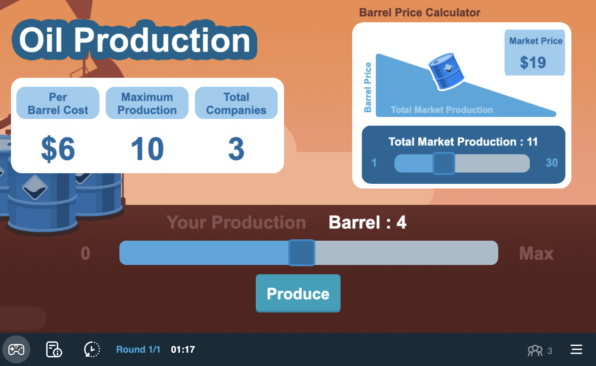
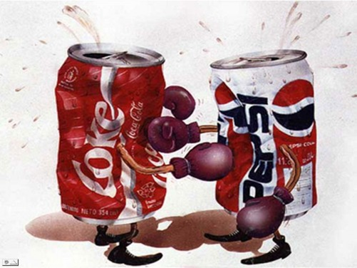

```{r setup, include=FALSE}
options(htmltools.dir.version = FALSE)
knitr::opts_chunk$set(echo=F,
                      message=F,
                      warning=F,
                      fig.retina = 3,
                      fig.align = "center")
library("tidyverse")
library("mosaic")
library("ggrepel")
library("fontawesome")
xaringanExtra::use_tile_view()
xaringanExtra::use_tachyons()
xaringanExtra::use_freezeframe()

update_geom_defaults("label", list(family = "Fira Sans Condensed"))
update_geom_defaults("text", list(family = "Fira Sans Condensed"))

set.seed(256)
```


class: title-slide

# 2.2 — Cournot Competition

## ECON 326 • Industrial Organization • Spring 2023

### Ryan Safner<br> Associate Professor of Economics <br> <a href="mailto:safner@hood.edu"><i class="fa fa-paper-plane fa-fw"></i>safner@hood.edu</a> <br> <a href="https://github.com/ryansafner/ioS23"><i class="fa fa-github fa-fw"></i>ryansafner/ioS23</a><br> <a href="https://ioS23.classes.ryansafner.com"> <i class="fa fa-globe fa-fw"></i>ioS23.classes.ryansafner.com</a><br>

---

# Models of Oligopoly

.pull-left[
Three canonical models of Oligopoly

1. .hi[Bertrand competition]
  - Firms **simultaneously** compete on **price**
2. .hi[Cournot competition]
  - Firms **simultaneously** compete on **quantity**
3. .hi[Stackelberg competition]
  - Firms **sequentially** compete on **quantity**

]

.pull-right[
.center[

]
]

---

# Cournot Competition on Moblab

.center[

]

---

# Cournot Competition on Moblab

.pull-left[
- Each of you is a firm selling identical scooters
- Each season, each firm chooses its quantity to produce
- You pay a cost for each you produce (identical across all firms)
- Market price depends on *total* industry output
    - More total output $\implies$ lower market price
    - Market price is revealed after all firms have chosen their output
]

.pull-right[
.center[

]
]

---

# Cournot Competition on Moblab

.pull-left[
- We will play 4 times:
    1. You are the only firm (monopoly)
    2. You will be matched with another firm (duopoly)
    3. You will be matched with 2 other firms (triopoly)
    4. The entire class is competing in the same market 
- Each instance will have 3 rounds 
]

.pull-right[
.center[

]
]

---

class: inverse, center, middle

# Cournot's Model

---

# Cournot

.left-column[
.center[


.smaller[
Antoine Augustin Cournot

1801-1877
]
]
]

.right-column[
.smallest[
- 1838 *Researches on the Mathematical Principles of the Theory of Wealth*

- First writer to:
  - ✅ use and advocate mathematics for study of political economy
  - ✅ relate demand and supply as functions of price and quantity
  - ✅ draw a demand and supply graph
  - ✅ use marginal analysis to find profit-maximizing output: where marginal revenue $=$ marginal cost

- Sadly, no influence in his lifetime, but enormous consequence on neoclassical economics

]

.source[Cournot, Antoine Augustin, 1838, *Researches on the Mathematical Principles of the Theory of Wealth*]

]

---
# Cournot's Model

.left-column[
.center[


.smaller[
Antoine Augustin Cournot

1801-1877
]
]
]
.right-column[
- Chapter V “Of Monopoly”, studies a monopoly supplier of mineral water who prices to maximize profit
  - $MR = MC$
]

---

# Cournot's Model

.left-column[
.center[


.smaller[
Antoine Augustin Cournot

1801-1877
]
]
]
.right-column[
.smallest[
> “Let us now imagine two proprietors and two springs of which qualities are identical and which on account of their similar positions supply the same market in competition.”

> “In this case the price is necessarily the same for each proprietor.”

> “If $p$ is the price, $D=F(p)$ the total sales, $D_1$ the sales from the spring (1), and $D_2$ the sales from the spring (2), then $D_1+D_2=D$.”

]

- Chapter VII “Of Competition of Producers”
]


---

# Cournot's Model

.left-column[
.center[


.smaller[
Antoine Augustin Cournot

1801-1877
]
]
]
.right-column[
.smallest[

> “If, to begin with, we neglect the cost of production, the respective incomes of the proprietors will be $pD_1$ and $pD_2$ and...each of them independently will seek to make this income as large as possible.”

> “[But] [p]roprietor (1) can have no direct influence on the determination of $D_2$.”

> “All that he can do when $D_2$ has been determined by proprietor (2) is to choose for $D_1$ the value which is best for him. This he will be able to accomplish by properly adjusting his price...except as proprietor (2), who seeing himself forced to accept his price and this value of $D_2$, may adopt a new value for $D_2$ more favorable ot his interests than the preceding one.”

]

- Chapter VII “Of Competition of Producers”
]

---

# Cournot Competition

.left-column[
.center[


.smaller[
Antoine Augustin Cournot

1801-1877
]
]
]
.right-column[

- We use modern game theory and Nash equilibrium to make Cournot’s model a **static game** (for now)

- .hi[“Cournot competition”]: two (or more) firms compete on **quantity** to sell the **same good**

- Firms set their quantities **simultaneously**

- Firms' joint output determines the market price faced by all firms
]

---

# Cournot Competition: Mechanics

.pull-left[

- Suppose two firms (.red[1] and .blue[2]), each have an identical constant cost $$MC(q)=AC(q)=c$$

- .red[Firm 1] and .blue[Firm 2] simultaneously set quantities, $\color{red}{q_1}$ and $\color{blue}{q_2}$

- Total market demand is given by

$$\begin{align*}
P&=a-bQ\\
Q&=\color{red}{q_1}+\color{blue}{q_2}\\
\end{align*}$$
]

.pull-right[
.center[

]
]

---

# Cournot Competition: Mechanics

.pull-left[

- .red[Firm 1's] profit is given by:

$$\begin{align*}
\color{red}{\pi_1}&=\color{red}{q_1}(P-c)\\
\color{red}{\pi_1}&=\color{red}{q_1}(a-b(\color{red}{q_1}+\color{blue}{q_2})-c)\\
\end{align*}$$

- And, symmetrically same for .blue[firm 2]

- **Note each firm's profits depend (in part) on the output of the other firm!** 
]

.pull-right[
.center[

]
]

---

# Residual Demand

- Consider the demand each firm faces to be a .hi-purple[residual demand]

--

- e.g. for .red[firm 1], it's (residual) demand is:

--

$$\begin{align*}
p&=a-b(\color{red}{q_1}+\color{blue}{q_2})\\
p&=\underbrace{(a-b\color{blue}{q_2})}_{intercept}-\underbrace{b}_{slope}\color{red}{q_1}\\
\end{align*}$$

--

- .blue[Firm 2] will produce some amount, $\color{blue}{q_2}$. 

--

- .red[Firm 1] takes this as given, to find its own residual demand
  - Intercept: $a-b\color{blue}{q_2}$
  - Slope: $b$ (coefficient in front of $\color{red}{q_1})$

---

# Residual Demand

.pull-left[
```{r}
Demand_fake<-function(x){10-x}
Demand_residual<-function(x){8-x}

ggplot(tibble(x=c(0,10)), aes(x=x))+
  stat_function(fun=Demand_fake, geom="line", size=2, color="blue")+
    stat_function(fun=Demand_residual, geom="line", size=2, color="darkblue", linetype = "dashed")+
  annotate(geom = "label", x = 9, y = Demand_fake(9) , label = "Market Demand",color = "blue", size = 4) +
    annotate(geom = "label", x = 5, y = Demand_residual(5) , label = "Demand for Firm 1",color = "darkblue", size = 4) +

  annotate("segment", x = 5, xend = 3, y = 5, yend = 5, color = "purple", size=2, alpha=0.9, arrow=arrow(length=unit(0.5,"cm"), ends="last", type="closed"))+
    annotate(geom = "label", x = 4, y =5 , label = expression(q[2]), color = "purple", size = 4)+ 

  scale_x_continuous(breaks = NULL,
                     limits = c(0,10),
                     expand=c(0,0))+
  scale_y_continuous(breaks = c(0,8,10),
                     labels = c(0,expression(a-(b*q[2])), expression(a)),
                     limits = c(0,10),
                     expand=c(0,0))+
  theme_classic(base_family = "Fira Sans Condensed", base_size=20)+
  labs(x = expression(paste("Firm 1's quantity, ", q[1])),
       y = expression("Market Price, p"))
```

]

.pull-right[
- .blue[Firm 2] will produce some amount, $\color{blue}{q_2}$. 

- .red[Firm 1] will take this as a given, a constant

- .red[Firm 1]'s choice variable is $\color{red}{q_1}$, *given* $\color{blue}{q_2}$
]

---

# Cournot Competition: Example

.content-box-green[
.hi-green[Example]: Assume Coke $(c)$ and Pepsi $(p)$ are the only two cola producers, each with a constant MC=AC=$0.50. The market (inverse) demand curve is given by:
$$\begin{align*}
P&=5-0.05Q\\
Q&=q_{c}+q_{p}\\
\end{align*}$$

]

--

$$P=5-0.05Q$$

--

$$P=5-0.05q_{c}-0.05q_{p}$$

---

# Cournot Competition: Example 

$$P=5-0.05q_{c}-0.05q_{p}$$

--

- Firms maximize profit (as always), by setting $q^*: MR(q)=MC(q)$

---

# Cournot Competition: Example 

$$P=\underbrace{5-0.05q_{p}}_{intercept}-\underbrace{0.05}_{slope}q_{c}$$

- Firms maximize profit (as always), by setting $q^*: MR(q)=MC(q)$

- Solve for Coke’s MR(q) first:
  - Take $q_{p}$ as given, a constant
  - Recall MR is twice the slope of demand
  
--

$$MR_{c}=5-0.05q_{p}-0.10q_{c}$$

---

# Cournot Competition: Example 

- Solve for $q^*$ for each firm (where $MR(q)=MC(q))$, we derive each firm's .hi[reaction function] or .hi[best response function] to the other firm's output

- Symmetric marginal costs and marginal revenues

--

$$\begin{align*}
q_{c}^*&=45-0.5q_{p}\\
q_{p}^*&=45-0.5q_{c}\\
\end{align*}$$

---

# Coke's Reaction Curve

.pull-left[
```{r}
library(ggtext)
Coke=function(x){45-0.5*x}

coke<-ggplot(tibble(x=c(0,10)), aes(x=x))+
  stat_function(fun=Coke, geom="line", size=2, color="red")+
    annotate(geom = "label", x = 65, y = Coke(65) , label = "Coke's RF",color = "red", size = 4) +
  scale_x_continuous(breaks = seq(0,100,10),
                     limits = c(0,100),
                     expand=c(0,0))+
  scale_y_continuous(breaks = seq(0,100,10),
                     limits = c(0,100),
                     expand=c(0,0))+
  theme_light(base_family = "Fira Sans Condensed", base_size=20)+
  labs(x = "<span style = 'color:blue'>Pepsi's Output, q<sub>p</sub></span>",
       y = "<span style = 'color:red'>Coke's Output, q<sub>p</sub></span>")+
  theme(axis.title.x = element_markdown(),
        axis.title.y = element_markdown())
coke
```
]

.pull-right[

We can graph .hi-red[Coke]'s .hi-purple[reaction curve] to .hi-blue[Pepsi]'s output

]

---

# Coke's Reaction Curve

.pull-left[
```{r}
coke+
  geom_segment(x=40,xend=40,y=0,yend=Coke(40), size=1, linetype="dotted", color="blue")+
  geom_segment(x=0,xend=40,y=Coke(40),yend=Coke(40), size=1, linetype="dotted", color="red")

```
]

.pull-right[

We can graph .hi-red[Coke]'s .hi-purple[reaction curve] to .hi-blue[Pepsi]'s output

- e.g. if .hi-blue[Pepsi] produces .hi-blue[40], .hi-red[Coke]'s best response is .hi-red[25]

]

---

# Coke's Reaction Curve

.pull-left[
```{r}
coke+
  geom_segment(x=40,xend=40,y=0,yend=Coke(40), size=1, linetype="dotted", color="blue")+
  geom_segment(x=0,xend=40,y=Coke(40),yend=Coke(40), size=1, linetype="dotted", color="red")+
  geom_segment(x=20,xend=20,y=0,yend=Coke(20), size=1, linetype="dotted", color="blue")+
  geom_segment(x=0,xend=20,y=Coke(20),yend=Coke(20), size=1, linetype="dotted", color="red")

```
]

.pull-right[

We can graph .hi-red[Coke]'s .hi-purple[reaction curve] to .hi-blue[Pepsi]'s output

- e.g. if .hi-blue[Pepsi] produces .hi-blue[40], .hi-red[Coke]'s best response is .hi-red[25]
- e.g. if .hi-blue[Pepsi] produces .hi-blue[20], .hi-red[Coke]'s best response is .hi-red[35]

]

---

# Pepsi's Reaction Curve

.pull-left[
```{r}
Pepsi=function(x){90-2*x}

pepsi<-ggplot(tibble(x=c(0,10)), aes(x=x))+
  stat_function(fun=Pepsi, geom="line", size=2, color="blue")+
    annotate(geom = "label", x = 15, y = Pepsi(15) , label = "Pepsi's RF",color = "blue", size = 4) +
  scale_x_continuous(breaks = seq(0,100,10),
                     limits = c(0,100),
                     expand=c(0,0))+
  scale_y_continuous(breaks = seq(0,100,10),
                     limits = c(0,100),
                     expand=c(0,0))+
  theme_light(base_family = "Fira Sans Condensed", base_size=20)+
  labs(x = "<span style = 'color:blue'>Pepsi's Output, q<sub>p</sub></span>",
       y = "<span style = 'color:red'>Coke's Output, q<sub>p</sub></span>")+
  theme(axis.title.x = element_markdown(),
        axis.title.y = element_markdown())
pepsi
```
]

.pull-right[

We can graph .hi-blue[Pepsi]'s .hi-purple[reaction curve] to .hi-red[Coke]'s output

]

---

# Pepsi's Reaction Curve

.pull-left[
```{r}
pepsi+
  geom_segment(x=25,xend=25,y=0,yend=40, size=1, linetype="dotted", color="blue")+
  geom_segment(x=0,xend=25,y=40,yend=40, size=1, linetype="dotted", color="red")

```
]

.pull-right[

We can graph .hi-blue[Pepsi]'s .hi-purple[reaction curve] to .hi-red[Coke]'s output

- e.g. if .hi-red[Coke] produces .hi-red[40], .hi-blue[Pepsi]'s best response is .hi-blue[25]

]

---

# Pepsi's Reaction Curve

.pull-left[
```{r}
pepsi+
  geom_segment(x=25,xend=25,y=0,yend=40, size=1, linetype="dotted", color="blue")+
  geom_segment(x=0,xend=25,y=40,yend=40, size=1, linetype="dotted", color="red")+
  geom_segment(x=35,xend=35,y=0,yend=20, size=1, linetype="dotted", color="blue")+
  geom_segment(x=0,xend=35,y=20,yend=20, size=1, linetype="dotted", color="red")

```
]

.pull-right[

We can graph .hi-blue[Pepsi]'s .hi-purple[reaction curve] to .hi-red[Coke]'s output

- e.g. if .hi-red[Coke] produces .hi-red[40], .hi-blue[Pepsi]'s best response is .hi-blue[25]
- e.g. if .hi-red[Coke] produces .hi-red[20], .hi-blue[Pepsi]'s best response is .hi-blue[35]

]

---

# Cournot-Nash Equilibrium, Graphically

.pull-left[
```{r}
coke+
  stat_function(fun=Pepsi, geom="line", size=2, color="blue")+
    annotate(geom = "label", x = 15, y = Pepsi(15) , label = "Pepsi's RF",color = "blue", size = 4) +
  geom_segment(x=30,xend=30,y=0,yend=30, size=1, linetype="dotted", color="blue")+
  geom_segment(x=0,xend=30,y=30,yend=30, size=1, linetype="dotted", color="red")+
  geom_point(x=30,y=30,size=5,color="purple")+
  annotate(geom = "label", x = 40, y = 40 , label = "Cournot-Nash Equilibrium",color = "purple", size = 5)
```
]

.pull-right[

Combine both curves on the same graph

- .hi-purple[Cournot-Nash Equilibrium]: $$\big( \color{red}{30}, \color{blue}{30} \big)$$
    - Where both reaction curves intersect

- Both are playing mutual best response to one another 

]

---

# Cournot-Nash Equilibrium, Algebraically

- .hi-purple[Cournot-Nash Equilibrium] algebraically: plug one firm's reaction function into the other's

--

$$\begin{align*}
q_{c}^*&=30-0.5q_{p}\\
q_{p}^*&=30-0.5q_{c}\\
\end{align*}$$

--

- The market demand again was

$$P=5-0.05q_{c}-0.05q_{p}$$

---

# Cournot-Nash Equilibrium, Algebraically

- Both firms produce 30

--

$$\begin{align*}
P&=5-0.05(30+30)\\
P&=\$2.00\\
\end{align*}$$

--

- Find profit for each firm:

--

$$\begin{align*}
\pi_{c}&=q_{c}(P-c)\\
\pi_{c}&=30(2.00-0.50)\\
\pi_{c}&=45\\
\end{align*}$$

- Symmetrically for Pepsi, $\pi_{p}=45$

---

# Cournot-Nash Equilibrium, The Market

```{r}
Demand_market<-function(x){5-0.05*x}
MR_market<-function(x){5-0.10*x}
MC_market<-function(x){0.50}

CS_1<-tribble(
  ~x, ~y,
  0, 2,
  0, 5,
  60, 2
)

DWL_1<-tribble(
  ~x, ~y,
  60, 2,
  60, 0.5,
  90, 0.5
)

ggplot(tibble(x=c(0,10)), aes(x=x))+
  geom_polygon(data=CS_1, aes(x=x,y=y), fill="blue",alpha=0.5)+ #cs
  geom_rect(xmin=0, xmax=60, ymin=0.5, ymax=2, fill="green", alpha=0.5)+ # pi
  geom_polygon(data=DWL_1, aes(x=x,y=y), fill="black",alpha=0.5)+ #dwl
  stat_function(fun=Demand_market, geom="line", size=2, color="blue")+
  annotate(geom = "label", x = 50, y = Demand_market(50) , label = "Market Demand",color = "blue", size = 4) +

      stat_function(fun=MC_market, geom="line", size=2, color="red")+
  annotate(geom = "label", x = 70, y = MC_market(70) , label = "MC(q)=AC(q)",color = "red", size = 4) +

  geom_segment(x=60,xend=60,y=0,yend=2,linetype="dotted", size =1)+
  geom_segment(x=0,xend=60,y=2,yend=2,linetype="dotted", size =1)+

    geom_point(x=60,y=2,size=5,color="purple")+
  annotate(geom = "label", x = 75, y = 2 , label = "Cournot-Nash Equilibrium",color = "purple", size = 4)+
  
  scale_x_continuous(breaks = seq(0,100,10),
                     limits = c(0,100),
                     expand=c(0,0))+
  scale_y_continuous(breaks = seq(0,5,1),
                     labels = scales::dollar,
                     limits = c(0,5),
                     expand=c(0,0))+
  theme_classic(base_family = "Fira Sans Condensed", base_size=20)+
  labs(x = "Industry Output, Q",
       y = "Market Price, p",
       title = "Cola Industry")
```

---

# Cournot Collusion

- Suppose now both firms .hi-purple[collude] to act like a monopolist, who sets the entire market:

$$\begin{align*}
MR&=MC\\
5-0.1Q&=0.50\\
45&=Q^*\\
\end{align*}$$

--

- The monopoly price will then be:

$$\begin{align*}
P&=5-0.05(45)\\
P&=\$2.75\\
\end{align*}$$

--

- Total profit will then be:

$$\Pi=45(\$2.75-\$0.50)=\$101.25$$

with $50.625 going to each firm

---

# Cournot Collusion, The Market

```{r}
CS_2<-tribble(
  ~x, ~y,
  0, 2.75,
  0, 5,
  45, 2.75
)

DWL_2<-tribble(
  ~x, ~y,
  45, 0.5,
  45, 2.75,
  90, 0.5
)

ggplot(tibble(x=c(0,10)), aes(x=x))+
  geom_polygon(data=CS_2, aes(x=x,y=y), fill="blue",alpha=0.5)+ #cs
  geom_rect(xmin=0, xmax=45, ymin=0.5, ymax=2.75, fill="green", alpha=0.5)+ # pi
  geom_polygon(data=DWL_2, aes(x=x,y=y), fill="black",alpha=0.5)+ #dwl
  stat_function(fun=Demand_market, geom="line", size=2, color="blue")+
    stat_function(fun=MR_market, geom="line", size=2, color="purple")+
  annotate(geom = "label", x = 70, y = Demand_market(70) , label = "Market Demand",color = "blue", size = 4) +
    annotate(geom = "label", x = 35, y = MR_market(35) , label = "MR(q)",color = "purple", size = 4) +
  
      stat_function(fun=MC_market, geom="line", size=2, color="red")+
  annotate(geom = "label", x = 70, y = MC_market(70) , label = "MC(q)=AC(q)",color = "red", size = 4) +

  geom_segment(x=60,xend=60,y=0,yend=2,linetype="dotted", size =1)+
  geom_segment(x=0,xend=60,y=2,yend=2,linetype="dotted", size =1)+

    geom_point(x=60,y=2,size=5,color="purple")+
  annotate(geom = "label", x = 80, y = 2 , label = "Cournot-Nash Equilibrium",color = "purple", size = 4)+
  annotate(geom = "label", x = 60, y = 2.75 , label = "Collusion/Monopoly",color = "orange", size = 4)+
  geom_segment(x=45,xend=45,y=0,yend=2.75,linetype="dotted", size =1)+
  geom_segment(x=0,xend=45,y=2.75,yend=2.75,linetype="dotted", size =1)+
    geom_point(x=45,y=2.75,size=5,color="orange")+
  scale_x_continuous(breaks = seq(0,100,10),
                     limits = c(0,100),
                     expand=c(0,0))+
  scale_y_continuous(breaks = seq(0,5,1),
                     labels = scales::dollar,
                     limits = c(0,5),
                     expand=c(0,0))+
  theme_classic(base_family = "Fira Sans Condensed", base_size=20)+
  labs(x = "Industry Output, Q",
       y = "Market Price, p",
       title = "Cola Industry")
```

---

# Cournot Collusion

.pull-left[
```{r}
coke+
  stat_function(fun=Pepsi, geom="line", size=2, color="blue")+
    annotate(geom = "label", x = 15, y = Pepsi(15) , label = "Pepsi",color = "blue", size = 4) +
  geom_segment(x=30,xend=30,y=0,yend=30, size=1, linetype="dotted", color="blue")+
  geom_segment(x=0,xend=30,y=30,yend=30, size=1, linetype="dotted", color="red")+
  geom_point(x=30,y=30,size=5,color="purple")+
  annotate(geom = "label", x = 40, y = 40 , label = "Cournot-Nash Equilibrium",color = "purple", size = 5)+
  geom_point(x=22.5,y=22.5,size=5,color="orange")+
  annotate(geom = "label", x = 15, y = 15 , label = "Collusion",color = "orange", size = 5)+
    geom_segment(x=22.5,xend=22.5,y=0,yend=22.5, size=1, linetype="dotted", color="orange")+
  geom_segment(x=0,xend=22.5,y=22.5,yend=22.5, size=1, linetype="dotted", color="orange")+
  geom_segment(x = 0, xend = 45, y = 45, yend = 0, size = 1, linetype = "dashed")


```
]

.pull-right[

- .hi-purple[Cournot Competition]: each firm produces 30 and earns $45.00

- .hi-orange[Collusion/Monopoly]: each firm produces 22.5 and earns $50.63

]

---

# Cournot Collusion: Stability

.pull-left[
```{r}
coke+
  stat_function(fun=Pepsi, geom="line", size=2, color="blue")+
    annotate(geom = "label", x = 15, y = Pepsi(15) , label = "Pepsi",color = "blue", size = 4) +
  geom_segment(x=30,xend=30,y=0,yend=30, size=1, linetype="dotted", color="blue")+
  geom_segment(x=0,xend=30,y=30,yend=30, size=1, linetype="dotted", color="red")+
  geom_point(x=30,y=30,size=5,color="purple")+
  annotate(geom = "label", x = 40, y = 40 , label = "Cournot-Nash Equilibrium",color = "purple", size = 5)+
  geom_point(x=22.5,y=22.5,size=5,color="orange")+
  annotate(geom = "label", x = 15, y = 15 , label = "Collusion",color = "orange", size = 5)+
    geom_segment(x=22.5,xend=22.5,y=0,yend=22.5, size=1, linetype="dotted", color="orange")+
  geom_segment(x=0,xend=22.5,y=22.5,yend=22.5, size=1, linetype="dotted", color="orange")+
  geom_segment(x = 0, xend = 45, y = 45, yend = 0, size = 1, linetype = "dashed")


```
]

.pull-right[

- .hi-purple[Cournot Competition]: each firm produces 30 and earns $45.00

- .hi-orange[Collusion/Monopoly]: each firm produces 22.5 and earns $50.63 

- .hi-turquoise[But is collusion a Nash equilibrium?]
]

---

# Cournot Collusion: Stability

.pull-left[
```{r}
coke+
  geom_point(x=22.5,y=22.5,size=5,color="orange")+
  annotate(geom = "label", x = 15, y = 15 , label = "Collusion",color = "orange", size = 5)+
    geom_segment(x=22.5,xend=22.5,y=0,yend=Coke(22.5), size=1, linetype="dotted", color="blue")+
  geom_segment(x=0,xend=22.5,y=Coke(22.5),yend=Coke(22.5), size=1, linetype="dotted", color="red")+
  geom_point(x = 22.5, y = 33.75, color = "black", size = 3)
```
]

.pull-right[

- Read either firm's reaction curve at the collusive outcome

- Suppose .red[Coke] knows .blue[Pepsi] is producing .blue[22.5] (as per the cartel agreement)

- .red[Coke]'s best response to .blue[Pepsi]'s .blue[22.5] is to produce .red[33.75]

]

---

# Cournot Collusion: Stability

- This (cheating the agreement) would bring market price to
$$\begin{align*}
P&=5-0.05(\color{red}{q_{c}}+\color{blue}{q_{p}})\\
P&=5-0.05*(\color{red}{33.75}+\color{blue}{22.50})\\
P&=5-0.05*(56.25)\\
P&=\$2.1875\\
\end{align*}$$

--

.pull-left[
- .red[Coke]'s profit would be:

$$\begin{align*}
\pi_{c}&=\color{red}{q_{c}}(P-c)\\
\pi_{c}&=\color{red}{33.75}(2.1875-0.50)\\
\pi_{c}&=\$56.95\\
\end{align*}$$

]

--

.pull-right[
- .blue[Pepsi]'s profit would be:

$$\begin{align*}
\pi_{p}&=\color{blue}{q_{p}}(P-c)\\
\pi_{p}&=\color{blue}{22.5}(2.1875-0.50)\\
\pi_{p}&=\$37.97\\
\end{align*}$$

]

---

# Cournot Collusion (One Firm Cheating), The Market

```{r}
CS_cheat<-tribble(
  ~x, ~y,
  0, 2.18,
  0, 5,
  56.25, 2.18
)

DWL_cheat<-tribble(
  ~x, ~y,
  56.25, 0.5,
  56.25, 2.18,
  90, 0.5
)

points_cheat <- tribble(
  ~x, ~y, ~color, ~lab,
  60, 2, "purple", "Cournot-Nash Equilibrium",
  45, 2.75, "orange", "Collusion",
  56.25, 2.18, "brown", "Cheating"
  )

ggplot(tibble(x=c(0,10)), aes(x=x))+
  geom_polygon(data=CS_cheat, aes(x=x,y=y), fill="blue",alpha=0.5)+ #cs
  geom_rect(xmin=0, xmax=56.25, ymin=0.5, ymax=2.18, fill="green", alpha=0.5)+ # pi
  geom_polygon(data=DWL_cheat, aes(x=x,y=y), fill="black",alpha=0.5)+ #dwl
  stat_function(fun=Demand_market, geom="line", size=2, color="blue")+
    stat_function(fun=MR_market, geom="line", size=2, color="purple")+
  annotate(geom = "label", x = 70, y = Demand_market(70) , label = "Market Demand",color = "blue", size = 4) +
    annotate(geom = "label", x = 35, y = MR_market(35) , label = "MR(q)",color = "purple", size = 4) +
  
      stat_function(fun=MC_market, geom="line", size=2, color="red")+
  annotate(geom = "label", x = 70, y = MC_market(70) , label = "MC(q)=AC(q)",color = "red", size = 4) +

  geom_segment(x=60,xend=60,y=0,yend=2,linetype="dotted", size =1)+
  geom_segment(x=0,xend=60,y=2,yend=2,linetype="dotted", size =1)+

  geom_segment(x=45,xend=45,y=0,yend=2.75,linetype="dotted", size =1)+
  geom_segment(x=0,xend=45,y=2.75,yend=2.75,linetype="dotted", size =1)+
  geom_segment(x=56.25,xend=56.25,y=0,yend=2.18,linetype="dotted", size =1)+
  geom_segment(x=0,xend=56.25,y=2.18,yend=2.18,linetype="dotted", size =1)+
  
  geom_point(data = points_cheat, aes(x = x, y = y, color = color), size = 3)+
  geom_text_repel(data = points_cheat, aes(x = x, y = y, label = lab, color = color), size = 4, box.padding = 0.5, nudge_y = 0.5)+
  guides(color = FALSE)+
  scale_color_manual(values = c("purple"= "purple", "orange" = "orange", "brown" = "brown"))+
  scale_x_continuous(breaks = seq(0,100,10),
                     limits = c(0,100),
                     expand=c(0,0))+
  scale_y_continuous(breaks = seq(0,5,1),
                     labels = scales::dollar,
                     limits = c(0,5),
                     expand=c(0,0))+
  theme_classic(base_family = "Fira Sans Condensed", base_size=20)+
  labs(x = "Industry Output, Q",
       y = "Market Price, p",
       title = "Cola Industry")
```

---

# Cournot Competition, You Try

.content-box-green[.hi-green[Example]:
Suppose Firm 1 and Firm 2 have a constant $MC=AC=8$. The market (inverse) demand curve is given by:

$$\begin{align*}
P&=200-2Q\\
Q&=q_1+q_2\\
\end{align*}$$
]

1. Find the Cournot-Nash equilibrium output and profit for each firm.

2. Find the output and profit for each firm if the two were to collude.

---

# Cournot Equilibrium, In General

.pull-left[
.smallest[
- Linear (inverse) demand curve: $P = a-bQ \quad (Q=q_1+q_2)$
- Constant costs $C(q)=c$

.pull-left[
- .hi-turquoise[Cournot competition]:
  - $q_1^* = q_2^* = \frac{a-c}{3b}$
  - $Q= 2 \left(\frac{a-c}{3b}\right)$
  - $P= \frac{a+2c}{3}$
  - $\pi_1 = \pi_2 = \frac{(a-c)^2}{9b}$
]

.pull-right[
- .hi-purple[Monopoly (collusion)]
  - $Q= \frac{a-c}{2b}$
  - $P = \frac{a+c}{2}$
  - $\Pi = \frac{(a-c)^2}{4b}$
]
]
]

.pull-right[
```{r}
Demand<-function(x){10-x}
MR<-function(x){10-2*x}

points_compare <- tribble(
  ~x, ~y, ~lab, ~color,
  6, 4, "Perfect competition", "green",
  4, 6, "Cournot", "purple",
  3, 7, "Monopoly", "brown"
)

ggplot(tibble(x=c(0,10)), aes(x=x))+
  stat_function(fun=Demand, geom="line", size=2, color="blue")+
    annotate(geom = "label", x = 9, y = Demand_c(9) , label = "Industry Demand",color = "blue", size = 4) +
  stat_function(fun=MR, geom="line", size=2, color="purple")+
    annotate(geom = "label", x = 4.5, y = MR_c(4.5) , label = "MR(q)",color = "purple", size = 4) +
  geom_hline(yintercept = 4, size = 1, color = "red")+
    annotate(geom = "label", x = 5, y = 4 , label = "MC(q)",color = "red", size = 4) +
  geom_segment(x = 0, xend = 3, y = 7, yend = 7, size = 1, linetype = "dotted")+
  geom_segment(x = 3, xend = 3, y = 7, yend = 0, size = 1, linetype = "dotted")+
  geom_segment(x = 0, xend = 4, y = 6, yend = 6, size = 1, linetype = "dotted")+
  geom_segment(x = 4, xend = 4, y = 6, yend = 0, size = 1, linetype = "dotted")+
  geom_segment(x = 6, xend = 6, y = 4, yend = 0, size = 1, linetype = "dotted")+
  
  geom_point(data = points_compare, aes(x = x, y = y, color = color), size = 5)+
  geom_text_repel(data = points_compare, aes(x = x, y = y, label = lab, color = color), size = 4, box.padding = 0.5, nudge_y = 0.5)+
  
  guides(color = FALSE)+
  scale_color_manual(values = c("purple"= "purple", "green" = "green", "brown" = "brown"))+
  scale_x_continuous(breaks = c(3,4,5,6,10),
                     labels = c(expression(frac(a-c,2*b)),expression(frac(2*(a-c),3*b)),
                                expression(frac(a,2*b)), expression(frac(a-c,b)),expression(frac(a,b))),
                     limits = c(0,10),
                     expand=c(0,0))+
  scale_y_continuous(breaks = c(0,4,6,7,10),
                     labels = c(0,"c", expression(frac(a+2*c,3)),expression(frac(a+c,2)),"a"),
                     limits = c(0,10),
                     expand=c(0,0))+
  theme_classic(base_family = "Fira Sans Condensed", base_size=12)+
  labs(x = "Industry output, Q",
       y = "Market Price, p")
```

]

---

# Comparative Statics

.pull-left[
- What if we relax some assumptions about the model?
  - Same technology (same costs)
  - Two firms only
  - No fixed costs
]

.pull-right[
.center[

]
]

---

# Comparative Statics: Decrease in MC

.pull-left[
- Suppose Coke's marginal cost decreases (such that $MC_c < MC_p$)

- Profit maximization requires $MC_c = MR_c$, so it will produce more (at $q_c^2$)
]

.pull-right[
```{r}
Demand_c<-function(x){10-x}
MR_c<-function(x){10-2*x}

ggplot(tibble(x=c(0,10)), aes(x=x))+
  stat_function(fun=Demand_c, geom="line", size=2, color="blue")+
    annotate(geom = "label", x = 9, y = Demand_c(9) , label = "Residual Demand \n for Coke",color = "blue", size = 4) +
  stat_function(fun=MR_c, geom="line", size=2, color="purple")+
    annotate(geom = "label", x = 4.5, y = MR_c(4.5) , label = "MR(q)",color = "purple", size = 4) +
  geom_hline(yintercept = 4, size = 1, color = "red")+
    annotate(geom = "label", x = 5, y = 4 , label = "MC(q)",color = "red", size = 4) +
  geom_hline(yintercept = 2, size = 1, color = "darkred")+
    annotate(geom = "label", x = 5, y = 2 , label = "MC(q)'",color = "darkred", size = 4) +
    annotate("segment", x = 8, xend = 8, y = 3.75, yend = 2.25, color = "purple", size=2, alpha=0.9, arrow=arrow(length=unit(0.5,"cm"), ends="last", type="closed"))+
    annotate("segment", x = 3.2, xend = 3.8, y = 1.25, yend = 1.25, color = "purple", size=2, alpha=0.9, arrow=arrow(length=unit(0.5,"cm"), ends="last", type="closed"))+
  geom_segment(x = 3, xend = 3, y = 4, yend = 0, size = 1, linetype = "dotted")+
  geom_segment(x = 4, xend = 4, y = 2, yend = 0, size = 1, linetype = "dotted")+
  scale_x_continuous(breaks = c(3,4),
                     labels = c(expression(q[c]^1), expression(q[c]^2)),
                     limits = c(0,10),
                     expand=c(0,0))+
  scale_y_continuous(breaks = c(0,2,4,10),
                     labels = c(0,expression(c[2]),expression(c[1]),expression(paste("P(0,",q[c],")"))),
                     limits = c(0,10),
                     expand=c(0,0))+
  theme_classic(base_family = "Fira Sans Condensed", base_size=20)+
  labs(x = expression(paste("Coke's output, ", q[c])),
       y = expression("Market Price, p"))
```
]

---

# Comparative Statics: Increase in MR

.pull-left[
- Or equivalently, suppose Coke's marginal revenue increases (such that $MR_c > MR_p$)
  
- Profit maximization requires $MC_c = MR_c$, so it will produce more (at $q_c^2$)
]

.pull-right[
```{r}
Demand_c<-function(x){10-x}
MR_c<-function(x){10-2*x}
Demand_c2<-function(x){12-x}
MR_c2<-function(x){12-2*x}

ggplot(tibble(x=c(0,10)), aes(x=x))+
  stat_function(fun=Demand_c, geom="line", size=2, color="blue", alpha= 0.5)+
    annotate(geom = "label", x = 9, y = Demand_c(9) , label = "Residual Demand",color = "blue", size = 4) +
  stat_function(fun=MR_c, geom="line", size=2, color="purple", alpha = 0.5)+
    annotate(geom = "label", x = 4.5, y = MR_c(4.5) , label = "MR(q)",color = "purple", size = 4) +
  
  # new demand and MR
    stat_function(fun=Demand_c2, geom="line", size=2, color="blue")+
    annotate(geom = "label", x = 6, y = Demand_c2(6) , label = "Residual Demand new",color = "blue", size = 4) +
  stat_function(fun=MR_c2, geom="line", size=2, color="purple")+
    annotate(geom = "label", x = 3, y = MR_c2(3) , label = "MR(q) new",color = "purple", size = 4) +


  geom_hline(yintercept = 4, size = 1, color = "red")+
    annotate(geom = "label", x = 5, y = 4 , label = "MC(q)",color = "red", size = 4) +
    annotate("segment", x = 8, xend = 8, y = 3.75, yend = 2.25, color = "purple", size=2, alpha=0.9, arrow=arrow(length=unit(0.5,"cm"), ends="first", type="closed"))+
    annotate("segment", x = 3.2, xend = 3.8, y = 1.25, yend = 1.25, color = "purple", size=2, alpha=0.9, arrow=arrow(length=unit(0.5,"cm"), ends="last", type="closed"))+
  geom_segment(x = 3, xend = 3, y = 4, yend = 0, size = 1, linetype = "dotted")+
  geom_segment(x = 4, xend = 4, y = 4, yend = 0, size = 1, linetype = "dotted")+
  scale_x_continuous(breaks = c(3,4),
                     labels = c(expression(q[c]^1), expression(q[c]^2)),
                     limits = c(0,10),
                     expand=c(0,0))+
  scale_y_continuous(breaks = c(0,4,10),
                     labels = c(0,"c",expression(paste("P(0,",q[c],")"))),
                     limits = c(0,10),
                     expand=c(0,0))+
  theme_classic(base_family = "Fira Sans Condensed", base_size=20)+
  labs(x = expression(paste("Coke's output, ", q[c])),
       y = expression("Market Price, p"))
```
]

---

# Comparative Statics: Increase in MR

.pull-left[
.smallest[
- In either case, .hi-purple[Coke becomes more efficient than Pepsi] (lower cost/higher revenues)

- Coke will produce more output
  - A shift of its reaction function to the right

- Pepsi will produce less output as a response

- Overall industry output increases; price decreases

- Profits to Coke increase; profits to Pepsi decrease
]
]

.pull-right[
```{r}
Coke2=function(x){60-0.5*x}
coke+
  stat_function(fun=Coke2, geom="line", size=2, color="darkred")+
    annotate(geom = "label", x = 65, y = Coke2(65) , label = "Coke's RF New",color = "darkred", size = 4) +
  stat_function(fun=Pepsi, geom="line", size=2, color="blue")+
    annotate(geom = "label", x = 10, y = Pepsi(10) , label = "Pepsi's RF",color = "blue", size = 4) +
  geom_segment(x=30,xend=30,y=0,yend=30, size=1, linetype="dotted", color="blue")+
  geom_segment(x=0,xend=30,y=30,yend=30, size=1, linetype="dotted", color="red")+
  
  geom_segment(x=20,xend=20,y=0,yend=50, size=1, linetype="dotted", color="blue")+
  geom_segment(x=0,xend=20,y=50,yend=50, size=1, linetype="dotted", color="red")+

  #annotate("segment", x = 40, xend = 50, y = 30, yend = 30, color = "purple", size=2, alpha=0.9, arrow=arrow(length=unit(0.5,"cm"), ends="last", type="closed"))+
  
  annotate("segment", x = 28, xend = 22, y = 10, yend = 10, color = "purple", size=2, alpha=0.9, arrow=arrow(length=unit(0.5,"cm"), ends="last", type="closed"))+

  annotate("segment", x = 10, xend = 10, y = 32, yend = 48, color = "purple", size=2, alpha=0.9, arrow=arrow(length=unit(0.5,"cm"), ends="last", type="closed"))+

  geom_point(x=30,y=30,size=5,color="purple")+
  annotate(geom = "label", x = 30, y = 20 , label = "Eq.1",color = "purple", size = 5)+
  geom_point(x=20,y=50,size=5,color="purple")+
  annotate(geom = "label", x = 20, y = 60 , label = "Eq.2",color = "purple", size = 5)
```
]

---

# Cournot Competition: Asymmetric Firms

.center[

[Cournot Oligopoly with Asymmetric Costs](https://ryansafner.shinyapps.io/cournot_asymmetric_costs/)

]

---

# Cournot Competition: Asymmetric Firms

.pull-left[

- If a firm has lower costs/higher revenues than others, it earns greater profit

- Competing firms will want to:
  1. lower their own costs/raise revenues
  2. raise rivals' costs/lower their revenues

]

.pull-right[
.center[

]
]

---

class: inverse, center, middle

# Endogenizing the Number of Firms

---

# Cournot Competition with $N$ Firms

.pull-left[

- So far we've assumed the number of firms *exogenously*: two.

- But as in any market, profits will attract entry

- Let's make the number of firms *endogenous*, determined by the market conditions

]

.pull-right[

.center[

]
]

---

# Cournot Competition with $N$ Firms

.pull-left[

- For tractability, return to our strict assumptions:
  - identical technology, costs, revenues
  - firms selling perfect substitutes

]

.pull-right[
.center[

]
]

---

# Cournot Competition with $N$ Firms

.pull-left[

- Symmetrically, in equilibrium, each firm will be selling $\frac{1}{N}=s_i$ of industry output
  - $N$ number of firms in equilibrium
  - $s_i$ is .hi-purple[market share] of firm $i$: $\left(\frac{q_i}{Q}\right)$

- e.g. with 5 firms, each sells $\frac{1}{5}$ of $Q$, market share of 20% each

- Each firm earns profits $\pi_i(N)$
]

.pull-right[
.center[

]
]

---

# Cournot Competition with $N$ Firms

.pull-left[
- Algebraically, with identical technology, each firm's marginal revenue is 

$$MR_i = \underbrace{\left[a-b\sum^N_{j \neq i}q_j\right]}_{intercept}-2bq_i$$

- So in symmetric equilibrium, $MR_i=MC_i$ for each firm $i$:

$$a-b\sum^N_{j \neq i}q_j-2bq_i=c$$

]

.pull-right[
```{r}
Demand_fake<-function(x){10-x}
Demand_residual<-function(x){8-x}
MR_residual<-function(x){8-2*x}

ggplot(tibble(x=c(0,10)), aes(x=x))+
  stat_function(fun=Demand_fake, geom="line", size=2, color="darkblue")+
    stat_function(fun=Demand_residual, geom="line", size=2, color="blue", linetype = "dashed")+
  annotate(geom = "label", x = 9, y = Demand_fake(9) , label = "Market Demand",color = "darkblue", size = 4) +
    annotate(geom = "label", x = 5, y = Demand_residual(5) , label = "Residual Demand \n for Firm i",color = "blue", size = 4) +
    stat_function(fun=MR_residual, geom="line", size=2, color="purple", linetype = "dashed")+
    annotate(geom = "label", x = 2.5, y = MR_residual(2.5) , label = "MR for Firm i",color = "purple", size = 4) +
  annotate("segment", x = 5, xend = 3, y = 5, yend = 5, color = "black", size=2, alpha=0.9, arrow=arrow(length=unit(0.5,"cm"), ends="last", type="closed"))+
    annotate(geom = "label", x = 4, y =5 , label = expression(sum(q[j], j!=i, N)), color = "black", size = 4)+ 

  scale_x_continuous(breaks = NULL,
                     limits = c(0,10),
                     expand=c(0,0))+
  scale_y_continuous(breaks = c(0,8,10),
                     labels = c(0,expression(a-b*sum(q[j], j!=i, N)), expression(a)),
                     limits = c(0,10),
                     expand=c(0,0))+
  theme_classic(base_family = "Fira Sans Condensed", base_size=20)+
  labs(x = expression(paste("Firm i's quantity, ", q[i])),
       y = expression("Market Price, p"))
```
]

---

# Cournot Competition with $N$ Firms

.quitesmall[

- In equilibrium, each firm is maximizing profits $(MR_i=MC_i)$:

$$a-b\sum^N_{j \neq i}q_j-2bq_i=c$$
]

--

.quitesmall[
- Since each firm's equilibrium output $q_i, q_j, \cdots, q_N$ will be symmetric:

$$a-b(N-1)q^*-2bq^*=c$$
]

---

# Cournot Competition with $N$ Firms

.quitesmall[
$$a-b(N-1)q^*-2bq^*=c$$

- Solving  for $q^*$:

$$q^* = \frac{a-c}{(N+1)b}$$
]

--

.quitesmall[
- Total industry output $Q=Nq^*$, so:

$$Q^* = \frac{N(a-c)}{(N+1)b}$$
]

--

.quitesmall[
$$p^* = \frac{A+Nc}{N+1}$$
]

--

.quitesmall[
$$\pi_i = \left( \frac{a-c}{N+1} \right)^2 \left(\frac{1}{b}\right)$$
]

.source[See pp.243-244 of the textbook for algebraic derivations.]

---

# Cournot Competition with $N$ Firms

.quitesmall[
$$a-b(N-1)q^*-2bq^*=c$$

- Solving  for $q^*$:

$$q^* = \frac{a-c}{(\color{#e64173}{N}+1)b}$$

- Total industry output $Q=\color{#e64173}{N}q^*$, so:

$$Q^* = \frac{\color{#e64173}{N}(a-c)}{(\color{#e64173}{N+1})b}$$

$$p^* = \frac{A+\color{#e64173}{N}c}{\color{#e64173}{N+1}}$$

$$\pi_i = \left( \frac{a-c}{\color{#e64173}{N}+1} \right)^2 \left(\frac{1}{b}\right)$$
]


.smallest[
- Takeaways:
  - .hi[As the number of firms], $\color{#e64173}{N} \uparrow$: $\downarrow q_i$; $\uparrow Q$; $\downarrow p$; $\downarrow \pi_i$
  - .hi[We approach the perfectly competitive equilibrium!]

]

.source[See pp.243-244 of the textbook for algebraic derivations.]

---

# Cournot Competition with $N$ Firms

.pull-left[

- Each firm $i$’s output, symmetrically, will be such that:

$$\frac{p-MC}{p}=\frac{1}{\varepsilon N}$$
- Again, each firm’s market power is limited by the price elasticity of demand $(\varepsilon)$
  - A monopolist, $(N=1)$
  - As $N$ increases, markups & market power diminish
]

.pull-right[
.center[

]
]

---

# Cournot Equilibrium with $N$ Firms: Visualization

.center[

[Cournot Oligopoly with $N$ Firms](https://ryansafner.shinyapps.io/cournot_n_firms/)

]

---

# Free Entry Equilibrium

.pull-left[
- So far we've assumed no formal .hi[barriers to entry], so firms are free to enter and exit

- In Cournot equilibrium, how many firms will there be (i.e. what is $N)$?
]

.pull-right[
.center[

]
]
---

# Free-Entry Equilibrium

.pull-left[

- .hi[“Free entry equilibrium”]: equilibrium where no additional firms will enter (additional entry must not be profitable); **two conditions**
  1. .hi-purple[Nash equilibrium in quantities] $MR(q)=MC(q)$; each firm is profit-maximizing given the number of firms
  2. .hi-purple[Zero-profits]: At Cournot output and free-entry number of firms, firms in market earn no profits (no incentive for entry/exit on the margin)
      - $p=AC(q)$
]

.pull-right[
```{r}
Demand=function(x){10-x}
MR=function(x){10-2*x}
MC=function(x){4}
AC=function(x){4+(9.25/x)}

ggplot(data.frame(x=c(0,12)), aes(x=x))+
  stat_function(fun=MC, geom="line", color="red", size=2)+
  geom_label(x=4.5,y=MC(4.5), color = "red", label="MC(q) = AC(q)")+
  #stat_function(fun=AC, geom="line", color="orange", size=2)+
  #geom_label(x=4.5,y=AC(4.5), color = "orange", label="AC(q)")+
  stat_function(fun=Demand, geom="line", color="blue", size=2)+
  geom_label(x=4.5,y=Demand(4.5), color = "blue", label="Demand")+
  stat_function(fun=MR, geom="line", color="purple", size=2)+
  geom_label(x=4.5,y=MR(4.5), color = "purple", label="MR(q)")+
  geom_segment(x=3,y=0,xend=3,yend=Demand(3),linetype=3, size=1)+
  geom_segment(x=0,y=Demand(3),xend=3,yend=Demand(3), linetype=3, size=1)+
  labs(x = "Quantity (q)",
       y = "Price (p)")+
  scale_x_continuous(breaks=NULL,
                     limits=c(0,5),
                     expand=c(0,0))+
  scale_y_continuous(breaks=NULL,
                     limits=c(0,10),
                     expand=c(0,0))+
  theme_classic(base_family = "Fira Sans Condensed", base_size=18)
```
]


---

# Free-Entry Equilibrium (Constant Returns to Scale)

.pull-left[
.smaller[
- .hi[Constant returns to scale] leads to a problem!
  - $\color{red}{MC(q)}=\color{red}{AC(q)}$ are constant and equal

- Regardless of number of firms $N$, $\color{blue}{p^*}>\color{red}{AC}$ *always*!

- .hi-turquoise[Nothing limits the entry of firms!] (Not a satisfactory theory)
  - (Aside from a government-imposed barrier to entry), only as $N \rightarrow \color{#e64173}{\infty}$ do firms stop entering $(\pi=0)$
]
]
.pull-right[
```{r}
Demand=function(x){10-x}
MR=function(x){10-2*x}
MC=function(x){4}
AC=function(x){4+(9.25/x)}

ggplot(data.frame(x=c(0,12)), aes(x=x))+
  geom_rect(xmin = 0, xmax = 3, ymin = 4, ymax = Demand(3), fill = "green", alpha = 0.5)+
  stat_function(fun=MC, geom="line", color="red", size=2)+
  geom_label(x=4.5,y=MC(4.5), color = "red", label="MC(q) = AC(q)")+
  #stat_function(fun=AC, geom="line", color="orange", size=2)+
  #geom_label(x=4.5,y=AC(4.5), color = "orange", label="AC(q)")+
  stat_function(fun=Demand, geom="line", color="blue", size=2)+
  geom_label(x=4.5,y=Demand(4.5), color = "blue", label="Demand")+
  stat_function(fun=MR, geom="line", color="purple", size=2)+
  geom_label(x=4.5,y=MR(4.5), color = "purple", label="MR(q)")+
  geom_segment(x=3,y=0,xend=3,yend=Demand(3),linetype=3, size=1)+
  geom_segment(x=0,y=Demand(3),xend=3,yend=Demand(3), linetype=3, size=1)+
  labs(x = "Quantity (q)",
       y = "Price (p)")+
  scale_x_continuous(breaks=NULL,
                     limits=c(0,5),
                     expand=c(0,0))+
  scale_y_continuous(breaks=NULL,
                     limits=c(0,10),
                     expand=c(0,0))+
  theme_classic(base_family = "Fira Sans Condensed", base_size=18)
```
]

---

# Free-Entry Equilibrium with Economies of Scale

.pull-left[

- Consider instead a case with .hi[economies of scale] for each firm $i$
$$C_i(q_i)= cq_i + f$$
  - High fixed costs $f$
  - constant variable (marginal) costs $c$
  - $AC(q)=c+\frac{f}{q}$

- Barrier to entry from cost-disadvantage to small-scale entry

- Equilibrium where $p=AC(q^\star)$
]

.pull-right[
```{r}
Demand=function(x){10-x}
MR=function(x){10-2*x}
MC=function(x){4}
AC=function(x){4+(9.25/x)}

ggplot(data.frame(x=c(0,12)), aes(x=x))+
  stat_function(fun=MC, geom="line", color="red", size=2)+
  geom_label(x=4.5,y=MC(4.5), color = "red", label="MC(q)")+
  stat_function(fun=AC, geom="line", color="orange", size=2)+
  geom_label(x=4.5,y=AC(4.5), color = "orange", label="AC(q)")+
  stat_function(fun=Demand, geom="line", color="blue", size=2)+
  geom_label(x=4.5,y=Demand(4.5), color = "blue", label="Demand")+
  stat_function(fun=MR, geom="line", color="purple", size=2)+
  geom_label(x=4.5,y=MR(4.5), color = "purple", label="MR(q)")+
  geom_segment(x=3,y=0,xend=3,yend=Demand(3),linetype=3, size=1)+
  geom_segment(x=0,y=Demand(3),xend=3,yend=Demand(3), linetype=3, size=1)+
  labs(x = "Quantity (q)",
       y = "Price (p)")+
  scale_x_continuous(breaks=NULL,
                     limits=c(0,5),
                     expand=c(0,0))+
  scale_y_continuous(breaks=NULL,
                     limits=c(0,10),
                     expand=c(0,0))+
  theme_classic(base_family = "Fira Sans Condensed", base_size=18)
```
]

---

# Fixed Costs and Incentives to Enter

.pull-left[
.smallest[
- Profits with $N$ firms are again $$\pi_i = \left( \frac{a-c}{N+1} \right)^2 \left(\frac{1}{b}\right)$$
  - These are gross profits, ignoring the fixed cost of entry $f$

- Fixed costs don't change any incentives on the margin to produce
  - $MR=MC$; $f$ doesn't affect $MC$

- Fixed costs only affect the incentive to enter
  - Firms only enter an industry if they expect they can recover $f$, so $\pi \geq f$ for entry
]
]

.pull-right[
```{r}
Demand=function(x){10-x}
MR=function(x){10-2*x}
MC=function(x){4}
AC=function(x){4+(9.25/x)}

ggplot(data.frame(x=c(0,12)), aes(x=x))+
  stat_function(fun=MC, geom="line", color="red", size=2)+
  geom_label(x=4.5,y=MC(4.5), color = "red", label="MC(q)")+
  stat_function(fun=AC, geom="line", color="orange", size=2)+
  geom_label(x=4.5,y=AC(4.5), color = "orange", label="AC(q)")+
  stat_function(fun=Demand, geom="line", color="blue", size=2)+
  geom_label(x=4.5,y=Demand(4.5), color = "blue", label="Demand")+
  stat_function(fun=MR, geom="line", color="purple", size=2)+
  geom_label(x=4.5,y=MR(4.5), color = "purple", label="MR(q)")+
  geom_segment(x=3,y=0,xend=3,yend=Demand(3),linetype=3, size=1)+
  geom_segment(x=0,y=Demand(3),xend=3,yend=Demand(3), linetype=3, size=1)+
  labs(x = "Quantity (q)",
       y = "Price (p)")+
  scale_x_continuous(breaks=NULL,
                     limits=c(0,5),
                     expand=c(0,0))+
  scale_y_continuous(breaks=NULL,
                     limits=c(0,10),
                     expand=c(0,0))+
  theme_classic(base_family = "Fira Sans Condensed", base_size=18)
```
]

---

# The Equilibrium Number of Firms

.smaller[
.content-box-green[
For our Coke & Pepsi example, suppose producing soda comes with a $10.00 fixed cost. How many firms would be in the industry in a free-entry equilibrium?
]
]

--

.smaller[
- Set (gross) profits (ignoring fixed costs) equal to fixed costs

$$\begin{align*}\pi &= f \\
\left(\frac{a-c}{N+1}\right)^2 \left(\frac{1}{b}\right)&=f \\
\left(\frac{5-0.5}{N+1}\right)^2\frac{1}{0.05}& =10.00 \\
N^* &= 5.36 \\ \end{align*}$$
]

---

# The Equilibrium Number of Firms

- **5 firms**; a sixth firm could not profitably enter 

- (If $N$ is not a whole number, the last whole number is the answer)

- In general, 

$$N^* = \frac{a-c}{\sqrt{bf}}-1$$


---

```{r, eval = F}
solve_q <- function(a,b,c,N){
  q <- (a-c)/((N+1)*b)
  return(q)
}

solve_Q <- function(a,b,c,N){
  Q <- N*(a-c)/((N+1)*b)
  return(Q)
}

solve_p <- function(a,b,c,N){
  p <- (a+N*c)/(N+1)
  return(p)
}

solve_pi <- function(a,b,c,N){
  p <- (a+N*c)/(N+1)
  q <- (a-c)/((N+1)*b)
  ac <- (f+c*((a-c)/((N+1)*b)))/((a-c)/((N+1)*b))
 # pi <- (1/b) * ((a-c)/(N+1))^2
  pi <- (p-ac)*q
  return(pi)
}

solve_AC <- function(a,b,c,f,N){
  ac <- (f+c*((a-c)/((N+1)*b)))/((a-c)/((N+1)*b))
  return(ac)
}

a <- 5
b <- 0.05
c <- 0.50
f <- 10

solve_AC(a,b,c,f,6)
solve_q(a,b,c,6)
solve_Q(a,b,c,6)
solve_p(a,b,c,6)
solve_pi(a,b,c,6)
```

# The Equilibrium Number of Firms

- In our Coke & Pepsi example: 

| $N$ | $q_i$ | $Q$ | $AC(q_i)$  | $p$ | $\pi_i$ |
|----------------:|------:|----:|-----------:|----:|-------:|
| 1 | 45.00 | 45.00 | $0.72 | $2.75 | $91.25 |
| 2 | 30.00 | 60.00 | $0.83 | $2.00 | $35.00 |
| 3 | 22.50 | 67.50 | $0.94 | $1.625 | $15.31 |
| 4 | 18.00 | 72.00 | $1.06 | $1.40 | $6.20 |
| 5 | 15.00 | 75.00 | $1.17 | $1.25 | $1.25 |
| 6 | 12.86 | 77.14 | $1.28 | $1.14 | .red[-$1.73] | 

- A potential sixth firm could not profitably enter (and the 5 other firms would suffer losses)

```{r, eval = F}

solve_n = function(a,b,c,f){
  N <- ((a-c)/(sqrt(b*f)))-1
  return(N)
}

solve_n(a = 5, b = 0.05, c = 0.5, f = 1.5)
solve_n(a = 5, b = 0.05, c = 0.5, f = 5)
solve_n(a = 5, b = 0.05, c = 0.5, f = 10)
solve_n(a = 5, b = 0.05, c = 0.5, f = 75)
```

---

# The Role of Fixed Costs 


.smaller[
.content-box-green[
For our Coke & Pepsi example, suppose producing soda comes with a .hi[$75.00] fixed cost. How many firms would be in the industry in a free-entry equilibrium?
]
]

--

.smaller[
- Set (gross) profits (ignoring fixed costs) equal to fixed costs

$$\begin{align*}\pi &= f \\
\left(\frac{a-c}{N+1}\right)^2 \left(\frac{1}{b}\right)&=f \\
\left(\frac{5-0.5}{N+1}\right)^2\frac{1}{0.05}& =75.00 \\
N^* &= 1.32 \\ \end{align*}$$
]

---

# The Equilibrium Number of Firms

```{r, eval = F}
f <- 70
solve_AC(a,b,c,f,2)
solve_q(a,b,c,2)
solve_Q(a,b,c,2)
solve_p(a,b,c,2)
solve_pi(a,b,c,2)

```

- In our Coke & Pepsi example: 

| $N$ | $q_i$ | $Q$ | $AC(q_i)$  | $p$ | $\pi_i$ |
|----------------:|------:|----:|-----------:|----:|-------:|
| 1 | 45.00 | 45.00 | $2.06 | $2.75 | $31.25 |
| 2 | 30.00 | 60.00 | $2.83 | $2.00 | .red[-$25.00] | 

- The Cournot duopoly is the same, but not profitable!
- Second firm does not have incentives to enter; a natural monopoly with 1 firm

---

# Insufficient Entry

.pull-left[
- With high enough fixed costs, even a *single* firm (monopolist) would not enter!

- Might make sense for government to subsidize a monopolist to break even
  - If cost of the subsidy $<$ consumer surplus at monopoly price

]

.pull-right[
```{r}
Demand=function(x){10-x}
MR=function(x){10-2*x}
MC=function(x){4}
AC=function(x){4+(12/x)}

ggplot(data.frame(x=c(0,12)), aes(x=x))+
  geom_rect(xmin=0, xmax = 3, ymin=Demand(3), ymax = AC(3), fill = "black", alpha = 0.5)+
  stat_function(fun=MC, geom="line", color="red", size=2)+
  geom_label(x=4.5,y=MC(4.5), color = "red", label="MC(q)")+
  stat_function(fun=AC, geom="line", color="orange", size=2)+
  geom_label(x=4.5,y=AC(4.5), color = "orange", label="AC(q)")+
  stat_function(fun=Demand, geom="line", color="blue", size=2)+
  geom_label(x=4.5,y=Demand(4.5), color = "blue", label="Demand")+
  stat_function(fun=MR, geom="line", color="purple", size=2)+
  geom_label(x=4.5,y=MR(4.5), color = "purple", label="MR(q)")+
  geom_segment(x=3,y=0,xend=3,yend=AC(3),linetype=3, size=1)+
  geom_segment(x=0,y=Demand(3),xend=3,yend=Demand(3), linetype=3, size=1)+
  geom_segment(x=0,y=AC(3),xend=3, yend=AC(3),linetype=3, size =1)+
  labs(x = "Quantity (q)",
       y = "Price (p)")+
  scale_x_continuous(breaks=NULL,
                     limits=c(0,5),
                     expand=c(0,0))+
  scale_y_continuous(breaks=NULL,
                     limits=c(0,10),
                     expand=c(0,0))+
  theme_classic(base_family = "Fira Sans Condensed", base_size=18)
```
]

---

class: inverse, center, middle

# Cournot Competition and Market Power

---

# Cournot Equilibrium and Market Power

$$\underbrace{\frac{P-MC}{P}}_{\text{Lerner index}} = \frac{s_i}{\varepsilon}$$

- Lefthand size is Lerner index (market power/markup share of price)
- $s_i$ is the market share of firm $i$ $\left(\frac{q_i}{Q}\right)$
- $\varepsilon$ is the price elasticity of market demand

---

# Cournot Equilibrium and Market Power: Summary

$$\underbrace{\frac{P-MC}{P}}_{\text{Lerner index}} = \frac{s_i}{\varepsilon}$$

.smallest[
1. Cournot duopolists have market power $p>MC$
2. Market power (left) is inversely related to price elasticity of demand
3. Cournot markups will be less than monopoly since $s_i < 1$
4. Endogenous relationship between $MC$ and market share $s_i$
  - Firms with lower $MC$ will have higher $s_i$ (more efficient firms will have higher market share)
5. The greater the number of firms, the less the market power
  - as $\uparrow n, \downarrow s_i$ and so $\downarrow \frac{P-MC}{P}$
  - elasticity of each firm $i$'s residual demand is $\frac{\varepsilon}{s_i}$
  - $\uparrow n$ raises each firm's $\varepsilon$, reducing its market power

]

---

# Measuring Market Power and Concentration

$$\frac{P-MC}{P} = \frac{s_i}{\varepsilon}$$
- If we multiply both sides of the equation by $s_i$ and sum over all $N$ firms...

---

# Measuring Market Power and Concentration

$$\sum_{i=1}^Ns_i \left(\frac{P-MC}{P}\right) =\sum_{i=1}^Ns_i \frac{s_i}{\varepsilon}$$

- If we multiply both sides of the equation by $s_i$ and sum over all $N$ firms...

---

# Measuring Market Power and Concentration

$$\sum_{i=1}^Ns_i \left(\frac{P-MC}{P}\right) =\frac{HHI}{\varepsilon}$$

.smallest[
- $HHI$ = .hi[Herfindahl-Hirschmann Index] (sum of squared market shares); a famous measure of industry concentration (we'll explore later)<sup>.magenta[†]</sup>
  - 0: perfect competition; 1: monopoly

- The larger the $HHI$ (holding $\varepsilon$ constant), the greater the average weighted markup/industry-wide Lerner index (lefthand side)

- Implication: .hi-turquoise[if Cournot model is accurate, measuring the `\\(HHI\\)` and `\\(\varepsilon\\)` provide good empirical evidence about firm conduct]

]

.footnote[<sup>.magenta[†]</sup> In the U.S., HHI is often measured using market shares as *percentages*, making HHI between 0 and 10,000.]