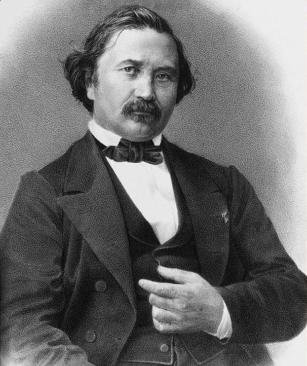

```{r setup, include=FALSE}
options(htmltools.dir.version = FALSE)
knitr::opts_chunk$set(echo=F,
                      message=F,
                      warning=F,
                      fig.retina = 3,
                      fig.align = "center")
library("tidyverse")
library("mosaic")
library("ggrepel")
library("fontawesome")
library("ggtext")
xaringanExtra::use_tile_view()
xaringanExtra::use_tachyons()
xaringanExtra::use_freezeframe()

update_geom_defaults("label", list(family = "Fira Sans Condensed"))
update_geom_defaults("text", list(family = "Fira Sans Condensed"))

set.seed(256)
```


class: title-slide

# 2.3 — Bertrand Competition

## ECON 326 • Industrial Organization • Spring 2023

### Ryan Safner<br> Associate Professor of Economics <br> <a href="mailto:safner@hood.edu"><i class="fa fa-paper-plane fa-fw"></i>safner@hood.edu</a> <br> <a href="https://github.com/ryansafner/ioS23"><i class="fa fa-github fa-fw"></i>ryansafner/ioS23</a><br> <a href="https://ioS23.classes.ryansafner.com"> <i class="fa fa-globe fa-fw"></i>ioS23.classes.ryansafner.com</a><br>

---

# Bertrand Competition: Moblab

.center[

]

---

# Bertrand Competition: Moblab

.pull-left[
- Each of you selling identical Economics course notes

- You will be put into a market with one other player

- Each term, both of you simultaneously choose your price

- Firm(s) choosing the lowest price get **all** the customers

]

.pull-right[
.center[

]

]

---
# Bertrand Competition: Moblab

.pull-left[

- The lowest price $p_L$ determines the market demand
$$q=3600-200p_L$$

- Both firms have $2 cost per unit sold

- $p=10$ maximizes total market profits

]

.pull-right[
.center[

]

]

---

# Bertrand Competition: Moblab

.pull-left[
$$q=3600-200p_L$$

.hi-green[Example:]
- Suppose Firm 1 sets $p=9$ and Firm 2 sets $p=10$

- Firm 2 sells 0, makes $0

- Firm 1 sells $q=3,600-200(9)=1,800$ and earns $1,800(9-2)=12,600$ profit

]

.pull-right[
.center[

]

]

---

# Bertrand Competition

.left-column[
.center[


.smaller[
Joseph Bertrand

1822-1890
]
]
]
.right-column[

.quitesmall[
> “Such is the study made in chapter VII of the rivalry between two proprietors, who without having to worry about any competition, manage two springs of identical quality. It would be in their mutual interest to associate [collude] or at least to set a common price so as to make the largest possible revenue from all the buyers, but this solution is rejected. Cournot assumes that one of the proprietors will reduce his prices to attract buyers to him and that the other will, in turn, reduce his prices even more to attract business back to him. They will only stop undercutting each other in this way when either proprietor, even if the other abandoned the struggle, has nothing more to gain from reducing his prices. One major objection to this is that there is no solution under this assumption, in that there is no limit in the downward movement. Indeed, whatever the common price adopted, if one of the proprietors, alone, reduces his price he will, ignoring any minor exceptions, attract all the buyers and thus double his revenue if his rival lets him do so. If Cournot’s formulation conceals this obvious result, it is because he most inadvertently introduces as $D$ $[q_1]$ and $D’$ $[q_2]$ the two proprietors’ respective outputs and by considering them as independent variables he assumes that should either proprietor change his output then the other proprietor’s output could remain constant. It quite obviously could not,” (503).

]

.source[Bertrand, Joseph, 1883, “Book review of theorie mathematique de la richesse sociale and of recherches sur les principles mathematiques de la theorie des richesses”, *Journal de Savants* 67: 499–508]

]

---

# Bertrand Competition

.left-column[
.center[


.smaller[
Joseph Bertrand

1822-1890
]
]
]
.right-column[
- .hi["Bertrand competition"]: two (or more) firms compete on **price** to sell the **same good**

- Firms set their prices **simultaneously**

- Consumers are indifferent between the brands and .hi-purple[always buy from the seller with the lowest price]

]

---

# Bertrand Competition: Example

.pull-left[

- Consider .hi-red[Coke] and .hi-blue[Pepsi] again, with a constant marginal cost of $0.50

- Let $Q$ be the *total* quantity purchased by consumers from the entire market (i.e. both firms)
  - $Q=\color{red}{q_c}+\color{blue}{q_p}$

- Denote .hi-red[Coke]'s price as .hi-red[`\\(p_c\\)`] and .hi-blue[Pepsi]'s price as .hi-blue[`\\(p_p\\)`]
]

.pull-right[
.center[

]
]

---

# Bertrand Competition: Example

.pull-left[
- Demand for soda from .hi-red[Coke]:

]

---

# Bertrand Competition: Example

.pull-left[
- Demand for soda from .hi-red[Coke]:
  - $Q$ if .red[`\\(p_c\\)`] $<$ .blue[`\\(p_p\\)`]
]

---

# Bertrand Competition: Example

.pull-left[
- Demand for soda from .hi-red[Coke]:
  - $Q$ if .red[`\\(p_c\\)`] $<$ .blue[`\\(p_p\\)`]
  - $\frac{Q}{2}$ if .red[`\\(p_c\\)`] $=$ .blue[`\\(p_p\\)`]
]

---

# Bertrand Competition: Example

.pull-left[
- Demand for soda from .hi-red[Coke]:
  - $Q$ if .red[`\\(p_c\\)`] $<$ .blue[`\\(p_p\\)`]
  - $\frac{Q}{2}$ if .red[`\\(p_c\\)`] $=$ .blue[`\\(p_p\\)`]
  - $0$ if .red[`\\(p_c\\)`] $>$ .blue[`\\(p_p\\)`]
]

--

.pull-right[
```{r, fig.retina=3}
Demand_b=function(x){10-x}
MC=function(x){2}
ggplot(data.frame(x=c(0,10)), aes(x=x))+
  
  # curves 
  stat_function(fun=Demand_b, geom="line", size=5, color="purple")+
  
  geom_segment(x=0.05,xend=0.05,y=10,yend=5, size =2, color = "red")+
  geom_segment(x=0,xend=2.5,y=5,yend=5, size =2, color = "red")+
  geom_segment(x=2.5,xend=5,y=5,yend=5, size =2, linetype="dotted", color = "red")+
  geom_segment(x=5,xend=10,y=5,yend=0, size=2, color="red")+
  annotate(geom = "label", x = 7, y = 3, label = "Coke's Demand",color = "red", size = 6) +
  
  stat_function(fun=MC, geom="line", size=2, color="orange")+
  annotate(geom = "label", x = 2, y = Demand_b(2), label = "Market Demand",color = "purple", size = 6) +
  annotate(geom = "label", x = 9, y = 2, label = "MC(q)", color="orange", size=6)+
  
  geom_segment(x=2.5,xend=2.5,y=0,yend=5, size=1, linetype="dotted")+
  geom_segment(x=5,xend=5,y=0,yend=5, size=1, linetype="dotted")+

  scale_x_continuous(breaks = c(0,2.5,5),
                     labels = c(0,expression(Q/2),"Q"),
                     expand=c(0,0))+
  scale_y_continuous(breaks = c(0,2,5),
                     labels = c(0,"$0.50", expression(p[p])),
                     limits = c(0,10),
                     expand=c(0,0))+
  theme_classic(base_family = "Fira Sans Condensed", base_size=20)+
  labs(x = expression(paste("Coke's Quantity, ", q[c]), sep=" "),
       y = expression(paste("Coke's Price, ", p[c]), sep=" "))
```
]

---

# Bertrand Competition: Example

.pull-left[
- Demand for soda from .hi-red[Coke]:
  - $Q$ if .red[`\\(p_c\\)`] $<$ .blue[`\\(p_p\\)`]
  - $\frac{Q}{2}$ if .red[`\\(p_c\\)`] $=$ .blue[`\\(p_p\\)`]
  - $0$ if .red[`\\(p_c\\)`] $>$ .blue[`\\(p_p\\)`]
]

.pull-left[
- Demand for soda from .hi-blue[Pepsi]:
  - $0$ if .red[`\\(p_c\\)`] $<$ .blue[`\\(p_p\\)`]
  - $\frac{Q}{2}$ if .red[`\\(p_c\\)`] $=$ .blue[`\\(p_p\\)`]
  - $Q$ if .red[`\\(p_c\\)`] $>$ .blue[`\\(p_p\\)`]
]

---

# Bertrand Competition: Example

.pull-left[

- The only way to sell soda is to match or beat your competitor's price 

]

.pull-right[
.center[

]
]

---

# Bertrand Competition: Example

.pull-left[

- The only way to sell soda is to match or beat your competitor's price

- Suppose you are .hi-red[Coke]

For a known .hi-blue[`\\(p_p\\)`], setting your price 

$$\color{red}{p_c}=\color{blue}{p_p}-\epsilon$$

for any arbitrary $\epsilon > 0$ captures you the entire market $Q$

- Same for .hi-blue[Pepsi] for $\color{red}{p_c}$

]

.pull-right[
.center[

]
]

---

# Bertrand Competition: Example

.pull-left[

- Won't charge $p<MC$, earn losses

- Firms continue undercutting one another until .hi-red[`\\(p_c\\)`] $=$ .hi-blue[`\\(p_p\\)`] $=MC$

- .hi-purple[Nash Equilibrium]: $$\big( \color{red}{p_c = MC}, \color{blue}{p_p=MC} \big)$$
  - Firms earn no profits! 

]

.pull-right[
.center[

]
]

---

# Bertrand Paradox

.pull-left[

- .hi[Bertrand Paradox]: when firms compete on price, .hi-turquoise[the perfectly competitive outcome can be achieved with just 2 firms!]
  - $p=MC$
  - $\pi=0$
  - $L = \frac{p-MC}{p} = 0$! 

]

.pull-right[
.center[

]
]

---

# Coke's Reaction Curve

.pull-left[
```{r}
rc<-ggplot(tibble(x=c(0,10)), aes(x=x))+
  geom_segment(x=0, xend=2,y=0,yend=2, size=1, linetype="dashed")+
  geom_segment(x=0,xend=0.55,y=0.5,yend=0.5, size=2, color="red")+
  geom_segment(x=0.55,xend=2.05,y=0.5,yend=2, size=2, color="red")+
  annotate(geom = "label", x = 1.75, y = 1.75 , label = "Coke's RC",color = "red", size = 4) +

  scale_x_continuous(breaks = seq(0,2,0.25),
                     labels = scales::dollar,
                     limits = c(0,2),
                     expand=c(0,0))+
  scale_y_continuous(breaks = seq(0,2,0.25),
                     labels = scales::dollar,
                     limits = c(0,2),
                     expand=c(0,0))+
  theme_classic(base_family = "Fira Sans Condensed", base_size=20)+
  labs(x = "<span style = 'color:blue'>Pepsi's Price, p<sub>p</sub></span>",
       y = "<span style = 'color:red'>Coke's Price, p<sub>p</sub></span>")+
  theme(axis.title.x = element_markdown(),
        axis.title.y = element_markdown())
rc
```
]

.pull-right[

We can graph .hi-red[Coke]'s .hi-purple[reaction curve] to .hi-blue[Pepsi]'s price

]

---

# Coke's Reaction Curve

.pull-left[
```{r}
rc+
  geom_segment(x=1.00,xend=1.00,y=0,yend=0.95, size=1, linetype="dotted", color="blue")+
  geom_segment(x=0,xend=1.00,y=0.95,yend=0.95, size=1, linetype="dotted", color="red")

```
]

.pull-right[

We can graph .hi-red[Coke]'s .hi-purple[reaction curve] to .hi-blue[Pepsi]'s price

- e.g. if .hi-blue[Pepsi] sets a price of .hi-blue[$1.00], .hi-red[Coke]'s best response is .hi-red[`\\($1.00-\epsilon\\)`]

]

---

# Coke's Reaction Curve

.pull-left[
```{r}
rc+
  geom_segment(x=1.00,xend=1.00,y=0,yend=0.95, size=1, linetype="dotted", color="blue")+
  geom_segment(x=0,xend=1.00,y=0.95,yend=0.95, size=1, linetype="dotted", color="red")+
  geom_segment(x=1.5,xend=1.5,y=0,yend=1.45, size=1, linetype="dotted", color="blue")+
  geom_segment(x=0,xend=1.5,y=1.45,yend=1.45, size=1, linetype="dotted", color="red")

```
]

.pull-right[

We can graph .hi-red[Coke]'s .hi-purple[reaction curve] to .hi-blue[Pepsi]'s price

- e.g. if .hi-blue[Pepsi] sets a price of .hi-blue[$1.50], .hi-red[Coke]'s best response is .hi-red[`\\($1.50-\epsilon\\)`]
- e.g. if .hi-blue[Pepsi] sets a price of .hi-blue[$1.50], .hi-red[Coke]'s best response is .hi-red[`\\($1.50-\epsilon\\)`]

]

---

# Coke's Reaction Curve

.pull-left[
```{r}
rc+
  geom_segment(x=1.00,xend=1.00,y=0,yend=0.95, size=1, linetype="dotted", color="blue")+
  geom_segment(x=0,xend=1.00,y=0.95,yend=0.95, size=1, linetype="dotted", color="red")+
  geom_segment(x=1.5,xend=1.5,y=0,yend=1.45, size=1, linetype="dotted", color="blue")+
  geom_segment(x=0,xend=1.5,y=1.45,yend=1.45, size=1, linetype="dotted", color="red")+
  geom_segment(x=0.50,xend=0.50,y=0,yend=0.50, size=1, linetype="dotted", color="blue")+
  geom_segment(x=0,xend=0.50,y=0.50,yend=0.50, size=1, linetype="dotted", color="red")

```
]

.pull-right[

We can graph .hi-red[Coke]'s .hi-purple[reaction curve] to .hi-blue[Pepsi]'s price

- e.g. if .hi-blue[Pepsi] sets a price of .hi-blue[$1.50], .hi-red[Coke]'s best response is .hi-red[`\\($1.50-\epsilon\\)`]
- e.g. if .hi-blue[Pepsi] sets a price of .hi-blue[$1.50], .hi-red[Coke]'s best response is .hi-red[`\\($1.50-\epsilon\\)`]
- e.g. if .hi-blue[Pepsi] sets a price of .hi-blue[$0.50], (MC) .hi-red[Coke]'s best response is .hi-red[`\\($0.50\\)`] (MC)

]

---

# Pepsi's Reaction Curve

.pull-left[
```{r}
rc_Pepsi<-ggplot(tibble(x=c(0,10)), aes(x=x))+
  geom_segment(x=0, xend=2,y=0,yend=2, size=1, linetype="dashed")+
  geom_segment(x=0.50,xend=0.50,y=0,yend=0.55, size=2, color="blue")+
  geom_segment(x=0.50,xend=2,y=0.55,yend=2.05, size=2, color="blue")+
  annotate(geom = "label", x = 900, y = 925 , label = "Pepsi's RC",color = "blue", size = 4) +
  scale_x_continuous(breaks = seq(0,2,0.25),
                     labels = scales::dollar,
                     limits = c(0,2),
                     expand=c(0,0))+
  scale_y_continuous(breaks = seq(0,2,0.25),
                     labels = scales::dollar,
                     limits = c(0,2),
                     expand=c(0,0))+
  theme_classic(base_family = "Fira Sans Condensed", base_size=20)+
  labs(x = "<span style = 'color:blue'>Pepsi's Price, p<sub>p</sub></span>",
       y = "<span style = 'color:red'>Coke's Price, p<sub>p</sub></span>")+
  theme(axis.title.x = element_markdown(),
        axis.title.y = element_markdown())
rc_Pepsi
```
]

.pull-right[

We can graph .hi-blue[Pepsi]'s .hi-purple[reaction curve] to .hi-red[Coke]'s price

]
---

# Pepsi's Reaction Curve

.pull-left[
```{r}
rc_Pepsi+
  geom_segment(x=0.95,xend=0.95,y=0,yend=1, size=1, linetype="dotted", color="blue")+
  geom_segment(x=0,xend=0.95,y=1,yend=1, size=1, linetype="dotted", color="red")

```
]

.pull-right[

We can graph .hi-blue[Pepsi]'s .hi-purple[reaction curve] to .hi-red[Coke]'s price

- e.g. if .hi-red[Coke] sets a price of .hi-red[$1.00], .hi-blue[Pepsi]'s best response is .hi-blue[`\\($1.00-\epsilon\\)`]

]

---

# Pepsi's Reaction Curve

.pull-left[
```{r}
rc_Pepsi+
  geom_segment(x=0.95,xend=0.95,y=0,yend=1, size=1, linetype="dotted", color="blue")+
  geom_segment(x=0,xend=0.95,y=1,yend=1, size=1, linetype="dotted", color="red")+
  geom_segment(x=1.45,xend=1.45,y=0,yend=1.5, size=1, linetype="dotted", color="blue")+
  geom_segment(x=0,xend=1.45,y=1.5,yend=1.5, size=1, linetype="dotted", color="red")

```
]

.pull-right[

We can graph .hi-blue[Pepsi]'s .hi-purple[reaction curve] to .hi-red[Coke]'s price

- e.g. if .hi-red[Coke] sets a price of .hi-red[$1.00], .hi-blue[Pepsi]'s best response is .hi-blue[`\\($1.00-\epsilon\\)`]
- e.g. if .hi-red[Coke] sets a price of .hi-red[$1.50], .hi-blue[Pepsi]'s best response is .hi-blue[`\\($1.50-\epsilon\\)`]

]

---

# Pepsi's Reaction Curve

.pull-left[
```{r}
rc_Pepsi+
  geom_segment(x=0.95,xend=0.95,y=0,yend=1, size=1, linetype="dotted", color="blue")+
  geom_segment(x=0,xend=0.95,y=1,yend=1, size=1, linetype="dotted", color="red")+
  geom_segment(x=1.45,xend=1.45,y=0,yend=1.5, size=1, linetype="dotted", color="blue")+
  geom_segment(x=0,xend=1.45,y=1.5,yend=1.5, size=1, linetype="dotted", color="red")+
  geom_segment(x=0.50,xend=0.50,y=0,yend=0.50, size=1, linetype="dotted", color="blue")+
  geom_segment(x=0,xend=0.50,y=0.50,yend=0.50, size=1, linetype="dotted", color="red")

```
]

.pull-right[

We can graph .hi-blue[Pepsi]'s .hi-purple[reaction curve] to .hi-red[Coke]'s price

- e.g. if .hi-red[Coke] sets a price of .hi-red[$1.00], .hi-blue[Pepsi]'s best response is .hi-blue[`\\($1.00-\epsilon\\)`]
- e.g. if .hi-red[Coke] sets a price of .hi-red[$1.50], .hi-blue[Pepsi]'s best response is .hi-blue[`\\($1.50-\epsilon\\)`]
- e.g. if .hi-red[Coke] sets a price of .hi-red[$0.50] (MC),  .hi-blue[Pepsi]'s best response is .hi-blue[`\\($0.50\\)`] (MC)

]

---

# Nash Equilibrium with Reaction Curves

.pull-left[
```{r}
rc+ 
  geom_segment(x=0.50,xend=0.50,y=0,yend=0.55, size=2, color="blue")+
  geom_segment(x=0.50,xend=2,y=0.55,yend=2.05, size=2, color="blue")+
  annotate(geom = "label", x = 900, y = 925 , label = "Pepsi's RC",color = "blue", size = 4) +
  geom_point(x=200,y=200,size=5,color="purple")+
  annotate(geom = "label", x = 0.85, y = 0.5 , label = "Nash Equilibrium",color = "purple", size = 5)
```
]

.pull-right[

Combine both curves on the same graph

- .hi-purple[Nash Equilibrium]: $$\big( \color{red}{p_c = MC}, \color{blue}{p_p=MC} \big)$$
    - Where both reaction curves intersect

- No longer an incentive to undercut or change price 

]

---

# Bertrand Competition: The Market

- We can find the industry price & quantity of output (and profits), like in the Cournot model

- Here, set $p=MC$

--

$$5-0.05Q = 0.50$$

--

$$Q^* = 90$$

$$q^\star_1 = q^\star_2 = 45$$
--

$$P^* = c = \$0.50$$ 

--

$$\pi_1 = \pi_2 = \Pi = 0$$

---

# Bertrand Competition: Example

.content-box-green[.hi-green[Example]:
Continue your example with Firm 1 and Firm 2, who still have a constant $MC=AC=8$. The market (inverse) demand curve is again given by:

$$\begin{align*}
P&=200-2Q\\
Q&=q_1+q_2\\
\end{align*}$$
]

1. Find the Nash equilibrium price each firm charges if they compete on price. 

2. Find the industry price, output, and profits under this equilibrium.

---

# Resolving the Bertrand Paradox

.left-column[
.center[


.smaller[
Joseph Bertrand

1822-1890
]
]
]

.right-column[
- The paradox happens due to pretty strict assumptions about the model
  - Homogeneous goods; consumers *only* buy from the lower-priced seller
  - No capacity constraints

- We can extend the Bertrand model in a few ways and see the paradox resolved, we'll examine two:
  1. Bertrand competition with differentiated products
  2. Bertrand competition with capacity constraints

]

---

class: inverse, center, middle

# Bertrand Competition with Product Differentiation

---

# Product Differentiation

.pull-left[
.smaller[
- Now consider instead of homogenous goods, each seller is selling differentiated products (i.e. imperfect substitutes)
  - Consumers have preferences between Coke and Pepsi

- Same assumptions of Bertrand model:
  - Firms set their own prices simultaneously

- But now each firm faces its own downward-sloping demand curve
]
]
.pull-right[
.center[

]
]

---

# Product Differentiation

.pull-left[

- Suppose the demand for Coke and for Pepsi, respectively, are:
$$q_c = 1.00-0.25p_c+0.25p_p \\
q_p = 1.00+0.25p_c-0.25p_p$$


$$MR_c = 1.00-0.25p_c+0.25p_p$$

]

.pull-right[
.center[

]
]

---

```{r}
library(ggtext)
Coke_b_RF=function(x){1+0.5*x}

Pepsi_b_RF=function(x){-2+2*x}
coke_bertrand<-ggplot(tibble(x=c(0,10)), aes(x=x))+
  stat_function(fun=Coke_b_RF, geom="line", size=2, color="red")+
    annotate(geom = "label", x = 4, y = Coke_b_RF(4) , label = "Coke's RF",color = "red", size = 4) +
  stat_function(fun=Pepsi_b_RF, geom="line", size=2, color="blue")+
    annotate(geom = "label", x = 2.5, y = Pepsi_b_RF(2.5) , label = "Pepsi's RF",color = "blue", size = 4) +
  scale_x_continuous(breaks = seq(0,5,1),
                     limits = c(0,5),
                     labels = scales::dollar,
                     expand=c(0,0))+
  scale_y_continuous(breaks = seq(0,5,1),
                     limits = c(0,5),
                     labels = scales::dollar,
                     expand=c(0,0))+
  theme_light(base_family = "Fira Sans Condensed", base_size=20)+
  labs(x = "<span style = 'color:blue'>Pepsi's Price, p<sub>p</sub></span>",
       y = "<span style = 'color:red'>Coke's Price, p<sub>p</sub></span>")+
  theme(axis.title.x = element_markdown(),
        axis.title.y = element_markdown())
coke_bertrand
```

---

class: inverse, center, middle

# Bertrand Competition with Capacity Constraints

---

# Capacity Constraints

Suppose each firm can only supply, at most, $q_1 \leq k_1$ and $q_2 \leq k_2$, where $k_1 + k_2 \leq \frac{a}{b}$ (horizontal intercept, max production)
  - implies that firms’ can't “flood” the market (and send the price to $0)

---

- If $p_1 < p_2$ then $q_1$ is $\min \left\{D(p_i), k_i \right\}$
- If $p_1 > p_2$ then $q_1$ is $\min \left\{k_i, D(p_i)-k_2 \right\}$
- If $p_1 = p_2$ then we assume demand is allocated according to relative capacities $q_1 = \min \left\{k_1, \frac{k_1}{(k_1+k_2)D(p)}\right\}$
  - e.g. if Firm 1 has 45% of total industry capacity, it takes 65% of industry demand
  
---

# Equilibria

- Denote $R_1(q_2)$ as Firm 1's *Cournot* best-response to Firm 2's output $q_2$
  - Note these are derived based on short run MC, which excludes the cost of capacity

- Case 1: Capacity constrained: $k_1 \leq R_1(k_2)$ and $k_2 \leq R_2(k_1)$
  - Neither firm can produce more than its best response when the other firm produces at its capacity
  - Nash equilibrium $p_1 = p_2 = P(k_1+k_2)$
  - Each firm produces at capacity
    - Lowering price is not profitable (cannot increase sales)
    - Raising price not profitable
  - Each firm acts a monopolist on its residual demand $D(p_1)-k_2$

- Case 2: Not-capacity constrained:

---

# Conjectural Variations

- Cournot's best response function is traditionally called a reaction function - from his discussion about how firms respond to another's output, *assuming the other firm does not change its output*

- Bowley (1924) calls this a .hi-purple[conjecture]: firm's belief about how its rivals will react to changes in its output

- Cournot competition with homogenous goods, identical costs. Firm 1's marginal revenue is:

$$MR_1(Q) = P(Q) + \frac{\Delta P(Q)}{\Delta Q} \frac{\Delta Q}{\Delta q_1}q_1$$

---

$$MR_1(q_1,q_2) = P(Q) + \frac{\Delta P(Q)}{\Delta Q} \frac{\Delta Q}{\Delta q_1}q_1$$
- $\frac{\Delta Q}{\Delta q_1}$ is the rate of change in *industry* output that firm 1 expects when it increases its output
  - $\Delta Q = \Delta q_1 + \frac{\Delta q_2}{\Delta q_1} \Delta q_1$
  - where $\frac{\Delta q_2}{\Delta q_1}$ is Firm 1’s .hi-purple[conjecture] about how Firm 2 will respond to Firm 1's output change.
  - Divide everything by $\Delta q_1$:

$$\frac{\Delta Q}{\Delta q_1} = 1 + \nu_1$$

- where $\nu_1 = \frac{\Delta q_2}{\Delta q_1}$, Firm 1's conjecture

---

- Substituting this back in, we get

$$MR_1(q_1,q_2) = P(Q) + \frac{\Delta P(Q)}{\Delta Q} (1+ \nu_1)q_1$$
- Equilibrium: each firm is profit-maximizing, given its conjecture about its rival

$$P(Q) + \frac{\Delta P(Q)}{\Delta Q} (1+ \nu_1)q_1 = MC(q_1)$$

And likewise for firm 2

---

$$P(Q) + \frac{\Delta P(Q)}{\Delta Q} (1+ \nu_1)q_1 = MC(q_1)$$

Again, for a linear demand curve $P(Q) = a - bQ$, $\frac{\Delta P(Q)}{\Delta Q}$ is the slope

$$\begin{align*}
P(Q) + \frac{\Delta P(Q)}{\Delta Q} (1+ \nu_1)q_1  \\
P(Q) + b (1+ \nu_1)q_1 \\
a-bQ-b(1+\nu)q_1\\
a-bq_1-bq_2-bq_1-b \nu q_1 \\
a-2bq_1-bq_2 - b\nu q_1 \\
\end{align*}$$

If $\nu = 0$: $a-2bq_1-bq_2$ Cournot
If $\nu = -1$: $a-bq_1-bq_2$ Bertrand (Demand = MC)
If $\nu = 1$: $a-3bq_1-bq_2$ Monopoly
---


# Properties

$$P(Q) + \frac{\Delta P(Q)}{\Delta Q} (1+ \nu_1)q_1 = MC(q_1)$$

- We can characterize effects of different conjectures on equilibrium output

- Larger values of $\nu$ (more aggressive response by other firm) reduce firm's $MR(q)$ and therefore its output

---

# Properties

$$P(Q) + \frac{\Delta P(Q)}{\Delta Q} (1+ \nu_1)q_1 = MC(q_1)$$

- Assume a common conjecture between firms $\nu=\nu_1=\nu_2$

- $\nu = 0$: the Cournot conjecture<sup>.magenta[†]</sup>
  - Reduces to the simple Cournot model
  
- $\nu = -1$: the Bertrand conjecture; firm is a price-taker, setting $p=MC$<sup>.magenta[‡]</sup>
$$P(Q)  = MC(q_1)$$

- $\nu = 1$: the Collusive/monopoly conjecture, firm(s) acts like a monopolist over the industry
  - since $2q_1$ is the total industry output

$$P(Q) + \frac{\Delta P(Q)}{\Delta Q} 2q_1 = MC(q_1)$$

.footnote[<sup>.magenta[†]</sup> Recall the definition of $MR(q)= p + \frac{\Delta p}{\Delta q}q$; or double the slope as demand.]

---

# 

- Logical flaw in the conjectural variations model: assumes firms make decisions simultaneously, not “reacting” to each other in real time!
  - We’ll deal with dynamic responses later

- But a useful empirical framework to explore market power and competitiveness
  - interpret and estimate $\nu$ as a conduct parameter to see if industry performing closer to Cournot/Bertrand/Collusion
  - in general, the greater $\nu$ is, the greater market power and markups are

