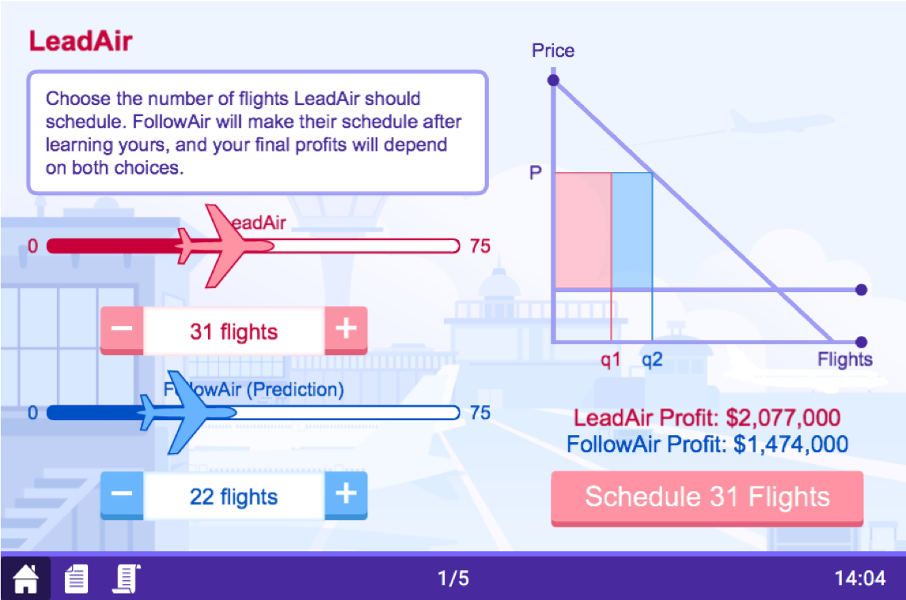

```{r setup, include=FALSE}
options(htmltools.dir.version = FALSE)
knitr::opts_chunk$set(echo=F,
                      message=F,
                      warning=F,
                      fig.retina = 3,
                      fig.align = "center")
library("tidyverse")
library("mosaic")
library("ggrepel")
library("fontawesome")
xaringanExtra::use_tile_view()
xaringanExtra::use_tachyons()
xaringanExtra::use_freezeframe()

update_geom_defaults("label", list(family = "Fira Sans Condensed"))
update_geom_defaults("text", list(family = "Fira Sans Condensed"))

set.seed(256)
```


class: title-slide

# 3.2 — Stackelberg Competition

## ECON 326 • Industrial Organization • Spring 2023

### Ryan Safner<br> Associate Professor of Economics <br> <a href="mailto:safner@hood.edu"><i class="fa fa-paper-plane fa-fw"></i>safner@hood.edu</a> <br> <a href="https://github.com/ryansafner/ioS23"><i class="fa fa-github fa-fw"></i>ryansafner/ioS23</a><br> <a href="https://ioS23.classes.ryansafner.com"> <i class="fa fa-globe fa-fw"></i>ioS23.classes.ryansafner.com</a><br>

---

# Stackelberg Competition: Moblab

.center[


]

---

# Stackelberg Competition: Moblab

.pull-left[
- Each of you is one Airline competing against another in a duopoly
    - Each pays same per-flight cost
    - Market price determined by *total* number of flights in market
    
- **LeadAir** first chooses its number of flights, publicly announced

- **FollowAir** then chooses its number of flights

]

.pull-right[
.center[

]
]

---

# Stackelberg Competition

.left-column[
.center[


.smallest[
Henrich von Stackelberg

1905-1946
]
]
]
.right-column[
- .hi[“Stackelberg competition”]: Cournot-style competition, two (or more) firms compete on **quantity** to sell the **same good**

- Again, firms’ joint output determines the market price faced by all firms

- But firms set their quantities **sequentially**
  - .hi-purple[Leader] produces first
  - .hi-purple[Follower] produces second

]

---

# Stackelberg Competition: Example

.pull-left[

- Return to .hi-red[Coke] and .hi-blue[Pepsi] again, with a constant marginal cost of $0.50 and the (inverse) market demand:

$$\begin{align*}
P&=5-0.05Q\\
Q&=\color{red}{q_{c}}+\color{blue}{q_p}\\
\end{align*}$$

]

.pull-right[
.center[

]
]

---

# Stackelberg Competition: Example


$$\begin{align*}
\color{red}{q_{c}^*}&=45-0.5\color{blue}{q_{p}}\\
\color{blue}{q_{p}^*}&=45-0.5\color{red}{q_{c}}\\
\\ \end{align*}$$

- Suppose now that .hi-red[Coke] is the .hi-purple[leader] and produces $\color{red}{q_c}$ **first**

--

- .hi-red[Coke] knows exactly how .hi-blue[Pepsi] will respond to its output:
$$\color{blue}{q_{p}^*}=45-0.5\color{red}{q_{c}}$$

--

- .hi-red[Coke], as leader, in theory faces **entire market demand**
  - But **not rational** to act like a monopolist!
  - knows that .hi-blue[Pepsi] (the .hi-purple[follower]) will still produce afterwards, which pushes down market price for both firms!


---

# Stackelberg Competition as Sequential Game

.pull-left[

- This is a sequential game, so we should solve this via .hi-purple[backward induction]

- Though .hi-blue[Pepsi] will move second (last), it will be responding to .hi-red[Coke]'s output

- So .hi-red[Coke] must know how .hi-blue[Pepsi] will react in order to choose its optimal output
]

.pull-right[
.center[

]
]

---

# Stackelberg Competition: Example

- Substitute .hi-blue[follower]'s reaction function into (inverse) market demand function faced by .hi-red[leader]

--

$$\begin{align*}
P&=5-0.05\color{red}{q_c}-0.05\color{blue}{p_p}\\
P&=5-0.05\color{red}{q_{c}}-0.05\color{blue}{(}45-0.5\color{red}{q_{c}}\color{blue}{)}\\
P&=2.75-0.025\color{red}{q_{c}}\\
\end{align*}$$


--

- Now find $MR(q)$ for .hi-red[Coke] from this by doubling the slope: 

$$MR_{c}=2.75-0.05q_{c}$$

---

# Stackelberg Competition: Example

- Now .hi-red[Coke] can find its optimal quantity:

$$\begin{align*}
MR_{c}&=MC\\
2.75-0.05q_{c}&=0.50\\
45&=q_{c}^*\\
\end{align*}$$
--

- .hi-blue[Pepsi] will optimally respond by producing:

$$\begin{align*}
q_p^*&=45-0.5q_{c}\\
q_p^*&=45-0.5(45)\\
q_p^*&=22.5\\
\end{align*}$$

---

# Stackelberg Competition: Example

.pull-left[
```{r}
library(ggtext)
Coke=function(x){45-0.5*x}
Pepsi=function(x){90-2*x}

points_react_stack <- tribble(
  ~x, ~y, ~color, ~lab,
  30, 30, "purple", "Cournot Nash Eq.",
  22.5, 22.5, "orange", "Collusion",
  22.5, 45, "darkgreen", "Stackelberg (Coke leads)"
  )


coke<-ggplot(tibble(x=c(0,10)), aes(x=x))+
  stat_function(fun=Coke, geom="line", size=2, color="red")+
    annotate(geom = "label", x = 65, y = Coke(65) , label = "Coke's RF",color = "red", size = 4) +
  scale_x_continuous(breaks = seq(0,100,10),
                     limits = c(0,100),
                     expand=c(0,0))+
  scale_y_continuous(breaks = seq(0,100,10),
                     limits = c(0,100),
                     expand=c(0,0))+
  theme_light(base_family = "Fira Sans Condensed", base_size=20)+
  labs(x = "<span style = 'color:blue'>Pepsi's Output, q<sub>p</sub></span>",
       y = "<span style = 'color:red'>Coke's Output, q<sub>c</sub></span>")+
  theme(axis.title.x = element_markdown(),
        axis.title.y = element_markdown())
coke+
  stat_function(fun=Pepsi, geom="line", size=2, color="blue")+
    annotate(geom = "label", x = 15, y = Pepsi(15) , label = "Pepsi's RF",color = "blue", size = 4) +
  geom_segment(x=30,xend=30,y=0,yend=30, size=1, linetype="dotted")+
  geom_segment(x=0,xend=30,y=30,yend=30, size=1, linetype="dotted")+
  geom_segment(x=22.5,xend=22.5,y=0,yend=45, size=1, linetype="dotted")+
  geom_segment(x=0,xend=22.5,y=22.5,yend=22.5, size=1, linetype="dotted")+
  geom_segment(x=0,xend=22.5,y=45,yend=45, size=1, linetype="dotted")+
  geom_segment(x = 0, xend = 45, y = 45, yend = 0, size = 1, linetype = "dashed", alpha = 0.5)+
  geom_point(data = points_react_stack, aes(x = x, y = y, color = color), size = 3)+
  geom_label_repel(data = points_react_stack, aes(x = x, y = y, label = lab, color = color), size = 4, box.padding = 0.5, nudge_y = 0.5)+
  guides(color = FALSE)+
  scale_color_manual(values = c("purple"= "purple", "orange" = "orange", "darkgreen" = "darkgreen"))
```
]

.pull-right[
- **Stackelberg Nash Equilibrium**: $$\big( \color{red}{q^*_{c}=45}, \color{blue}{q^*_{p}=22.5} \big)$$

]

---

# Stackelberg Competition: Example

- With $\color{red}{q^*_{c}=45}$ and $\color{blue}{q^*_p=22.5}$, this sets a market-clearing price of:

$$\begin{align*}
P&=5-0.05(67.5)\\
P&=\$1.625\\
\end{align*}$$

--

.pull-left[
- .hi-red[Coke's] profit would be:

$$\begin{align*}
\pi_{c}&=(1.625-0.50)45\\
\pi_{c}&=\$50.625\\
\end{align*}$$

]

--

.pull-right[
- .hi-blue[Pepsi's] profit would be:

$$\begin{align*}
\pi_{p}&=(1.625-0.50)22.5\\
\pi_{p}&=\$25.3125\\
\end{align*}$$

]

---

# Stackelberg-Nash Equilibrium, The Market

```{r}
Demand_market<-function(x){5-0.05*x}
MR_market<-function(x){5-0.10*x}
MC_market<-function(x){0.50}

CS_s<-tribble(
  ~x, ~y,
  0, 1.625,
  0, 5,
  67.5, 1.625
)

DWL_s<-tribble(
  ~x, ~y,
  67.5, 1.625,
  67.5, 0.5,
  90, 0.5
)

points_stack <- tribble(
  ~x, ~y, ~color, ~lab,
  60, 2, "purple", "Cournot Nash Eq.",
  45, 2.75, "orange", "Collusion",
  67.5, 1.625, "darkgreen", "Stackelberg Nash Eq."
  )

ggplot(tibble(x=c(0,10)), aes(x=x))+
  geom_polygon(data=CS_s, aes(x=x,y=y), fill="blue",alpha=0.5)+ #cs
  geom_rect(xmin=0, xmax=67.5, ymin=0.5, ymax=1.625, fill="green", alpha=0.5)+ # pi
  geom_polygon(data=DWL_s, aes(x=x,y=y), fill="black",alpha=0.5)+ #dwl
  stat_function(fun=Demand_market, geom="line", size=2, color="blue")+
  annotate(geom = "label", x = 25, y = Demand_market(25) , label = "Market Demand",color = "blue", size = 4) +

      stat_function(fun=MC_market, geom="line", size=2, color="red")+
  annotate(geom = "label", x = 25, y = MC_market(25) , label = "MC(q)=AC(q)",color = "red", size = 4) +

  geom_segment(x=67.5,xend=67.5,y=0,yend=1.625,linetype="dotted", size =1)+
  geom_segment(x=0,xend=67.5,y=1.625,yend=1.625,linetype="dotted", size =1)+

  geom_point(data = points_stack, aes(x = x, y = y, color = color), size = 4)+
  geom_text_repel(data = points_stack, aes(x = x, y = y, label = lab, color = color), size = 4, box.padding = 0.5, nudge_y = 0.5)+
  guides(color = FALSE)+
  scale_color_manual(values = c("purple"= "purple", "orange" = "orange", "darkgreen" = "darkgreen"))+
  
  scale_x_continuous(breaks = seq(0,100,10),
                     limits = c(0,100),
                     expand=c(0,0))+
  scale_y_continuous(breaks = seq(0,5,1),
                     labels = scales::dollar,
                     limits = c(0,5),
                     expand=c(0,0))+
  theme_classic(base_family = "Fira Sans Condensed", base_size=20)+
  labs(x = "Industry Output, Q",
       y = "Market Price, p",
       title = "Cola Industry")
```

---

# Cournot vs. Stackelberg Competition

```{r}
cournot_stackelberg_compare <- tribble(
  ~firm, ~output, ~profit, ~output, ~profit,
  "Coke", "30.00", "$45.00", "45.00", '$50.63',
  "Pepsi", "30.0", "$45.00", "22.50", "$25.31",
  "INDUSTRY", "60.0", "$90.00", "67.50", "$75.94"
)

# a custom table container
sketch = htmltools::withTags(table(
  class = 'display',
  thead(
    tr(
      th(rowspan = 2, 'Firm'),
      th(colspan = 2, 'Cournot (p = $2.00)'),
      th(colspan = 2, 'Stackelberg (p = $1.63)')
    ),
    tr(
      lapply(rep(c('output', 'profit'), 2), th)
    )
  )
))

DT::datatable(cournot_stackelberg_compare,
              container = sketch,
              rownames = FALSE,
              options = list(dom = 't') # only show table, no other options
)
```

---

# Stackelberg and First-Mover Advantage

.pull-left[

- Stackelberg **leader** clearly has a .hi-purple[first-mover advantage] over the **follower**
  - **Leader**: $q^*=45$, π = $50.63
  - **Follower**: $q^*=22.5$, π = $25.31

- If firms compete **simultaneously** (.hi[Cournot]): $q^*=30$, π = $45.00 each

- Leading $\succ$ simultaneous $\succ$ Following

]

.pull-right[
```{r stackrf}
points_react_stack_2 <- tribble(
  ~x, ~y, ~color, ~lab,
  30, 30, "purple", "Cournot Nash Eq.",
  22.5, 22.5, "orange", "Collusion",
  22.5, 45, "darkgreen", "Stackelberg (Coke leads)",
  45, 22.5, "darkgreen", "Stackelberg (Pepsi leads)"
  )


coke<-ggplot(tibble(x=c(0,10)), aes(x=x))+
  stat_function(fun=Coke, geom="line", size=2, color="red")+
    annotate(geom = "label", x = 65, y = Coke(65) , label = "Coke's RF",color = "red", size = 4) +
  scale_x_continuous(breaks = seq(0,100,10),
                     limits = c(0,100),
                     expand=c(0,0))+
  scale_y_continuous(breaks = seq(0,100,10),
                     limits = c(0,100),
                     expand=c(0,0))+
  theme_light(base_family = "Fira Sans Condensed", base_size=20)+
  labs(x = "<span style = 'color:blue'>Pepsi's Output, q<sub>p</sub></span>",
       y = "<span style = 'color:red'>Coke's Output, q<sub>c</sub></span>")+
  theme(axis.title.x = element_markdown(),
        axis.title.y = element_markdown())
coke+
  stat_function(fun=Pepsi, geom="line", size=2, color="blue")+
    annotate(geom = "label", x = 15, y = Pepsi(15) , label = "Pepsi's RF",color = "blue", size = 4) +
  geom_segment(x=30,xend=30,y=0,yend=30, size=1, linetype="dotted")+
  geom_segment(x=0,xend=30,y=30,yend=30, size=1, linetype="dotted")+
  geom_segment(x=22.5,xend=22.5,y=0,yend=45, size=1, linetype="dotted")+
  geom_segment(x=0,xend=22.5,y=22.5,yend=22.5, size=1, linetype="dotted")+
  geom_segment(x=0,xend=22.5,y=45,yend=45, size=1, linetype="dotted")+
  geom_segment(x=0,xend=45,y=22.5,yend=22.5, size=1, linetype="dotted")+
  geom_segment(x=45,xend=45,y=0,yend=22.5, size=1, linetype="dotted")+
  geom_segment(x = 0, xend = 45, y = 45, yend = 0, size = 1, linetype = "dashed", alpha = 0.5)+
  geom_point(data = points_react_stack_2, aes(x = x, y = y, color = color), size = 4)+
  geom_label_repel(data = points_react_stack_2, aes(x = x, y = y, label = lab, color = color), size = 4, box.padding = 0.5, nudge_y = 0.5)+
  guides(color = FALSE)+
  scale_color_manual(values = c("purple"= "purple", "orange" = "orange", "darkgreen" = "darkgreen"))
```
]

---
# Stackelberg and First-Mover Advantage

.pull-left[

- Stackelberg Nash equilibrium requires .hi-purple[perfect information] for **both** leader and follower
  - Follower must be able to **observe** leader's output to choose its own
  - Leader must **believe** follower will see leader's output and react optimally

- .hi-purple[Imperfect information] reduces the game to (simultaneous) .hi[Cournot competition]

]

.pull-right[
```{r, ref.label="stackrf"}
```
]

---

# Stackelberg and First-Mover Advantage

.pull-left[

- Again, leader *cannot* act like a monopolist 
  - A strategic game! Market output (that pushes down market price) is $Q=q_{c}+q_{p}$
    
- Leader's choice of 45 is optimal **only if** follower responds with 22.5

]

.pull-right[
```{r, ref.label="stackrf"}
```
]

---

# Comparing All Oligopoly Models

```{r}
all_compare <- tribble(
  ~firm, ~output, ~profit, ~output, ~profit, ~output, ~profit, ~output, ~profit,
  "Coke", "45.00", "$0.00", "30.00", "$45.00", "45.00", '$50.63', "22.50", "$50.63", 
  "Pepsi", "45.00", "$0.00", "30.00", "$45.00", "22.50", "$25.31", "22.50", "$50.63",
  "INDUSTRY", "90.00", "$0.00", "60.00", "$90.00", "67.50", "$75.94", "45.00", "$101.25"
)

# a custom table container
sketch = htmltools::withTags(table(
  class = 'display',
  thead(
    tr(
      th(rowspan = 2, 'Firm'),
      th(colspan = 2, 'Bertrand (p = $0.50)'),
      th(colspan = 2, 'Cournot (p = $2.00)'),
      th(colspan = 2, 'Stackelberg (p = $1.63)'),
      th(colspan = 2, 'Collusion (p = $2.75)')
    ),
    tr(
      lapply(rep(c('output', 'profit'), 4), th)
    )
  )
))

DT::datatable(all_compare,
              container = sketch,
              rownames = FALSE,
              options = list(dom = 't') # only show table, no other options
)
```

.smaller[
- Output: $Q_m < Q_c < Q_s < Q_b$
- Market price: $P_b < P_s < P_c < P_m$
- Profit: $\pi_b=0 < \pi_s < \pi_c < \pi_m$

Where subscript $m$ is monopoly (collusion), $c$ is Cournot, $s$ is Stackelberg, $b$ is Bertrand
]