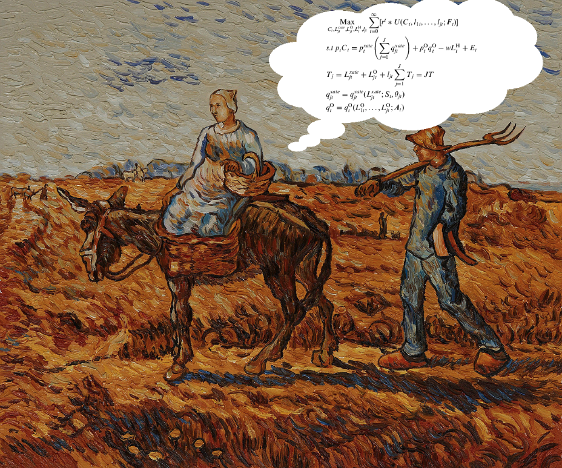
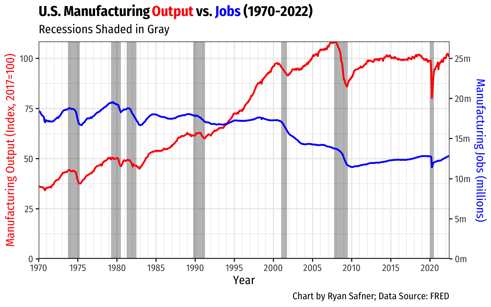

```{r setup, include=FALSE}
options(htmltools.dir.version = FALSE)
knitr::opts_chunk$set(echo=F,
                      message=F,
                      warning=F,
                      fig.retina = 3,
                      fig.align = "center")
library("tidyverse")
library("mosaic")
library("ggrepel")
library("fontawesome")
xaringanExtra::use_tile_view()
xaringanExtra::use_tachyons()
xaringanExtra::use_freezeframe()

update_geom_defaults("label", list(family = "Fira Sans Condensed"))
update_geom_defaults("text", list(family = "Fira Sans Condensed"))

set.seed(256)
```


class: title-slide

# 4.1 — Why Are There Firms?

## ECON 326 • Industrial Organization • Spring 2023

### Ryan Safner<br> Associate Professor of Economics <br> <a href="mailto:safner@hood.edu"><i class="fa fa-paper-plane fa-fw"></i>safner@hood.edu</a> <br> <a href="https://github.com/ryansafner/ioS23"><i class="fa fa-github fa-fw"></i>ryansafner/ioS23</a><br> <a href="https://ioS23.classes.ryansafner.com"> <i class="fa fa-globe fa-fw"></i>ioS23.classes.ryansafner.com</a><br>

---

class: inverse

# Outline

### [Where are the Firms in Economic Theory?](#3)
### [Why Are There Firms?](#17)
### [The Division of Labor](#20)
### [The Division of Labor and Firms](#41)
### [The Division of Labor and Life Cycle of Industries](#62)

---

class: inverse, center, middle

# Where are the Firms in Economic Theory?

---

# Firms in Economics

.pull-left[

]

.pull-right[

]

---

# Firms in Economics

.center[
<iframe width="980" height="550" src="https://www.youtube.com/embed/uSLscJ2cY04" frameborder="0" allow="accelerometer; autoplay; encrypted-media; gyroscope; picture-in-picture" allowfullscreen></iframe>
]

---

# Firms in Economics


```{r, fig.retina=3, fig.height=5}
mc_ex1<-function(x){30*x+8}
avc_ex1<-function(x){15*x+8}
ac_ex1<-function(x){15*x+8+45/x}
afc_ex1<-function(x){45/x}

ggplot(data.frame(x=c(0,10)), aes(x=x))+
  stat_function(fun=mc_ex1, geom="line", size=2, color = "red")+
    geom_label(aes(x=2.5,y=mc_ex1(2.5)), color = "red", label=expression(MC(q)), size = 4)+
  stat_function(fun=avc_ex1, geom="line", size=2, color = "brown")+
    geom_label(aes(x=3,y=avc_ex1(3)), color = "brown", label=expression(AVC(q)), size = 4)+
  stat_function(fun=afc_ex1, geom="line", size=2, color = "pink")+
    geom_label(aes(x=3,y=afc_ex1(3)), color = "pink", label=expression(AFC(q)), size = 4)+
  stat_function(fun=ac_ex1, geom="line", size=2, color = "orange")+
    geom_label(aes(x=3,y=ac_ex1(3)), color = "orange", label=expression(AC(q)), size = 4)+
   scale_x_continuous(breaks=NULL,
                     limits=c(0,4),
                     expand=expand_scale(mult=c(0,0.1)))+
  scale_y_continuous(breaks=NULL,
                     labels=scales::dollar,
                     limits=c(0,100),
                     expand=expand_scale(mult=c(0,0.1)))+
  #scale_colour_manual("Curves", values = line_colors, guide=F)+
  labs(x = "Output, q",
       y = "Per-Unit Costs ($)",
       caption = expression(paste(C(q)==15*q^2+8*q+45)))+
  theme_classic(base_family = "Fira Sans Condensed", base_size=20)
```


---

# Firms in Economics

.center[

]

---

# Neoclassical Production Theory

.center[

]

---

# Neoclassical Production Theory

.center[

]

---

# Neoclassical Production Theory

.center[

]

---

# Structure-Conduct-Performance Paradigm

.pull-left[
.center[

]
]

.pull-right[

- An industry’s .hi-purple[“Performance”]
  - Price (high, low)
  - Output (high, low)
  - Profit
  - Productive efficiency
  - Allocative efficiency (CS, DWL)
  - Quality, safety, etc.
]
---

# Structure-Conduct-Performance Paradigm

.pull-left[
.center[

]
]

.pull-right[

- ... which is determined by its firms’ .hi-purple[“Conduct”]
  - Pricing behavior
  - Output choices
  - Advertising
  - Lobbying
  - Lawsuits
  - Entry and exit
  - Collusion
  - Innovation
]

---

# Structure-Conduct-Performance Paradigm

.pull-left[
.center[

]
]

.pull-right[

- ... which is determined by the industry’s .hi-purple[“Structure”]
  - Number of buyers
  - Number of sellers
  - Product differentiation
  - Vertical integration
  - Barriers to entry
]

---

# Structure-Conduct-Performance Paradigm

.pull-left[
.center[

]
]

.pull-right[

- ... which is determined (exogenously) by the product’s .hi-purple[“Technology”]
  - **Consumer demand** (price and income elasticity, substitutes, location, etc)
  - **Product’s features**: experience, information, durability, rivalry, excludability
  - **Production features**: economies of scale, economies of scope, network externalities, two-sided platforms
]

---

# Structure-Conduct-Performance Paradigm

.pull-left[
.center[

]
]

.pull-right[

- .hi-purple[Government policy] can affect nearly every stage
  - Entry regulation
  - Price regulation
  - Antitrust lawsuits
  - Taxes and subsidies
]

---

# SCP vs. the “New Learning”

.pull-left[
.smallest[

- Counter-framework evolved in Industrial Organization theory from 1960s-1980s, often called the “New Learning”

- Theoretical and empirical problems with SCP

- Focus instead on property rights, transaction costs, theory of the firm, efficiency-rationales for business behavior, etc. 

- Implications for regulation and antitrust
]
]

.pull-right[
.center[

]
]

---

class: inverse, center, middle

# Why Are There Firms?

---

# Why Are There Firms?

.pull-left[
- In modern market economies, most production takes place in a legal organization known as a .hi[firm]

- It does not *have* to be this way, and for most of history it was not this way
    - Craft guilds
    - Independent artisans
    - Independent contractors

]

.pull-right[

.center[

]
]

---

# Why Are There Firms?

.pull-left[
- If markets are so efficient, and great at managing resources, why are there firms?

- Firms abolish allocation of goods by prices, substitute a rigid command-and-control hierarchy/central planning!


]

.pull-right[

.center[

]
]

---

class: inverse, center, middle

# The Division of Labor

---

# The Division of Labor I

.left-column[
.center[


Adam Smith

1723-1790
]
]

.right-column[

> "The greatest improvement in the productive powers of labour, and the greater part of the skill, dexterity, and judgment with which it is any where directed, or applied, seem to have been the effects of the .hi[division of labour]," (Book I, Chapter 1).
]

.source[Smith, Adam, 1776, [*An Enquiry into the Nature and Causes of the Wealth of Nations*](https://www.econlib.org/library/Smith/smWN.html)]

---

# The Division of Labor II

.pull-left[
- Output performed under the .hi[division of labor] exceeds output performed in isolation (.hi-purple[autarky])

- Variation in factor endowments

- Variation in production opportunities

- Variation in human talents
]

.pull-right[


]

---

# The Division of Labor III

.left-column[
.center[


Adam Smith

1723-1790
]
]

.right-column[

> "It is but a very small part of a man's wants which the produce of his own labour can supply. He supplies the far greater part of them by exchanging that surplus part of the produce of his own labour, which is over and above his own consumption, for such parts of the produce of other men's labour as he has occasion for. Every man thus lives by exchanging, or becomes in some measure a merchant, and the society itself grows to be what is properly a commercial society," (Book I, Chapter 4).
]

.source[Smith, Adam, 1776, [*An Enquiry into the Nature and Causes of the Wealth of Nations*](https://www.econlib.org/library/Smith/smWN.html)]

---

# Smith's Pin Factory Example I

.left-column[
.center[


Adam Smith

1723-1790
]
]

.right-column[
.smallest[
> "To take an example...from a very trifling manufacture...the trade of the .hi[pin-maker]. [I]n the way in which this business is now carried on, not only the whole work is a peculiar trade, but it is divided into a number of branches, of which the greater part are likewise peculiar trades. One man draws out the wire, another straights it, a third cuts it, a fourth points it, a fifth grinds it at the top for receiving the head...and .hi[the important business of making a pin is, in this manner, divided into about eighteen distinct operations]....hi[Ten men only were employed [and they] could make among them upwards of forty-eight thousand pins in a day...But if they had all wrought separately and independently [they] certainly could not each of them have made twenty, perhaps not one pin in a day...]" (Book I, Chapter 1).

]
]
.source[Smith, Adam, 1776, [*An Enquiry into the Nature and Causes of the Wealth of Nations*](https://www.econlib.org/library/Smith/smWN.html)]

---

# Smith's Pin Factory Example II

.center[


Adam Smith's pin factory illustration
]

---

# Division of Labor: Origins

.left-column[
.center[


Adam Smith

1723-1790
]
]

.right-column[

> "This .hi[division of labour], from which so many advantages are derived, .hi[is not originally the effect of any human wisdom], which foresees and intends that general opulence to which it gives occasion. It is the necessary, though very slow and gradual, .hi[consequence of a certain propensity in human nature] which has in view no such extensive utility; .hi[the propensity to truck, barter, and exchange one thing for another,]" (Book I, Chapter 2).
]

.source[Smith, Adam, 1776, [*An Enquiry into the Nature and Causes of the Wealth of Nations*](https://www.econlib.org/library/Smith/smWN.html)]

---

# DOL Is Limited By the Extent of the Market

.left-column[
.center[


Adam Smith

1723-1790
]
]

.right-column[

> "As it is the power of exchanging that gives occasion to the division of labour, so .hi[the extent of this division must always be limited by...the extent of the market.] When the market is very small, no person can have any encouragement to dedicate himself entirely to one employment, for want of the power to exchange all that surplus part of the produce of his own labour, which is over and above his own consumption, for such parts of the produce of other men's labour as he has occasion for," (Book I, Chapter 3).
]

.source[Smith, Adam, 1776, [*An Enquiry into the Nature and Causes of the Wealth of Nations*](https://www.econlib.org/library/Smith/smWN.html)]

---

# The Division of Labor: Summary

.pull-left[
.smallest[

- .hi[Division of labor]: process where people *specialize* in production and then *exchange* their produce with others to acquire all of their desired goods

- Two senses: 
    1. **Factory system**: splitting up production process into specialized discrete steps boosts productivity
    2. **Economic system**: an economy of people specialize & exchange for all needs, leading to widespread prosperity
    
- .hi-purple[The more trading opportunities, the greater the benefits of specialization]

]
]

.pull-right[
.center[

]
]

---

# The Division of Labor and Capital Accumulation I

.left-column[
.center[


Allyn Young

1876-1929
]
]

.right-column[

.smaller[

> "The important thing, of course, is that .hi[with the division of labour a group of complex processes is transformed into a succession of simpler processes, some of which, at least, lend themselves to the use of machinery]. In the use of machinery and the adoption of indirect processes there is a further division of labour, the economies of which are again .hi[limited by the extent of the market]. .hi[It would be wasteful to make a hammer to drive a single nail; it would be better to use whatever awkward implement lies conveniently at hand]," (p.530).

]
]
.source[Young, Allyn, 1928, "Increasing Returns and Economics Progress," *Economic Journal* 38(152)]

---

# The Division of Labor and Capital Accumulation II

.left-column[
.center[


Allyn Young

1876-1929
]
]

.right-column[

.smaller[

> "It would be wasteful to furnish a factory with an elaborate equipment of specially constructed jigs, gauges, lathes, drills, presses and conveyors to build a hundred automobiles; it would be better to rely mostly upon tools and machines of standard types, so as to make a relatively larger use of directly applied and a relatively smaller use of indirectly-applied labour. .hi[[Henry] Ford's methods would be absurdly uneconomical if his output were very small], and would be unprofitable even if his output were what many other manufacturers of automobiles would call large.," (p.530).

]
]
.source[Young, Allyn, 1928, "Increasing Returns and Economics Progress," *Economic Journal* 38(152)]

---

# The Division of Labor and Capital Accumulation III

.pull-left[
.smaller[
- More trading opportunities create .hi-purple[economies of scale]
    - As $\uparrow$ output, $\downarrow$ average cost
    
- Makes large investments in capital & technology profitable
    - Spreads $f$ over a larger volume of $q$
    
- Labor-saving technologies
    - May replace labor entirely with capital
    - Might create new complex tasks for labor
]
]
.pull-right[
.center[

]
]

---

# The Division of *Knowledge*

- Greater extent of the market $\rightarrow$ greater division of labor, and also a greater specialization and .hi-purple[division of knowledge]

.center[

]

---

# The Division of *Knowledge*

- Greater extent of the market $\rightarrow$ greater division of labor, and also a greater specialization and .hi-purple[division of knowledge]

.center[


]

---

# DOL, Productivity, & Employment

.left-column[
.center[


Michael Munger
]
]

.right-column[
.smaller[
> "The market Smith was talking about was the number of potential (and, in an important sense, actual!) customers for the product in question. As the ability of transport and communications to handle trade increases, the size of factories increases. Let me say that again, because it is so obvious it's confusing. .hi[As the number of potential customers you can reach expands, and the costs of shipping and handling fall, factories become fewer and larger.] There is far more capital investment in these factories, but fewer workers. And output increases ten-fold, a hundred-fold, a billion-fold."

]
]

.source[Munger, Michael, 2007, ["I'll Stick With These: Some Sharp Observations on the Division of Labor,"](https://www.econlib.org/library/Columns/y2007/Mungerpins.html) *EconLog*]

---

# DOL, Productivity, & Employment: Example

.center[


100 workers with sticks
]


---

# DOL, Productivity, & Employment: Example

.center[


10 workers with shovels
]


---

# DOL, Productivity, & Employment: Example

.center[


1 worker with a backhoe
]


---

# DOL, Productivity, & Employment: A Framework

.pull-left[
.center[

]
]

.pull-right[

- .hi-blue[Productivity Per Worker]: exponential increase with larger markets & more capital investment

- .hi-red[Employment]: Increase, then decrease, with larger markets & more capital investment

]

---

# DOL, Productivity, & Employment

.left-column[
.center[


Michael Munger
]
]

.right-column[
.smaller[
> "Today, most pin manufacture has moved to Asia. Your first impulse might be to nod and think, ``Sure, cheap labor.'' But that is not an important part of the story. Pin manufacturing is highly capital intensive. Smith's insight on the division of labor, and Howe's idea of making the process continuous and making labor more productive, have combined to expand the market for Chinese pins to the whole world. The number of workers engaged in pin manufacture in China has *fallen*, not risen, as pin output has expanded. And wages have increased more than ten-fold, as productivity has exploded"

]
]

.source[Munger, Michael, 2007, ["I'll Stick With These: Some Sharp Observations on the Division of Labor,"](https://www.econlib.org/library/Columns/y2007/Mungerpins.html) *EconLog*]

---

# Division of Labor, Productivity, & Employment

.center[

]

---

class: inverse, center, middle

# The Division of Labor and Firms

---

# Two Methods of "Organizing" Production

.pull-left[
.center[

]
]

.pull-right[

1. .hi[Contracting] or .hi-purple[using the market]: a buyer and a seller make a one-time agreement for a specific transaction

2. .hi[Team Production] or .hi-purple[internal organization]: a resource owner (or their agent) hires factors of production and manages their production
]

---

# Why Not Contract Everything?

.left-column[
.center[

.smallest[
George Stigler

1911-1991

Economics Nobel 1982
]
]
]
.right-column[

.smallest[

The master gun-maker–the entrepreneur–seldom possessed a factory or workshop...Usually he owned merely a warehouse in the gun quarter, and his function was to acquire semi-finished parts and to give these out to specialized craftsmen, who undertook the assembly and finishing of the gun. He purchased materials from the barrel-makers, lock-makers, sight-stampers, trigger-makers, ramrod-forgers, gun-furniture makers, and, if he were engaged in the military branch, from bayonet-forgers. All of these were independent manufacturers executing the orders of several master gunmakers...Once the parts had been purchased from the “material-makers,” as they were called, the next task was to hand them out to a long succession of “setters-up,” each of whom performed a specific operation in connection with the assembly and finishing of the gun...the jiggers...the barrel-strippers...the hardeners, polishers, borers and riflers, engravers, browners, and finally the lock-freers, who adjusted the working parts," (pp.192-193).

]
.source[Stigler, George J, (1951), "The Division of Labor is Limited by the Extent of the Market," *Journal of Political Economy* 59(3):3-21]

]

---

# Why Not Contract Everything?

.pull-left[
.center[

]
]

.pull-right[

- .hi-purple[Craft productions]: each artisan works at own pace, independently performing multiple tasks
]

---

# Why Not Contract Everything?

.pull-left[
.center[


.smallest[
Each task could potentially be a specialization of a particular worker. But how many tasks are "internal" to a firm, and how many are separate firms?
]
]
]

.pull-right[

- Smith's division of labor does not say anything about the boundaries of the firm

- Are the stages of production each a separate firm, or are some stages within a single firm?

- Vertical integration

]

---

# Coase: Transactions Costs!

.left-column[
.center[


.smaller[
Ronald H. Coase

(1910-2013)

Economics Nobel 1991]

]
]

.right-column[

.smallest[

“The main reason why it is profitable to establish a firm would seem to be that there is a .hi[cost of using the price mechanism]," (pp.192-193).

]
.source[Coase, Ronald H, (1937), "The Nature of the Firm," *Economica* 59(3):3-21]

]

---

# Transaction Costs I

.pull-left[
- Example .hi[Transaction costs]!
  - .hi-purple[Search costs]: cost of finding trading partners
  - .hi-purple[Bargaining costs]: cost of reaching an agreement
  - .hi-purple[Enforcement costs]: trust between parties, cost of upholding agreement, dealing with unforeseen contingencies, punishing defection, using police and courts 
]

.pull-right[
.center[

]
]

---

# Transaction Costs II

.pull-left[
- With high transaction costs, resources *cannot* be traded

- Resources *cannot* be switched to higher-valued uses

- If others value goods higher than their current owners, resources are *inefficiently* allocated!
]

.pull-right[
.center[

]
]

---

# Incomplete Contracts

.pull-left[
.center[

]
]

.pull-right[

- Contract performance takes place over time - the source of uncertainty

- .hi[Complete contracts] that account for every possible contingency are *impossible*

- Have to constantly renegotiate terms of contract to respond to uncertain changes

]

---

# The Firm: A General Contract

.pull-left[
.center[


.smallest[
At any time, employer can choose $x \in X$ for employee to perform, where $X$ is the set of tasks in the employee's "job description"
]
]
]

.pull-right[

- Establishing an organization (firm) substitutes a single .hi[employment contract] between factor owner (worker, landowner, etc.) and firm owner

- Firm owner (or their agents) pays factor owner (hourly wage, salary, rent, etc) for the right to direct factor owner to provide whatever service firm owner's discretion (within bounds of the contract)
  - aka "job description"

]

---

# The Make-or-Buy Decision

.pull-left[
.center[

]
]

.pull-right[

- Firms (and individuals!) face a .hi[make-or-buy decision] on all of their inputs and output:
  - Produce something in-house (.hi-purple[team production]) OR
  - Buy it from another producer in the market (.hi-purple[contracting])

- Smith's describes how markets $\implies$ specialization $\implies$ productivity, NOT which production processes are *internalized* vs. *left external*
]

---

# Make-or-Buy Decision

.pull-left[
.center[


Operate own delivery vehicles
]
]

.pull-right[
.center[


Contract with outside delivery companies
]

]

---

# Make-or-Buy Decision

.pull-left[
.center[


Operate own cafeteria
]
]

.pull-right[
.center[


Employees/students turn to the market
]

]

---

# Make-or-Buy Decision

.pull-left[
.center[


Auto manufacturers often produce their own car bodies
]
]

.pull-right[
.center[


But often buy the tires from other companies
]

]

---

# Make-or-Buy Decision

.pull-left[
.center[


Google doesn't make its own hardware
]
]

.pull-right[
.center[


IMB makes its own hardware
]

]

---

# When is it Efficient to Internalize?

.pull-left[
.center[

]
]

.pull-right[

- Other examples of In-House vs. Contracted services
  - Janitors
  - Coping services
  - Travel assistance

- One major determinant: how *competitive* is the market?
  - Buying on competitive market $\succ$ producing in-house $\succ$ buying on monopolistic market

]

---

# Coase: Transactions Costs!

.left-column[
.center[


.smaller[
Ronald H. Coase

(1910-2013)

Economics Nobel 1991]

]
]

.right-column[

.smallest[

“A firm will tend to expand until the costs of organising an extra transaction within the firm become equal to the costs of carrying out the same transaction by means of an exchange on the open market or the costs of organising in another firm,"

]
.source[Coase, Ronald H, (1937), "The Nature of the Firm," *Economica* 59(3):3-21]

]

---

# Coase: Transactions Costs!

.left-column[
.center[


.smaller[
Ronald H. Coase

(1910-2013)

Economics Nobel 1991]

]
]

.right-column[

.smallest[

“It should be noted that most inventions will change both the costs of organising and the costs of using the price mechanism. In such cases, whether the invention tends to make firms larger or smaller will depend on the relative effect on these two sets of costs.  For instance, if the telephone reduces the costs of using the price mechanism more than it reduces the costs of organising, then it will have the effect of reducing the size of the firm,"

]
.source[Coase, Ronald H, (1937), "The Nature of the Firm," *Economica* 59(3):3-21]

]

---

# The Boundaries of Firms

.pull-left[
.center[

]
]

.pull-right[

- The "size" of the firm is not just how much output $q$ it produces, but the .hi-purple[number of transactions or activities within its boundaries]!

]

---

# What Stops a Firm from Expanding Forever?

.pull-left[
.center[

]
]

.pull-right[

- What stops a firm from expanding forever?

- Lenin: "The whole of society will have become one office and one factory"

- Hayek, Mises, Austrians: [economic calculation problem](https://devf19.classes.ryansafner.com/class/03-class)

- Coase: diminishing returns to the managerial function

]

---

# Assessing Coase

.left-column[
.center[


.smaller[
Ronald H. Coase

(1910-2013)

Economics Nobel 1991]

]
]

.right-column[

- Coase’s answer to why there are firms is very general, almost tautological, what about the details?

1. Stigler (1951) theory of the division of labor
2. Nexus of contract theory (Alchian, Demsetz)
3. Asset specificity theory (Williamson)
4. Agency costs theory (Jensen)
5. Property rights view (Hart, Grossman)
]

---

class: inverse, center, middle

# The Division of Labor and Life Cycle of Industries

---

# The Division of Labor and Life Cycle of Industries

.left-column[
.center[

.smallest[
George Stigler

1911-1991

Economics Nobel 1982
]
]
]
.right-column[

.smallest[

"If one considers the full life of industries...Young industries are often strangers to the established economic system. They require new kinds or qualities of materials and hence make their own; they must overcome technical problems in the use of their products and cannot wait for potential users to overcome them...These young industries must design their specialized equipment and often manufacture it, and they must undertake to recruit (historically, often to import) skilled labor. When the industry has attained a certain size and prospects, many of these tasks are sufficiently important to be turned over to specialists," (pp.190).

]
.source[Stigler, George J, (1951), "The Division of Labor is Limited by the Extent of the Market," *Journal of Political Economy* 59(3):3-21]

]

---

# The Division of Labor and Life Cycle of Industries

.left-column[
.center[

.smallest[
George Stigler

1911-1991

Economics Nobel 1982
]
]
]
.right-column[

.smallest[

"When the industry has attained a certain size and prospects, many of these tasks are sufficiently important to be turned over to specialists It becomes profitable for other firms to supply equipment and raw materials, to undertake the marketing of the product and the utilization of by-products, and even to train skilled labor," (pp.190).

]
.source[Stigler, George J, (1951), "The Division of Labor is Limited by the Extent of the Market," *Journal of Political Economy* 59(3):3-21]

]

---

# The Division of Labor and Life Cycle of Industries

.left-column[
.center[

.smallest[
George Stigler

1911-1991

Economics Nobel 1982
]
]
]
.right-column[

.smallest[

"And finally, when the industry begins to decline, these subsidiary, auxiliary, and complementary industries begin also to decline, and eventually the surviving firms must begin to reappropriate functions which are no longer carried on at a sufficient rate to support independent firms," (pp.190).

]
.source[Stigler, George J, (1951), "The Division of Labor is Limited by the Extent of the Market," *Journal of Political Economy* 59(3):3-21]

]

---

# The Division of Labor and Life Cycle of Industries

.left-column[
.center[

.smallest[
George Stigler

1911-1991

Economics Nobel 1982
]
]
]
.right-column[

.smallest[

"The division of labor is not a quaint practice of eighteenth century pin factories, it is a fundamental principle of economic organization," (pp.193).

]
.source[Stigler, George J, (1951), "The Division of Labor is Limited by the Extent of the Market," *Journal of Political Economy* 59(3):3-21]

]
