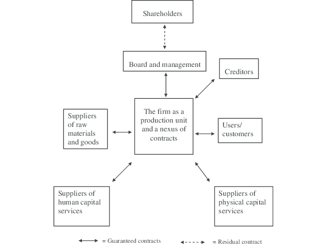

```{r setup, include=FALSE}
options(htmltools.dir.version = FALSE)
knitr::opts_chunk$set(echo=F,
                      message=F,
                      warning=F,
                      fig.retina = 3,
                      fig.align = "center")
library("tidyverse")
library("mosaic")
library("ggrepel")
library("fontawesome")
xaringanExtra::use_tile_view()
xaringanExtra::use_tachyons()
xaringanExtra::use_freezeframe()

update_geom_defaults("label", list(family = "Fira Sans Condensed"))
update_geom_defaults("text", list(family = "Fira Sans Condensed"))

set.seed(256)
```


class: title-slide

# 4.2 — The Firm as Nexus of Contracts

## ECON 326 • Industrial Organization • Spring 2023

### Ryan Safner<br> Associate Professor of Economics <br> <a href="mailto:safner@hood.edu"><i class="fa fa-paper-plane fa-fw"></i>safner@hood.edu</a> <br> <a href="https://github.com/ryansafner/ioS23"><i class="fa fa-github fa-fw"></i>ryansafner/ioS23</a><br> <a href="https://ioS23.classes.ryansafner.com"> <i class="fa fa-globe fa-fw"></i>ioS23.classes.ryansafner.com</a><br>

---

class: inverse

# Outline

### [The Firm as Nexus of Contracts](#5)
### [Agency Theory: The Separation of Ownership and Control](#18)
### [Corporate Governance: Reducing Agency Costs](#34)
### [The Market for Corporate Control](#41)

---

# Review of Theory of the Firm

- **Smith**: division of labor is limited by the extent of the market

- **Young**: specialization yields opportunities for innovation, tools, and capital replacing labor to enhance productivity

- **Coase**: producers decide whether it is cheaper to produce in-house vs. contracting
  - depends on extent of the market
  
- **Stigler**: tasks within production become specialized firms as industry expands, then contracts


---

# Theory of the Firm & Transaction Costs

.left-column[
.center[


.smaller[
Ronald H. Coase

(1910-2013)

Economics Nobel 1991]

]
]

.right-column[

- Coase’s (1937) answer to why there are firms is very general, almost tautological, what about the details?

1. Life cycle of firms
  - Stigler (1951)
2. .hi[Nexus of Contract Theory]
  - Alchian and Demsetz (1972); Jensen and Meckling (1976)
3. Asset specificity theory
  - Williamson (1975); Klein, Crawford, and Alchian (1978)
4. Property Rights View of the Firm
  - Grossman and Hart (1986)
]

---

class: inverse, center, middle

# The Firm as Nexus of Contracts

---

# The Firm as Nexus of Contracts

.left-column[
.center[

]
.smallest[
L: Armen Alchian (1914-2013)

R: Harold Demsetz (1930-2019)

]
]
.right-column[

.smallest[

“It is common to see the firm characterized by the power to settle issues by fiat, by authority, or by disciplinary action superior to that available in the conventional market. This is delusion. .hi[The firm does not own all its inputs. It has no power of fiat, no authority, no disciplinary action any different in the slightest degree from ordinary market contracting between any two people.] I can "punish" you only by withholding future business or by seeking redress in the courts for any failure to honor our exchange agreement. That is exactly all that any employer can do,” (pp.777-778).

]
.source[Alchian, Armen A and Harold Demsetz, 1972, "Production, Information Costs, and Economic Organization," *American Economic Review* 62: 777-795]

]

---

# The Firm as Nexus of Contracts

.left-column[
.center[

]
.smallest[
L: Armen Alchian (1914-2013)

R: Harold Demsetz (1930-2019)

]
]
.right-column[

.smallest[

“[A firm] is a .hi[team] use of inputs and a centralized position of some party in the contractual arrangements of all other inputs. It is the .hi[centralized contractual agent in a team productive process],” (p.778).

]
.source[Alchian, Armen A and Harold Demsetz, 1972, "Production, Information Costs, and Economic Organization," *American Economic Review* 62: 777-795]

]

---

# The Firm as Nexus of Contracts

.left-column[
.center[

]
.smallest[
L: Armen Alchian (1914-2013)

R: Harold Demsetz (1930-2019)

]
]
.right-column[

.smallest[

“Two men jointly lift heavy cargo into trucks. Solely by observing the total marginal productivity and making pay-weight loaded per day, it is impossible to determine each person's marginal productivity...In team production, marginal products of cooperative team members are not so directly and separably (i.e., cheaply) observable. What a team offers to the market can be taken as the marginal product of the team but not of the team members. .hi[The costs of metering or ascertaining the marginal products of the team's members is what calls forth new organizations and procedures],” (pp.778).

]
.source[Alchian, Armen A and Harold Demsetz, 1972, "Production, Information Costs, and Economic Organization," *American Economic Review* 62: 777-795]

]

---

# The Firm as Nexus of Contracts

.left-column[
.center[

]
.smallest[
L: Armen Alchian (1914-2013)

R: Harold Demsetz (1930-2019)

]
]
.right-column[
.smaller[
- Many production process require .hi[team production] between factors of production

- Team production creates .hi[information costs]:

- workers can .hi-purple[shirk] in their efforts and free ride on others' efforts

- difficult to determine an individual worker's marginal product
  - pay is often by *average* product (total output per hour, etc)

- .hi-purple[Factors recognize it is in their own interest to appoint a member to specialize in monitoring them (i.e. a boss) to manage them
]

]

.source[Alchian, Armen A and Harold Demsetz, 1972, "Production, Information Costs, and Economic Organization," *American Economic Review* 62: 777-795]

]


---

# Shirking and Information Costs

.center[
<iframe width="980" height="550" src="https://www.youtube.com/embed/8afqoDL3Qsk" frameborder="0" allow="accelerometer; autoplay; encrypted-media; gyroscope; picture-in-picture" allowfullscreen></iframe>
]

---

# The Firm: Appointing a Monitor

.left-column[
.center[

]
.smallest[
L: Armen Alchian (1914-2013)

R: Harold Demsetz (1930-2019)

]
]
.right-column[

> “One method of reducing shirking is for someone to specialize as a monitor to check the input performance of team members,” (p.781).

.source[Alchian, Armen A and Harold Demsetz, 1972, "Production, Information Costs, and Economic Organization," *American Economic Review* 62: 777-795]

]

---

# The Firm: Appointing a Monitor

.left-column[
.center[


.smallest[
Steven N.S. Cheung

1935-

]
]
]

.right-column[
.smallest[
> “My own favorite example is riverboat pulling in China before the communist regime, when a large group of workers marched along the shore towing a good-sized wooden boat. .hi[The unique interest of this example is that the collaborators actually agreed to the hiring of a monitor to whip them.] The point here is that even if every puller were perfectly "honest," it would still be too costly to measure the effort each has contributed to the movement of the boat, but to choose a different measurement agreeable to all would be so difficult that the arbitration of an agent is essential,” (p.8-9).
]

.source[Steven N.S. Cheung, 1983, "The Contractual Nature of the Firm," *Journal of Law and Economics* 26(1): 1-21]

]

---

# The Firm: Aligning the Monitor's Incentives

.left-column[
.center[

]
.smallest[
L: Armen Alchian (1914-2013)

R: Harold Demsetz (1930-2019)

]
]
.right-column[

> “But who will monitor the monitor?...Market competition offered by other monitors, but for reasons already given, that is not perfectly effective. Another constraint can be imposed on the monitor: give him title to the net earnings of the team, net of payments to other inputs. If owners of cooperating inputs agree with the monitor that he is to receive any residual product above prescribed amounts ... the monitor will have an added incentive not to shirk as a monitor,” (p.782).

.source[Alchian, Armen A and Harold Demsetz, 1972, "Production, Information Costs, and Economic Organization," *American Economic Review* 62: 777-795]

]

---

# The Firm as Nexus of Contracts

.left-column[
.center[

]
.smallest[
L: Armen Alchian (1914-2013)

R: Harold Demsetz (1930-2019)

]
]
.right-column[

- Factors agree to appoint a monitor to deter shirking, improve their team's productivity

- To align the monitor's incentives, monitor pays factors fixed payments (e.g. wages, rent, interest) in exchange for the right to be the .hi-purple[residual claimaint]
  - Any residual income for the team once the factors have been paid goes to the residual claimaint
  - i.e. these are profits to the owners

.source[Alchian, Armen A and Harold Demsetz, 1972, "Production, Information Costs, and Economic Organization," *American Economic Review* 62: 777-795]

]

---

# The Firm: Aligning the Monitor's Incentives

.left-column[
.center[

]
.smallest[
L: Armen Alchian (1914-2013)

R: Harold Demsetz (1930-2019)

]
]
.right-column[

- Monitor-owner, as residual claimaint now has good incentives:
  - Minimize costs, maximize profits (own income!)
  - internalizes all of the marginal benefits of reducing costs

.source[Alchian, Armen A and Harold Demsetz, 1972, "Production, Information Costs, and Economic Organization," *American Economic Review* 62: 777-795]

]

---

# The Firm: Monitor as Residual Claimant

.left-column[
.center[

]
.smallest[
L: Armen Alchian (1914-2013)

R: Harold Demsetz (1930-2019)

]
]
.right-column[

.smallest[
> “It is this entire bundle of rights:

> 1) to be a residual claimant;

> 2) to observe input behavior;

> 3) to be the central party common to all contracts with inputs;

> 4) to alter the membership of the team; and

> 5) to sell these rights,

> that defines the ownership (or the employer) of the classical (capitalist, free-enterprise) firm,” (p.783).

]

.source[Alchian, Armen A and Harold Demsetz, 1972, "Production, Information Costs, and Economic Organization," *American Economic Review* 62: 777-795]

]

---

# The Firm as Nexus of Contracts

.left-column[
.center[


.smallest[
Eugene Fama

1939-

Economics Nobel 2013
]
]
]

.right-column[

> “The striking insight of Alchian and Dernsetz (1972) and Jensen and Meckling (1976) is in viewing the firm as a set of contracts among factors of production. In effect, the firm is viewed as a team whose members act from self-interest but realize that their destinies depend to some extent on the survival of the team in its competition with other teams.”

]

.source[Fama, Eugene F, 1980, "Agency Problems and the Theory of the Firm," *Journal of Political Economy* 88(2): 288-307]

---

class: inverse, center, middle

# Agency Theory: The Separation of Ownership and Control

---

# Corporations

.pull-left[
.smaller[
- .hi[Corporations] are firms that have many owners (.hi-purple[shareholders])
  - Each owns at least one .hi-purple[share of stock] or .hi-purple[equity] in the firm

- .hi-purple[Shareholders] are (partial) **owners** of the firm
  - .hi-purple[Residual claimants] on profits
  - Have decision-making rights
  - .hi-purple[Limited liability] of firm's debts

- Learn more in a business course!

]
]

.pull-right[

.center[

]
]

---

# Corporations

.pull-left[

- Many owners cannot possibly coordinate production: choose .hi[managers] to run day-to-day production in exchange for a salary

- One of the key differences in modern large firms is the **separation of ownership and control**
]

.pull-right[

.center[

]
]

---
# Agency Theory

.left-column[
.center[


Adam Smith

1723-1790
]
]

.right-column[

.smallest[
> “The trade of a joint stock company is always managed by a court of directors...The directors of such companies, however, .hi[being the managers rather of other people's money than of their own, it cannot well be expected that they should watch over it with the same anxious vigilance with which the partners in a private copartnery frequently watch over their own.] Like the stewards of a rich man, .hi[they are apt to consider attention to small matters as not for their master's honour], and very easily give themselves a dispensation from having it. Negligence and profusion, therefore, must always prevail, more or less, in the management of the affairs of such a company,” (Book V, Chapter 1).

]
]

.source[Smith, Adam, 1776, [*An Enquiry into the Nature and Causes of the Wealth of Nations*](https://www.econlib.org/library/Smith/smWN.html)]

---

# The Separation of Ownership and Control

.left-column[
.center[
 
.smallest[
L: Adolf Berle (1895-1971)

R: Gardiner Means (1896-1988)
]
]
]

.right-column[

> “We now have single corporate enterprises employing hundreds of thousands of workers, having hundreds of thousands of stockholders, using billions of dollars' worth of the instruments of production, serving millions of customers, and controlled by a single management group. These are great collectives of enterprise, and a system composed of them might well be called ‘collective capitalism,’”


]

.source[Berle, Adolf and Gardiner Means, 1932, *The Modern Corporation and Private Propertt*]

---

# The Separation of Ownership and Control

.left-column[
.center[
 
.smallest[
L: Adolf Berle (1895-1971)

R: Gardiner Means (1896-1988)
]
]
]

.right-column[

> “The property owner who invests in a modern corporation so far surrenders his wealth to those in control of the corporation that he has exchanged the position of independent owner for one in which he may become merely recipient of the wages of capital... [Such owners] have surrendered the right that the corporation should be operated in their sole interest,”


]

.source[Berle, Adolf and Gardiner Means, 1932, *The Modern Corporation and Private Propertt*]

---

# The Separation of Ownership and Control

.left-column[
.center[
 
.smallest[
L: Adolf Berle (1895-1971)

R: Gardiner Means (1896-1988)
]
]
]

.right-column[

.smallest[
> “.hi[[H]ave we any justification for assumption that those in control of a modern corporation will also choose to operate it in the interests of the owners?] The answer to this question will depend on the degree to which the self-interest of those in control may run parallel to the interests of ownership and, insofar as they differ, on the checks on the use of power which may be established by political, economic, or social conditions... If we are to assume that the desire for personal profit is the prime force motivating control, we must conclude that the interests of control are different from and often radically opposed to those of ownership; that the owners most emphatically will not be served by a profit-seeking controlling group,” (pp. 113-114).

]
]

.source[Berle, Adolf and Gardiner Means, 1932, *The Modern Corporation and Private Propertt*]

---

# A Peek Inside the Corporate Veil II

.pull-left[

- .hi[Principal-Agent problem]: owners and agents may have different incentives

- Maximizing different things!
    - Shareholders: maximize profit
    - Management: maximize own salary

- Gardener and Means (1932): managers plunder shareholders
]

.pull-right[

.center[

]
]

---

# The Separation of Ownership and Control

.center[
<iframe width="980" height="550" src="https://www.youtube.com/embed/PF_iorX_MAw" frameborder="0" allow="accelerometer; autoplay; encrypted-media; gyroscope; picture-in-picture" allowfullscreen></iframe>
]

---

# Agency Costs

.left-column[
.center[

.smallest[

Michael C. Jensen

1939-
]
]
]

.right-column[

.smaller[

> “We define an .hi[agency relationship as a contract under which one or more persons (the principal(s)) engage another person (the agent) to perform some service on their behalf which involves delegating some decision making authority to the agent]. If both parties to the relationship are utility maximizers, .hi[there is good reason to believe that the agent will not always act in the best interests of the principal.] The principal can limit divergences from his interest by establishing appropriate incentives for the agent and by incurring monitoring costs designed to limit the aberrant activities of the agent,” (p.308) 


]

.source[Jensen, Michael C and William H Meckling, 1976, "Theory of the Firm: Managerial Behavior, Agency Costs, and Ownership Structure," *Journal of Financial Economics* 3: 305-360]

]
---

# Agency Costs

.left-column[
.center[

.smallest[

Michael C. Jensen

1939-
]
]
]

.right-column[

> “In addition in some situations it will pay the agent to expend resources (bonding costs) to guarantee that he will not take certain actions which would harm the principal or to ensure that the principal will be compensated if he does take such actions. However, it is generally impossible for the principal or the agent at zero cost to ensure that the agent will make optimal decisions from the principal’s viewpoint,” (p.308) 


.source[Jensen, Michael C and William H Meckling, 1976, "Theory of the Firm: Managerial Behavior, Agency Costs, and Ownership Structure," *Journal of Financial Economics* 3: 305-360]

]

---

# Agency Costs

.left-column[
.center[

.smallest[

Michael C. Jensen

1939-
]
]
]

.right-column[

> “We define agency costs as the sum of:
1. the monitoring expenditures by the principal,
2. the 	bonding expenditures by the agent,
3. the residual loss [in monetary value of deviation by the agent from the principal's objectives],” (pp.308-9) 

.source[Jensen, Michael C and William H Meckling, 1976, "Theory of the Firm: Managerial Behavior, Agency Costs, and Ownership Structure," *Journal of Financial Economics* 3: 305-360]
]

---

# Agency Costs

.left-column[
.center[

.smallest[

Michael C. Jensen

1939-
]
]
]

.right-column[

.smallest[
> “.hi[Contractual relations are the essence of the firm, not only with employees but with suppliers, customers, creditors, and so on.] The problem of agency costs and monitoring exists for all of these contracts, independent of whether there is joint production in [the Alchian & Demsetz] sense....hi[It is important to recognize that most organizations are simply legal fictions which serve as a nexus for a set of contracting relationships among individuals.] This includes firms, non-profit institutions such as universities, hospitals, and foundations, mutual organizations such as mutual savings banks and insurance companies and co-operatives, some private clubs, and even governmental bodies such as cities, states, and the federal government, government enterprises such as TVA, the Post Office, transit systems, and so forth,” (pp.310-311).

]

.source[Jensen, Michael C and William H Meckling, 1976, "Theory of the Firm: Managerial Behavior, Agency Costs, and Ownership Structure," *Journal of Financial Economics* 3: 305-360]

]

---

# Firm is Nexus of Contracts (Again)

.left-column[
.center[

.smallest[

Michael C. Jensen

1939-
]
]
]

.right-column[

.smallest[
> “Viewed this way, it makes little or no sense to try to distinguish those things that are ‘inside’ the firm (or any other organization) from those things that are ‘outside’ of it. There is in a very real sense only a multitude of complex relationships (i.e., contracts) between the legal fiction (the firm) and the owners of labor, material and capital inputs and the consumers of output....hi[The firm is not an individual. It is a legal fiction which serves as a focus for a complex process in which the conflicting objectives of individuals] (some of whom may ‘represent’ other organizations) are .hi[brought into equilibrium within a framework of contractual relations.] In this sense the .hi[‘behavior’ of the firm is like the behavior of a market, that is, the outcome of a complex equilibrium process],” (pp.310-311).

]

.source[Jensen, Michael C and William H Meckling, 1976, "Theory of the Firm: Managerial Behavior, Agency Costs, and Ownership Structure," *Journal of Financial Economics* 3: 305-360]

]

---

# Firm is Nexus of Contracts (Again)

.center[

]

---

# Agency Costs

.left-column[
.center[

.smallest[

Michael C. Jensen

1939-
]
]
]

.right-column[

.smallest[
> “If the owner-manager sells equity claims on the corporation...agency costs will be generated by the divergence between his interest and those of the outside shareholders, since he will then bear only a fraction of the costs of any non-pecuniary benefits he takes out in maximizing his own utility. If the manager owns only 95 percent of the stock, he will expend resources to the point where the marginal utility derived from a dollar's expenditure of the firm's resources on such items equals the marginal utility of an additional 95 cents in general purchasing power (i.e., his share of the wealth reduction) and not one dollar,” (pp.312).

]
]

.source[Jensen, Michael C and William H Meckling, 1976, "Theory of the Firm: Managerial Behavior, Agency Costs, and Ownership Structure," *Journal of Financial Economics* 3: 305-360]

---

class: inverse, center, middle

# Corporate Governance: Reducing Agency Costs

---

# Corporate Governance: Reducing Agency Costs

.left-column[
.center[

.smallest[

Andrei Shleifer

1961-
]
]
]

.right-column[

> “Corporate governance deals with the ways in which suppliers of finance to corporations assure themselves of getting a return on their investment. How do the suppliers of finance get managers to return some of the profits to them? How do they make sure that managers do not steal the capital they supply or invest it in bad projects? How do suppliers of finance control managers?” (p.737).


]

.source[Shleifer, Andrei and Robert W Vishny, 1997, "A Survey of Corporate Governance," *Journal of Finance* 52(2): 737-783]

---

# Corporate Governance: Reducing Agency Costs

.left-column[
.center[

.smallest[

Andrei Shleifer

1961-
]
]
]

.right-column[
.smallest[
> “.hi[At first glance, it is not entirely obvious why the suppliers of capital get anything back.] After all, they part with their money, and have little to contribute to the enterprise afterward. The professional managers or entrepreneurs who run the firms might as well abscond with the money. Although they sometimes do, usually they do not. Most advanced market economies have solved the problem of corporate governance at least reasonably well, in that they have assured the flows of enormous amounts of capital to firms, and actual repatriation of profits to the providers of finance. But this does not imply that they have solved the corporate governance problem perfectly, or that the corporate governance mechanisms cannot be improved,” (p.737).

]
]

.source[Shleifer, Andrei and Robert W Vishny, 1997, "A Survey of Corporate Governance," *Journal of Finance* 52(2): 737-783]

---

# Corporate Governance: Executive Pay

.left-column[
.center[

.smallest[

Michael C. Jensen

1939-
]
]
]

.right-column[

.smallest[
> “The critics have it wrong. There are serious problems with CEO compensation, but ‘excessive’ pay is not the biggest issue. The relentless focus on how much CEOs are paid diverts public attention from the real problem—how CEOs are paid. In most publicly held companies, the compensation of top executives is virtually independent of performance. On average, corporate America pays its most important leaders like bureaucrats. Is it any wonder then that so many CEOs act like bureaucrats rather than the value-maximizing entrepreneurs companies need to enhance their standing in world markets?,” (p.138). 

]
]

.source[Jensen, Michael C and Kevin J Murphy, 1990, "CEO Incentives - It’s Not How Much You Pay, But How," *Harvard Business Review* 3: 138-153]


---

# Corporate Governance: Executive Pay

.center[

]


.source[Murphy, Kevin J, 2012, "Executive Compensation: Where We Are, and How We Got Here]


---

# Corporate Governance: Executive Pay

.center[

]


.source[Murphy, Kevin J, 2012, "Executive Compensation: Where We Are, and How We Got Here]

---

# Corporate Governance Strategies

.pull-left[
.center[

]
]

.pull-right[

- Executive pay: tying pay to performance

- Equity-sharing

- Shareholder activism

- Public disclosures of information

- Independent external auditors

]

---

class: inverse, center, middle

# The Market for Corporate Control

---


# External Market Checks on Agency Costs

.pull-left[
.center[

]

]

.pull-right[

- There are often external constraints on abusive management:

- Stock market: Equity price as an objective indicator of company performance

- Left: Microsoft announced Steve Ballmer's retirement as the CEO of Microsoft on Aug 23, 2013
  - Microsoft stock rose instantly by about 6%, creating $18 billion dollars in market cap

]

---

# The Market for Corporate Control

.pull-left[
.center[

]
]

.pull-right[

- .hi-purple[Market for corporate control]: stock market can facilitate .hi-purple[takeovers] of inefficiently-managed companies to improve the company
  - pejorative: .hi-purple["corporate raiding"]

- Outsiders purchase stock of a firm to take control (and right to determine management)
  - may be invited (“friendly”) or uninvited (“hostile”)
]

---

# The Market for Corporate Control

.left-column[
.center[

.smallest[

Henry G. Manne

1928-2015
]
]
]

.right-column[

.smaller[
> “The basic proposition advanced in this paper is that the control of corporations may constitute a valuable asset; that this asset exists independent of any interest in either economics of scale or monopoly profits; that an active market for corporate control exists; and that a great many mergers are probably the result of the successful workings of this special market,” (p.112).

]
]

.source[Manne, Henry G, 1965, "Mergers and the Market for Corporate Control," *Journal of Political Economy* 73(2): 110-120]

---

# The Market for Corporate Control

.left-column[
.center[

.smallest[

Henry G. Manne

1928-2015
]
]
]

.right-column[

.smaller[
> “A fundamental premise underlying the market for corporate control is the existence of a high positive correlation between corporate managerial efficiency and the market price of shares of that company.'O As an existing company is poorly managed - in the sense of not making as great a return for the shareholders as could be accomplished under other feasible managements - the market price oi the shares declines relative to the shares of other companies in the same industry or relative to the market as a whole,” (p.112).

]
]

.source[Manne, Henry G, 1965, "Mergers and the Market for Corporate Control," *Journal of Political Economy* 73(2): 110-120]

---

# The Market for Corporate Control

.left-column[
.center[

.smallest[

Henry G. Manne

1928-2015
]
]
]

.right-column[

.smaller[
> “Share price, or that part reflecting managerial efficiency, also measures the potential capital gain inherent in the corporate stock. The lower the stock price, relative to what it could be with more efficient management, the more attractive the take-over becomes to those who believe they can manage the company more efficiently. And the potential returns from the successful take-over and revitalization of a poorly run company can be enormous,” (p.113).

]
]

.source[Manne, Henry G, 1965, "Mergers and the Market for Corporate Control," *Journal of Political Economy* 73(2): 110-120]
