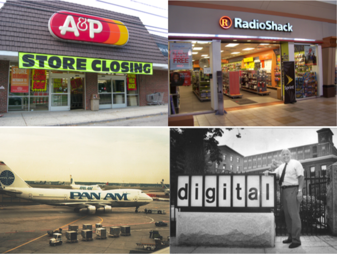
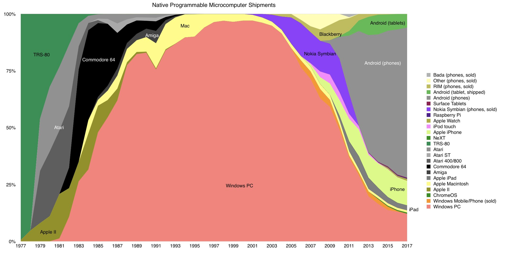
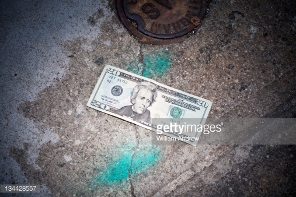

```{r setup, include=FALSE}
options(htmltools.dir.version = FALSE)
knitr::opts_chunk$set(echo=F,
                      message=F,
                      warning=F,
                      fig.retina = 3,
                      fig.align = "center")
library("tidyverse")
library("mosaic")
library("ggrepel")
library("fontawesome")
xaringanExtra::use_tile_view()
xaringanExtra::use_tachyons()
xaringanExtra::use_freezeframe()

update_geom_defaults("label", list(family = "Fira Sans Condensed"))
update_geom_defaults("text", list(family = "Fira Sans Condensed"))

set.seed(256)
```


class: title-slide

# 4.5 — Entrepreneurship & Uncertainty

## ECON 326 • Industrial Organization • Spring 2023

### Ryan Safner<br> Associate Professor of Economics <br> <a href="mailto:safner@hood.edu"><i class="fa fa-paper-plane fa-fw"></i>safner@hood.edu</a> <br> <a href="https://github.com/ryansafner/ioS23"><i class="fa fa-github fa-fw"></i>ryansafner/ioS23</a><br> <a href="https://ioS23.classes.ryansafner.com"> <i class="fa fa-globe fa-fw"></i>ioS23.classes.ryansafner.com</a><br>

---

class: inverse, center, middle

# Uncertainty, Competition, and Profits

---

# The Model is Not the Reality

.pull-left[

- Our models so far have given us interesting results

- But are **fictional**, a static picture of the world with a lot of assumptions

- But **still** show us useful insights about how a market economy works

- Some great readings in today's readings page to help you understand

]

.pull-right[
.center[

]
]

---

# The Model is Not the Reality

.center[


Source: [SMBC](https://www.smbc-comics.com/comic/2013-09-19)

"Shame on the three of you who enjoyed this joke"
]

---

# Profits and Uncertainty

.left-column[
.center[


.smallest[
Frank H. Knight

1885-1972
]
]
]

.right-column[

.smaller[
> “.hi[Uncertainty must be taken in a sense radically distinct from the familiar notion of Risk], from which it has never been properly separated...The essential fact is that .hi['risk' means in some cases a quantity susceptible of measurement], while at other times it is something distinctly not of this character; and there are far-reaching and crucial differences in the bearings of the phenomena depending on which of the two is really present and operating...It will appear that a measurable uncertainty, or 'risk' proper, as we shall use the term, is so far different from an unmeasurable one that it is not in effect an uncertainty at all,” (p.21)

]
]

.source[Knight, Frank H, 1921, [*Risk, Uncertainty, and Profit*](https://oll.libertyfund.org/titles/knight-risk-uncertainty-and-profit)]

---

# Uncertainty $\neq$ Risk

.center[

<iframe width="980" height="550" src="https://www.youtube.com/embed/GiPe1OiKQuk" frameborder="0" allow="accelerometer; autoplay; encrypted-media; gyroscope; picture-in-picture" allowfullscreen></iframe>

]

---

# Uncertainty $\neq$ Risk

.left-column[
.center[

]
]

.right-column[

- **“Known knowns”**: .hi-purple[perfect information]
  - Everybody knows everything
  - Everybody knows that everybody knows everything
  - Maximize utility, profit, etc.

- **“Known unknowns”**: .hi-purple[risk]
  - We can estimate the .hi-turquoise[probability distribution] of states of the world that *could* happen
  - We just don’t know *which* state will be realized
  - Maximize *expected* utility, etc.

]

---

# Uncertainty $\neq$ Risk

.left-column[
.center[

]
]

.right-column[

- **“Unknown unknowns”**: .hi[uncertainty]
  - We don’t know the probability distribution
  - We dont’t even know the *possible* states of the world!
  - No model to optimize in a world of uncertainty!
]

---

# Profits and Uncertainty

.left-column[
.center[


.smallest[
John Maynard Keynes

1883-1946
]
]
]

.right-column[

> “By ‘uncertain’ knowledge...I do not mean merely to distinguish what is known for certain from what is only probable. The game of roulette is not subject, in this sense, to uncertainty...The sense in which I am using the term is that in which the prospect of a European war is uncertain, or the price of copper and the rate of interest twenty years hence, or the obsolescence of a new invention...About these matters there is no scientific basis on which to form any calculable probability whatever. We simply do not know!”


]

.source[Keynes, John Maynard, 1936, *The General Theory of Employment, Interest, and Money*]

---

# Aside: Uncertainty vs. Behavioral Economics

.left-column[
.center[

]
]

.right-column[

- Decisions under uncertainty $\neq$ decisions under risk
  - impossible to *optimize* because you don’t know what model to use!

- Behavioral Economics: humans systematically make “wrong” or “irrational” decisions
  - But “irrational” is defined according to an ideal optimization model under *risk*, not uncertainty!

]

.source[Gigerenzer, Gerd, 2012, [<i class="fab fa-youtube"></i> "What Can Economists Know?"](https://www.youtube.com/watch?v=DdEEwoKkfMA), Institute for New Economic Thinking's (INET) Paradigm Lost Conference, Berlin

Smith, Vernon, L, 2003, [<i class="fab fa-youtube"></i> "Constructivist and Ecological Rationality in Economics (Nobel Prize Lecture)](https://www.nobelprize.org/prizes/economic-sciences/2002/smith/lecture/)]

---

# Aside: Uncertainty vs. Behavioral Economics

.left-column[
.center[

]
]

.right-column[

- .hi-purple[Heuristics] under uncertainty allow us to be .hi-purple[“ecologically rational”]
  - Rational within a given environment/context, rather than globally/universally rationally


.source[Gigerenzer, Gerd, 2012, [<i class="fab fa-youtube"></i> "What Can Economists Know?"](https://www.youtube.com/watch?v=DdEEwoKkfMA), Institute for New Economic Thinking's (INET) Paradigm Lost Conference, Berlin

Smith, Vernon, L, 2003, [<i class="fab fa-youtube"></i> "Constructivist and Ecological Rationality in Economics (Nobel Prize Lecture)](https://www.nobelprize.org/prizes/economic-sciences/2002/smith/lecture/)]
]

---

# Profits and Uncertainty

.left-column[
.center[


.smallest[
Frank H. Knight

1885-1972
]
]
]

.right-column[

> “The .hi[primary attribute of competition.]..is the .hi[‘tendency’ to eliminate profit or loss], and .hi[bring the value of economic goods to equality with their cost]...Hence .hi[the problem of profit is one way of looking at the problem between perfect competition and actual competition]....hi[The key to the whole tangle will be found to lie in the notion of risk or uncertainty] and the ambiguities concealed therein,” (pp.18-19).

]

.source[Knight, Frank H, 1921, [*Risk, Uncertainty, and Profit*](https://oll.libertyfund.org/titles/knight-risk-uncertainty-and-profit)]

---

# Profits and Uncertainty

.left-column[
.center[


.smallest[
Frank H. Knight

1885-1972
]
]
]

.right-column[

.smaller[

> “It is this .hi[‘true’ uncertainty], and .hi[not risk], as has been argued, which .hi[forms the basis of a valid theory of profit] and .hi[accounts for the divergence between actual and theoretical competition],” (pp.18-19).

> “The prime essential to that perfect competition which would secure in fact those results to which actual competition only ‘tends,’ is the absence of Uncertainty (in the true, unmeasurable sense)...[Risk] does not preclude perfect planning [and] cannot prevent the complete realization of the tendencies of competitive forces, or give rise to profit,” (pp.20-21)

]
]

.source[Knight, Frank H, 1921, [*Risk, Uncertainty, and Profit*](https://oll.libertyfund.org/titles/knight-risk-uncertainty-and-profit)]

---

# The Role of Entrepreneurial Judgment

.left-column[
.center[


.smallest[
Frank H. Knight

1885-1972
]
]
]

.right-column[

- .hi-purple[“Knightian uncertainty”]: not that we can’t assign probabilities to each outcome; we do not have the knowledge necessary to list all possible outcomes!

- Requires .hi-purple[entrepreneurial judgment] to *both*:
  1. estimate possible actions and
  2. estimate the likelihood of their success
]

.source[Langlois, Richard L. and Metin Cosgel, 1993, "Frank Knight on Risk, Uncertainty, and the Firm: A New Interpretation," *Economic Inquiry* 31]

---

# Entrepreneurial Judgment

.left-column[
.center[

.smallest[
Henry Ford

1863-1947
]
]

]

.right-column[

> “If I had asked people what they wanted, they would have said **faster horses**,” - Henry Ford

]

---

# Entrepreneurial Judgment

.pull-left[
.center[

]
]

.pull-right[

> “It’s really hard to design products by focus groups. A lot of times, **people don't know what they want until you show it to them**.” - Steve Jobs
]

---

class: inverse, center, middle

# Schumpeterian Entrepreneurship

---

# Schumpeterian Entrepreneurship

.left-column[
.center[


Joseph Schumpeter

1883-1950
]
]

.right-column[
.smaller[
> “The carrying out of new combinations we call “enterprise”; the individuals whose function it is to carry them out we call “entrepreneurs,” (p.74).

> “As it is the carrying out of new combinations that constitutes the entrepreneur, it is not necessary that he should be permanently connected with an individual firm...On the other hand, our concept is narrower than the traditional one in that it does not include all heads of firms or managers or industrialists who merely may operate an established business, but only those who actually perform that function,” (p.75).

]

.source[Schumpeter, Joseph, 1934, *The Theory of Economic Development*]
]

---

# Schumpeterian Entrepreneurship

.left-column[
.center[


Joseph Schumpeter

1883-1950
]
]

.right-column[

> But whatever the type, everyone is an entrepreneur only when he actually
“carries out new combinations,” and loses that character as soon as he has
built up his business, when he settles down to running it as other people
run their businesses. This is the rule, of course, and hence it is just as rare for anyone always to remain an entrepreneur throughout the decades
of his active life as it is for a businessman never to have a moment in
which he is an entrepreneur, to however modest a degree. (p.78)

.source[Schumpeter, Joseph, 1934, *The Theory of Economic Development*]
]

---

# Markets as an Evolutionary Process

.left-column[
.center[


Joseph Schumpeter

1883-1950
]
]

.right-column[
.smallest[
> “The fundamental new impulse that sets and keeps the capitalist engine in motion comes from the new consumers’ goods, the new methods of production or
transportation, the new markets, the new forms of industrial organization that capitalist enterprise creates...that incessantly revolutionizes the economic structure from within, incessantly destroying the old one, incessantly creating a new one. .hi[This process of Creative Destruction is the essential fact about capitalism.],” (pp.82-84).

]

.source[Schumpeter, Joseph A, (1947), *Capitalism, Socialism, and Democracy*]
]

---

# Markets as an Evolutionary Process

.left-column[
.center[


Joseph Schumpeter

1883-1950
]
]

.right-column[
.smallest[
> “Capitalism...is by nature a form of economic change and not only never is but never can be stationary...The essential point to grasp is that in dealing with capitalism we are dealing with an .hi[evolutionary process],” (pp.82). 

]

.source[Schumpeter, Joseph A, (1947), *Capitalism, Socialism, and Democracy*]

]

---

# Real World Competition vs. Textbook Competition

.left-column[
.center[


Joseph Schumpeter

1883-1950
]
]

.right-column[

.smaller[
> “The first thing to go [when we look in reality] is the traditional conception of the modus operandi of competition....hi[in capitalist reality as distinguished from its textbook picture], it is not that kind of competition that counts but from the new commodity, the new technology, the new source of supply, the new type of organization....hi[competition] which commands a decisive cost or quality advantage .hi[which strikes not at the margins of the profits and the outputs of the existing firms but at their foundations and their very lives],” (p.132).

]

.source[Schumpeter, Joseph A, (1947), *Capitalism, Socialism, and Democracy*]
]
---

# Real World Competition vs. Textbook Competition

.left-column[
.center[


Joseph Schumpeter

1883-1950
]
]

.right-column[

> “It is hardly necessary to point out that competition of the kind we now have in mind acts not only when in being but also when .hi[it is merely an ever-present threat]. It disciplines before it attacks. The businessman feels himself to be in a competitive situation even if he is alone in his field,” (pp. 84-85).

.source[Schumpeter, Joseph A, (1947), *Capitalism, Socialism, and Democracy*]
]

---

# Real World Competition vs. Textbook Competition

.left-column[
.center[


Joseph Schumpeter

1883-1950
]
]

.right-column[

.smaller[
> “If we look more closely at the conditions ... that must be fulfilled in order to produce perfect competition, we realize immediately that outside of agricultural mass production there cannot be many instances of it,” (pp.78–79).

> “[I]t becomes evident immediately that pure cases of long-run monopoly must be of the rarest occurrence and that even tolerable approximations to the requirements of the concept must be still rarer than are cases of perfect competition,” (p.99).

]

.source[Schumpeter, Joseph A, (1947), *Capitalism, Socialism, and Democracy*]
]

---

# Real World Competition vs. Textbook Competition

.left-column[
.center[


Joseph Schumpeter

1883-1950
]
]

.right-column[

.quitesmall[
> “First, since we are dealing with a process whose every element takes
considerable time in revealing its true features and ultimate effects, .hi[there is no point in appraising the performance of that process [at] a given point of time; we must judge its performance over time], as it unfolds through decades or centuries. A system — any system, economic or other — that at every given point of time fully utilizes its possibilities to the best advantage may yet in the long run be inferior to a system that does so
at no given point of time, because the latter’s failure to do so may be
a condition for the level or speed of long-run performance,” (p.83).

> “In this respect, .hi[perfect competition is not only impossible but inferior, and has no title to being set up as a model of ideal efficiency],” (p.106).

]
.source[Schumpeter, Joseph A, (1947), *Capitalism, Socialism, and Democracy*]
]


---

# Creative Destruction

.left-column[
.center[


Joseph Schumpeter

1883-1950
]
]

.right-column[

> “Industrial mutation...that .hi[incessantly revolutionizes the economic structure from within], incessantly destroying the old one, incessantly creating a new one.  This .hi[process of Creative Destruction is the essential fact about capitalism].  It is what capitalism consists in and what every capitalist concern has got to live in. Every piece of business strategy acquires its true significance only against the background of that process and within the situation created by it.” (p.83).

]

.source[Schumpeter, Joseph A, (1947), *Capitalism, Socialism, and Democracy*]

---

# Large Firms Play An Important Role Historically

.left-column[
.center[


Joseph Schumpeter

1883-1950
]
]

.right-column[

> “As soon as we go into details and inquire into the individual items in which progress was most conspicuous, the trail leads not to the doors of those firms that work under conditions of comparatively free competition but precisely to the doors of the large concerns...and a shocking suspicion dawns upon us that big business may have had more to do with creating that standard of life than with keeping it down, (p.82).

]

.source[Schumpeter, Joseph A, (1947), *Capitalism, Socialism, and Democracy*]


---

# But They, And Profit, Are Temporary

.left-column[
.center[


Joseph Schumpeter

1883-1950
]
]

.right-column[

> “[V]isualize an entrepreneur who...carries out an innovation ..that his
receipts will exceed his costs. The difference we shall call Entrepreneurs’
Profit, or simply Profit. It is the premium put upon successful innovation in capitalist society and is temporary by nature: It will vanish in the
subsequent process of competition and adaption,” (p.105).

> “In some cases, however, it is so successful as to yield profits far above
what is necessary in order to induce the corresponding investment. These cases then provide the baits that lure capital on to untried trails,” (p.90)

]

.source[Schumpeter, Joseph A, (1939), *Business Cycles*]

---

# Creative Destruction: Examples

.pull-left[
.center[

]
]
.pull-right[
.center[

]
]

---

# Creative Destruction: Example II

.center[

]

---

# Creative Destruction: Example III

.center[


59 years of progress
]

---

# No Corporate Monolith Lasts Forever (On Its Own)

.center[

]

---

# No Corporate Monolith Lasts Forever (On Its Own)

.center[

]

---

# No Corporate Monolith Lasts Forever (On Its Own)

.center[

]

---

# No Corporate Monolith Lasts Forever (On Its Own)

.center[

]

---

# No Corporate Monolith Lasts Forever (On Its Own)

.center[

]

---

class: inverse, center, middle

# Kirznerian Entrepreneurship

---


# Entrepreneurship and the Pursuit of Profit

.left-column[
.center[


.smallest[
Israel M. Kirzner

1930-
]
]
]

.right-column[

> “The entrepreneurial element in the economic behavior of market participants consists in their .hi[alertness to] previously unnoticed changes in .hi[circumstances which may make it possible to get far more in exchange for whatever they have to offer than was hitherto possible],” (p.15).

]

.source[Kirzner, Israel M, 1973, *Competition and Entrepreneurship*]
---


# Entrepreneurship and the Pursuit of Profit

.left-column[
.center[


.smallest[
Israel M. Kirzner

1930-
]
]
]

.right-column[

.smallest[

> “In this process the .hi[plans of consumers and of resource owners are gradually brought into greater and greater consistency with one another.]  Consumers’ .hi[initial ignorance] of the kinds of commodities technologically possible with currently available resources and of the relative prices at which these commodities can in principle be produced .hi[gradually diminishes]...The .hi[new knowledge is acquired through changes in the prices of resources and of products], brought about by the bids and offers of the entrepreneur-producers who are eagerly competing for the profits to be won by discovering where resource owners and consumers have (in effect) underestimated each other's eagerness to buy or sell,” (p.18).

]
]

.source[Kirzner, Israel M, 1973, *Competition and Entrepreneurship*]
---

# Entrepreneurship and the Pursuit of Profit

.left-column[
.center[


.smallest[
Israel M. Kirzner

1930-
]
]
]

.right-column[

> “[Entrepreneurship is] the ability to see where new products have become unsuspectedly valuable to consumers and where new methods of production have, unknown to others, become feasible. [It] consists not of shifting the curves of cost or of revenues which face him, but of noticing that they have in fact shifted,” (p.15).

]

.source[Kirzner, Israel M, 1973, *Competition and Entrepreneurship*]

---

# Entrepreneurship and the Pursuit of Profit


.pull-left[

- .hi[Entrepreneurship]: being alert to **profit opportunities** and entering a market as a seller to try to capture gains from trade/innovation
]

.pull-right[
.center[

]
]

---

# Entrepreneurship and the Pursuit of Profit

.center[

]

---

# Entrepreneurship and the Pursuit of Profit

.left-column[
.center[


Mark Zuckerberg

1984-
]
]

.right-column[

> “Why were we the ones to build [Facebook]? We were just students. We had way fewer resources than big companies. If they had focused on this problem, they could have done it. 
The only answer I can think of is: **we just cared more**. 
**While some doubted** that connecting the world was actually important, **we were building**. While others doubted that this would be sustainable, **we were forming lasting connections**.”

]


---

# Firm's Can’t “Maximize Profits” Under Uncertainty! 

.left-column[
.center[


.smallest[
Armen A. Alchian

1914-2013
]
]
]

.right-column[

.smaller[

> “.hi[In the presence of uncertainty] - a necessary condition for the existence of profits - .hi[there is no meaningful criterion for selecting the decision that will 'maximize profits.'] The maximum-profit criterion is not meaningful as a basis *for selecting* the action which will, in fact, result in an outcome with higher profits than any other action would have...” (p.212).

> “The only way to make ‘profit maximization’ a specifically meaningful action is to postulate a model containing certainty,” (p.213).

]
]

.source[Alchian, Armen A, 1950, "Uncertainty, Evolution, and Economic Theory," *Journal of Political Economy* 58(3): 211-221]


---

# Firm's Can’t “Maximize Profits” Under Uncertainty! 

.left-column[
.center[


.smallest[
Armen A. Alchian

1914-2013
]
]
]

.right-column[

> “In an economic system the realization of profits is the criterion according to which successful and surviving firms are selected...Realized positive profits, not *maximum* profits, are the mark of success and viability. It does not matter through what process of reasoning or motivation such success was achieved. The fact of its accomplishment is sufficient. This is the criterion by which the economic system selects survivors: those who realize *positive profits* are the survivors; those who suffer losses disappear,” (p.213).

]

.source[Alchian, Armen A, 1950, "Uncertainty, Evolution, and Economic Theory," *Journal of Political Economy* 58(3): 211-221]


---

# Firm's Can’t “Maximize Profits” Under Uncertainty! 

.left-column[
.center[


.smallest[
Armen A. Alchian

1914-2013
]
]
]

.right-column[

.smaller[
> “Positive profits accrue to those who are better than their actual competitors, even if the participants are ignorant, intelligent, skillful, etc. The crucial element is one's aggregate position relative to actual competitors, not hypotheticallhy perfect competitors. As in a race, the award goes to the relatively fastest, even if all the competitors loaf. Even in a world of stupid men there would still be profits. Also, the greater the uncertainties of the world, the greater is the possibility that profits would go to venturesome and lucky rather than to logical, careful, fact-gathering, individuals,” (p.213).

]
]

.source[Alchian, Armen A, 1950, "Uncertainty, Evolution, and Economic Theory," *Journal of Political Economy* 58(3): 211-221]

---

# Firm's Can’t “Maximize Profits” Under Uncertainty! 

.left-column[
.center[


.smallest[
Armen A. Alchian

1914-2013
]
]
]

.right-column[

> “[A]lthough individual participants may not know their cost and revenue situations, the economist can predict the consequences of higher wage rates, taxes, government policy, etc. Like the biologist, the economist predicts the effects of environmental changes on the surviving class of living organisms; the economist need not assume that each participant is aware of, or acts according to, his cost and demand situation,” (p.220-221).

]

.source[Alchian, Armen A, 1950, "Uncertainty, Evolution, and Economic Theory," *Journal of Political Economy* 58(3): 211-221]

---

class: inverse, center, middle

# Assessing “Perfect Competition”

---

# Assessing “Perfect Competition”

.left-column[
.center[


.smallest[
Friedrich A. Hayek

1899-1992

Economics Nobel 1974
]
]
]

.right-column[

.smaller[
> “It appears to be generally held that the so-called theory of 'perfect competition' provides the appropriate model for judging the effectiveness of competition in real life and that, to the extent that real competition differs from that model, it is undesirable and even harmful. For this attitude there seems to me to exist very little justification....[W]hat the theory of perfect competition discusses has little claim to be called 'competition' at all, and that its conclusions are of little use as guides to policy.”

]
]

.source[Hayek, Friedrich A, 1948, "The Meaning of Competition," Chapter V in *Individualism and Economic Order*]

---

# Assessing “Perfect Competition”

.left-column[
.center[


.smallest[
Friedrich A. Hayek

1899-1992

Economics Nobel 1974
]
]
]

.right-column[

.smaller[

> “[The Perfect competition model] throughout assumes that state of affairs *already to exist* which...the *process of competition* tends to *bring about* (or to approximate) and that, if the state of affairs assumed by the theory of perfect competition ever existed, it would not only deprive of their scope all the activities which the verb "to compete" describes but would make them virtually impossible. ... Advertising, undercutting, and improving ('differentiating') the goods or services produced are all excluded by definition — ‘perfect’ competition means indeed the absence of all competitive activities.”

]
]

.source[Hayek, Friedrich A, 1948, "The Meaning of Competition," Chapter V in *Individualism and Economic Order*]

---

# Assessing “Perfect Competition”

.left-column[
.center[


.smallest[
Friedrich A. Hayek

1899-1992

Economics Nobel 1974
]
]
]

.right-column[

.smaller[

> “When we deal, however, with a situation in which a number of persons are attempting to work out their separate plans...the problem becomes one of how the "data" of the different individuals on which they base their plans are adjusted to the objective facts of their environment (which includes the actions of the other people).”

> “Or, to anticipate our main conclusion in a brief statement, competition is by its nature a dynamic process whose essential characteristics are assumed away by the assumptions underlying static analysis [in the perfect competition model].”

]
]

.source[Hayek, Friedrich A, 1948, "The Meaning of Competition," Chapter V in *Individualism and Economic Order*]

---

# Assessing “Perfect Competition”

.left-column[
.center[


.smallest[
Friedrich A. Hayek

1899-1992

Economics Nobel 1974
]
]
]

.right-column[

.smallest[

> “Yet the current tendency in discussion is to be intolerant about the imperfections and to be silent about the prevention of competition. We can probably still learn more about the real significance of competition by studying the results which regularly occur where competition is deliberately suppressed than by concentrating on the shortcomings of actual competition compared with an ideal which is irrelevant for the given facts.”

> “I say advisedly ‘where competition is deliberately suppressed’ and not merely ‘where it is absent,’ because its main effects are usually operating, even if more slowly, so long as it is not outright suppressed with the assistance or the tolerance of the state.”

]
]

.source[Hayek, Friedrich A, 1948, "The Meaning of Competition," Chapter V in *Individualism and Economic Order*]

---

# Assessing “Perfect Competition”

.left-column[
.center[


.smallest[
Friedrich A. Hayek

1899-1992

Economics Nobel 1974
]
]
]

.right-column[

.smallest[

> “The evils which experience has shown to be the regular consequence of a suppression of competition are on a different plane from those which the imperfections of competition may cause. Much more serious than the fact that prices may not correspond to marginal cost is the fact that, with an entrenched monopoly, costs are likely to be much higher than is necessary.”

> “A monopoly based on superior efficiency, on the other hand, does comparatively little harm so long as it is assured that it will disappear as soon as anyone else becomes more efficient in providing satisfaction to the consumers.”

]
]

.source[Hayek, Friedrich A, 1948, "The Meaning of Competition," Chapter V in *Individualism and Economic Order*]

---

# Something For You To Reflect On

.pull-left[
- .hi-purple[What is “competition?”]

- Economists tend to use it as a noun — perfect competition, an end-state equilibrium
  - There’s no actual competing in perfect competition!

]

.pull-right[
.center[

]
]

---

# So What’s the Point of the Models?

.pull-left[
- In perfect competition (model):
  - price-taking firms set price equal to marginal cost
  - long run economic profits are zero
  - allocative efficiency: consumer and producer surplus maximized

- This is a *tendency* .hi[only because of **free entry and exit**]

]

.pull-right[
.center[

]
]

---

# So What’s the Point of the Models?

.pull-left[

- **Don’t judge real markets by their similarity to the perfect competition model**

- Judge them more on their level of contestability, ease of potential entry

.smallest[
> "...In that Empire, the Art of Cartography attained such Perfection that the map of a single Province occupied the entirety of a City, and the map of the Empire, the entirety of a Province.  In time, those Unconscionable Maps no longer satisfied, and the Cartographers Guilds struck a Map of the Empire whose size was that of the Empire, and which coincided point for point with  it. The following Generations, who were not so fond of the Study of Cartography as their Forebears had been, saw that that vast Map was Useless..."

]

]

.pull-right[
.center[

]
]
