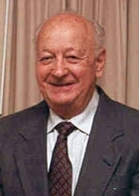
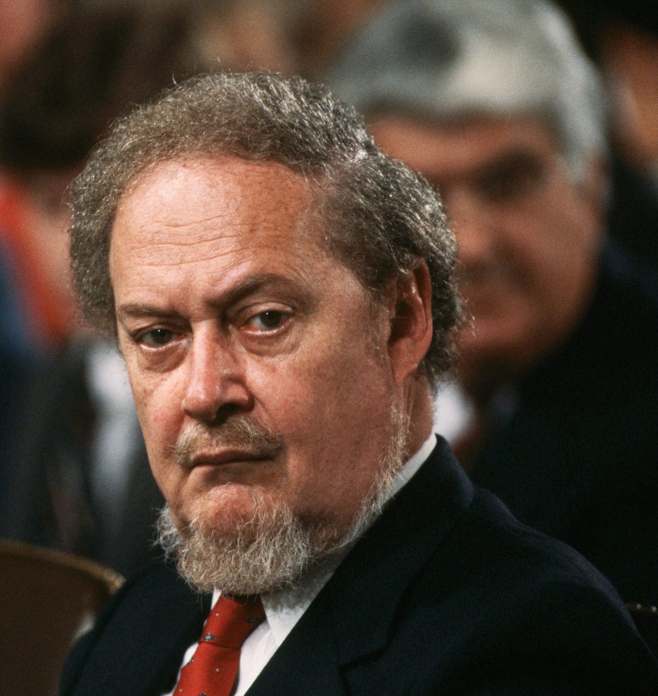
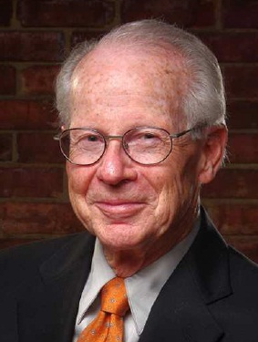
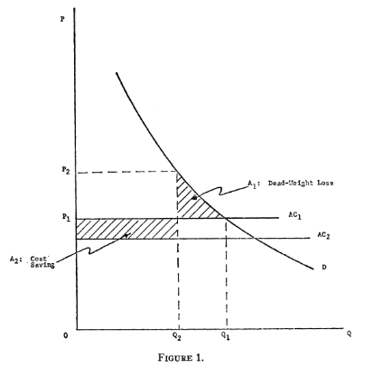
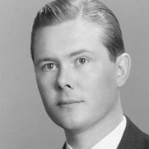
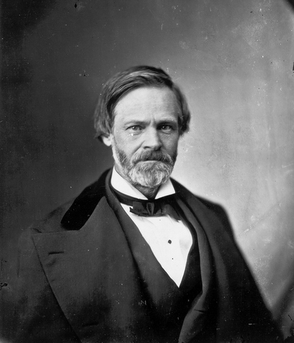
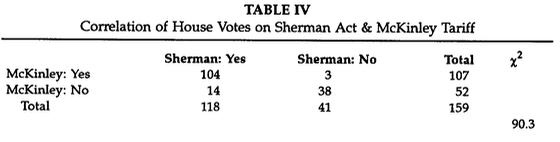

```{r setup, include=FALSE}
options(htmltools.dir.version = FALSE)
knitr::opts_chunk$set(echo=F,
                      message=F,
                      warning=F,
                      fig.retina = 3,
                      fig.align = "center")
library("tidyverse")
library("mosaic")
library("ggrepel")
library("fontawesome")
xaringanExtra::use_tile_view()
xaringanExtra::use_tachyons()
xaringanExtra::use_freezeframe()

update_geom_defaults("label", list(family = "Fira Sans Condensed"))
update_geom_defaults("text", list(family = "Fira Sans Condensed"))

set.seed(256)
```

class: title-slide

# 5.3 — Antitrust II: The Paradox

## ECON 326 • Industrial Organization • Spring 2023

### Ryan Safner<br> Associate Professor of Economics <br> <a href="mailto:safner@hood.edu"><i class="fa fa-paper-plane fa-fw"></i>safner@hood.edu</a> <br> <a href="https://github.com/ryansafner/ioS23"><i class="fa fa-github fa-fw"></i>ryansafner/ioS23</a><br> <a href="https://ioS23.classes.ryansafner.com"> <i class="fa fa-globe fa-fw"></i>ioS23.classes.ryansafner.com</a><br>

---

class: inverse

# Outline

### [Is Monopoly/Concentration Always Bad?](#4)

### [The Paradox of Antitrust](#9)

### [Historical Revisionism of the Gilded Age](#30)

### [The Legislative History & Intent of Sherman Act](#57)

---

# Antitrust II: The Paradox

.pull-left[
.center[

]
]

.pull-right[

Last class: The Laws, and evolution of legal & economic thinking

Today:

- The Antitrust Paradox
  - Antitrust as small-business protectionism

- Revisionist history of antitrust
  - Robber barons/progressive era

- Legislative history/intent of Sherman Act

- Rent-seeking and public policy
]

---

class: inverse, center, middle

# Is Monopoly/Concentration Always Bad?

---

# Monopoly/Concentration Through Efficiency?

.left-column[
.center[


Harold Demsetz

1930-2019
]
]

.right-column[

.smallest[
> “This paper takes a critical view of contemporary doctrine in this area [of identifying monopolies and monopolization] and presents data which suggest that this doctrine offers a dangerous base upon which to build a policy toward business.” (p.1).

> “Under the pressure of competitive rivalry, and in the apparent absence of effective barriers to entry, it would seem that the concentration of an industry's output in a few firms could only derive from their superiority in producing and marketing products or in the superiority of a structure of industry in which there are only a few firms,” (p.1).

]

.source[Demsetz, Harold, 1973, “Industry Structure, Market Rivalry, and Public Policy,” *Journal of Law & Economics* 16(1): 1-9]
]

---

# Monopoly/Concentration Through Efficiency?

.left-column[
.center[


Harold Demsetz

1930-2019
]
]

.right-column[

.smallest[
> “None of this is necessarily monopolistic (although monopoly may play some role). Profit does not arise because the firm creates ‘artificial scarcity’ through a reduction in its output. Nor does it arise because of collusion. Superior performance can be attributed to the combination of great uncertainty plus luck or atypical insight by the management of a firm. It is not until the experiments are actually tried that we learn which succeed and which fail. By the time the results are in, it is the shareholder that has captured (some of) the value, positive or negative, of past decisions. Even though the profits that arise from a firm's activities may be eroded by competitive imitation, since information is costly to obtain and techniques are difficult to duplicate, the firm may enjoy growth and a superior rate of return for some time,” (p.3).

]

.source[Demsetz, Harold, 1973, “Industry Structure, Market Rivalry, and Public Policy,” *Journal of Law & Economics* 16(1): 1-9]
]

---

# Monopoly/Concentration Through Efficiency?

.left-column[
.center[


Harold Demsetz

1930-2019
]
]

.right-column[

.quitesmall[
> “Superior ability also may be interpreted as a competitive basis for acquiring a measure of monopoly power. In a world in which information is costly and the future is uncertain, a firm that seizes an opportunity to better serve customers does so because it expects to enjoy some protection from rivals because of their ignorance of this opportunity or because of their inability timitate quickly. One possible source of some monopoly power is superior entrepreneurship. Our patent, copyright, and trademark laws explicitly provide as a reward for uncovering new methods (and for revealing these methods), legal protection against free imitation, and it may be true in some cases that an astute rival acquires the exclusive rights to some resource that later becomes valuable. There is no reason to suppose that competitive behavior never yields monopoly power, although in many cases such power may be exercised not by creating entry barriers, but through the natural frictions and ignorance that characterize any real economy. If rivals seek better ways to satisfy buyers or to produce a product, and if one or a few succeed in such endeavors, then the reward for their entrepreneurial efforts is likely to be some (short term) monopoly power and this may be associated with increased industrial concentration. To destroy such power when it arises may very well remove the incentive for progress,” (p.3)

]

.source[Demsetz, Harold, 1973, “Industry Structure, Market Rivalry, and Public Policy,” *Journal of Law & Economics* 16(1): 1-9]
]

---

# Monopoly/Concentration Through Efficiency?

.left-column[
.center[


Harold Demsetz

1930-2019
]
]

.right-column[

.quitesmall[
> “I have presented an explanation of industry structure and profitability based on competitive superiority. The problem faced by a deconcentration or anti-merger policy was posed on the basis of this explanation. Is there a danger that such a policy will produce more inefficiency than it eliminates? The data presented suggest that this danger should be taken seriously,” (p.9).

]

.source[Demsetz, Harold, 1973, “Industry Structure, Market Rivalry, and Public Policy,” *Journal of Law & Economics* 16(1): 1-9]

]

---

class: inverse, center, middle

# The Paradox of Antitrust

---

# Robert Bork

.left-column[
.center[

.smaller[
Robert Bork

1927-2012
]
]
]

.right-column[
.smaller[
- U.S. Solicitor General (1973-1977)

- Judge on U.S. Court of Appeals for the D.C. Circuit (1982-1988)

- 1987 nominee for U.S. Supreme Court (Senate famously voted down his nomination)

- Influenced/by (second generation) Chicago School of economics

- Makes two key (and influential) points:
  1. What is the *goal* of antitrust?
  2. How antitrust has been practiced is inconsistent, even paradoxical
]
]

---

# Robert Bork and the Goals of the Sherman Act

.left-column[
.center[

.smaller[
Robert Bork

1927-2012
]

]
]

.right-column[

.quitesmall[
> “Despite the obvious importance of the question to a statute as vaguely phrased as the Sherman Act, the federal courts in all the years since 1890 have never arrived at a definitive statement of the values or policies which control the law's application and evolution. The question of values, therefore, remains central to the controversy about this basic law and its interpretation...Nevertheless, a starting point is the question of legislative intent. In this paper I propose to answer the question.. My conclusion, drawn from the evidence in the Congressional Record, is that Congress intended the courts to implement (that is, to take into account in the decision of cases) only that value we would today call consumer welfare. To put it another way, the policy the courts were intended to apply is the maximization of wealth or consumer want satisfaction. This requires courts to distinguish between agreements or activities that increase wealth through efficiency and those that decrease it through restriction of output,” (p.7).


]

.source[Bork, Robert H, 1966, “Legislative Intent and the Policy of the Sherman Act,” *Journal of Law & Economics* 9: 7-48]

]
---

# Robert Bork and the Goals of the Sherman Act

.left-column[
.center[

.smaller[
Robert Bork

1927-2012
]

]
]

.right-column[

.smallest[

> “Failure to settle the issue of values has led inevitably to a degree of irresponsibility in the judicial process...Often a court will announce a value in deciding a Sherman Act case without explaining either the selection of the value or the method of its application to the facts...One is tempted, and perhaps occasionally entitled, to suspect that such a suddenly appearing value is a *deus ex machina* by which the court rescues itself from the perplexing task of economic analysis and judgment that rigorous adherence to a consumer-welfare value premise would sometimes require,” (pp.7-8).

]

.source[Bork, Robert H, 1966, “Legislative Intent and the Policy of the Sherman Act,” *Journal of Law & Economics* 9: 7-48]

]

---


# Robert Bork and the Goals of the Sherman Act

.left-column[
.center[

.smaller[
Robert Bork

1927-2012
]

]
]

.right-column[

.quitesmall[

“Values other than consumer welfare apparently played large roles in [some famous cases]...In *Alcoa*, the Court of Appeals for the Second Circuit judged illegal Aluminum Company of America’s large market position in virgin aluminum ingot. In an assertion seemingly important to his argument, Judge Hand said:

]

.tiny[
> ‘We have been speaking only of the economic reasons which forbid monopoly; but...there are others, based upon the belief that great industrial consolidations are inherently undesirable, *regardless of their economic results.* In the debates in Congress Senator Sherman himself...showed that among the purposes of Congress
in 1890 was a desire to put an end to great aggregations of capital because of the helplessness of the individual before them.’ (Emphasis added).

]

.quitesmall[

Without pausing to explain what the noneconomic helplessness of the individual might consist of, what category of individuals was involved, or how the concept applied to the facts of the case before him, Judge Hand moved on to another formulation of noneconomic values supposedly embedded in the statute:

]

.tiny[
> ‘Throughout the history of the statutes [the antitrust laws, including the Sherman Act] it has been constantly assumed that one of their purposes was to perpetuate and preserve, for its own sake and *in spite of the possible cost*, an organization of industry in small units which can effectively compete with each other.’

]

.quitesmall[
The passage was followed immediately by: ‘We hold ‘Alcoa’s’ monopoly of ingot was the kind covered by Sec. 2 [of the Sherman Act].’
,” (pp.8-9).

]

.source[Bork, Robert H, 1966, “Legislative Intent and the Policy of the Sherman Act,” *Journal of Law & Economics* 9: 7-48]

]

---

# Robert Bork and the Goals of the Sherman Act

.left-column[
.center[

.smaller[
Robert Bork

1927-2012
]

]
]

.right-column[

.smallest[

> “The legislative history, in fact, contains no colorable support for application by courts of any value premise or policy other than the maximization of consumer welfare. The legislators did not, of course, speak of consumer welfare with the precision of a modern economist but their reasoning was unmistakeable...In short, since the legislative history of the Sherman Act shows consumer welfare to be the decisive value it should be treated by a court as the only value,” (pp.10-11).

]

.source[Bork, Robert H, 1966, “Legislative Intent and the Policy of the Sherman Act,” *Journal of Law & Economics* 9: 7-48]

]

---

# Robert Bork and the Paradox of Antitrust

.left-column[
.center[

]
]

.right-column[
.smallest[
- 1978 *Paradox of Antitrust*

- Antitrust law (as it was practiced into the 1960s) is a paradox: it was being used to .hi[protect competitors] by making it .hi[illegal to compete], which hurts consumers

- Antitrust law and enforcement consists of a conflict of interests:
  1. Consumer welfare
  2. Protectionism for small businesses

- Antitrust law protects some businesses by restraining competition
  - restraining largest businesses because they are "too big"
  - might be that they are the most efficient!
]
]

---

# Robert Bork and the Paradox of Antitrust

.left-column[
.center[

]
]

.right-column[

.smaller[
> "What we all ‘know’ is wrong. We are working from an intellectual base that does not exist. What is true is that our ideas are old; they carry whatever credentials time alone can confer...we never really understood the sweeping implications of these ideas. But it is *not* true, as we trustingly assume, that these ideas were demonstrated theoretically or confirmed empirically..." (pp.11-12)

]
.source[Bork, Robert H, 1978, *The Antitrust Paradox*]
]

---

# Robert Bork and the Paradox of Antitrust

.left-column[
.center[

]
]

.right-column[

.quitesmall[
> “The accepted view is well expressed by [a case opinion that says]: ‘The *per se* rule of prohibition...has been applied to price-fixing agreements, group boycotts, tying arrangements, and horizontal divisions of markets. As to each of these practicices, experience and analysis have established the utter lack of justification to excuse its inherent threat to competition’ ... [these statements] are clearly, though unintentionally, misleading...The point here is that the history cited does not exist. Never has ‘experience’ demonstrated the anticompetitive nature of any of these practices. Experience may demonstrate that a practice raises prices or that it injures a rival, but that is all, and many competitive practices do the same things. Only theory can separate the competitive from the anticompeteive, and as for that, these rules referred to were not estliabhed on a foundation of ‘analysis,’” (p.12)

]
.source[Bork, Robert H, 1978, *The Antitrust Paradox*]
]

---

# Robert Bork and the Paradox of Antitrust

.left-column[
.center[

]
]

.right-column[

.quitesmall[
> “The lines along which the law should be reformed are clear...:”

> “(1) The goal that should guide the interpretation of the antitrust laws is the welfare of consumers. Departures from that standard destroy the consistency and predictability of the law; run counter to the legislative intent...; and damage the integrity of the judicial process by involving the courts in grossly political choices for which neither the statutes nor any other acceptable source provide any guidance.”(p.421)

> “(2) In judging consumer welfare, productive efficiency, the single most important factor contributing to that welfare, must be given due weight along with allocative efficiency. Failure to consider productive efficiency—or worse, the tendency to view it as pernicious by calling it a ‘barrier to entry’ or a ‘competitive advantage’—is probably the major reason for the deformation of antitrust’s doctrines.”
]

.source[Bork, Robert H, 1978, *The Antitrust Paradox*]

]

---


# Robert Bork and the Paradox of Antitrust

.left-column[
.center[

]
]

.right-column[

.smallest[
> (3) The law should be reformed so that it strikes at three classes of behavior:
> > (a) The suppression of competition by horizontal agreement, such as the nonancillary agreements of rivals or potential rivals to fix prices or divide markets.
> > (b) Horizontal mergers creating very large market shares (those that have fewer than three significant rivals in any market).
> > (c) Deliberate predation engaged in to drive rivals from a market, prevent or delay the entry of rivals, or discipline existing rivals. The kinds of predation that are likely to occur have been discussed, and care must be taken not to confuse hard competition with predation.

]
.source[Bork, Robert H, 1978, *The Antitrust Paradox*]
]

---


# Robert Bork and the Paradox of Antitrust

.left-column[
.center[

]
]

.right-column[

.smallest[
> (4) The law should permit agreements on prices, territories, refusals to deal, and other suppressions of rivalry that are ancillary, i nthe ense discussed, to an integration of productive economic activity. It should abandon its concern with such beneficial practices as small horizontal mergers, all vertical or conglomerate mergers, vertical price maintenance and market division, tying arrangements, exclusive dealing and requirements contracts, ‘predatory’ price cutting, and the like. Antittrust should have no concern with any firm size or industry structure created by internal growth or by a merger more than ten years old. 

> These are not prescriptions for the non-enforcement of the antitrust laws, but rather for their enforcement in a way that advances rather than retards competition and consumer welfare, (p.422)

]
.source[Bork, Robert H, 1978, *The Antitrust Paradox*]
]

---

# Consumer Welfare Standard: Basic Idea

.left-column[
.center[


.smallest[
Olvier E Williamson

1932-

Economics Nobel 2009
]
]
]
.right-column[


> “The effects on resource allocation of a merger that yields economies [e.g. of scale, scope, etc] but extends market power can be investigated in a partial equilibrium context with the help of Figure 1,” (p.21).

]
.source[Williamson, Oliver E, 1968, “Economies as an Antitrust Defense: The Welfare Tradeoffs,” *American Economic Review* 58(1): 18-36]

---

# Consumer Welfare Standard: Basic Idea

.left-column[
.center[

]
]

.right-column[

.quitesmall[
> “The horizontal line labeled $AC_1$ represents the level of average costs of one of the two (or more) firms before the combination, while $AC_2$ shows the level of average costs after the merger. The price before the merger is given by $P_1$ and ... the price after the merger is given by $P_2$ and is assumed to exceed $P_1$ (if it were less than $P_1$ the economic effects of the merger would be strictly positive)...The net welfare effects of the merger are given (approximately) by the two shaded areas...The area designated $A_1$ is the familiar dead-weight loss that would result if price were increased from $P_1$ to $P_2$, assuming that costs remain costant. But since average costs are actually reduced by the merger, the area designated $A_2$, which represents cost savings, must also be taken into account. The net allocative effect is given by the difference $A_2-A_1$, of these two areas,” (pp.21-22).

]

.source[Williamson, Oliver E, 1968, “Economies as an Antitrust Defense: The Welfare Tradeoffs,” *American Economic Review* 58(1): 18-36]

]

---

# Minimum Efficient Scale

.pull-left[

```{r, fig.retina=3}
tiny_mes<-function(x){(4*x-2)^(2)+12}
tiny_mes_2<-function(x){(4*x-4)^(2)+12}
tiny_mes_3<-function(x){(4*x-6)^(2)+12}
tiny_mes_4<-function(x){(4*x-8)^(2)+12}
tiny_mes_5<-function(x){(4*x-10)^(2)+12}
tiny_mes_6<-function(x){(4*x-12)^(2)+12}
tiny_mes_7<-function(x){(4*x-14)^(2)+12}
tiny_mes_8<-function(x){(4*x-16)^(2)+12}

big_mes<-function(x){(0.25*x-2)^(2)+4}

demand<-function(x){20-2*x}

mes_plot<-ggplot(data.frame(x=c(0,10)), aes(x=x))+
  stat_function(fun=demand, geom="line", size=2, color="blue")+
  geom_label(x = 9, y=demand(9), color = "blue", size = 5, label = "Demand")+
    scale_x_continuous(breaks=seq(0,10,1),
                     limits=c(0,10),
                     expand=expand_scale(mult=c(0,0.1)))+
  scale_y_continuous(breaks=seq(0,20,2),
                     limits=c(0,20),
                     labels=scales::dollar,
                     expand=expand_scale(mult=c(0,0.1)))+
  labs(x = "Quantity (thousands)",
       y = "Price")+
  theme_classic(base_family = "Fira Sans Condensed", base_size=20)+
  theme(legend.position = "bottom")

mes_plot+
  stat_function(fun=tiny_mes, geom="line", size=2, color="orange")+
  stat_function(fun=tiny_mes_2, geom="line", size=2, color="orange")+
  stat_function(fun=tiny_mes_3, geom="line", size=2, color="orange")+
  stat_function(fun=tiny_mes_4, geom="line", size=2, color="orange")+
  stat_function(fun=tiny_mes_5, geom="line", size=2, color="orange")+
  stat_function(fun=tiny_mes_6, geom="line", size=2, color="orange")+
  stat_function(fun=tiny_mes_7, geom="line", size=2, color="orange")+
  stat_function(fun=tiny_mes_8, geom="line", size=2, color="orange")+
  geom_segment(x=0, xend=4, y=12, yend=12, size=1, linetype="dashed")+
  geom_segment(x=4, xend=4, y=12, yend=0, size=1, linetype="dashed")+
  geom_label(x=2.5, y=12, label="MES (Competitive)", color="orange", size=5)+
  stat_function(fun=big_mes, geom="line", size=2, color="red")+
  geom_segment(x=0, xend=8, y=4, yend=4, size=1, linetype="dashed")+
  geom_segment(x=8, xend=8, y=4, yend=0, size=1, linetype="dashed")+
  geom_label(x=2.5, y=4, label="MES (Monopoly)", color="red", size=5)
```
]

.pull-right[

- Industries with large .hi[minimum efficient scale (MES)] and .hi[economies of scale], few large firm(s) can serve industry more efficiently than many competitive firms

- Antitrust enforcement forces less efficient "perfect competition" on this industry by restraining the large firm(s)

]

---

# Private Antitrust

.pull-left[
.center[

]
]

.pull-right[

- Recall in private civil cases, a successful antitrust claim can earn the plaintiff .hi-purple[treble damages] against defendant

- Strong incentives for firms to sue their competitors for antitrust violations!

- Antitrust enforcement can be a form of rent-seeking by smaller firms against larger firms
]

---

# Proscriptions for Antitrust Policy

.left-column[
.center[

]
]

.right-column[

- Some practices (overt collusion or cartelization) clearly hurt consumers: price-fixing, geographic market division, mergers that create monopolies

- But many seemingly anti-competitive practices are pro-competitive and benefit consumers:
  - price discrimination, tying, bundling, vertical contractual restraints, etc.
  - think of lectures 4.3, 4.4, 4.5 for pro-competitive, efficiency reasons for these practices 

]

---

# Consumer Welfare Standard

.pull-left[
```{r, fig.retina=3}
mc<-function(x){2}
demand<-function(x){10-x}
mr<-function(x){10-2*x}

CS<-tibble(x=c(0,0,8),
           y=c(10,2,2))

CS_2<-tibble(x=c(0,0,4),
           y=c(10,6,6))
dwl<-tibble(x=c(4,4,8),
           y=c(6,2,2))
mr<-function(x){10-2*x}

ggplot(data.frame(x=c(0,10)), aes(x=x))+
  
  # surpluses
  geom_polygon(data=CS_2, aes(x=x,y=y), fill="blue",alpha=0.5)+
  geom_rect(xmin=0,xmax=4,ymin=2,ymax=6,fill="green", alpha=0.25)+ #profit
  geom_polygon(data=dwl, aes(x=x,y=y), fill="black",alpha=0.5)+ #dwl
  
  # surplus labels
  geom_label(aes(x=1.5, y= 4), label="Profit", color="green", size =5)+
  geom_label(aes(x=1.5, y= 7.5), label="CS", color="blue", size =5)+
  geom_label(aes(x=5.5, y= 3.5), label="DWL", color="black", size =5)+
  
  # lines 
  stat_function(fun=demand, geom="line", size=2, color = "blue")+
    geom_label(aes(x=9,y=demand(9)), color = "blue", label="Demand", size = 5)+
  stat_function(fun=mr, geom="line", size=2, color = "purple")+
    geom_label(aes(x=4.5,y=mr(4.5)), color = "purple", label=expression(MR(q)), size = 5)+
  stat_function(fun=mc, geom="line", size=2, color = "red")+
    geom_label(aes(x=6,y=mc(6)), color = "red", label=expression(MC(q)==AC(q)), size = 5)+
  
  # optimal dots
  geom_segment(x=0, xend=4, y=6, yend=6, size=1, linetype="dotted")+
  geom_segment(x=8, xend=8, y=0, yend=2, size=1, linetype="dotted")+
  geom_segment(x=4, xend=4, y=0, yend=6, size=1, linetype="dotted")+
  
  geom_point(x=4,y=6, size=3)+
  geom_text(x=4.5,y=6.5,label=expression(paste("(",q^m,", ",p^m,")")), size=5)+
    geom_text(x=8.5,y=2.5,label=expression(paste("(",q^c,", ",p^c,")")), size=5)+

    scale_x_continuous(breaks=seq(0,10,1),
                     limits=c(0,10),
                     expand=expand_scale(mult=c(0,0.1)))+
  scale_y_continuous(breaks=seq(0,10,1),
                     limits=c(0,10),
                     labels=scales::dollar,                   
                     expand=expand_scale(mult=c(0,0.1)))+
  guides(fill=F)+
  labs(x = "Quantity",
       y = "Price")+
  theme_classic(base_family = "Fira Sans Condensed", base_size=20)
```

]

.pull-right[
- Think about the Supreme Court's test from *Standard Oil Co. of New Jersey v. United States*: 

- An "unduly" contract "in restraint of trade" results in "monopoly or its consequences":

1. higher prices
2. reduced output
3. reduced quality

]

---

# Not-Clear Cases

.pull-left[
.center[

]
]

.pull-right[

- Suppose several firms launch a price war against one another

- Probably bad for the *competitors* in the industry
  - Could argue "predatory pricing"...

- But are price wars bad for *the consumer??*

- .hi-purple[Antitrust should protect *competition* not *the competitors*!]
]

---

# Your Prescriptions Probably Come from Your Priors

.pull-left[
.center[

]
]

.pull-right[

- A lot of answers in these less clear-cut cases depend on your priors:

- .hi-purple[Proponents of free markets]: markets sort these things out through creative destruction, competitors will undercut big businesses, consumers will benefit, no need to intervene

- .hi-purple[Proponents of government intervention]: markets often don't work well, big businesses will suppress competition, need to intervene to fix market failures

]

---

# Consumer Welfare Standard

.pull-left[
.center[

]
]

.pull-right[

- One of the most influential arguments/books on antitrust law

- Since 1977, courts and the agencies (FTC, DOJ) adopted the consumer welfare standard 

- Practices that were originally *per se* illegal in the 1960s were reconsidered under a *rule of reason* based on whether they benefit or harm consumers
]

---

class: inverse, center, middle

# Historical Revisionism of the Gilded Age

---

# Historical Puzzles

.left-column[
.center[

.smallest[
George Stigler

1911-1991

Economics Nobel 1982
]
]
]
.right-column[

.smallest[

> "For much too long a time students of the history of antitrust policy have been at least midly perplexed by the coolness with which American economists greeted the Sherman Act. Was not the nineteenth century the period in which the benevolent effects of competition were most widely extolled? Should not a profession praise a Congress which seeks to legislate its textbook assumptions into practice? And with even modest foresight, should not the economists have foreseen that the Sherman Act would put more into economists' purses than perhaps any other law ever passed?," (1).

]
.source[Stigler, George J, 1982, "The Economists and the Problem of Monopoly," *American Economic Review* 72(2):1-11]

]

---

# Stigler Was Famously A Fan of the Sherman Act

.left-column[
.center[

.smallest[
George Stigler

1911-1991

Economics Nobel 1982
]
]
]
.right-column[

.smallest[

> “I like the Sherman Act. So far as I can tell, it's a public interest law — in the same sense in which I think having private property, enforcement of contracts, and suppression of crime are public interest phenomena,” (1984, 46).

]
.source[Stigler, George J, 1984, "Reason Interview: George Stigler." *Reason*, January 1984, 41-8.]

]

---

# "New Learning" in Industrial Organization

.smallest[
> "A clue to a more satisfactory explanation may be found in the 'new learning' of industrial organization. Much of this learning doubts that antitrust law promotes competition. Brozen (1982, 14) for example, concludes that antitrust laws 'are themselves restraining output and the growth of productivity.' Harold Demsetz has said that if certain policies were continued, he would favor outright repeal of the Sherman Act...McGee (1971,16) for example says, 'for a variety of reasons, it is simply *not* correct to assume that atomistic competition is the ultimate *policy* goal; or to regard departures from that kind of competition as necessarily bad.'...Johnson (1983,3) writes '...the competitive model of economic theory not only offers littled guidance [for antitrust law], but actually points us in the wrong direction. The confusion arises because many economists fail to realize that the 'competitive model' is silent on the subject of competition," (DiLorezno and High, 1988: 424)

> "...the current empirical record of antitrust enforcement [in improving consumer welfare] is weak," (Crandall and Winston, 2003: 3)

.source[DiLorenzo, Thomas J and Jack C High, 1988, "Antitrust and Competition, Historically Considered," *Economic Inquiry* 26(3):423-435

Crandall, Robert W and Clifford Winston, 2003, "Does Antitrust Policy Improve Consumer Welfare? Assessing the Evidence," *Journal of Economic Perspectives* 17(4): 3-26]
]

---

# Economists Were Skeptical of the Sherman Act

> "There is no doubt that economists at the turn of the [20th] century looked upon competition as a process of enterprise and rivalry [rather than the 'perfect competition model'], and that they disapproved of antitrust law...If our thesis is correct, economists owe special attention to the meaning they attach to competition...[i]f these conclusions [based on perfect competition] are substantially different from conclusions based on rivalry, then the competitive model has very likely misdirected the profession, at least as far as antitrust policy is concernced" (p.432-433).

.source[DiLorenzo, Thomas J and Jack C High, 1988, "Antitrust and Competition, Historically Considered," *Economic Inquiry* 26(3):423-435]


---

# The Standard Story: The Robber Barons

.center[

]

---

# The Standard Oil Case

.center[

]

---

# The Standard Oil Case

.left-column[
.center[


John S. McGee
]
]

.right-column[

.smallest[

> "The *Standard Oil* case of 1911 is a landmark in the development of antitrust law. But it is more than a famous law case: it created a legend. The firm whose history it relates to became the archetype of predatory monopoly," (p.137)

> "According to most accounts, the Standard Oil Co. of New Jersey established an oil refining monopoly in the United States, in large part through the systematic use of predatory price discrimination. Standard struck down its competitors, in one market at a time, until it enjoyed a monopoly position everywhere. Similarly, it preserved its monopoly by cutting prices selectively wherever competitors dared enter...The main trouble with this 'history' is that it is logically deficient, and I can find little or no evidence to support it," (p.138).

]
.source[McGee, John S, 1958, "Predatory Price Cutting: The Standard Oil (N.J.) Case," *Journal of Law and Economics* 1: 137-169]

]

---

# Real Oil Prices

```{r, fig.align="center", fig.retina=3, fig.width=12}
oil_prices<-read_csv("../data/oil_prices.csv")

ggplot(data = oil_prices)+
  aes(x = Year,
      y = Real_price_2013_USD)+
  geom_path(size = 1,
            color = "red")+
  scale_x_continuous(breaks=seq(1860,2020,10))+
  scale_y_continuous(labels=scales::dollar)+
  labs(x = "Year",
       y = "Real Price per Barrel (2013 USD)",
       title = "Real Oil Prices (2013 USD) per Barrel, 1863-2013",
       caption = "Source: BP Statistical Review of World Energy 2014")+
  theme_classic(base_family="Fira Sans", base_size=18)

```


---

# Real Oil Prices

```{r, fig.align="center", fig.retina=3, fig.width=12}

ggplot(data = oil_prices %>% filter(Year<1914))+
  aes(x = Year,
      y = Real_price_2013_USD)+
  geom_path(size = 1,
            color = "red")+
  
  geom_vline(xintercept=1870, size=1, linetype="dashed")+
  geom_label(x=1870, y=110, label="Standard Oil \n Founded")+
  
    geom_vline(xintercept=1911, size=1, linetype="dashed")+
  geom_label(x=1911, y=110, label="Standard Oil \n Broken Up")+

  scale_x_continuous(breaks=seq(1860,1920,10),
                     limits=c(1860,1920))+
  scale_y_continuous(labels=scales::dollar)+
  labs(x = "Year",
       y = "Real Price per Barrel (2013 USD)",
       title = "Real Oil Prices (2013 USD) per Barrel, 1863-1913",
       caption = "Source: BP Statistical Review of World Energy 2014")+
  theme_classic(base_family="Fira Sans", base_size=18)
```

---

# “Predatory Pricing” Doesn’t Make Much Sense

.left-column[
.center[


John S. McGee
]
]

.right-column[

.quitesmall[

> "In the beginning, oil refining in the United States apparently was competitive...The number of refiners was evidently large, since the Standard interests bought out more than a hundred of them. Standard Oil was not born with monopoly power: as late as 1870 it had only 10 per cent of the refining business" (p.138-139).

> “The usual argument that local price cutting is a monopolizing technique *begins* by assuming that the predator has important monopoly power, which is his ‘war chest’ for supporting the unprofitable raids and forays. Evidently the technique could not be used until the Standard interests achieved the necessary monopoly power...A simpler technique did exist, and Standard used it. Unless there are legal restraints, anyone can monopolize an industry through mergers and acquisitions, paying for the acquisitions by permitting participation of the former owners in the expected monopoly profits,” (p.139).

]
.source[McGee, John S, 1958, "Predatory Price Cutting: The Standard Oil (N.J.) Case," *Journal of Law and Economics* 1: 137-169]

]

---

# “Predatory Pricing” Doesn’t Make Much Sense

.left-column[
.center[


John S. McGee
]
]

.right-column[

.smallest[

> "To sum up: (1) Predatory price cutting does not explain how a seller acquires monopoly power that he must have before he could practice it. (2) Whereas it is *conceivable* that someone might embark on a predatory program, I cannot see that it would pay him to do so, since outright purchase is both cheaper and more reliable...(4) Actual variations in prices among markets may be accounted for in terms of variations in demand elasticities, but do not establish that anybody is preying on anybody else,” (p.143).

]
.source[McGee, John S, 1958, "Predatory Price Cutting: The Standard Oil (N.J.) Case," *Journal of Law and Economics* 1: 137-169]

]

---

# Standard May Have Had A Monopoly, But Not From This

.left-column[
.center[


John S. McGee
]
]

.right-column[

.quitesmall[

> “Judging from the Record, Standard Oil did not use predatory price discrimination to drive out competing refiners, nor did its pricing practice have that effect...To do so would have been foolish; and, whatever else has been said about them, the old Standard organization was seldom criticized for making less money when it could readily have made more...Anyone who has relied upon price discrimination to explain Standard’s dominance would do well to start looking for something else. The place to start is merger.” (p.143).

> “It should be quite clear that this is not a verdict of acquittal for the Standard Oil company; the issue of monopoly remains. What this study says is that Standard did not achieve or maintain a monopoly position through price discrimination...what businessmen *do* to one another is much less significant to monopoly than what they find useful to do together to serve their common interest,” (pp.143-144).

]
.source[McGee, John S, 1958, "Predatory Price Cutting: The Standard Oil (N.J.) Case," *Journal of Law and Economics* 1: 137-169]

]

---

# Changes in Price Under the Pre-Sherman Act "Trusts"

.pull-left[
.center[

]
]

.pull-right[
.center[

]
]

.source[DiLorenzo, Thomas J, 1985, "The Origins of Antitrust: An Interest-Group Perspective," *International Review of Law and Economics* 5:73-90]
---

# Changes in Price Under the Pre-Sherman Act "Trusts"

.center[

]

.source[DiLorenzo, Thomas J, 1985, "Competition, Except Where Prohibited By Law," *Reason Magazine* February]

---

# Changes in Price Under the Pre-Sherman Act "Trusts"

> "...I compiled from the *Congressional Record* of the 51st Congress a list of industries that were accused of being monopolized by trusts. The graph...shows the industries for which data on output from 1880 to 1900 are available...of the 17 industries, there were *increases* in output...in all but two industries, matches and castor oil...In addition, output in these industries generally expanded more rapidly than output in other industries during the 10 years leading up to the first trust-busting legislation," (p.35).

.source[DiLorenzo, Thomas J, 1985, "Competition, Except Where Prohibited By Law," *Reason Magazine* February]

---

# Changes in Price Under the Pre-Sherman Act "Trusts"

> "And predictably, prices in these industries were generally *falling*, not rising, even when compared to the declining general price level. For example, the average price of steel rails fell from $58 to $32 between 1880 and 1890, or by 53 percent. The price of refined sugar fell from 9 cents per pound in 1880 to 7 cents in 1890 and to 4.5 cents in 1900; the price oflead dropped from $5.04 per pound in 1880 to $4.41 in 1890; and zinc fell from $5.51 per pound to $4.40...Perhaps the most widely attacked trusts were those in the sugar and petroleum industries. But there is evidence that the effect of these combinations or mergers was to *reduce* the prices of sugar and petroleum," (pp.35-36)

.source[DiLorenzo, Thomas J, 1985, "Competition, Except Where Prohibited By Law," *Reason Magazine* February]

---

# Antitrust As Rent-Seeking

> "The political impetus for some kind of antitrust law came from the farm lobbies of mostly midwestern, agricultural states, such as Missouri. Rural cattlemen and butchers were especially eager to have statutes enacted that would thwart competition from the newly centralized meat processing facilities in Chicago. The evidence on price and output in these industries, moreover, does not support the conjecture that these industries suffered from a monopoly in the late nineteenth century, if monopoly is understood in the conventional neoclassical way as an organization of industry which tends to restrict output and raise prices. These industries were fiercely competitive because of relatively free entry and rapid technological advances such as refrigeration," (p.93)

.source[Boudreaux, Donald J and Thomas J DiLorenzo, 1993, "The Protectionist Roots of Antitrust," *Review of Austrian Economics* 6(2):81-96]

---

# Antitrust As Rent-Seeking

> "...[F]or over a century the antitrust laws have been used to thwart competition by providing a vehicle for uncompetitive businesses to sue their competitors for cutting prices, innovating new products and processes, and expanding output," (p.93)

.source[Boudreaux, Donald J and Thomas J DiLorenzo, 1993, "The Protectionist Roots of Antitrust," *Review of Austrian Economics* 6(2):81-96]

---

# Antitrust Abuses

.center[

]

---


# Rationales for Regulation: Rent-Seeking

.left-column[
.center[

.smallest[
George Stigler

1911-1991

Economics Nobel 1982
]
]
]
.right-column[

- All groups desire to use the State to protect their interests (create a rent)

- Direct .hi[subsidies] boost profits but can induce **entry** into the industry
  - dilutes profits/rents

- Control of entry reduces competition and increases rents to incumbents

- Olsonian problem: More organized industries fare better in controlling politics than less organized

.source[Stigler, George J, (1971), "The Theory of Economic Regulation," *Bell Journal of Economics and Management Science* 3:3-21]

]

---

# The Theory of Economic Regulation

.left-column[
.center[

.smallest[
George Stigler

1911-1991

Economics Nobel 1982
]
]
]
.right-column[

> "[A]s a rule, regulation is acquired by the industry and is designed and operated primarily for its benefits," (p.3).

> "[E]very industry or occupation that has enough political power to utilize the state will seek to control entry. In addition, the regulatory policy will ofeten be so fashioned as to retard the rate of growth of new firms," (p.5).

.source[Stigler, George J, (1971), "The Theory of Economic Regulation," *Bell Journal of Economics and Management Science* 3:3-21]

]


---

# Regulatory Capture

.pull-left[
.center[

]
]

.pull-right[
- .hi[Regulatory capture]: a regulatory body is "captured" by the very industry it is tasked with regulating

- Industry members use agency to further their own interests
  - Incentives for firms to design regulations to harm competitors
  - Legislation & regulations written by lobbyists & industry-insiders
]

---

# Historical Revisionism of Antitrust and Progressive Era

.left-column[
.center[


]
]

.right-column[

> "[B]ecause of their inability to maintain their cartels [prior to the ICC], railroads were big supporters of the [Interstate Commerce Act] because the newly-formed ICC could coordinate cartel prices...Using the new law as authority, the railroads revamped their freight classification, raised rates, eliminated passes and fare reductions, and revised less than carload rates on all types of goods, including groceries." 

.source[Kolko, Gabriel, 1963, *The Triumph of Conservatism: A Reinterpretation of American History, 1900-1916*]
]

---

# Historical Revisionism of Antitrust and Progressive Era

.left-column[
.center[

.smaller[
Gabriel Kolko

1932-2014
]
]
]

.right-column[

> "[The Progressive idea was the] political rationalization of business and industrial conditions, a movement that operated on the assumption that general welfare of the community could be served best by satisfying the concrete needs of business...it is business control over politics (and by the 'business' I mean the major economic interests) rather than political regulation of the economy that is the significant phenomenon of the Progressive era." (pp.2-3) 

.source[Kolko, Gabriel, 1963, *The Triumph of Conservatism: A Reinterpretation of American History, 1900-1916*]
]

---

# Historical Revisionism of Antitrust and Progressive Era

.left-column[
.center[

.smaller[
Gabriel Kolko

1932-2014
]
]
]

.right-column[
.smaller[
> "[T]he regulation itself was invariably controlled by the leaders of the regulated industry, and directed towards ends they deemed acceptable and desirable," (p.3) 

> "[C]ompetition was unacceptable to many key business and financial interests, and the merger movement was to a large extent a reflection of voluntary, unsuccessful business efforts to bring irresistible competitive trends under control," (p.4)

> "[I]t was not the existence of monopoly that caused the federal government to intervene in the economy, but the lack of it," (p.5)
]

.source[Kolko, Gabriel, 1963, *The Triumph of Conservatism: A Reinterpretation of American History, 1900-1916*]
]

---

# Historical Revisionism of Antitrust and Progressive Era

.left-column[
.center[

.smaller[
Gabriel Kolko

1932-2014
]
]
]

.right-column[

> "the new laws attacking unfair competitors and price discrimination meant that government would now make it possible for many trade associations to stabilize, for the first time, prices within their industries, and to make effective oligopoly a new phase of the economy," (p.268)

.source[Kolko, Gabriel, 1963, *The Triumph of Conservatism: A Reinterpretation of American History, 1900-1916*]
]

---

class: inverse, center, middle

# The Legislative History & Intent of Sherman Act

---

# The Legislative History & Intent of Sherman Act

.left-column[
.center[

.smallest[
Thomas Hazlett

1952-

Former FCC Chief Economist
]
]
]

.right-column[

.smallest[
> “Economists have singled out the Sherman Antitrust Act as a uniquely proconsumer piece of legislation...This proconsumer view of antitrust is all the more ironic in light of recent dissatisfaction with anticonsumer consequences of antitrust policy generally...There is widespread concern that antitrust law has been employed against competitive market rivalry. Moreover, the central paradox of an 1890 antimonopoly law remains: Why should an economy rapidly expanding outputs in virtually all major industrial sectors move to quash restrictions of output...particularly when such output increases were intrinsically tied to the emergence of large corporate forms...? (263-264)

]

.source[Hazlett, Thomas, 1992, “The Legislative History of the Sherman Act Re-Examined,” *Economic Inquiry* 30: 263-276]
]

---

# The Legislative History & Intent of Sherman Act

.left-column[
.center[

.smallest[
Thomas Hazlett

1952-

Former FCC Chief Economist
]
]
]

.right-column[

.quitesmall[
> “The proconsumer view of the Sherman Act has been most thoroughly elaborated by Robert Bork...The law, argues Bork, should be interpreted as wholly devoted to maximizing economic efficiency,” (p.264).

> “The policy importance of this interpretation is vast. Antitrust courts have repeatedly found various "noneconomic" grounds for preserving particular firms or market forms, the classic being Justice Peckham's concern over the "small dealers and worthy men" (U.S. v. Trans Missouri, [1897]) who deserved a judicial reprieve from competitive extinction. This line of reasoning forms the basis of the protectionist thrust in antitrust law. In his famous Alcoa decision, Judge Learned Hand supplies the paradigmatic counter-efficiency hypothesis:

]
.tiny[
> > ‘Throughout the history of these [antitrust] statutes, it has been constantly assumed that one of their purposes was to perpetuate and preserve, for its own sake and in spite of possible cost, an organization of industry of small units which can effectively compete with each other.’

]

.quitesmall[
> “It is this interpretation which Bork finds everywhere in the courts, and nowhere in the Congress of 1890, and which has led antitrust to be "a policy at war with itself,” (p.264).

]

.source[Hazlett, Thomas, 1992, “The Legislative History of the Sherman Act Re-Examined,” *Economic Inquiry* 30: 263-276]
]

---

# The Legislative History & Intent of Sherman Act

.left-column[
.center[

.smallest[
Thomas Hazlett

1952-

Former FCC Chief Economist
]
]
]

.right-column[

.smallest[
> “If Senator Sherman possessed any long-lived commitment to the alleged efficiency goals of his Act, he kept them to himself,” (p.266).

> “Sherman's sentiments regarding the control of "one man" and the profits accumulated by trusts, concomitant with his rejection of cost-efficiencies being realized in the form of lower prices, belies an efficiency concern for the combination issue. This concern was ably articulated in his March 21 Senate speech, his major public address on the issue:”


]

.source[Hazlett, Thomas, 1992, “The Legislative History of the Sherman Act Re-Examined,” *Economic Inquiry* 30: 263-276]
]

---


# The Legislative History & Intent of Sherman Act

.left-column[
.center[

.smallest[
Sen. John Sherman

1823-1900]
]
]

.right-column[

.smallest[
> “If the concentrated powers of this combination are intrusted to a single man, it is a kingly prerogative inconsistent with our form of government, and should be subject to the strong resistance of the state and national authorities. If anything is wrong, this is wrong. If we will not endure a king as a political power we should not endure a king over the production, transportation, and sale of any of the necessaries of life. If we would not submit to an emperor, we should not submit to an autocrat of trade, with power to prevent competition, and to fix theprice of any commodity.”


]

.source[Hazlett, Thomas, 1992, “The Legislative History of the Sherman Act Re-Examined,” *Economic Inquiry* 30: 263-276]
]

---

# The Legislative History & Intent of Sherman Act

.left-column[
.center[

.smallest[
Thomas Hazlett

1952-

Former FCC Chief Economist
]
]
]

.right-column[

.smallest[
> “One interpretation of this passage is that Sherman is concerned with ‘non-economic’ (or nonefficiency) issues, such as the distribution of wealth and power. This is precisely the position Judge Leaned Hand took, in fact, in Alcoa...Yet it is not clear. In that the senator was not of the ‘Chicago School,’ his attack on price-fixing may have been motivated by distributional, and not efficiency, issues,’ (p.267).


]

.source[Hazlett, Thomas, 1992, “The Legislative History of the Sherman Act Re-Examined,” *Economic Inquiry* 30: 263-276]
]

---

# The Legislative History & Intent of Sherman Act

.left-column[
.center[

.smallest[
Thomas Hazlett

1952-

Former FCC Chief Economist
]
]
]

.right-column[

.quitesmall[
> “‘The most important measure adopted during this Congress,’"wrote Sherman in his autobiography, ‘was what was popularly known as the McKinley Tariff Law’... on October 1,1890, the tariff was ’a matter of constant debate in both houses’ between 1883 and 1890...as opposed to the monopoly law, which came and went with little discussion. Whatever cross-currents were evidenced in the analysis of the trust question, the tariff was then well understood as a restriction of output resulting in dead-weight losses. Most conveniently, the tariff appears on a neat continuum in our consumer welfare analysis. Compared to a free-market cartel which restricts output and still manages to sustain itself against potential competitors, a tariff, which enjoys state-enforcement of output restrictions, is bound to create a clearly more objectionable interference with ‘free and full competition.’ Certainly, this was the prevailing, ‘orthodox’ view; according to mainstream economists of the day, monopoly problems ‘would arise only if such groups or classes were permitted to appropriate the political powers of the state...and create... ’artificial’ monopolies by tariff and other class legislation’” 267-268
 (p.267).


]

.source[Hazlett, Thomas, 1992, “The Legislative History of the Sherman Act Re-Examined,” *Economic Inquiry* 30: 263-276]
]

---

# The Legislative History & Intent of Sherman Act

.left-column[
.center[

.smallest[
Thomas Hazlett

1952-

Former FCC Chief Economist
]
]
]

.right-column[

.quitesmall[
> “Contrary to the public interest hypothesis, not only was Senator John Sherman a Republican (high tariff) vote on Senate tax questions, he was one of the protectionist system's most vocal proponents,” (p.268).

> “During the Sherman Act debate populists had charged that ‘Tariffs are the mother of trusts.’ ‘At all events,’ write Tarbell of the Sherman Act, ‘the measure was passed ahead of the tariff bill. Thus, an answer was ready for the critics. As Senator Morgan said, ‘The bill was a good preface to an argument upon the protective tariff,’” (p.269).

]

.source[Hazlett, Thomas, 1992, “The Legislative History of the Sherman Act Re-Examined,” *Economic Inquiry* 30: 263-276]
]

---

# The Legislative History & Intent of Sherman Act

.center[

]

.source[Hazlett, Thomas, 1992, “The Legislative History of the Sherman Act Re-Examined,” *Economic Inquiry* 30: 263-276]


---


# The Legislative History & Intent of Sherman Act

.left-column[
.center[

.smallest[
Thomas Hazlett

1952-

Former FCC Chief Economist
]
]
]

.right-column[

.quitesmall[
> “The evidence reveals that the Sherman Act was not part of a generally proconsumer campaign to remedy market power problems in the U.S. economy. Rather, it emerged as a political compromise with the following characteristics: (1) It provided incumbent Republican legislators (and their prevailing distributional coalition) with a cosmetic defense on the trust question, in anticipation of the upcoming consumer-to-industry transfers in the McKinley Tariff. (2) It gave advocates of small, localized firms some prospect of a buffer against the waves of creative destruction. (3) It did not augur to be a particularly consequential measure, as only twenty-two government actions were brought through 1904...(4) Hence, the prevailing distributional coalition got its legislative priority-higher tariffs-at what it took to be a good price. Populist critics of big business found it difficult to oppose the Sher- man Act, while large scale corporate interests found it unnecessary, particularly as how it bought the GOP room to maneuver o n its tariff hike.” (p.273).

]

.source[Hazlett, Thomas, 1992, “The Legislative History of the Sherman Act Re-Examined,” *Economic Inquiry* 30: 263-276]
]


---


# The Legislative History & Intent of Sherman Act

.left-column[
.center[

.smallest[
Thomas Hazlett

1952-

Former FCC Chief Economist
]
]
]

.right-column[

.smaller[
> “If the Sherman Act had been crafted in the spirit of minimizing allocative inefficiencies, it would have been a theoretical case of immaculate conception. There was not an economist eligible for paternity. As Stigler muses: "A careful student of the history of economics would have searched long and hard on July 2 of 1890, the day the Sherman Act was signed by President Harrison, for any economist who had ever recommended the policy of actively combating collusion or monopolization in the economy at large” (p.274).

]

.source[Hazlett, Thomas, 1992, “The Legislative History of the Sherman Act Re-Examined,” *Economic Inquiry* 30: 263-276]
]